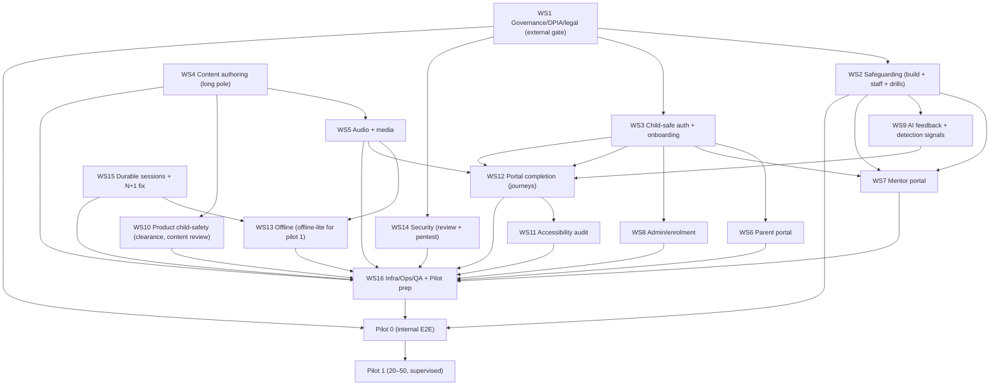

# Critical Path — Phase 6 to Pilot 1

Status: **Plan only.** Companion to [MASTER_EXECUTION_PLAN.md](MASTER_EXECUTION_PLAN.md) (WS1–WS16),
[ROADMAP.md](ROADMAP.md), [PILOT_PLAN.md](PILOT_PLAN.md). Identifies the blocking tasks, what runs in
parallel, the longest dependency chain, and the resulting build order to the **first supervised
pilot (Pilot 1)**.

---

## 1. Dependency graph (to Pilot 1)

---

## 2. Blocking tasks (nothing ships to a child until these close)

These are hard gates; everything downstream waits on them:

1. **WS1 — Governance/DPIA/legal sign-off + independent child-safety review.** The root gate; largely
   external timelines. Blocks: any child data, WS3, WS6/7/8, WS14 residency, Pilot 0/1.
2. **WS2 — Operational safeguarding live (build + staffed + drilled).** Blocks: any child use; WS7
   escalation.
3. **WS4 → WS5 — Content authored then narrated.** The **content chain is the long pole** (author →
   educational review → record audio → QA per lesson). Blocks: a real learning pilot, WS13 packaging,
   WS16 test data.
4. **WS3 — Child-safe auth/onboarding.** Blocks: parent/mentor/admin/portal (all need real identities).
5. **WS16 — QA + Pilot-0 dry run.** The final serial gate before real children.

---

## 3. What runs in parallel (maximize concurrency)

- **From day 0, independently:** WS1 (governance), WS4 (content — start immediately; it's the long
  pole and gate-free to author), WS15 (durable sessions + N+1 — pure engineering, no external gate),
  WS5 audio-pipeline setup, WS14 security hardening, WS3 auth build.
- **Content lessons** author in parallel across multiple authors (WS4); **audio records in parallel**
  across lessons (WS5), trailing each lesson.
- **Once WS1 policy drafts + WS3 auth exist:** WS6/WS7/WS8 (parent/mentor/admin) build in parallel
  (shared auth patterns); WS12 (portal completion) in parallel; WS2 build ∥ staffing ∥ runbook; WS9
  (feedback + detection); WS10.
- **Accessibility tokens/themes** (WS11) start early; the **audit** runs after screens land.
- **Infra + QA planning** (WS16) start early; the **Pilot-0 dry run** is the serial finale.

The core learning engine, persistence, migrations, backend query APIs, and the portal core already
exist — so most *algorithmic* engineering is **not** on the critical path.

---

## 4. Longest dependency chain (the critical path)

The floor on time-to-Pilot-1 is the longest serial chain. Two candidate chains compete:

- **Governance chain:** `WS1 (governance + external safety review) → WS2 (safeguarding build + staff +
  drills) → WS7 (mentor escalation) → WS16 (QA/pilot-0) → Pilot 1`.
- **Content chain:** `WS4 (author + educational review) → WS5 (record + QA audio) → WS13 (offline
  packaging) / WS12 (wired into journeys) → WS11 (a11y audit) → WS16 (QA/pilot-0) → Pilot 1`.

**The critical path is whichever of {WS1→WS2} and {WS4→WS5} finishes later — and both are long.**

- **WS1 (governance)** is bounded by *external* legal/DPIA/independent-review timelines — often the
  single longest, least-controllable item. **Start it first, escalate it, and never let it idle.**
- **WS4→WS5 (content + audio)** scales with author/voice throughput × lesson count — controllable by
  **staffing more authors/recorders in parallel**. This is the lever to shorten the content chain.

**Recommended assumption:** treat **WS1 (governance)** as the binding constraint and **WS4→WS5
(content+audio)** as the second — resource both from day 0. Everything else (auth, portals,
safeguarding build, offline, security, hardening, a11y, QA) can be made to fit inside their shadow if
staffed in parallel.

Convergence point: **WS16 (QA + Pilot 0)** — every stream feeds it; it cannot start until content,
surfaces, safeguarding, security, and a11y are all done. Pilot 0 → Pilot 1.

---

## 5. Recommended build order (sequenced)

1. **Kick off in parallel (day 0):** WS1 (governance — escalate), WS4 (content — staff heavily),
   WS15 (durable sessions + N+1), WS5 (audio pipeline), WS14 (security hardening), WS3 (auth).
2. **On WS1 policy drafts + WS3:** WS2 (safeguarding), WS6/WS7/WS8, WS12, WS9(a/b), WS10; WS11 tokens.
3. **Per lesson as WS4 completes it:** WS5 records audio; WS13 packages offline; WS10 content review.
4. **As surfaces land:** WS11 accessibility audit; WS16 QA (load, cross-device, offline, safety,
   security), UAT with facilitators.
5. **Serial gates (must all be green):** M-Gov (WS1) + M-Safe (WS2) + M-Content (WS4/WS5) + M-Assure
   (WS11/14/15/16-QA) → **Pilot 0 (internal E2E dry run)** → **Pilot 1**.

---

## 6. Slack, risk, and float

- **Zero-float items (do not slip):** WS1 (external gate), WS2 (safety gate), Pilot-0 dry run. A slip
  here slips Pilot 1 one-for-one.
- **Bufferable-by-staffing:** WS4/WS5 (add authors/recorders), WS6/7/8/12 (add frontend).
- **Truly parallel / off critical path:** WS15 (engineering hardening), WS14 (most security),
  WS9(a/b), WS11 tokens — do them early so they never become the binding constraint.
- **Watch item:** WS11 (a11y audit) and WS16 (QA) both sit near the convergence — start their
  *planning* early and run *audits/tests continuously* so the final pass isn't a big-bang bottleneck.

The single highest-leverage program action: **start governance (WS1) and content+audio (WS4/WS5) on
day 0 and resource them hardest** — they set the floor; everything else can be parallelized to fit.
