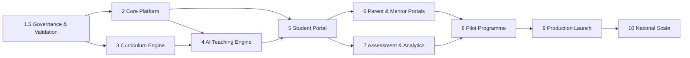

# Final Roadmap — Project Taleem

| | |
|---|---|
| **Supersedes** | [docs/08-delivery/44-roadmap.md](./docs/08-delivery/44-roadmap.md) (extends its 5 phases into the executive 10-phase structure) |
| **Companions** | [EXECUTIVE_REVIEW.md](./EXECUTIVE_REVIEW.md) · [WORLD_CLASS_GAP_ANALYSIS.md](./WORLD_CLASS_GAP_ANALYSIS.md) · [FINAL_MILESTONE_PLAN.md](./FINAL_MILESTONE_PLAN.md) |
| **Date** | 2026-07-20 |

## Principles

1. **Governance before build; evidence before scale.** No child touches the platform before Phase 1.5
   closes. No national scale before a pilot proves it.
2. **Child safety and lawfulness are exit criteria of every phase**, not a phase.
3. **Adopt the four redesigns** ([gap analysis §3](./WORLD_CLASS_GAP_ANALYSIS.md)): LLM-as-last-resort +
   in-region default · mentor-mediated summative · async-first realtime for v1 · partnership-sourced SNC.
4. **Effort is a planning assumption** (relative team-quarters), not a commitment; dates are set when
   team size + funding are confirmed. Phases overlap where dependencies allow (noted).

## Phase map

---

## Phase 1.5 — Governance & Validation

- **Objectives.** Remove the existential blockers so building is lawful, safe, and economically sane.
- **Deliverables.** Closed decisions in [FOUNDER_DECISIONS.md](./FOUNDER_DECISIONS.md) (8 build-blocking);
  completed items in [EXTERNAL_VALIDATION_CHECKLIST.md](./EXTERNAL_VALIDATION_CHECKLIST.md) (legal,
  safeguarding, DPIA, security, independent architecture); the **DPIA**; the mandatory-reporting policy;
  a signed cloud/residency + KMS decision; a funded 24/7 safeguarding staffing model; **on-device Android
  Go validation** and an **AI unit-economics spike**.
- **Dependencies.** Legal counsel, safeguarding partner, infra decision, funding for safety ops.
- **Exit criteria.** Zero open Critical findings ([RISK_REMEDIATION_PLAN §5](./RISK_REMEDIATION_PLAN.md));
  DPIA complete and fed back into specs; lawful basis confirmed; residency + broker + vector + KMS ADRs
  signed; independent external review passed.
- **Risks.** Legal ruling forces re-architecture; safety-ops funding not secured; residency has no compliant region.
- **Effort.** M (1–2 quarters; largely non-engineering — legal/partnership/decision latency dominates).
- **Quality gates.** Counsel sign-off; safeguarding sign-off; external-review pass; every Phase-1.5
  decision recorded with owner + date.

## Phase 2 — Core Platform

- **Objectives.** Turn the verified M1 skeleton into the production spine: identity, persistence, events,
  observability, deployment — governance-safe, no child data yet.
- **Deliverables.** Sharded PostgreSQL + migrations (Alembic) + RLS; Redis (workload-split) + broker
  (per ADR); outbox/CDC relay; the **Identity & Access** context (guardian-anchored, JWKS+KMS, no child
  onboarding yet); event-schema registry + CI compat checks; real IaC (per FD-02) + staging; OTel→
  collector + SLO dashboards incl. the **safeguarding-escalation SLO**; async-first delivery (no
  WebSocket gateway — redesign §3.3); progressive delivery.
- **Dependencies.** Phase 1.5 (cloud/residency/KMS/broker decisions).
- **Exit criteria.** Staging runs the spine at load-test L2 (100k concurrent synthetic); migrations
  rehearsed on distribution-faithful data; DR restore drill passed; architecture fitness functions green
  in CI; ASVS L2 controls on the spine verified.
- **Risks.** Boundary erosion; sharding/write-ceiling surprises; broker ops complexity.
- **Effort.** L (2–3 quarters).
- **Quality gates.** [DoD](./docs/07-engineering/50-definition-of-done.md); load L2; DR restore; security
  scan clean; per-context connection isolation enforced.

## Phase 3 — Curriculum Engine

- **Objectives.** A real, validated curriculum spine as data.
- **Deliverables.** Partnership-sourced **SNC dataset** (KG–G5 first) ingested (redesign §3.4);
  curriculum-as-data authoring + versioning + standards mapping; the **prerequisite knowledge graph**
  (doc 58); Islamiat ↔ Ethics/Akhlaqiat track; content-QA + bias-review process with sign-off; the
  early-literacy (Qaida→decoding) pathway design.
- **Dependencies.** Phase 2 (persistence, authoring surface); SNC partnership (Phase 1.5/business).
- **Exit criteria.** KG–G5 objectives authored, standards-mapped (0 unmapped), acyclic prerequisite graph,
  content-QA sign-off, mastery criteria machine-readable.
- **Risks.** SNC dataset unavailable/incomplete; authoring throughput underestimated; provincial variance.
- **Effort.** L (2–3 quarters; content-heavy; can overlap Phase 2).
- **Quality gates.** Standards-coverage report clean; expert + child-safety content sign-off; psychometric
  review of assessment blueprints.

## Phase 4 — AI Teaching Engine

- **Objectives.** A safe, grounded, affordable AI Teacher.
- **Deliverables.** The **LLM-as-last-resort** architecture (redesign §3.1): cache/RAG → in-region small/
  on-device model + distress classification → frontier LLM for hard turns; two-sided guardrails;
  deterministic clinician-reviewed crisis templates; transcript logging + confidentiality carve-out;
  **Urdu/Roman-Urdu red-team eval with a numeric bar + continuous canary**; per-student cost cap enforced.
- **Dependencies.** Phase 3 (curriculum for RAG); Phase 1.5 (residency + no-training contract + cost envelope).
- **Exit criteria.** Red-team eval passes the numeric child-safety bar (incl. Urdu); groundedness/honesty
  eval passes; cost/turn within envelope on realistic traffic; no pre-classified-C4 text leaves region;
  no generative AI offline.
- **Risks.** Urdu safety recall too low; cost envelope unmet; provider behavior drift.
- **Effort.** L (2–3 quarters).
- **Quality gates.** AI red-team **release-blocking**; cost gate; residency gate; independent AI-safety review (EV-08).

## Phase 5 — Student Portal

- **Objectives.** The child's actual school experience — the most important surface.
- **Deliverables.** The Student App (Next.js PWA): shallow ≤5-destination IA, lesson runtime (content
  blocks + resume), in-lesson AI Teacher, formative checks, **offline day-pack + sync engine** (built on
  the verified M1 prototype), **audio-guided non-reader onboarding**, ReadAloud everywhere, safety-help
  one tap away; full a11y (AA + RTL + Urdu) with visual-regression in CI.
- **Dependencies.** Phases 2–4; Android Go validation (Phase 1.5); design-system library growth.
- **Exit criteria.** A child completes enrol(stub)→lesson→AI→formative→resume, **offline on a real Android
  Go device on 3G within data budget**; AA + RTL audited; child usability-tested.
- **Risks.** Urdu/Nastaʿlīq/audio fail on-device; cognitive load too high for non-readers.
- **Effort.** L (2–3 quarters).
- **Quality gates.** [SACs](./docs/03-security-privacy/15-child-safety-framework.md); AA+COGA audit (EV-05);
  on-device validation (EV-06); data-budget gate; child usability sign-off.

## Phase 6 — Parent & Mentor Portals

- **Objectives.** The human layer — guardian trust and mentor safeguarding at the core.
- **Deliverables.** Guardian Portal (consent/privacy self-service, progress, report cards, safety concern,
  **discreet safety exit** for the household-adversary case); Mentor Portal (triage-first "Needs
  Attention", human grading, **mentor-mediated summative** hooks, bounded/monitored messaging); the
  message-monitoring-at-scale classifier; mentor vetting + onboarding pipeline.
- **Dependencies.** Phase 5; the crisis protocol + staffing (Phase 1.5).
- **Exit criteria.** A guardian consents/revokes and sees a report card; a mentor receives and actions an
  AI escalation within SLA; all adult↔child messaging routed through the moderated pipeline; vetting
  enforced (no access before vetting).
- **Risks.** Mentor supply/vetting can't scale; messaging monitoring cost; guardian-as-threat gaps.
- **Effort.** M–L (2 quarters).
- **Quality gates.** Safeguarding sign-off; grooming-vector red-team; escalation-SLA SLO live.

## Phase 7 — Assessment & Analytics

- **Objectives.** Fair, valid measurement and honest impact metrics.
- **Deliverables.** Assessment engine (item bank, immutable sealed attempts, server-side scoring, mastery
  computation, **mentor-mediated summative** — redesign §3.2, ethical proctoring-lite); Grading &
  Reporting (verifiable, signed report cards + transcripts, human-accountable promotion); privacy-
  preserving analytics + the **north-star** instrumentation; at-risk model feeding the mentor queue.
- **Dependencies.** Phases 3–6.
- **Exit criteria.** North-star event flows (incl. offline-queued, deduped); report cards derive from
  immutable attempts and are cryptographically verifiable; assessment validity/reliability reviewed;
  analytics carry no raw child PII.
- **Risks.** Mastery gaming; assessment-validity shortfall; north-star flag unlawful.
- **Effort.** L (2–3 quarters; overlaps Phase 6).
- **Quality gates.** Psychometric sign-off; honesty/integrity gate (no fabricated figures); privacy scan.

## Phase 8 — Pilot Programme

- **Objectives.** Prove — with real children, safely, small — that it teaches, includes, and is safe.
- **Deliverables.** A thin *complete school* (KG–G5, Urdu) for a small, consented pilot cohort with a
  partner NGO/school; 24/7 safeguarding live; full instrumentation; a pre-registered evaluation of
  learning outcomes and reach.
- **Dependencies.** Phases 2–7 complete for the pilot scope; all Phase-1.5 gates closed; external reviews passed.
- **Exit criteria.** Pilot cohort learns end-to-end on real devices/networks; **zero unresolved child-
  safety incidents**; measured mastery + reach + guardian trust; unit economics observed against the model;
  lawful throughout.
- **Risks.** A safety incident; learning outcomes disappoint; cost higher than modeled; consent/legal issues.
- **Effort.** L (2 quarters run + evaluation).
- **Quality gates.** All release gates ([02 PRD §10](./docs/01-product/02-prd.md)); independent safeguarding
  monitoring; ethics/evaluation sign-off; go/no-go review before Phase 9.

## Phase 9 — Production Launch

- **Objectives.** Full school, early scale, hardened.
- **Deliverables.** KG–G10 + full v1 subjects; human grading + promotion + transcripts; full portals;
  student life (non-exploitative); multi-channel engagement (multi-provider SMS + PTA); dashboards;
  search; multi-region readiness; the security-assurance program (recurring pentest + disclosure policy).
- **Dependencies.** A successful, evaluated pilot (Phase 8).
- **Exit criteria.** Full loop incl. human grading + promotion for KG–G10; AA across portals; ASVS L2 across
  surfaces; DR proven cross-region; SLOs held under L3 load; cost within envelope.
- **Risks.** Scale/perf ceilings; safety-ops staffing lag; cost drift.
- **Effort.** L (3–4 quarters).
- **Quality gates.** Full [DoD](./docs/07-engineering/50-definition-of-done.md) + release gates; load L3;
  DR drill; recurring external audit.

## Phase 10 — National Scale

- **Objectives.** Serve up to 1,000,000 students; recognized credential; additional languages.
- **Deliverables.** Load-validated to 1M enrolled / ~150k concurrent; provincial/board variance lit up;
  Sindhi/Pashto/Punjabi/Balochi via the localization pipeline; sponsorship at scale; **recognized
  credential** via board/government MoU; adaptive mastery pacing; realtime revisited only if demanded.
- **Dependencies.** Phase 9; credential-recognition partnership; sustained funding.
- **Exit criteria.** Core-path SLOs held at 1M-scale load; no un-mitigated ceilings; credential recognized
  by a partner; marginal cost/student sustainable.
- **Risks.** Funding sufficiency; recognition never materializes; scale ceilings; language quality.
- **Effort.** L (ongoing, multi-year).
- **Quality gates.** 1M load validation; cost-per-student guardrail; recognition secured; per-language safety+a11y evals.

---

## Cross-cutting quality gates (every phase)

Child safety (SACs) · lawful basis maintained · AA + RTL + Urdu on the reference device · data budgets ·
no PII in logs/analytics · no fabricated grades/metrics · no un-mitigated 1M ceiling · red-team green for
any AI change · [DoD](./docs/07-engineering/50-definition-of-done.md) satisfied. **Nothing ships on a
deadline; everything ships when it is ready.**

## Sequencing notes

- Phases 2 and 3 overlap (platform vs content); 6 and 7 overlap.
- Phase 4 (AI) hard-depends on Phase 3 (curriculum for grounding) and Phase 1.5 (residency/cost).
- The four redesigns are adopted at the start of their owning phase, not retrofitted.
- Each phase re-scores the [Executive Review](./EXECUTIVE_REVIEW.md) categories it touches.

---

## Change log

| Date | Change | Author |
|---|---|---|
| 2026-07-20 | 10-phase roadmap (1.5→10) with objectives, deliverables, dependencies, exit criteria, risks, effort, and quality gates; adopts the four redesigns; supersedes doc 44's 5-phase structure. | Executive panel |
