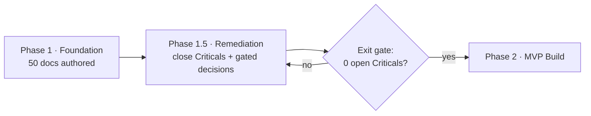

# Risk Remediation Plan — Project Taleem

| | |
|---|---|
| **Companion to** | [ARCHITECTURE_REVIEW.md](./ARCHITECTURE_REVIEW.md) · [BLUEPRINT_GAP_ANALYSIS.md](./BLUEPRINT_GAP_ANALYSIS.md) · [FINAL_RECOMMENDATIONS.md](./FINAL_RECOMMENDATIONS.md) |
| **Date** | 2026-07-19 |
| **Purpose** | Turn the 97 findings into a prioritized, owned remediation plan; record exactly what was applied to the blueprint in this pass and what remains decision-gated. |

## 1. Remediation phases

The review inserts a **Phase 1.5 — Remediation** between the current Phase 1 (Foundation) and Phase 2
(Build). Phase 2 does not start until the Phase-1.5 exit gate (§5) is green.

| Track | What | Owner class |
|---|---|---|
| **T1 · Legal/Clinical** | Decisions that gate whether the platform may lawfully/safely exist | Privacy Counsel, Safeguarding, Clinical |
| **T2 · Safety Mechanisms** | Author + wire the safety controls | Trust & Safety, Security, Product |
| **T3 · Feasibility Proof** | Capacity, cost, DR, sharding, residency | Architecture, Infra, Business |
| **T4 · Teach & Certify** | Mastery, knowledge graph, validity, tokens, audio | Learning Science, Design |
| **T5 · Operability** | IR, on-call, staffing, retention, monitoring | SRE, Ops, DPO |

## 2. Disposition legend

- **APPLIED** — changed in the blueprint during this review pass (see §4).
- **DRAFTED** — a new artifact was authored this pass with labeled planning assumptions; needs
  sign-off before it is authoritative.
- **DECISION-REQUIRED** — cannot be closed without a human legal/business/clinical/infra decision.
- **SCHEDULED** — accepted, queued for Phase 1.5/v1 with an owner.

## 3. Critical remediation (all must reach APPLIED/DRAFTED-and-signed before Phase 2)

| ID | Remediation | Owner | Effort | Track | Disposition |
|---|---|---|---|---|---|
| AR-C-01 | Author unaccompanied-minor enrolment pathway + legal analysis | Product + Counsel | L | T1 | DECISION-REQUIRED (legal) — scaffold DRAFTED |
| AR-C-02 | Household-adversary threat model + child-private channel + discreet exit | T&S + Security | M | T2 | DRAFTED (threat model) + SCHEDULED (UI) |
| AR-C-03 | Transcript confidentiality default + safeguarding carve-out | T&S + Authz | S | T2 | APPLIED (docs 12, 15) |
| AR-C-04 | Crisis-response protocol: MVP escalation, numeric SLA, 24/7, deterministic templates | Safeguarding + Clinical | L | T1/T2 | DRAFTED (protocol) — SLA/staffing DECISION-REQUIRED |
| AR-C-05 | Mandatory-reporting/external-referral policy | Counsel + Safeguarding | M | T1 | DECISION-REQUIRED (legal) — scaffold DRAFTED |
| AR-C-06 | No generative AI offline; offline crisis affordance + queued flag | AI + T&S | S | T2 | APPLIED (docs 24, 33, 15) |
| AR-C-07 | In-region distress classification; no pre-classified-C4 egress; zero-retention | Infra + AI + Legal | L | T1/T3 | DECISION-REQUIRED (residency) — control DRAFTED |
| AR-C-08 | Re-ground lawful basis off forced consent; DPIA | Counsel | M | T1 | DECISION-REQUIRED (legal) |
| AR-C-09 | Delete knowledge-based recovery; two-person institutional guardianship | Security + T&S | S | T2 | APPLIED (doc 11) |
| AR-C-10 | Hide distress-classified transcripts in child's own session; anti-shoulder-surf | Security + Design | M | T2 | APPLIED (doc 11) + SCHEDULED (UI) |
| AR-C-11 | Capacity model + sharding strategy | Architecture | L | T3 | DRAFTED (capacity model) + APPLIED (docs 08, 09 reference) |
| AR-C-12 | Cost model + AI envelope + spend breaker | Business + AI | M | T3 | DRAFTED (cost model) |
| AR-C-13 | BC/DR plan + tested restore + DR region | Infra | L | T3 | DRAFTED (BC/DR) — DR region DECISION-REQUIRED |
| AR-C-14 | Define mastery threshold + calibration | Learning Science | M | T4 | DRAFTED (mastery/validity doc) |
| AR-C-15 | Prerequisite knowledge graph as v1 core | Learning Science | M | T4 | DRAFTED (mastery/validity doc) + APPLIED (doc 21 reference) |
| AR-C-16 | Assessment validity framework + item-bank sizing/authoring | Learning Science | L | T4 | DRAFTED (mastery/validity doc) |
| AR-C-17 | Server-side scoring; summative identity assurance | Assessment + Security | M | T4 | APPLIED (docs 23) + DRAFTED (in validity doc) |
| AR-C-18 | Real token ramps + contrast matrix | Design | M | T4 | DRAFTED (token values doc) + APPLIED (doc 16/18 reference) |
| AR-C-19 | Mandatory recorded Urdu audio + TTS decision + font budget, device-tested | Design + Content | L | T4 | DECISION-REQUIRED (device test) — requirement APPLIED (docs 16) |
| AR-C-20 | Islamiat ↔ Ethics/Akhlaqiat track | Learning Science | S | T4 | APPLIED (doc 21) |
| AR-C-21 | Audit-immutability + runtime PII-log mechanisms | Security + SRE | M | T5 | APPLIED (docs 39) |
| AR-C-22 | IR plan + on-call + message-monitoring design | SRE + T&S | L | T5 | DRAFTED (IR plan) — staffing DECISION-REQUIRED |
| AR-C-23 | Define attendance/mastery/SLA before MUSTs; else downgrade KPIs | Product | M | T4 | APPLIED (docs 02, 03) partial + DRAFTED (definitions) |
| AR-C-24 | Produce DPIA/threat-model/reporting/retention/red-team/staffing artifacts | Multi | L | T1–T5 | Mix: DRAFTED (threat, retention, crisis, IR, capacity, cost, BCDR, validity, tokens) + DECISION-REQUIRED (DPIA, reporting) |

## 4. Improvements APPLIED to the blueprint in this pass

Documentation-level fixes and new artifacts authored during this review (all within reviewer authority;
none fabricate a legal/clinical determination — where a value needs sign-off it is labeled a planning
assumption and flagged **DECISION REQUIRED**).

### 4.1 Targeted edits to existing documents

| Doc | Change | Closes |
|---|---|---|
| 11 Authentication | Deleted the knowledge-based number-change recovery path; required independent re-verification + safeguarding review; two-person institutional guardianship; hardware-backed per-profile keys (never PIN-derived) | AR-C-09, AR-C-10, AR-H-14 |
| 12 Authorization / 15 Child Safety | Transcript confidentiality is the default; distress/safeguarding-classified turns are invisible to guardian/mentor (C4-path only); guardian access/export carve-out | AR-C-03, AR-H-22 |
| 24 AI Teacher | No generative AI offline; all serving tiers pass one safety bar; distress-adjacent turns routed to strongest tier; continuous provider-canary safety eval; Urdu/Roman-Urdu safety-eval requirement; deterministic clinician-reviewed crisis templates outside the LLM path | AR-C-06, AR-H-16/17/18, AR-C-04 (partial) |
| 33 Offline / 09 DB / 10 API | Replaced client-wall-clock LWW with server-incremented version counters + HLC; attempts merge by union; offline crisis affordance + queued safety flag | AR-H-28, AR-C-06 |
| 15 Child Safety | Distress escalation promoted to MVP; numeric SLA planning assumptions; references new crisis + reporting artifacts; curriculum-content-review requirement | AR-C-04, AR-C-05, AR-H (curriculum) |
| 02 PRD / 03 FR | Promoted FR-AIT-007 (distress escalation) and FR-IDN-007 (recovery) to MVP; added FR for moderated Mentor↔child comms, curriculum content review, and the unaccompanied-minor pathway | AR-C-01, AR-C-04, AR-C-23, AR-H-01/05/06/07 |
| 21 Curriculum | Prerequisite DAG promoted to v1 core entity; Islamiat ↔ Ethics/Akhlaqiat track | AR-C-15, AR-C-20 |
| 23 Assessment | Server-side scoring on sync (no offline keys); summative vs formative identity assurance | AR-C-17, AR-H-03 |
| 39 Logging | Audit immutability mechanism (WORM + hash-chain + anchored digests + verifier); runtime allow-list serialization + staging PII-canary scan | AR-C-21 |
| 08 / 09 Architecture | Reference the capacity model + committed sharding strategy; durable realtime backplane | AR-C-11, AR-H-25/26 |
| 16 / 18 Design | Reference the new token-values/contrast-matrix artifact; mandatory recorded-audio requirement | AR-C-18, AR-C-19 |
| README | Add the Phase-1.5 remediation artifacts to the index; link the four review deliverables | — |

### 4.2 New blueprint artifacts DRAFTED

| New doc | Closes | Note |
|---|---|---|
| `docs/03-security-privacy/51-threat-model.md` | AR-C-02, AR-H-12 | Per-boundary STRIDE + attacker trees incl. household adversary |
| `docs/03-security-privacy/52-safeguarding-crisis-protocol.md` | AR-C-04/05/22 | Tiered SLAs (planning assumptions, DECISION REQUIRED), deterministic templates, mandatory-reporting scaffold |
| `docs/07-engineering/53-incident-response-plan.md` | AR-C-22 | SEV taxonomy (SEV1 = child in danger), IC roles, safeguarding IR |
| `docs/02-architecture/54-capacity-and-scale-model.md` | AR-C-11, AR-H-25/27/32 | Enrolled vs concurrent, QPS/TPS/WS/events, sharding plan, pre-scaling |
| `docs/08-delivery/55-cost-model.md` | AR-C-12, AR-H-29/31 | Per-student envelope, AI tier-mix, spend breaker |
| `docs/02-architecture/56-bcdr-plan.md` | AR-C-13, AR-H-34 | RPO/RTO by AZ vs region, crypto-shred backups, tested restore |
| `docs/03-security-privacy/57-data-retention-schedule.md` | AR-H-20/21 | Numeric periods per data class + automated expiry |
| `docs/05-education/58-mastery-and-assessment-validity.md` | AR-C-14/15/16/17 | Mastery rule, prerequisite DAG, validity/reliability, item-bank sizing |
| `docs/04-design/59-design-token-values.md` | AR-C-18 | Full ramps + computed contrast matrix + high-contrast map |

## 5. Phase 1.5 exit gate (Phase-2 go/no-go criteria)

Phase 2 (build) may begin only when **all** are true:

1. **Zero open Critical findings** — each AR-C-* is APPLIED, or DRAFTED-and-signed-off by its owner.
2. **T1 legal/clinical decisions closed:** lawful basis (D-02), residency + LLM inference (D-01/D-03),
   mandatory-reporting policy (G-03), unaccompanied-minor legality (G-11), safeguarding SLA + 24/7
   staffing (D-06) — signed by Counsel/Safeguarding.
3. **DPIA completed and its findings fed back** into 11–15/24 (G-02).
4. **Feasibility proven on paper:** capacity model + sharding ADR + cost model + BC/DR reviewed by
   Architecture/Infra/Business; residency decided (D-01).
5. **Teach-and-certify closed:** mastery definition, prerequisite graph, assessment-validity framework,
   token contrast matrix — signed by Learning Science/Design; Urdu audio/font validated on a real
   Android Go handset (AR-C-19).
6. **All High findings** are APPLIED or SCHEDULED with a dated owner for pre-MVP.
7. **Independent external review** of the safety/security/privacy remediation (G-32).

## 6. High / Medium / Low remediation (summary)

All 34 High findings map to Phase 1.5 or pre-MVP with owners (see [ARCHITECTURE_REVIEW.md §4](./ARCHITECTURE_REVIEW.md)).
Medium findings are scheduled for pre-v1; Low for the backlog ([46 Backlog](./docs/08-delivery/46-project-backlog.md)).
Notable High items to schedule now: multi-provider SMS + PTA (AR-H-30), realtime scale design (AR-H-25),
AI red-team methodology (AR-H-33), chaos/DR testing (AR-H-34), staffing/capacity model (AR-C-22/23),
localization pipeline (AR-H-08/AR-C-19), no-reader onboarding (AR-H-07/G-31).

---

## Change log

| Date | Change | Author |
|---|---|---|
| 2026-07-19 | Initial remediation plan: Phase-1.5 insertion, 5 tracks, disposition of all 24 Criticals, list of applied edits + 9 new drafted artifacts, Phase-2 exit gate. | External Principal Engineer (review) |
