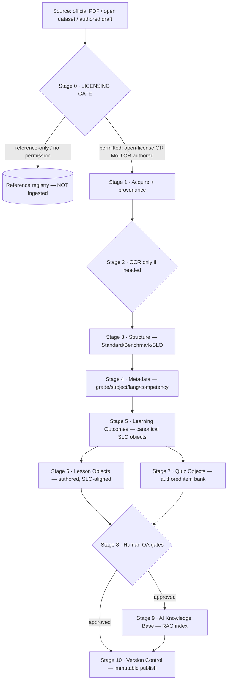

# 04 · Curriculum Ingestion Pipeline

| | |
|---|---|
| **Date** | 2026-07-20 |
| **Purpose** | Convert *officially, legally available* Pakistani curriculum resources into structured learning objects — with a hard licensing gate so nothing improperly-sourced ever enters. |
| **Basis** | [01 Inventory](./01_CURRICULUM_RESOURCE_INVENTORY.md) · [02 Matrix](./02_MASTER_CURRICULUM_MATRIX.md) · [03 Gap](./03_CONTENT_GAP_ANALYSIS.md) |
| **Integrates** | [docs/05-education/21-curriculum-engine.md](../docs/05-education/21-curriculum-engine.md) · [docs/05-education/58-mastery-and-assessment-validity.md](../docs/05-education/58-mastery-and-assessment-validity.md) · [docs/05-education/24-ai-teacher-specification.md](../docs/05-education/24-ai-teacher-specification.md) · [docs/02-architecture/09-database-design.md](../docs/02-architecture/09-database-design.md) |

## 1. Principles

1. **Licensing gate first — nothing legally unavailable enters.** Stage 0 admits only sources we are
   permitted to ingest (open-licensed, or under a written MoU/permission). Everything else is
   **reference-only** and never becomes an ingested object. This is a hard, auditable gate, not a
   guideline.
2. **Provenance on every object.** Each learning object records its `source`, `license`, `permission_ref`,
   and `derivation` (ingested vs authored) — enforced, queryable, and shown in review.
3. **Standards are ingested; teaching content is authored.** The pipeline *ingests* the official
   standards spine (Scheme of Studies + SLO grids, under MoU) to produce the SLO taxonomy; **lesson and
   quiz objects are authored originals** aligned to those SLOs ([03 §5](./03_CONTENT_GAP_ANALYSIS.md)) — the
   pipeline structures and QA-gates them, it does not copy textbooks.
4. **Human-in-the-loop before publish.** No learning object goes live without psychometric, child-safety,
   and bias/neutrality sign-off ([21 §6](../docs/05-education/21-curriculum-engine.md), [15](../docs/03-security-privacy/15-child-safety-framework.md)).
5. **Immutable versioning.** Published curriculum is versioned, never mutated ([21 §5](../docs/05-education/21-curriculum-engine.md)).

## 2. Pipeline overview



## 3. Stage specifications

### Stage 0 · Licensing gate (mandatory, hard)

The first and most important stage. Every candidate source is classified before anything else happens.

| Class | Examples | Action |
|---|---|---|
| **Open-licensed** | Open datasets (CC-BY/ODbL/PDDL); genuinely CC-licensed content (per-asset verified) | Admit with attribution metadata |
| **Permitted under MoU** | NCP Scheme of Studies + SLO grids ingested under written NCC/MoFEPT permission | Admit with `permission_ref` |
| **Authored original** | Our own lesson/quiz drafts (AI-assisted + human) | Admit as `derivation=authored` |
| **Reference-only** | ARR textbooks (PCTB/STBB/NBF), proprietary platforms (Sabaq/Taleemabad), NC-restricted OER without a commercial license | **Reject from ingestion** → Reference registry only |
| **Prohibited** | Third-party scanned textbooks; anything unverified | **Reject entirely** |

Gate outputs a signed `SourceManifest{source, license, permission_ref, class, verified_by, verified_at}`.
**No object may exist downstream without a manifest.** A CI/data check fails the pipeline if any object
lacks provenance.

### Stage 1 · Acquire + provenance

Fetch the permitted artifact (or receive the authored draft); attach the `SourceManifest`; compute a
content hash; record retrieval time and the exact source URL. Store the raw artifact in access-controlled
storage ([09 §11](../docs/02-architecture/09-database-design.md)) — never redistributed.

### Stage 2 · OCR (only if needed)

Many NCP PDFs are image-heavy (e.g. the Scheme of Studies) → OCR required; text-native PDFs skip this.

- **Urdu + English OCR** (Nastaʿlīq is hard — use a validated Urdu-capable OCR; human-verify a sample).
- Preserve layout hints (tables/grids) — the Progression Grids are tabular (Standard → Benchmark → SLO).
- Confidence-scored; low-confidence spans flagged for human correction.

### Stage 3 · Structure

Parse into the curriculum hierarchy ([02 §1](./02_MASTER_CURRICULUM_MATRIX.md)):
`Subject → Standard/Domain → Benchmark → SLO`. Grid/table extraction reconstructs the progression grid.
Output is structured JSON, still tied to provenance.

### Stage 4 · Metadata

Enrich each node: `grade`, `subject`, `language`, `curriculum_version`, `competency_class`
(knowledge/comprehension/application/analysis), `standard_code` (SNC/NCP mapping), `religious_track`
(Islamiat/Ethics where applicable). Metadata is what makes the taxonomy queryable and mappable.

### Stage 5 · Learning Outcomes (canonical SLO objects)

Produce the canonical `objective` records ([21](../docs/05-education/21-curriculum-engine.md)) — one per SLO —
each with machine-readable **mastery criteria** ([58 §1](../docs/05-education/58-mastery-and-assessment-validity.md))
and a `standard_code`. **Coverage report** runs here: unmapped objectives or uncovered standards are
errors ([21 §4](../docs/05-education/21-curriculum-engine.md)); the prerequisite DAG is validated acyclic
([58 §2](../docs/05-education/58-mastery-and-assessment-validity.md)). *If ingesting under MoU, SLOs may
carry official text; if not, SLOs are our re-expression* — the `derivation` field records which.

### Stage 6 · Lesson Objects (authored, SLO-aligned)

**Authored, not ingested.** For each SLO, authors (AI-drafted + mandatory human review) create lesson
objects as ordered content blocks (text/image/audio/interactive) — Urdu-first, mandatory recorded audio
([16](../docs/04-design/16-accessibility-standards.md)), within data budgets. Each lesson links to its
SLO(s) and carries `derivation=authored` + author attribution.

### Stage 7 · Quiz Objects (authored item bank)

**Authored, not ingested.** For each SLO, generate the item bank (≥5× distinct-item pool for mastery +
anti-gaming, [58 §1/§4](../docs/05-education/58-mastery-and-assessment-validity.md)). Item types per
competency class ([02 §5](./02_MASTER_CURRICULUM_MATRIX.md)). FBISE SLO model papers inform the *blueprint*
(reference), never copied. Constructed-response items flagged for mentor-mediated summative.

### Stage 8 · Human QA gates (release-blocking)

No object publishes without:

- **Psychometric review** — item difficulty/discrimination, validity, reliability ([58 §3](../docs/05-education/58-mastery-and-assessment-validity.md)).
- **Child-safety + age-appropriateness** review ([15 §4](../docs/03-security-privacy/15-child-safety-framework.md)).
- **Bias / gender / religious-neutrality + minority-inclusion** rubric ([21 §6](../docs/05-education/21-curriculum-engine.md)).
- **Curriculum Architect sign-off** (standards alignment).
- **AI-generated content is always human-reviewed** — never auto-published.

### Stage 9 · AI Knowledge Base (RAG index)

Build the AI Teacher's grounding corpus ([24 §4](../docs/05-education/24-ai-teacher-specification.md)) **only
from approved objects**:

- **Included:** our authored lessons + SLO taxonomy (ours or MoU-permitted) + open-licensed supplements.
- **Excluded:** any reference-only/ARR/PROP source — **never** RAG'd. The knowledge base is version-pinned
  to a `curriculum_version`; retrieval respects authorization ([24 §4](../docs/05-education/24-ai-teacher-specification.md)).
- Provenance flows into RAG so every AI answer can cite an approved, licensed source.

### Stage 10 · Version Control

Publish is **immutable versioning** ([21 §5](../docs/05-education/21-curriculum-engine.md)): editing a
published unit creates a new `curriculum_version`; learner records cite the exact version learned against.
Every object retains full provenance + QA sign-off history + author/version. Rollback is a version switch.
Publishing is gated, audited, reversible ([27 Admin](../docs/06-portals/27-admin-portal.md),
[FR-ADM-002](../docs/01-product/03-functional-requirements.md)).

## 4. Provenance & compliance (enforced)

Every learning object row ([09](../docs/02-architecture/09-database-design.md)) carries:

```json
{ "object_id": "...", "type": "objective|lesson|item",
  "source": "ncc.gov.pk/... | authored | open-dataset",
  "license": "MoU-2026-NCC | CC-BY-4.0 | authored-original",
  "permission_ref": "MoU-... | null",
  "derivation": "ingested | re-expressed | authored",
  "qa_signoffs": ["psychometric:...", "safety:...", "bias:..."],
  "curriculum_version": "v1.0" }
```

A **data-integrity CI gate** rejects any object without a valid manifest + license + QA sign-off, and
asserts that the RAG index contains **zero** reference-only sources. This operationalizes "do not include
material that is not legally available for our intended use."

## 5. Sequencing (fits the roadmap)

- **Phase 1.5:** pursue the **NCC/MoFEPT MoU**; verify PCTB/STBB/KA-Urdu terms live; stand up the licensing
  gate + provenance schema.
- **Phase 3 (Curriculum Engine):** run Stages 0–5 for KG–G5 (standards → SLO taxonomy); begin Stages 6–8
  authoring; coverage report clean.
- **Phase 4 (AI):** Stage 9 knowledge base from approved content only.
- Ongoing: Stage 10 versioning; expand to KG–G10.

## 6. What this pipeline guarantees

1. **Legality:** nothing improperly-sourced can enter or reach the AI (Stage 0 + provenance CI gate).
2. **Quality:** nothing publishes without psychometric + safety + bias sign-off (Stage 8).
3. **Alignment + recognition:** standards mapping + immutable versioning tie every lesson to an official
   SLO and a reproducible version.
4. **Efficiency:** AI-assisted authoring (human-reviewed) against public standards — no publisher
   partnership needed; an NCC/MoFEPT MoU accelerates the standards layer.

## Change log

| Date | Change | Author |
|---|---|---|
| 2026-07-20 | Ingestion pipeline: licensing-gate-first design (0–10 stages), provenance model, standards-ingested-vs-content-authored separation, human QA gates, RAG-from-approved-only, immutable versioning, data-integrity CI gate. | Curriculum discovery |
