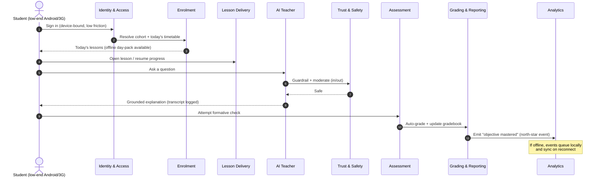

# 02 · Product Requirements Document (PRD)

| | |
|---|---|
| **Document ID** | 02 |
| **Owner** | Staff Product Manager / Chief Product Officer |
| **Status** | Draft (Phase 1) |
| **Last updated** | 2026-07-19 |
| **Related** | [Authoring Brief](../_meta/authoring-brief.md) · [01 Vision](../00-overview/01-vision.md) · [03 Functional Requirements](./03-functional-requirements.md) · [04 Non-Functional Requirements](./04-non-functional-requirements.md) · [05 Personas](./05-user-personas.md) · [06 Journeys](./06-user-journeys.md) · [07 Information Architecture](./07-information-architecture.md) · [21 Curriculum](../05-education/21-curriculum-engine.md) · [24 AI Teacher](../05-education/24-ai-teacher-specification.md) · [15 Child Safety](../03-security-privacy/15-child-safety-framework.md) · [44 Roadmap](../08-delivery/44-roadmap.md) |

## Purpose

This document is the **master product specification** for Project Taleem. It translates the
constitution set out in [01 Vision](../00-overview/01-vision.md) into a concrete, prioritised
product: who we serve, what we will build and in what order, the complete capability set organised by
the fourteen bounded contexts, and the measurable outcomes that define success. It is the anchor that
[03 Functional Requirements](./03-functional-requirements.md) and
[04 Non-Functional Requirements](./04-non-functional-requirements.md) trace back to.

## Scope

In scope: the product problem, goals and non-goals, target users, release-phased scope
(MVP → v1 → v2), the feature set by bounded context, success metrics tied to the north-star,
assumptions, dependencies, and a MoSCoW-prioritised capability list. Out of scope: implementation
detail (owned by `02-architecture/*`), UX detail (owned by `04-design/*` and `06-portals/*`), and
pedagogy internals (owned by `05-education/*`). This PRD references those documents; it does not
duplicate them.

---

## 1. Problem restatement

Millions of Pakistani children are out of school or in schools that cannot teach them — a failure
driven by cost, distance, teacher shortage and absenteeism, overcrowding, gendered barriers,
displacement, and disability (see [01 Vision §1](../00-overview/01-vision.md)). The children who most
need a patient, expert, always-available teacher are the least likely to ever get one.

The **defining constraint is not content — it is the child's reality**: a shared low-end Android
phone, an intermittent 3G connection metered by the megabyte, a few hours of electricity, a noisy
home with no desk, a possibly non-literate caregiver, and Urdu as the language of instruction. The
product problem is therefore not "how to put lessons online" but:

> **How do we deliver a complete, fair, safe, credentialed school — enrolment through report card — to
> a child at the bottom of the connectivity and affordability curve, at a marginal cost that makes
> national scale viable?**

Every requirement in this repository is a partial answer to that question.

## 2. Goals and non-goals

### 2.1 Product goals (Phase 1 → v1)

| # | Goal | Tied to |
|---|---|---|
| G1 | A child can **enrol** with guardian consent and be placed in a grade/cohort on a low-end device. | Identity, Enrolment |
| G2 | A child can **attend a structured, timetabled school day** mapped to the national curriculum. | Curriculum, Lesson Delivery |
| G3 | Every child has an **AI Teacher** that teaches, answers questions, and gives formative feedback — safely and grounded in curriculum. | AI Teacher, Trust & Safety |
| G4 | A child is **assessed fairly** (auto + human-reviewed) and receives a **verifiable report card**. | Assessment, Grading & Reporting |
| G5 | The core learning path works **offline-capable on 3G / intermittent power**, in Urdu, RTL-complete. | Lesson Delivery, Media, NFRs |
| G6 | **Guardians and Mentors** can see progress, attendance, and report cards and act on them. | Engagement, Grading & Reporting |
| G7 | The platform is **safe by default** — every AI output and upload is governed and moderatable. | Trust & Safety |
| G8 | The architecture **scales to 1,000,000 students** without rework of the core learning path. | All contexts, [04 NFR](./04-non-functional-requirements.md) |

### 2.2 Non-goals (Phase 1 / v1)

Stating anti-goals protects scope and children (mirrors [01 Vision §8](../00-overview/01-vision.md)).

| # | Non-goal | Rationale |
|---|---|---|
| NG1 | An open-ended, ungrounded chatbot. | AI Teacher stays inside curriculum + safety rails. |
| NG2 | A course marketplace or third-party LMS container. | Taleem is one coherent school, one curriculum spine. |
| NG3 | Native iOS/Android app stores at launch. | PWA-first reaches low-end Android without store friction; native is a later evaluation. |
| NG4 | Live synchronous video classes as the default modality. | Bandwidth-hostile; async lesson runtime + light live is the model. |
| NG5 | Paid fee wall on the core school. | Monetisation is sponsorship/partnership; never exclude the poor. |
| NG6 | Full multi-board/provincial variance at MVP. | Model curriculum-as-data now; light up boards in v1/v2. |
| NG7 | Data monetisation / ad targeting / third-party model training on child data. | Absolute privacy stance ([14 Privacy](../03-security-privacy/14-privacy-model.md)). |
| NG8 | Unsupervised high-stakes AI decisions (promotion, safeguarding) without a human in the loop. | Vision principle 6 & 8. |

## 3. Target users

Summarised here; full detail in [05 Personas](./05-user-personas.md). Role vocabulary is canonical
per [Authoring Brief §2](../_meta/authoring-brief.md).

| Role | Primary need from Taleem | Device / context (planning assumption) |
|---|---|---|
| **Student** | Learn, be seen, progress, feel it is *my* school. | Shared low-end Android, 3G, 2–4h power/day, Urdu-first. |
| **Guardian** | Proof my child is learning; low-effort involvement; trust. | Same/shared device; may have limited literacy; SMS/WhatsApp reachable. |
| **Mentor** | Scale human care across a cohort; act on what AI escalates. | Mid-range Android or low-end laptop; more reliable connectivity. |
| **AI Teacher** | (System actor) Deliver lessons and formative feedback safely. | Server-side; provider-abstracted LLM gateway. |
| **School Admin** | Run enrolment, cohorts, timetables, mentor assignment for a region. | Laptop/desktop, better connectivity. |
| **Platform Admin** | Publish curriculum, configure platform, run operations. | Desktop, internal network. |
| **Safety Officer** | Triage flags, handle safeguarding, audit. | Desktop, restricted-access console. |
| **Curriculum Architect** | Author/map curriculum, objectives, assessment blueprints. | Desktop authoring tools. |

**Primary user is the Student at the bottom of the curve.** When a design trade-off pits Student
reach against any other role's convenience, Student reach wins.

## 4. Product scope by release

Release philosophy: **the north-star ("objectives mastered by children who would otherwise be out of
school") must be measurable from MVP.** MVP is therefore not a demo — it is a thin but *complete*
vertical school for one grade band, one province's SNC mapping, in Urdu, that a real child can attend
end to end.

```mermaid
graph LR
    subgraph MVP["MVP — Thin Complete School"]
        A1[Enrol + consent]
        A2[Timetabled lessons<br/>KG–G5 core subjects]
        A3[AI Teacher<br/>guardrailed tutoring]
        A4[Formative + basic exams]
        A5[Report card v1]
        A6[Offline day-pack]
        A7[Safety spine]
    end
    subgraph V1["v1 — Full School"]
        B1[KG–G10 full subjects]
        B2[Human grading workflow]
        B3[Promotion decisions]
        B4[Mentor + Guardian portals]
        B5[Streaks / student life]
        B6[Multi-channel nudges]
        B7[Analytics dashboards]
    end
    subgraph V2["v2 — Scale & Reach"]
        C1[Multi-board / provincial variance]
        C2[Additional languages<br/>Sindhi/Pashto/Punjabi]
        C3[Sponsorship at scale]
        C4[Adaptive mastery paths]
        C5[Credential portability]
        C6[Richer proctoring-lite]
    end
    MVP --> V1 --> V2
```

### 4.1 MVP — "a thin complete school"

**Definition of MVP done:** a Student in a pilot cohort can enrol with Guardian consent, follow a
timetabled week of lessons for KG–Grade 5 core subjects in Urdu, learn with a guardrailed AI Teacher,
complete formative practice and a basic exam, receive a report card, do all of it with a downloadable
offline day-pack on a low-end Android/3G device, and have every AI interaction and upload governed by
the safety spine.

| Included at MVP | Deferred from MVP |
|---|---|
| Identity + guardian consent; Student/Guardian/Mentor/Admin roles | Full ABAC granularity beyond core roles |
| Curriculum-as-data: KG–G5, core subjects, one SNC mapping | Multi-board/provincial variants; full G6–G10 |
| Lesson runtime with content blocks, progress, resume, offline day-pack | Adaptive path optimisation; rich interactive media |
| AI Teacher: RAG-grounded tutoring + formative feedback + safety guardrails + transcript logging | Voice, multi-turn "office hours", AI-generated new content |
| Assessment: item bank, formative quizzes, one exam type, auto-grading | Human-grading workflow at scale; proctoring-lite |
| Grading & Reporting: gradebook + report card v1 (PDF-able) | Transcripts, promotion engine |
| Engagement: essential transactional notifications (SMS/WhatsApp) | Streaks, houses, gamified student life |
| Trust & Safety: moderation of AI output + uploads, flag triage, audit log | Full safeguarding case-management workflow |
| Media: image optimization, offline packaging, basic audio | Adaptive-bitrate video pipeline |
| Analytics: event ingestion + north-star instrumentation | Rich dashboards |
| Platform/Admin: config + feature flags for pilot | Full back-office |

### 4.2 v1 — "the full school"

Everything the vision calls a *school*, at pilot-to-early-scale volume:

- Full **KG–Grade 10**, all v1 core subjects (Urdu, English, Mathematics, Science, Islamiat, Social
  Studies / Pakistan Studies).
- **Human grading** of subjective work by Mentors; combined auto+human gradebook.
- **Promotion decisions** and transcripts (human-accountable).
- **Mentor Portal** and **Guardian Portal** fully featured
  ([28 Mentor](../06-portals/28-mentor-portal.md), [25 Parent](../06-portals/25-parent-portal.md)).
- **Student life**: streaks, cohorts/houses, celebrations (non-exploitative — see NG in §2.2).
- **Multi-channel Engagement**: nudges, reminders, report-card delivery over SMS/WhatsApp/push.
- **Analytics dashboards** for Mentors, School Admins, Platform Admins.
- **Assessment**: proctoring-lite, multiple item/exam types, human review workflow.

### 4.3 v2 — "scale and reach"

- **Multi-board / provincial curriculum variance** without schema change.
- **Additional languages** (Sindhi, Pashto, Punjabi, Balochi) as first-class citizens.
- **Payments & Sponsorship at scale**: donor/sponsor management, fee-waiver automation.
- **Adaptive mastery paths** (spaced retrieval optimisation, per-child pacing).
- **Credential portability** integrations (board/government partnership — business-track dependency).
- Hardening to full **1,000,000-student** operational load.

## 5. Complete feature set by bounded context

The product is organised into the fourteen canonical bounded contexts
([Authoring Brief §5](../_meta/authoring-brief.md)). The table below is the **feature spine**; each
feature decomposes into functional requirements in
[03 Functional Requirements](./03-functional-requirements.md) (IDs shown for traceability) and is
constrained by [04 NFR](./04-non-functional-requirements.md).

| # | Bounded context | Core capabilities | FR prefix | First release |
|---|---|---|---|---|
| 1 | **Identity & Access** | Account creation, passwordless/low-friction auth, sessions, RBAC/ABAC, guardian consent capture & revocation, device binding. | `FR-IDN` | MVP |
| 2 | **Enrolment & School Ops** | Schools/regions, cohorts, timetables, attendance, mentor assignment, grade placement. | `FR-ENR` | MVP |
| 3 | **Curriculum** | Subjects, grades, units, learning objectives, standards mapping, versioning, curriculum-as-data authoring. | `FR-CUR` | MVP |
| 4 | **Lesson Delivery** | Lesson runtime, content blocks, progress tracking, resume, offline sync/day-pack, lite mode. | `FR-LSN` | MVP |
| 5 | **AI Teacher** | AI tutoring orchestration, RAG over curriculum, tiered model routing, safety guardrails, transcript logging, "I don't know" honesty. | `FR-AIT` | MVP |
| 6 | **Assessment** | Item bank, quizzes/exams, attempts, auto-grading, human grading, proctoring-lite. | `FR-ASM` | MVP (auto) → v1 (human) |
| 7 | **Grading & Reporting** | Gradebook, report cards, transcripts, promotion decisions. | `FR-GRD` | MVP (report card) → v1 (promotion) |
| 8 | **Engagement & Notifications** | Messaging, nudges, streaks, multi-channel delivery (SMS/WhatsApp/push), quiet hours. | `FR-ENG` | MVP (transactional) → v1 (full) |
| 9 | **Trust & Safety** | Moderation, safeguarding, flag triage, audit, escalation to Safety Officer/Mentor. | `FR-TNS` | MVP |
| 10 | **Media** | Upload, transcode, deliver, adaptive bitrate, image optimization, offline packaging. | `FR-MED` | MVP (image/audio) → v1 (video) |
| 11 | **Search** | Indexing + query over curriculum/lessons/help (Meilisearch), typo-tolerant, Urdu-aware. | `FR-SCH` | v1 |
| 12 | **Analytics & Insights** | Event ingestion, learning analytics, north-star instrumentation, dashboards. | `FR-ANL` | MVP (ingest) → v1 (dashboards) |
| 13 | **Payments & Sponsorship** | Scholarships, sponsors/donors, fee waivers (thin in v1). | `FR-PAY` | v1 (thin) → v2 (scale) |
| 14 | **Platform / Admin** | Configuration, feature flags, back-office operations, audit. | `FR-ADM` | MVP |

### 5.1 Cross-context flow: a Student's first mastered objective

The north-star event ("an objective mastered") is produced by a chain that crosses most contexts.
This flow is the product's spinal cord and must remain intact under offline and low-bandwidth
conditions.

## 6. Success metrics / KPIs

All KPIs ladder up to the **north-star metric** defined in
[01 Vision §6](../00-overview/01-vision.md): *number of curriculum objectives mastered by students who
would otherwise be out of school.* Targets below the north-star are **planning assumptions** to be
calibrated with pilot data — they are labelled as such and are not fabricated observations.

| Layer | KPI | Definition | Target (planning assumption) |
|---|---|---|---|
| **North-star** | Objectives mastered (OOS learners) | Distinct curriculum objectives passing the mastery bar, by learners flagged out-of-school at enrolment. | Grow month-over-month through pilot; no gaming via logins/content. |
| **Learning** | Mastery rate | % of attempted objectives reaching mastery within N attempts. | ≥ 60% within 3 attempts (assumption). |
| **Learning** | Grade-to-grade progression | % of enrolled Students promoted with a valid report card per cycle. | ≥ 70% of active cohort (assumption). |
| **Reach** | Bottom-of-curve completion | % of lessons completed on 3G/low-end devices in lite/offline mode. | ≥ 80% of sessions usable offline/lite (assumption). |
| **Reach** | Enrolment funnel conversion | Consent-started → enrolled → first-lesson-completed. | ≥ 50% start→first-lesson (assumption). |
| **Engagement** | Weekly active learners (WAL) | Students completing ≥1 lesson/week. | Retention curve flattening by week 6 (assumption). |
| **Engagement** | Streak / return rate | % returning within 7 days of last session. | ≥ 40% D7 return (assumption). |
| **Trust & Safety** | Safety incident detection & resolution | Flagged interactions triaged within SLA; safeguarding escalations handled. | 100% flags triaged within SLA; **zero tolerance** for child-safety failures. |
| **Trust** | Guardian report-card trust | % of report cards viewed/acknowledged by a Guardian. | ≥ 60% acknowledged (assumption). |
| **Performance** | Core-path availability | Availability of login→lesson→submit. | 99.9% (from [04 NFR](./04-non-functional-requirements.md)). |
| **Performance** | Lesson TTI on 3G | Time-to-interactive for lesson page on low-end Android/3G. | First meaningful paint < 3 s (NFR-bound). |
| **Sustainability** | Marginal cost per active Student | Fully-loaded infra + AI cost per WAL. | Trend down toward affordability at scale (assumption). |
| **AI quality** | Groundedness / honesty | % AI responses grounded in curriculum RAG; unsupported-claim rate. | High groundedness; "I don't know" over hallucination. |

**Guardrail metrics (must not regress while chasing the above):** data cost per lesson, safety
incident rate, accessibility conformance, and marginal cost per Student.

## 7. Assumptions

Labelled per [Authoring Brief §8](../_meta/authoring-brief.md); all are **planning assumptions**
unless confirmed in a cited doc.

| # | Assumption | Owner to confirm |
|---|---|---|
| A1 | Target devices are low-end Android (≥ Android 8, ~2 GB RAM) on 3G, 2–4h power/day. | [04 NFR](./04-non-functional-requirements.md) device matrix |
| A2 | Guardians are reachable via SMS/WhatsApp even when literacy is limited. | [30 Notification System](../06-portals/30-notification-system.md) |
| A3 | SNC KG–G10 is the curriculum spine; provincial/board variance modelled as data, lit up later. | [21 Curriculum](../05-education/21-curriculum-engine.md) |
| A4 | Human Mentors can be recruited, trained, and safeguarding-vetted to supervise cohorts. | Business track / [28 Mentor](../06-portals/28-mentor-portal.md) |
| A5 | Funding is sponsorship/philanthropy/public partnership, not learner fees. | Business track / [01 Vision §9](../00-overview/01-vision.md) |
| A6 | Latest Claude models (tiered) are available behind our LLM gateway at acceptable cost/latency. | [24 AI Teacher](../05-education/24-ai-teacher-specification.md) |
| A7 | Regulatory posture aligns to the strictest of PECA/PDPB drafts, GDPR-K, COPPA-equivalents. | [14 Privacy](../03-security-privacy/14-privacy-model.md) |
| A8 | Credential recognition is a business partnership, not something this repo invents. | Business track |

## 8. Dependencies

| # | Dependency | Type | Blocks | Reference |
|---|---|---|---|---|
| D1 | Curriculum content authored and mapped as data (KG–G5 for MVP). | Internal / content | Lesson Delivery, Assessment, AI Teacher RAG | [21 Curriculum](../05-education/21-curriculum-engine.md) |
| D2 | LLM gateway + provider access (Claude-default, tiered). | Internal platform | AI Teacher | [24 AI Teacher](../05-education/24-ai-teacher-specification.md) |
| D3 | Child Safety Framework operational (moderation, escalation, audit). | Internal / compliance | AI Teacher, Media, Trust & Safety | [15 Child Safety](../03-security-privacy/15-child-safety-framework.md) |
| D4 | Privacy & consent model + legal posture. | Internal / legal | Identity, Enrolment | [14 Privacy](../03-security-privacy/14-privacy-model.md) |
| D5 | SMS/WhatsApp delivery provider(s) with Pakistan coverage. | External | Engagement & Notifications | [30 Notification System](../06-portals/30-notification-system.md) |
| D6 | Offline/PWA architecture and sync design. | Internal architecture | Lesson Delivery, Media | [33 Offline](../02-architecture/33-offline-architecture.md) |
| D7 | Core platform: PostgreSQL, Redis, Meilisearch, S3-compatible storage, event pipeline. | Internal architecture | All contexts | [08 System Architecture](../02-architecture/08-system-architecture.md) |
| D8 | Mentor recruitment/training/vetting pipeline. | Business / ops | Human grading, safeguarding escalation | Business track |
| D9 | Sponsor/donor onboarding (thin in v1). | Business | Payments & Sponsorship | [Authoring Brief §5](../_meta/authoring-brief.md) |

## 9. Prioritised capability list (MoSCoW)

Prioritisation is against the **north-star and reach at the bottom of the curve**. "Must" = MVP
release blocker; "Should" = v1; "Could" = v1/v2 if capacity allows; "Won't (now)" = explicitly out for
Phase 1.

### 9.1 Must have (MVP release blockers)

| Capability | Context | Why blocking |
|---|---|---|
| Account + guardian consent capture/revocation | Identity | No child onboarded without lawful consent. |
| Grade placement + cohort + timetable | Enrolment | No "school" without structure. |
| Curriculum-as-data (KG–G5, one SNC map) | Curriculum | Spine for lessons/assessment/RAG. |
| Lesson runtime + progress + resume + **offline day-pack** | Lesson Delivery | Core learning path; reach at bottom of curve. |
| AI Teacher: RAG tutoring + **safety guardrails** + transcript logging | AI Teacher | Core pedagogy; unsafe AI is a release blocker. |
| Formative checks + one exam type + auto-grading | Assessment | Fair assessment is part of "school". |
| Gradebook + **report card v1** | Grading & Reporting | Verifiable proof of learning. |
| Transactional notifications (SMS/WhatsApp) | Engagement | Guardian consent + essential comms. |
| Moderation of AI output + uploads, flag triage, audit log | Trust & Safety | Child safety is absolute. |
| Image optimization + audio + offline packaging | Media | Lessons must render on 3G/low-end. |
| North-star event instrumentation | Analytics | Success must be measurable from MVP. |
| Config + feature flags for pilot | Platform/Admin | Operate the pilot safely. |
| Lite mode default on slow links; RTL-complete Urdu UI | Cross-cutting | Reach + accessibility are acceptance criteria. |

### 9.2 Should have (v1)

| Capability | Context |
|---|---|
| Full KG–G10, all core subjects | Curriculum, Lesson Delivery, Assessment |
| Human grading workflow + combined gradebook | Assessment, Grading & Reporting |
| Promotion decisions + transcripts (human-accountable) | Grading & Reporting |
| Mentor Portal + Guardian Portal (full) | Enrolment, Engagement, Portals |
| Streaks / cohorts / student life (non-exploitative) | Engagement |
| Multi-channel nudges + report-card delivery + quiet hours | Engagement & Notifications |
| Analytics dashboards (Mentor/Admin) | Analytics |
| Search over curriculum/lessons/help (Urdu-aware) | Search |
| Proctoring-lite, multiple item/exam types | Assessment |
| Adaptive-bitrate video pipeline | Media |
| Thin Payments & Sponsorship (fee waivers) | Payments & Sponsorship |

### 9.3 Could have (v1/v2 if capacity allows)

| Capability | Context |
|---|---|
| Voice / audio AI Teacher interactions | AI Teacher, Media |
| Adaptive mastery pacing + spaced-retrieval optimisation | Curriculum, Lesson Delivery |
| Houses/leaderboards (safety-reviewed, non-dark-pattern) | Engagement |
| Richer learning-analytics for Curriculum Architects | Analytics |
| Additional-language pilots | Cross-cutting |

### 9.4 Won't have (Phase 1)

| Capability | Rationale |
|---|---|
| Native app-store apps | PWA-first; native evaluated later (NG3). |
| Default live synchronous video classes | Bandwidth-hostile (NG4). |
| Full multi-board/provincial variance | Modelled as data, lit up in v2 (NG6). |
| Data monetisation / ad targeting | Absolute privacy stance (NG7). |
| Unsupervised high-stakes AI decisions | Human-in-loop required (NG8). |
| Fee wall on core school | Sponsorship model (NG5). |

## 10. Release acceptance gates

A release ships only when its gate is green. Gates encode the vision's non-negotiables as
acceptance criteria, not aspirations.

| Gate | MVP | v1 |
|---|---|---|
| **Complete school loop** | Enrol → timetabled lesson → AI Teacher → assess → report card, end to end, for one cohort. | Full loop incl. human grading + promotion for KG–G10. |
| **Bottom-of-curve** | Core loop usable offline/lite on low-end Android/3G; every screen within data budget. | Same, at higher content volume + video degraded-mode. |
| **Child safety** | Every AI output + upload governed; flags triaged within SLA; audit complete. | Full safeguarding case-management operational. |
| **Accessibility** | WCAG 2.2 AA on core loop; RTL-complete Urdu; ≥44px targets; one-handed 360px. | AA across all portals. |
| **Privacy/security** | OWASP ASVS L2 on core; consent enforced; least privilege; encryption at rest+in transit. | Full ASVS L2 across surfaces. |
| **Scale posture** | No decision caps growth < 1M; capacity model documented. | Load-validated toward 1M. |
| **North-star instrumented** | "Objective mastered" event flowing (incl. offline-queued). | Dashboards live. |

---

## Open questions

- **Mastery bar definition:** what precise threshold constitutes "objective mastered" for the
  north-star? (Owned by [23 Assessment Engine](../05-education/23-assessment-engine.md); PRD needs the
  final rule to lock the KPI.)
- **"Out-of-school at enrolment" flag:** how is it captured lawfully and without stigma, and can it be
  trusted for north-star segmentation? ([05 Personas](./05-user-personas.md) / [14 Privacy](../03-security-privacy/14-privacy-model.md).)
- **Pilot cohort size and grade band:** is KG–G5 the right MVP band, and how large is the first
  cohort? (Business + [44 Roadmap](../08-delivery/44-roadmap.md).)
- **AI Teacher cost envelope:** what per-Student monthly AI budget keeps marginal cost viable at
  scale, and how does tiered routing hit it? ([24 AI Teacher](../05-education/24-ai-teacher-specification.md).)
- **Report-card portability:** which board/government partnership makes the credential recognised?
  (Business track; blocks G4's full value.)
- **Attendance semantics online:** what counts as "attending" in an async, offline-capable school?
  (Enrolment + Analytics.)

## Change log

| Date | Change | Author |
|---|---|---|
| 2026-07-19 | Initial draft PRD (Phase 1): problem, goals/non-goals, users, MVP→v1→v2 scope, feature set by 14 contexts, KPIs tied to north-star, assumptions, dependencies, MoSCoW, acceptance gates. | Staff Product Manager |
