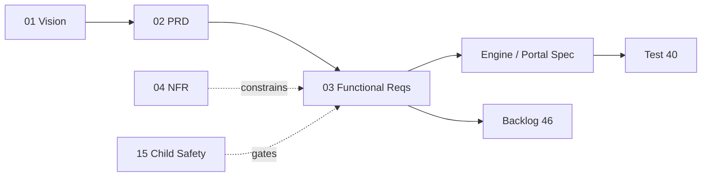

# 03 · Functional Requirements

| | |
|---|---|
| **Document ID** | 03 |
| **Owner** | Staff Product Manager / Lead Business Analyst |
| **Status** | Draft (Phase 1) |
| **Last updated** | 2026-07-19 |
| **Related** | [02 PRD](./02-prd.md) · [04 Non-Functional Requirements](./04-non-functional-requirements.md) · [06 Journeys](./06-user-journeys.md) · [08 System Architecture](../02-architecture/08-system-architecture.md) · [10 API Design](../02-architecture/10-api-design.md) · [15 Child Safety](../03-security-privacy/15-child-safety-framework.md) · [21 Curriculum](../05-education/21-curriculum-engine.md) · [22 Lesson Engine](../05-education/22-lesson-engine.md) · [23 Assessment Engine](../05-education/23-assessment-engine.md) · [24 AI Teacher](../05-education/24-ai-teacher-specification.md) · [46 Backlog](../08-delivery/46-project-backlog.md) |

## Purpose

This document enumerates the **testable functional requirements** of Project Taleem, decomposing the
feature spine of [02 PRD §5](./02-prd.md) into atomic, traceable statements. Each requirement has a
stable ID (`FR-<CTX>-NNN`), a priority, a release, and an acceptance-criteria contract. It is the
authority that [40 Testing Strategy](../07-engineering/40-testing-strategy.md) writes tests against and
that [46 Backlog](../08-delivery/46-project-backlog.md) breaks into stories.

## Scope

In scope: *what* the system must do, per bounded context, as verifiable behaviour. Out of scope:
*how well* it must do it (quality attributes — owned by [04 NFR](./04-non-functional-requirements.md)),
UX/visual detail ([04-design/*](../04-design/17-ui-design-system.md)), and internal algorithm design
(owned by the relevant engine spec). This document references those; it does not duplicate them.

---

## 1. How to read a requirement

Each requirement is a row in its context's table:

- **ID** — `FR-<CTX>-NNN`, stable forever. `<CTX>` is the PRD context prefix (e.g. `IDN`, `LSN`).
- **Requirement** — a single MUST/SHOULD/MAY statement (RFC 2119). MUST = release blocker for its
  release; SHOULD = strongly expected, waivable only with a recorded decision; MAY = optional.
- **Rel** — first release the requirement is binding in (`MVP` / `v1` / `v2`), per PRD §4.
- **Acceptance** — the observable condition that proves the requirement is met. Every MUST has one.

Traceability chain: **[01 Vision](../00-overview/01-vision.md) → [02 PRD goal](./02-prd.md) → FR
(this doc) → engine/portal spec → test → backlog story.** Cross-cutting mandates (child safety,
low-bandwidth, accessibility, privacy) are **acceptance criteria on every requirement**, restated as
global constraints in §16 rather than repeated per row.

---

## 2. Identity & Access — `FR-IDN`

| ID | Requirement | Rel | Acceptance |
|---|---|---|---|
| FR-IDN-001 | The system MUST let a Guardian create an account and enrol a Student, capturing explicit, revocable consent before any child data is stored. | MVP | No Student record exists without a linked, timestamped consent record; revoking consent triggers the erasure flow in [14 Privacy](../03-security-privacy/14-privacy-model.md). |
| FR-IDN-002 | The system MUST support low-friction authentication suitable for shared low-end devices (phone-number + OTP and/or PIN), not requiring email. | MVP | A Student can sign in on a 3G device with an OTP or PIN in ≤ 3 steps; no email is required anywhere in the flow. |
| FR-IDN-003 | The system MUST support device binding so a shared device can hold multiple Student profiles switchable without re-auth friction. | MVP | Two Students on one device switch profiles with a PIN; sessions are isolated per profile. |
| FR-IDN-004 | The system MUST assign every principal exactly one canonical role from [Authoring Brief §2](../_meta/authoring-brief.md) and enforce it via the authorization model. | MVP | Access decisions resolve through [12 Authorization](../03-security-privacy/12-authorization-model.md); no principal acts outside its role in an audit sample. |
| FR-IDN-005 | The system MUST allow a Guardian to view, export, and revoke consent and to request erasure of their child's data. | MVP | Guardian self-service consent screen exists; export and erasure requests are logged and fulfilled within the SLA in [14 Privacy](../03-security-privacy/14-privacy-model.md). |
| FR-IDN-006 | The system MUST expire and rotate sessions and support remote sign-out of a lost/shared device. | MVP | Sessions expire per [11 Authentication](../03-security-privacy/11-authentication-strategy.md); a Guardian can revoke a device and its sessions end immediately. |
| FR-IDN-007 | The system **MUST** support account/PIN recovery without email (Guardian-phone or Mentor-assisted), resistant to social-engineering. *(Promoted SHOULD/v1 → MUST/MVP per audit AR-H-07 — the primary persona has no email and shared-device sibling PINs; a day-one lockout has no recourse otherwise.)* | **MVP** | A Student who lost their PIN recovers access via a recorded, rate-limited, independently-verified flow that never exposes another child's data. |
| FR-IDN-008 | The system **MUST** provide an unaccompanied-minor / no-available-guardian enrolment pathway (institutional/NGO guardianship + independent attestation + heightened safety envelope). *(New — audit AR-C-01; DECISION REQUIRED: legal sufficiency.)* | MVP | A guardian-less child (orphan/displaced) can enrol via the pathway with two-person institutional control ([11 §3.2](../03-security-privacy/11-authentication-strategy.md); pathway design tracked in [RISK_REMEDIATION_PLAN.md](../../RISK_REMEDIATION_PLAN.md) AR-C-01). |

## 3. Enrolment & School Ops — `FR-ENR`

| ID | Requirement | Rel | Acceptance |
|---|---|---|---|
| FR-ENR-001 | The system MUST place an enrolled Student into a grade (KG–G10) and a cohort. | MVP | Every active Student has exactly one current grade and cohort; placement is auditable. |
| FR-ENR-002 | The system MUST model a timetable that maps a cohort to a structured, recurring set of lessons per subject. | MVP | A cohort's week renders as a timetable; each slot resolves to a curriculum unit via [21 Curriculum](../05-education/21-curriculum-engine.md). |
| FR-ENR-003 | The system MUST record attendance in an async, offline-capable sense (defined by the attendance semantics rule). | MVP | An "attended" event is emitted per the agreed rule (see Open Questions) and survives offline queueing. |
| FR-ENR-004 | The system MUST let a School Admin assign one or more Mentors to a cohort. | MVP | A cohort has ≥1 assigned Mentor; the Mentor sees only their assigned cohorts ([28 Mentor](../06-portals/28-mentor-portal.md)). |
| FR-ENR-005 | The system MUST support modelling multiple "schools"/regions without code change, isolating their cohorts and admins. | v1 | Two schools coexist; a School Admin of one cannot read the other's Students. |
| FR-ENR-006 | The system SHOULD support cohort transfer and re-placement (e.g. a mis-placed Student) with an audit trail. | v1 | A Student moved between cohorts retains their record; the change is logged with actor and reason. |

## 4. Curriculum — `FR-CUR`

| ID | Requirement | Rel | Acceptance |
|---|---|---|---|
| FR-CUR-001 | The system MUST model curriculum **as data** — subjects, grades, units, and learning objectives — with no hardcoded curriculum content. | MVP | A Curriculum Architect adds a unit via authoring tools with zero code deploy; see [21 Curriculum](../05-education/21-curriculum-engine.md). |
| FR-CUR-002 | The system MUST map every learning objective to a curriculum standard (SNC KG–G10) for traceability. | MVP | Each objective carries a standard code; coverage reports list unmapped objectives as errors. |
| FR-CUR-003 | The system MUST version curriculum so that a Student's record references the exact curriculum version they learned against. | MVP | Report cards and mastery records cite a curriculum version; editing a published unit creates a new version, never mutating history. |
| FR-CUR-004 | The system MUST support the v1 core subjects (Urdu, English, Mathematics, Science, Islamiat, Social/Pakistan Studies) and adding subjects without schema change. | MVP (KG–G5) → v1 (KG–G10) | A new subject is added as data; the schema is unchanged; existing Students are unaffected. |
| FR-CUR-005 | The system SHOULD support provincial/board variance as data overlays on the SNC spine. | v2 | A board variant is expressed as an overlay; the base spine is unmodified. |
| FR-CUR-006 | The system MUST express each objective's **mastery criteria** consumable by the Assessment and Lesson engines. | MVP | An objective's mastery rule is machine-readable and referenced by [23 Assessment](../05-education/23-assessment-engine.md). |

## 5. Lesson Delivery — `FR-LSN`

| ID | Requirement | Rel | Acceptance |
|---|---|---|---|
| FR-LSN-001 | The system MUST render a lesson from ordered content blocks (text, image, audio, interactive check) in the lesson runtime. | MVP | A lesson defined as blocks renders in order on a low-end device; see [22 Lesson Engine](../05-education/22-lesson-engine.md). |
| FR-LSN-002 | The system MUST track per-Student lesson progress and support **resume** from the exact last position. | MVP | Closing and reopening a lesson resumes at the last block; progress survives app restart and offline. |
| FR-LSN-003 | The system MUST let a Student download an **offline day-pack** (a day/week of lessons + assets) and complete lessons fully offline. | MVP | With the network disabled after download, a Student completes lessons and their progress + submissions queue locally per [33 Offline](../02-architecture/33-offline-architecture.md). |
| FR-LSN-004 | The system MUST queue offline submissions and progress and sync them idempotently on reconnect without loss or duplication. | MVP | Reconnecting flushes the queue; replaying the same queue twice produces identical server state (idempotent). |
| FR-LSN-005 | The system MUST default to **lite mode** on slow links (reduced media, deferred non-essential assets) within the data budget. | MVP | On a throttled 3G profile, a lesson loads in lite mode within the [04 NFR](./04-non-functional-requirements.md) payload budget. |
| FR-LSN-006 | The system MUST present lessons Urdu-first, RTL-complete, and accessible per [16 Accessibility](../04-design/16-accessibility-standards.md). | MVP | Lesson UI passes RTL and WCAG 2.2 AA checks; Urdu Nastaʿlīq/Naskh renders correctly. |
| FR-LSN-007 | The system SHOULD support adaptive pacing (reorder/repeat blocks) based on mastery signals. | v2 | Pacing adapts per the Lesson Engine's mastery inputs without breaking resume or offline. |

## 6. AI Teacher — `FR-AIT`

| ID | Requirement | Rel | Acceptance |
|---|---|---|---|
| FR-AIT-001 | The system MUST answer a Student's curriculum question via an AI Teacher **grounded in curriculum content (RAG)**, never as an open-ended chatbot. | MVP | Responses cite/derive from indexed curriculum; off-syllabus prompts are redirected, not freely answered ([24 AI Teacher](../05-education/24-ai-teacher-specification.md)). |
| FR-AIT-002 | The system MUST route every AI input and output through the [15 Child Safety](../03-security-privacy/15-child-safety-framework.md) guardrails **before** it reaches a child. | MVP | An unsafe generated response is blocked/replaced and logged; no child sees ungoverned AI output in a red-team sample. |
| FR-AIT-003 | The system MUST log every AI interaction (prompt, retrieved context, response, model tier, safety verdict) as a moderatable transcript. | MVP | Each interaction has a retrievable transcript record accessible to Trust & Safety; retention follows [14 Privacy](../03-security-privacy/14-privacy-model.md). |
| FR-AIT-004 | The AI Teacher MUST prefer honest uncertainty ("I don't know / let's ask your Mentor") over fabricating an answer. | MVP | On an unanswerable/unsafe query, the AI Teacher declines or escalates rather than hallucinating, verified by eval set. |
| FR-AIT-005 | The system MUST call LLM providers only through the internal `AITeacher` gateway with tiered model routing; product code MUST NOT call a provider SDK directly. | MVP | Static analysis finds no direct provider SDK import outside the gateway ([08 Architecture](../02-architecture/08-system-architecture.md)). |
| FR-AIT-006 | The AI Teacher MUST never imply it is human and MUST be labelled "AI Teacher" in student-facing copy. | MVP | All AI surfaces show the AI-Teacher label; copy review finds no human impersonation. |
| FR-AIT-007 | The AI Teacher **MUST** escalate a Student to a live human within a tiered numeric SLA on distress/safeguarding signals, serving a deterministic clinician-reviewed holding response. *(Promoted SHOULD/v1 → MUST/MVP per audit AR-C-04.)* | **MVP** | Escalation reaches a human within the [52 Crisis Protocol](../03-security-privacy/52-safeguarding-crisis-protocol.md) SLA (T0 ≤ 5 min, 24/7); the holding response is template-served outside the LLM path; MVP has a responder surface ([28 Mentor](../06-portals/28-mentor-portal.md) / Safety console). |
| FR-AIT-008 | All **Mentor↔Student communication MUST** be in-platform, logged, moderated through the safety pipeline, rate-limited, and must never permit off-platform contact-info exchange. *(New — audit AR-H-01.)* | MVP | No Mentor↔child channel exists outside the moderated pipeline in a red-team test ([15 §7](../03-security-privacy/15-child-safety-framework.md)). |

## 7. Assessment — `FR-ASM`

| ID | Requirement | Rel | Acceptance |
|---|---|---|---|
| FR-ASM-001 | The system MUST maintain an **item bank** of assessment items mapped to learning objectives. | MVP | Every item links to ≥1 objective; orphan items are flagged. |
| FR-ASM-002 | The system MUST deliver formative checks and at least one exam type, recording each **attempt** immutably. | MVP | Attempts are append-only; a completed attempt cannot be silently edited. |
| FR-ASM-003 | The system MUST **auto-grade** objective item types and compute mastery against the objective's criteria. | MVP | Auto-graded results match a gold set; mastery is computed per [FR-CUR-006]. |
| FR-ASM-004 | The system MUST support **human grading** of subjective work by a Mentor, combined with auto scores in one gradebook. | v1 | A Mentor grades subjective items; the gradebook reflects the combined result with grader attribution. |
| FR-ASM-005 | The system MUST support offline attempt capture, syncing per the offline contract without allowing answer tampering after submission. | MVP | An offline-submitted attempt is sealed at submission time and syncs idempotently. |
| FR-ASM-006 | The system SHOULD provide **proctoring-lite** integrity signals (e.g. focus loss, timing anomalies) without hostile surveillance of children. | v1 | Integrity signals are advisory, privacy-reviewed, and never the sole basis of a high-stakes decision. |
| FR-ASM-007 | The system MUST emit the **"objective mastered"** north-star event when mastery criteria are met. | MVP | Mastery produces exactly one north-star event (deduplicated), even across offline replay. |

## 8. Grading & Reporting — `FR-GRD`

| ID | Requirement | Rel | Acceptance |
|---|---|---|---|
| FR-GRD-001 | The system MUST maintain a per-Student **gradebook** aggregating attempts, mastery, and human grades. | MVP | Gradebook totals reconcile with underlying attempts for any sampled Student. |
| FR-GRD-002 | The system MUST generate a **report card v1** a Guardian can view and export (PDF-able), citing curriculum version and mastery evidence. | MVP | A report card renders and exports; it names the curriculum version and lists objective-level results. |
| FR-GRD-003 | The system MUST never inflate or fabricate results; report-card figures MUST be derivable from immutable attempt records. | MVP | Every report-card number traces to source attempts; no manual override without a logged, authorised reason. |
| FR-GRD-004 | The system MUST support **promotion decisions** with a human accountable in the loop (no unsupervised high-stakes AI decision). | v1 | A promotion records the deciding human and the evidence; AI may recommend but not decide alone ([15 Child Safety](../03-security-privacy/15-child-safety-framework.md)). |
| FR-GRD-005 | The system SHOULD produce a cumulative **transcript** across grades. | v1 | A transcript aggregates report cards across cycles with consistent identity and curriculum versions. |

## 9. Engagement & Notifications — `FR-ENG`

| ID | Requirement | Rel | Acceptance |
|---|---|---|---|
| FR-ENG-001 | The system MUST deliver essential transactional notifications (consent, report card ready, safety) over SMS/WhatsApp. | MVP | A Guardian receives a report-card-ready message; delivery is logged ([30 Notifications](../06-portals/30-notification-system.md)). |
| FR-ENG-002 | The system MUST respect consent, channel preference, quiet hours, and opt-out for every non-safety message. | MVP | Opted-out Guardians receive no non-safety messages; quiet hours are honoured. |
| FR-ENG-003 | The system SHOULD send learning nudges and streak reminders that motivate without dark patterns. | v1 | Nudges pass the anti-dark-pattern review; frequency caps are enforced. |
| FR-ENG-004 | The system SHOULD support cohort/house membership and celebration events (non-exploitative student life). | v1 | Streaks/houses exist and are safety-reviewed; no engagement-maximising exploitation. |
| FR-ENG-005 | The system MUST fall back across channels (e.g. push → SMS) when a primary channel fails for a critical message. | v1 | A failed push for a critical message triggers an SMS fallback, logged end-to-end. |

## 10. Trust & Safety — `FR-TNS`

| ID | Requirement | Rel | Acceptance |
|---|---|---|---|
| FR-TNS-001 | The system MUST moderate all AI output and all user uploads before a child is exposed to them. | MVP | No unmoderated upload or AI output reaches a child in a red-team test ([15 Child Safety](../03-security-privacy/15-child-safety-framework.md)). |
| FR-TNS-002 | The system MUST let any user (and the system automatically) **flag** content/interactions for review. | MVP | A flag creates a triage item with the context attached. |
| FR-TNS-003 | The system MUST provide a Safety Officer triage queue with SLA tracking and escalation. | MVP | Flags appear in the queue with age/SLA; overdue flags escalate. |
| FR-TNS-004 | The system MUST maintain an immutable audit log of safety-relevant actions. | MVP | Safety actions are append-only and tamper-evident; sampled actions reconcile with the audit log. |
| FR-TNS-005 | The system MUST support a safeguarding escalation path that reaches a human (Mentor/Safety Officer) within SLA for high-severity signals. | MVP | A high-severity safeguarding signal reaches a human within the defined SLA, recorded end-to-end. |
| FR-TNS-006 | The system SHOULD provide safeguarding case management (case state, notes, resolution). | v1 | A flagged case moves through states to resolution with a full history. |

## 11. Media — `FR-MED`

| ID | Requirement | Rel | Acceptance |
|---|---|---|---|
| FR-MED-001 | The system MUST optimise images (format, resolution, compression) to meet lesson data budgets. | MVP | Delivered images fit the per-screen budget in [04 NFR](./04-non-functional-requirements.md); see [34 Media](../02-architecture/34-media-architecture.md). |
| FR-MED-002 | The system MUST package media for offline day-packs with integrity verification. | MVP | Day-pack assets download once, verify by checksum, and render offline. |
| FR-MED-003 | The system MUST support audio content usable on low-end devices and metered data. | MVP | Audio streams/plays within budget; a lite variant exists. |
| FR-MED-004 | The system MUST scan and moderate all uploaded media through Trust & Safety before delivery. | MVP | An uploaded image is safety-scanned before any child can view it. |
| FR-MED-005 | The system SHOULD provide adaptive-bitrate video with a documented degraded-mode (audio/transcript-only) fallback. | v1 | Video adapts to bandwidth and degrades to audio/transcript on poor links (no feature ships without degraded mode). |

## 12. Search — `FR-SCH`

| ID | Requirement | Rel | Acceptance |
|---|---|---|---|
| FR-SCH-001 | The system MUST index curriculum, lessons, and help content and answer queries via Meilisearch. | v1 | A query returns relevant curriculum/lesson/help results; see [32 Search](../02-architecture/32-search-architecture.md). |
| FR-SCH-002 | Search MUST be Urdu-aware (script, diacritics, RTL) and typo-tolerant. | v1 | Urdu queries with common vari/typo forms return correct results. |
| FR-SCH-003 | Search MUST respect authorization so results never leak content a principal cannot access. | v1 | A principal never sees a result they are not entitled to open. |

## 13. Analytics & Insights — `FR-ANL`

| ID | Requirement | Rel | Acceptance |
|---|---|---|---|
| FR-ANL-001 | The system MUST ingest product events (including the north-star event) into the analytics pipeline, tolerating offline-queued arrival. | MVP | Events land in the pipeline; offline events arrive after reconnect without loss or double-count. |
| FR-ANL-002 | Analytics MUST use privacy-preserving identifiers and never expose raw child PII in dashboards. | MVP | Dashboard datasets contain no raw child PII; access is authorized ([14 Privacy](../03-security-privacy/14-privacy-model.md)). |
| FR-ANL-003 | The system SHOULD provide dashboards for Mentors/Admins (progress, attendance, mastery, at-risk). | v1 | Dashboards render the agreed metrics for the viewer's authorized scope only ([31 Analytics](../06-portals/31-analytics-platform.md)). |

## 14. Payments & Sponsorship — `FR-PAY`

| ID | Requirement | Rel | Acceptance |
|---|---|---|---|
| FR-PAY-001 | The system MUST NOT place a fee wall on the core learning path. | MVP | The full enrol→lesson→assess→report-card loop is reachable with zero payment. |
| FR-PAY-002 | The system SHOULD model sponsors/donors and fee-waiver/scholarship allocation (thin). | v1 | A sponsor can fund a cohort; a Student's waiver is recorded and never gates core learning. |
| FR-PAY-003 | The system SHOULD support sponsorship reporting for donors without exposing child PII. | v2 | Donors see aggregate impact, never identifiable child data. |

## 15. Platform / Admin — `FR-ADM`

| ID | Requirement | Rel | Acceptance |
|---|---|---|---|
| FR-ADM-001 | The system MUST provide configuration and **feature flags** to operate a pilot and roll features gradually. | MVP | A flag toggles a feature per cohort/school without deploy ([08 Architecture](../02-architecture/08-system-architecture.md)). |
| FR-ADM-002 | The system MUST let a Platform Admin publish curriculum versions and manage catalog safely. | MVP | Publishing is gated, audited, and reversible; a bad publish can be rolled back. |
| FR-ADM-003 | The system MUST provide back-office audit visibility over privileged actions. | MVP | Privileged actions are logged and queryable by authorized staff. |
| FR-ADM-004 | The system SHOULD support graceful maintenance / degraded modes announced to users in-language. | v1 | Maintenance shows an Urdu-first, accessible notice; core offline content stays usable. |

## 16. Global functional constraints (apply to every requirement)

These are **acceptance criteria on all requirements above**, not separate features
([Authoring Brief §8](../_meta/authoring-brief.md), [01 Vision §7](../00-overview/01-vision.md)):

| # | Constraint | Authority |
|---|---|---|
| GC-1 | **Child safety** — no requirement ships if it can expose a child to unsafe content or actors. | [15 Child Safety](../03-security-privacy/15-child-safety-framework.md) |
| GC-2 | **Bottom-of-curve** — every user-facing requirement works offline/lite on low-end Android/3G within data budgets. | [04 NFR](./04-non-functional-requirements.md), [33 Offline](../02-architecture/33-offline-architecture.md) |
| GC-3 | **Accessibility & Urdu-first** — WCAG 2.2 AA and complete RTL are pass/fail criteria. | [16 Accessibility](../04-design/16-accessibility-standards.md) |
| GC-4 | **Privacy by design** — collect the least child data; enforce consent and least privilege. | [14 Privacy](../03-security-privacy/14-privacy-model.md) |
| GC-5 | **Auditability** — safety-, grade-, and privilege-affecting actions are logged immutably. | [13 Security](../03-security-privacy/13-security-model.md) |
| GC-6 | **Honesty** — no fabricated grades, progress, or AI claims. | [01 Vision §7](../00-overview/01-vision.md) |
| GC-7 | **Scale** — no requirement's implementation may cap growth below 1,000,000 students. | [04 NFR](./04-non-functional-requirements.md) |

## 17. Requirement summary & coverage

| Context | Prefix | Count | MVP MUSTs |
|---|---|---|---|
| Identity & Access | FR-IDN | 9 | 8 |
| Enrolment & School Ops | FR-ENR | 6 | 4 |
| Curriculum | FR-CUR | 6 | 5 |
| Lesson Delivery | FR-LSN | 7 | 6 |
| AI Teacher | FR-AIT | 8 | 8 |
| Assessment | FR-ASM | 7 | 5 |
| Grading & Reporting | FR-GRD | 5 | 3 |
| Engagement & Notifications | FR-ENG | 5 | 2 |
| Trust & Safety | FR-TNS | 6 | 5 |
| Media | FR-MED | 5 | 4 |
| Search | FR-SCH | 3 | 0 |
| Analytics & Insights | FR-ANL | 3 | 2 |
| Payments & Sponsorship | FR-PAY | 3 | 1 |
| Platform / Admin | FR-ADM | 4 | 3 |
| **Total** | — | **77** | **56** |

> **Post-audit (2026-07-19):** the review ([ARCHITECTURE_REVIEW.md](../../ARCHITECTURE_REVIEW.md))
> promoted FR-AIT-007 (distress escalation) and FR-IDN-007 (recovery) from v1/SHOULD to **MVP/MUST**, and
> added FR-AIT-008 (moderated Mentor↔child comms) and FR-IDN-008 (unaccompanied-minor pathway). A
> curriculum-content-review requirement is now enforced via [15 §4](../03-security-privacy/15-child-safety-framework.md).

Every MVP MUST maps to at least one [02 PRD §9.1](./02-prd.md) release blocker and will map to at
least one test in [40 Testing Strategy](../07-engineering/40-testing-strategy.md) and one story in
[46 Backlog](../08-delivery/46-project-backlog.md).

---

## Open questions

- **Attendance semantics** (FR-ENR-003): what event(s) count as "attending" in an async,
  offline-capable school? (Shared open question with [02 PRD](./02-prd.md); blocks the acceptance
  wording.)
- **Mastery bar** (FR-ASM-007 / FR-CUR-006): the exact threshold for "objective mastered" is owned by
  [23 Assessment](../05-education/23-assessment-engine.md) and must be locked to finalise acceptance.
- **Recovery without email** (FR-IDN-007): the social-engineering-resistant recovery flow needs a
  security design in [11 Authentication](../03-security-privacy/11-authentication-strategy.md).
- **Proctoring-lite ethics** (FR-ASM-006): which integrity signals are acceptable for children under
  the privacy and child-safety frameworks?
- **Offline conflict resolution** (FR-LSN-004): the merge/last-writer rules for conflicting offline
  edits are owned by [33 Offline](../02-architecture/33-offline-architecture.md).

## Change log

| Date | Change | Author |
|---|---|---|
| 2026-07-19 | Initial functional requirements: 74 requirements across 14 bounded contexts with IDs, releases, and acceptance criteria; global constraints; traceability to PRD/tests/backlog. | Staff PM / Lead BA |
