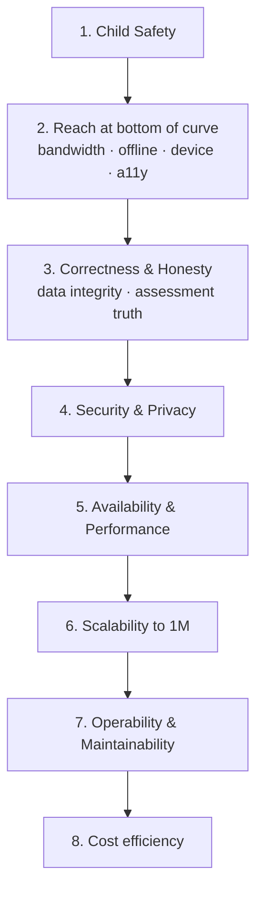

# 04 · Non-Functional Requirements

| | |
|---|---|
| **Document ID** | 04 |
| **Owner** | Principal Engineer / Head of Quality |
| **Status** | Draft (Phase 1) |
| **Last updated** | 2026-07-19 |
| **Related** | [Authoring Brief §6](../_meta/authoring-brief.md) · [02 PRD](./02-prd.md) · [03 Functional Requirements](./03-functional-requirements.md) · [08 System Architecture](../02-architecture/08-system-architecture.md) · [13 Security](../03-security-privacy/13-security-model.md) · [16 Accessibility](../04-design/16-accessibility-standards.md) · [33 Offline](../02-architecture/33-offline-architecture.md) · [35 Deployment](../02-architecture/35-deployment-architecture.md) · [38 Monitoring](../07-engineering/38-monitoring.md) · [40 Testing](../07-engineering/40-testing-strategy.md) |

## Purpose

This document defines the **quality attributes** — the "how well" — that Project Taleem must meet:
performance, scalability, availability, low-bandwidth budgets, offline behaviour, security, privacy,
accessibility, reliability, observability, maintainability, and cost. Each NFR has a stable ID
(`NFR-<CAT>-NN`), a target, and a **measurement method**, so that a requirement is either met or not —
never a matter of opinion.

## Scope

In scope: measurable, cross-cutting quality targets binding on all functional requirements in
[03 FR](./03-functional-requirements.md). Out of scope: the *mechanisms* that achieve them (owned by
architecture, deployment, infra, and engineering-practice docs, which are cross-referenced). A target
here without a named measurement method is a defect in this document.

---

## 1. NFR taxonomy & the prime directive

Taleem's quality attributes are ranked. When two conflict, the higher-ranked wins, and the trade-off
is recorded. This ordering operationalises [01 Vision §7](../00-overview/01-vision.md).

**Prime directive:** *a feature that is fast, cheap, and beautiful but unreachable by a girl on a
shared 3G phone has failed its most important NFR.* Reach outranks raw performance and cost.

Categories & prefixes: Performance `PERF`, Bandwidth/Data `DATA`, Offline `OFFL`, Scalability
`SCAL`, Availability `AVAIL`, Reliability `REL`, Security `SEC`, Privacy `PRIV`, Accessibility
`A11Y`, Localisation `L10N`, Observability `OBS`, Maintainability `MNT`, Compatibility `COMPAT`,
Cost `COST`.

---

## 2. Target device & network baseline (the "reference poverty line")

All budgets below are validated against this baseline, not a developer's laptop. This is the
**reference environment**; passing here is the bar.

| Dimension | Reference baseline (planning assumption) | Notes |
|---|---|---|
| Device | Low-end Android, ~2 GB RAM, Android 8+, quad-core ~1.4 GHz, 720p | Often shared across siblings |
| CPU throttle | 4–6× slowdown vs desktop | Model in Lighthouse/CI |
| Network | 3G, ~400 kbps down / 100 kbps up, ~400 ms RTT, packet loss | "Slow 3G" profile in CI |
| Data cost | Metered, prepaid, per-MB — data is money | Drives DATA budgets |
| Power | 2–4 h electricity/day; battery-conscious | Drives offline + efficiency |
| Browser | Chrome/Android WebView, modern evergreen; PWA-capable | No native store dependency (PRD NG3) |

**COMPAT-01 (MUST):** the core learning path is fully usable on the reference baseline. **Measurement:**
CI runs the core journeys under the emulated device+network profile; a failure is a release blocker.

---

## 3. Performance — `PERF`

| ID | Requirement | Target | Measurement |
|---|---|---|---|
| PERF-01 | API latency, in-region | p95 < 300 ms, p99 < 800 ms (excl. AI calls) | APM histograms in [38 Monitoring](../07-engineering/38-monitoring.md); synthetic probes |
| PERF-02 | First Contentful Paint, lesson page, reference baseline | < 3 s on Slow 3G | Lighthouse CI in the pipeline ([37 CI/CD](../07-engineering/37-cicd-pipeline.md)) |
| PERF-03 | Time-to-Interactive, lesson page, reference baseline | < 5 s on Slow 3G | Lighthouse CI |
| PERF-04 | Interaction responsiveness (INP) | INP < 200 ms at p75 | RUM field data |
| PERF-05 | AI Teacher first-token latency | < 2.5 s p95 in-region | Gateway metrics; streamed responses so perceived latency is low |
| PERF-06 | Offline lesson open (cached) | < 1 s | Local benchmark on reference device |
| PERF-07 | Search query latency | < 150 ms p95 | Meilisearch metrics ([32 Search](../02-architecture/32-search-architecture.md)) |

**Design consequence:** Server Components by default, streamed AI responses, aggressive caching, and
minimal client JS ([08 Architecture](../02-architecture/08-system-architecture.md)).

## 4. Bandwidth & data budgets — `DATA`

Data is money to our learners. Every screen has a **documented data budget**; exceeding it is a
defect, not a nice-to-have.

| ID | Requirement | Budget | Measurement |
|---|---|---|---|
| DATA-01 | Initial route JS (gzip) | ≤ 150 KB | Bundle-size gate in CI; PR fails on regression |
| DATA-02 | Lesson page, fully usable (total transfer, lite mode) | ≤ 500 KB | WebPageTest/Lighthouse transfer report |
| DATA-03 | Per-image payload (optimised) | ≤ 60 KB typical; hard cap enforced by Media pipeline | [34 Media](../02-architecture/34-media-architecture.md) checks |
| DATA-04 | A full offline **day-pack** | Documented, capped, shown to user before download | Day-pack manifest size assertion |
| DATA-05 | Lite mode is **default** on slow/metered links; rich assets are opt-in | Lite mode active whenever Save-Data or slow link detected | Feature test on throttled profile |
| DATA-06 | No screen loads non-essential third-party assets on the critical path | 0 blocking third-party bytes | CI network-request audit |

**Data-cost empathy is a guardrail metric** (PRD §6): it must not regress while chasing other goals.

## 5. Offline & sync — `OFFL`

| ID | Requirement | Target | Measurement |
|---|---|---|---|
| OFFL-01 | A Student can download a day/week of lessons and complete them fully offline | 100% of core lesson types | Offline E2E test (network disabled) |
| OFFL-02 | Progress and submissions queue locally and sync **idempotently** on reconnect | Zero loss, zero duplication | Replay test: flush queue twice → identical server state |
| OFFL-03 | Sync conflict resolution is deterministic and documented | No silent data loss | Conflict-scenario tests per [33 Offline](../02-architecture/33-offline-architecture.md) |
| OFFL-04 | The app degrades gracefully offline (clear state, no dead ends) | No unrecoverable offline state | UX offline audit |
| OFFL-05 | Assessment attempts are sealed at submission and tamper-proof offline | Sealed attempts immutable | Integrity test |

## 6. Scalability — `SCAL`

The architecture must serve **1,000,000 enrolled students** (Brief §1) with no rework of the core
path. Scale is designed in, not deferred.

| ID | Requirement | Target | Measurement |
|---|---|---|---|
| SCAL-01 | Core learning path scales horizontally (stateless services behind LB) | Linear scale-out to 1M enrolled | Load test toward target ([40 Testing](../07-engineering/40-testing-strategy.md)) |
| SCAL-02 | No component has a hard ceiling below 1M without a documented shard/partition plan | 0 un-mitigated ceilings | Architecture review checklist |
| SCAL-03 | Peak concurrent active learners sustained | ≥ 100k concurrent (planning assumption) | Sustained load test |
| SCAL-04 | Data stores partition/shard by tenant/context where justified | Documented growth plan per store | [09 Database](../02-architecture/09-database-design.md) |
| SCAL-05 | AI Teacher cost/throughput scales via tiered routing + caching | Cost/Student within envelope (see COST) | Gateway load + cost model |
| SCAL-06 | Event pipeline handles north-star + product events at 1M scale | No backpressure loss | Pipeline load test |

## 7. Availability & reliability — `AVAIL` / `REL`

| ID | Requirement | Target | Measurement |
|---|---|---|---|
| AVAIL-01 | Core learning path (login → lesson → submit) availability | 99.9% monthly | SLO monitoring; error-budget policy ([38 Monitoring](../07-engineering/38-monitoring.md)) |
| AVAIL-02 | Admin/analytics surfaces availability | 99.5% monthly | SLO monitoring |
| AVAIL-03 | Planned maintenance never breaks offline learning | 0 offline outages during maintenance | Maintenance runbook + test |
| REL-01 | Recovery Point Objective (RPO) for learner records | ≤ 5 min | Backup/replication verification |
| REL-02 | Recovery Time Objective (RTO) for core path | ≤ 30 min | DR drill ([35 Deployment](../02-architecture/35-deployment-architecture.md)) |
| REL-03 | Graceful degradation: AI down → lessons/assessment still work | Core path survives AI outage | Chaos/dependency-failure test |
| REL-04 | No single point of failure on the core path | 0 SPOFs | Architecture review + failure-injection |
| REL-05 | Idempotent, retry-safe write APIs on the critical path | Safe under client retries | Contract tests ([10 API](../02-architecture/10-api-design.md)) |

## 8. Security — `SEC`

Full model in [13 Security](../03-security-privacy/13-security-model.md); headline targets here.

| ID | Requirement | Target | Measurement |
|---|---|---|---|
| SEC-01 | OWASP **ASVS Level 2** conformance on all surfaces (core path first) | 100% applicable L2 controls | ASVS checklist + pen test |
| SEC-02 | Child data encrypted **at rest and in transit** | AES-256 at rest; TLS 1.2+ in transit | Config audit; scanner |
| SEC-03 | Least-privilege authorization on every access | 0 over-broad grants in review | [12 Authorization](../03-security-privacy/12-authorization-model.md) audit |
| SEC-04 | Dependency & container vulnerability scanning in CI | 0 known criticals released | SCA/image scan gate ([37 CI/CD](../07-engineering/37-cicd-pipeline.md)) |
| SEC-05 | Secrets never in code/images; rotated | 0 secrets in repo/image scans | Secret-scanning gate |
| SEC-06 | Security-relevant events audited immutably | Tamper-evident audit log | Audit-log verification |
| SEC-07 | Rate limiting & abuse protection on auth and AI endpoints | Enforced; abuse contained | Load/abuse test |

## 9. Privacy — `PRIV`

Full model in [14 Privacy](../03-security-privacy/14-privacy-model.md).

| ID | Requirement | Target | Measurement |
|---|---|---|---|
| PRIV-01 | Data minimisation: collect only what teaching/protecting a child requires | 0 unjustified fields in data-map review | Data inventory audit |
| PRIV-02 | Explicit, revocable **guardian consent** before any child-data processing | 100% of child records consent-linked | Consent-record audit |
| PRIV-03 | Right to access, export, and erasure honoured within SLA | Requests fulfilled ≤ SLA | Request-log audit |
| PRIV-04 | No child data sold, ad-targeted, or used to train third-party models | 0 such flows | Data-flow review; contractual controls |
| PRIV-05 | Analytics use privacy-preserving identifiers; no raw child PII in dashboards | 0 PII in analytics datasets | Dataset scan ([31 Analytics](../06-portals/31-analytics-platform.md)) |
| PRIV-06 | Data residency posture close to Pakistan; documented cross-border controls | Documented & enforced | Infra config review ([36 Infrastructure](../02-architecture/36-infrastructure-architecture.md)) |
| PRIV-07 | Retention limits per data class; auto-expiry of transcripts/logs | Retention enforced automatically | Retention-job verification |

## 10. Accessibility — `A11Y`

Full standard in [16 Accessibility](../04-design/16-accessibility-standards.md).

| ID | Requirement | Target | Measurement |
|---|---|---|---|
| A11Y-01 | WCAG **2.2 AA** on all user-facing surfaces (core path first) | 100% AA success criteria | Automated axe + manual audit in CI/QA |
| A11Y-02 | Complete RTL support for Urdu | 0 RTL layout defects on core path | RTL visual regression |
| A11Y-03 | Usable one-handed on a 360px screen; touch targets ≥ 44px | Pass | Manual + automated target-size check |
| A11Y-04 | Screen-reader operable in Urdu and English | Core journeys operable | Assistive-tech test matrix |
| A11Y-05 | Colour contrast meets AA; never colour-only signalling | Pass | Contrast checker; design tokens ([18 Tokens](../04-design/18-design-tokens.md)) |
| A11Y-06 | Works with low literacy: icon+text, audio support, plain language | Usability-validated | Low-literacy usability testing |

## 11. Localisation — `L10N`

| ID | Requirement | Target | Measurement |
|---|---|---|---|
| L10N-01 | Urdu-first UI with correct Nastaʿlīq/Naskh rendering | Correct rendering on reference device | Visual + font-fallback test |
| L10N-02 | All user-facing strings externalised; no hardcoded copy | 0 hardcoded strings | Lint/i18n-extraction check |
| L10N-03 | Architecture supports adding Sindhi/Pashto/Punjabi/Balochi without schema change | New language added as data | Design review; v2 pilot |
| L10N-04 | Locale-correct dates, numbers, and plurals | Correct formatting | Formatting tests |

## 12. Observability — `OBS`

| ID | Requirement | Target | Measurement |
|---|---|---|---|
| OBS-01 | Structured, correlated logs across services (trace/correlation IDs) | 100% requests traceable | [39 Logging](../07-engineering/39-logging.md) |
| OBS-02 | Metrics for the four golden signals per service | All core services instrumented | [38 Monitoring](../07-engineering/38-monitoring.md) |
| OBS-03 | Distributed tracing across the core path | End-to-end traces available | Tracing dashboards |
| OBS-04 | SLO dashboards + alerting with error budgets | Alerts fire before SLA breach | Alert test / game-day |
| OBS-05 | Logs never contain child PII or secrets | 0 PII/secret leaks in logs | Log-scanning gate |

## 13. Maintainability & operability — `MNT`

| ID | Requirement | Target | Measurement |
|---|---|---|---|
| MNT-01 | Clean/Hexagonal + DDD boundaries respected; no cross-context DB coupling | 0 boundary violations | Architecture fitness functions in CI |
| MNT-02 | Test coverage on core-path domain logic | ≥ 85% branch on domain layer (planning assumption) | Coverage gate ([40 Testing](../07-engineering/40-testing-strategy.md)) |
| MNT-03 | Reproducible builds; one-command local bring-up | `make up` works from clean clone | Onboarding CI check |
| MNT-04 | Infrastructure as code; no manual prod changes | 100% IaC-managed | Drift detection ([36 Infrastructure](../02-architecture/36-infrastructure-architecture.md)) |
| MNT-05 | Documented runbooks for every SLO alert | 1 runbook per alert | Runbook coverage audit |
| MNT-06 | 12-Factor config; environment parity | Pass | Config review |

## 14. Cost efficiency — `COST`

Marginal cost per active Student must trend toward affordability at national scale
([01 Vision §6](../00-overview/01-vision.md)); this makes the sponsorship funding model viable.

| ID | Requirement | Target | Measurement |
|---|---|---|---|
| COST-01 | Fully-loaded marginal cost per weekly-active Student tracked and trending down | Documented budget envelope (planning assumption) | Cost model + FinOps dashboard |
| COST-02 | AI Teacher cost controlled via tiered routing, caching, and prompt/RAG efficiency | Within per-Student AI envelope | Gateway cost metrics ([24 AI Teacher](../05-education/24-ai-teacher-specification.md)) |
| COST-03 | Infra scales down with load (no idle over-provisioning) | Elastic capacity | Utilisation dashboards |
| COST-04 | Media/storage costs bounded by optimisation + lifecycle policies | Lifecycle rules enforced | Storage cost review |

---

## 15. Verification & governance

- **Every NFR is a CI or operational gate**, not an aspiration. Performance, bundle, accessibility,
  security-scan, and coverage gates run in [37 CI/CD](../07-engineering/37-cicd-pipeline.md); runtime
  SLOs are monitored per [38 Monitoring](../07-engineering/38-monitoring.md).
- **Release blockers:** all `MUST` NFRs on the core path are release blockers, enforced in
  [50 Definition of Done](../07-engineering/50-definition-of-done.md).
- **Trade-off records:** when NFRs conflict, resolve by the §1 ranking and record the decision (ADR
  if it changes a fixed decision).
- **Planning assumptions** (labelled) are calibrated with pilot data and updated here — this doc is
  the single home for quality targets; other docs cite it, not restate it.

## Open questions

- **Concurrent-active target** (SCAL-03): is 100k concurrent the right planning number for the pilot
  and early scale, and how does it map to 1M enrolled? (Owned with [35 Deployment](../02-architecture/35-deployment-architecture.md).)
- **AI cost envelope** (COST-02): the per-Student monthly AI budget that keeps marginal cost viable
  is still open (shared with [24 AI Teacher](../05-education/24-ai-teacher-specification.md) and PRD).
- **Coverage target** (MNT-02): confirm ≥ 85% branch on domain layer vs. a differentiated target per
  layer. (Owned by [40 Testing](../07-engineering/40-testing-strategy.md).)
- **Data-residency specifics** (PRIV-06): exact in-region hosting and lawful cross-border transfer
  mechanisms pending legal input ([14 Privacy](../03-security-privacy/14-privacy-model.md)).

## Change log

| Date | Change | Author |
|---|---|---|
| 2026-07-19 | Initial NFRs: ranked quality attributes, reference device/network baseline, and measurable targets with methods across 14 categories; all tied to CI/operational gates. | Principal Engineer / Head of Quality |
