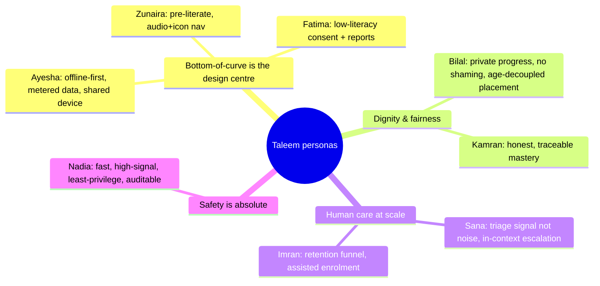

# 05 · User Personas

| | |
|---|---|
| **Document ID** | 05 |
| **Owner** | Staff UX Researcher |
| **Status** | Draft |
| **Last updated** | 2026-07-19 |
| **Related** | [01 Vision](../00-overview/01-vision.md) · [02 PRD](02-prd.md) · [06 User Journeys](06-user-journeys.md) · [07 Information Architecture](07-information-architecture.md) · [15 Child Safety](../03-security-privacy/15-child-safety-framework.md) · [20 Navigation](../04-design/20-navigation-structure.md) · [24 AI Teacher](../05-education/24-ai-teacher-specification.md) |

## Purpose

This document gives every downstream author a shared, human picture of *who* Taleem is for. It
translates the canonical roles from the [Authoring Brief](../_meta/authoring-brief.md) into concrete,
grounded personas so that design, architecture, curriculum, and safety decisions can be tested
against a real person rather than an abstraction. A persona here is a decision tool, not marketing: if
a proposed feature fails Ayesha or excludes Fatima, it fails.

## Scope

In scope: one or more personas per canonical role (Student, Guardian, Mentor, School Admin, Platform
Admin / Safety Officer, Curriculum Architect), each with context, goals, frustrations, device and
connectivity reality, literacy, motivations, a representative quote, and explicit design
implications. Out of scope: journeys (owned by [06](06-user-journeys.md)), quantitative market
sizing, and recruitment/segmentation strategy (business track).

---

## 1. How to use these personas

- **They are a filter, not a decoration.** Every screen, API, and content model should be checked
  against at least Ayesha (bottom of the connectivity curve) and Fatima (low-literacy caregiver). If
  it works for them it works for the top of the curve.
- **Design implications are contractual.** The bullets under each persona are the acceptance-criteria
  hooks other documents inherit; they are cross-referenced from IA, navigation, and the AI Teacher
  spec.
- **No stereotyping.** These are specific individuals with agency, ambition, and constraints — not
  representatives of a group. Poverty and limited literacy describe circumstances, never capability.
- **Names are illustrative** (planning assumption) and chosen to span provinces, genders, and urban/
  rural realities.

### Persona-to-role map

| Persona | Canonical role | Segment it stress-tests |
|---|---|---|
| **Ayesha Solangi** | Student | Out-of-school rural girl, shared device, metered 3G, low power |
| **Bilal Khan** | Student | Urban boy behind grade level, catch-up learner, second-hand device |
| **Zunaira Bibi** | Student | First-generation KG learner, pre-literate, needs audio-first UI |
| **Fatima Solangi** | Guardian | Low-literacy mother, consent-holder, voice-first, trust-driven |
| **Sana Iqbal** | Mentor | Trained educator scaling care across a cohort of ~150 |
| **Imran Baloch** | School Admin | Runs a regional "school"; enrolment drives, timetables, mentor load |
| **Nadia Rehman** | Platform Admin / Safety Officer | Safeguarding triage at national scale; audit and speed |
| **Dr. Kamran Ali** | Curriculum Architect | Maps SNC to objectives + assessment blueprints across boards |

---

## 2. Student personas

### 2.1 Ayesha Solangi — the out-of-school rural girl *(primary design centre)*

| Attribute | Detail |
|---|---|
| **Age / grade** | 11 · should be Grade 5, effectively never formally schooled past Grade 2 |
| **Location** | Village near Khairpur, rural Sindh |
| **Language** | Sindhi at home, Urdu is the medium she must learn in; almost no English |
| **Literacy** | Reads simple Urdu slowly; decodes numbers confidently; strong oral memory |
| **Device** | Father's Android (Redmi, 2GB RAM, Android 11), shared with 3 siblings; hers ~1 hr/evening |
| **Connectivity** | Zong 3G, ~2–3 GB/month the family rations; signal drops indoors; Wi-Fi none |
| **Power** | 4–6 hrs load-shedding daily; studies by phone light after Maghrib |
| **Context** | Helps with siblings and housework; the phone is negotiated, not owned; a nearby cousin left school when the girls' school closed |

**Goals**

- Learn to read and do maths well enough that dropping her from school was clearly a mistake.
- Not fall further behind her age group; feel she is *in a grade*, not "doing apps".
- Study in short bursts, in Urdu, without burning the family's data.

**Frustrations**

- Apps assume fast Wi-Fi and a personal phone; videos buffer and eat the whole month's data.
- English-first interfaces lock her out on the first screen.
- Losing her place when the phone is taken back or the power cuts.

**Motivations:** pride, proving herself, and a genuine hunger to learn; a mentor who *notices her*
matters more than any badge.

> "If it finishes my Baba's data, he takes the phone back. I want to learn, but quietly and cheaply."

**Design implications**

- **Offline-first is her baseline, not a mode.** Download a day/week over any window of connectivity;
  learn and be assessed fully offline; sync opportunistically. See [06 §Offline day](06-user-journeys.md).
- **Every screen shows a data cost**; "lite mode" (text/audio, no autoplay video) is the default on
  slow links (Brief §6).
- **Resume is sacred.** State survives app kill, power loss, and device hand-off between siblings on
  the same account (guardian-managed profiles).
- **Urdu-first, audio-supported reading** so slow decoding never blocks learning; Sindhi as a
  first-class language is a roadmap commitment, not a nicety (Vision §7.3).
- **Short-session design:** a lesson must yield value in a 10–15 minute burst and checkpoint often.

### 2.2 Bilal Khan — the urban boy behind grade level

| Attribute | Detail |
|---|---|
| **Age / grade** | 13 · enrolled at Grade 7 age, reading/maths at ~Grade 4 |
| **Location** | Katchi abadi (informal settlement), Karachi |
| **Language** | Urdu fluent (spoken + read); functional but weak English; strong street numeracy |
| **Literacy** | Reads Urdu well; low academic confidence — has been "the slow one" in a class of 60 |
| **Device** | Own second-hand Android (4GB RAM, cracked screen); prepaid data he tops up himself |
| **Connectivity** | Mostly 4G, occasional free Wi-Fi at a relative's shop; more data than Ayesha but budget-conscious |
| **Power** | Urban load-shedding; charges phone at the shop |
| **Context** | Works part-time; embarrassed by the gap between his age and his level; motivated by not looking foolish |

**Goals**

- Close the gap **without being publicly labelled "behind"**.
- Get to a real Matric pathway; sees education as an exit from informal work.
- Quick wins that rebuild confidence.

**Frustrations**

- Being placed by age into content he can't do, or by test into "baby" content that shames him.
- Rote, joyless drills; no sense of momentum.
- Feeling watched/compared with peers.

**Motivations:** dignity, upward mobility, and visible progress; streaks and mastery gates work *if*
they never expose his gap to others.

> "Just don't make me look stupid in front of everyone. Show me where I actually am and let me climb."

**Design implications**

- **Diagnostic placement decoupled from age**, framed privately and encouragingly; mastery-based
  progression lets him accelerate through what he knows and slow where he doesn't (Vision §4.2).
- **Private-by-default progress:** no public leaderboards that expose a struggling learner; cohort
  belonging without ranking (Vision anti-goal: no dark patterns).
- **Confidence loop:** early achievable wins, then stretch; celebration tuned to effort/mastery, not
  comparison.
- **Catch-up as a first-class flow**, not an error state — the IA must represent "learning below your
  enrolled grade" as normal (see [07 §Learning hierarchy](07-information-architecture.md)).

### 2.3 Zunaira Bibi — the first-generation KG learner *(pre-literate)*

| Attribute | Detail |
|---|---|
| **Age / grade** | 6 · KG |
| **Location** | Peri-urban Multan, south Punjab |
| **Language** | Saraiki/Punjabi at home; being introduced to Urdu |
| **Literacy** | Pre-literate — cannot yet read menus or labels |
| **Device** | Mother's phone, fully supervised sessions |
| **Connectivity** | Shared 3G; sessions are short and adult-mediated |
| **Context** | First person in her family to attend any "school"; learns by tapping, listening, mimicking |

**Goals (and her guardian's for her):** learn letters, sounds, numbers, and the *habit* of school;
feel joy, not pressure.

**Frustrations:** text-dependent navigation is a wall; long instructions lose her; anything scary or
loud.

**Motivations:** play, colour, sound, praise, and a caregiver sitting beside her.

> *(spoken by her mother)* "She can't read yet — she needs to hear it and touch it. If she has to read a menu, she's stuck."

**Design implications**

- **Audio-first, icon-first navigation** with minimal text; every actionable element has a voice
  label and a picture (see [20 Navigation §Low-literacy patterns](../04-design/20-navigation-structure.md)).
- **Guardian-supervised session mode** and strict age-appropriate safety rails on all AI output
  (Vision §7.1, [15 Child Safety](../03-security-privacy/15-child-safety-framework.md)).
- **Generous touch targets** (≥44px) and forgiving interactions for small, imprecise hands.
- Establishes that **"can this child read the UI at all?"** is a real constraint the IA must answer,
  not assume away.

---

## 3. Guardian persona

### 3.1 Fatima Solangi — the low-literacy consent-holder

| Attribute | Detail |
|---|---|
| **Age** | 34 · Ayesha's mother |
| **Location** | Rural Sindh (same household as §2.1) |
| **Language** | Sindhi first language, some spoken Urdu; **cannot read fluently** |
| **Literacy** | Low print literacy; **high oral and social literacy**; navigates the world by voice, images, and trusted people |
| **Device** | Owns the household phone; comfortable with WhatsApp voice notes and calls, uneasy with text forms |
| **Connectivity** | Same rationed 3G; prefers voice/SMS to data-heavy apps |
| **Role in system** | **Legal consent-holder**; monitors attendance and receives report cards |

**Goals**

- Give her daughter the schooling she herself never had — and have *proof* of it.
- Understand, in language she can follow, whether Ayesha is safe, attending, and improving.
- Consent confidently without being tricked into something she can't read.

**Frustrations**

- Dense consent text and forms she cannot read create fear, not trust.
- Not knowing if the phone time is "real school" or wasted.
- Report cards full of jargon or English.

**Motivations:** her child's future; community respect; being treated as a capable decision-maker
despite limited print literacy.

> "I can't read the long paragraphs. Tell me in a voice message: is she safe, is she going, is she learning?"

**Design implications**

- **Consent must be intelligible without fluent reading:** Urdu voice narration, plain-language
  summaries, icons, and possibly assisted consent via a mentor/community touchpoint; every consent
  event is logged and revocable (see [06 §Consent & enrolment](06-user-journeys.md), [14 Privacy](../03-security-privacy/14-privacy-model.md)).
- **Guardian comms are voice-and-visual-first**, delivered on the channels she already trusts (SMS/
  WhatsApp/voice) via the Engagement & Notifications service — not buried in an app she rarely opens.
- **Report cards are legible to a low-literacy parent:** Urdu, pictographic progress, "what this
  means / what to do next" in one plain line; avoid grade jargon.
- **Trust signals over feature density.** Fatima's dashboard answers three questions first: *safe?
  attending? improving?*

---

## 4. Mentor persona

### 4.1 Sana Iqbal — the human educator who scales care

| Attribute | Detail |
|---|---|
| **Age / background** | 29 · B.Ed., 4 years classroom teaching; now a remote Taleem Mentor |
| **Location** | Hyderabad; works from home on laptop + phone |
| **Language** | Fluent Urdu + English; some Sindhi (matches her cohort's region where possible) |
| **Device** | Laptop primary, phone secondary; reliable broadband |
| **Cohort** | ~150 students across a couple of grades (planning assumption; load owned by [Enrolment & School Ops]) |
| **Role in system** | Supervises a cohort, handles escalations the AI cannot, grades subjective work, provides human warmth and accountability |

**Goals**

- Catch the child who has quietly stopped — before they drop out.
- Spend her limited human hours where they matter most (struggling, at-risk, or flagged learners),
  letting the AI Teacher handle routine tutoring.
- Grade fairly and give feedback that actually helps.

**Frustrations**

- Drowning in noise: 150 students, no signal about *who needs me today*.
- Context-switching between tools; slow, unclear escalation queues.
- Being asked to rubber-stamp AI decisions she can't see the reasoning for.

**Motivations:** vocation — she became a teacher to reach exactly these children; AI is leverage, not
replacement.

> "Don't give me 150 green ticks. Give me the five students who are slipping, with the context to help them today."

**Design implications**

- **Triage-first mentor console:** prioritised worklist (at-risk, flagged, awaiting-human-grade) over
  a flat roster; the system surfaces *signal*, not a wall of dashboards.
- **Escalation with context:** when the AI Teacher hands off (safety, repeated failure, out-of-scope,
  distress), the mentor receives the transcript, the learning state, and a recommended action (see
  [06 §Mentor escalation](06-user-journeys.md), [24 AI Teacher](../05-education/24-ai-teacher-specification.md)).
- **Human-in-the-loop grading** for subjective work with AI-assist (draft rubric scoring the mentor
  can override) — never auto-final on subjective assessment (Vision §7.6).
- **Cohort belonging without surveillance:** Sana can care at scale without exposing individual
  children to comparison.

---

## 5. School Admin persona

### 5.1 Imran Baloch — the regional school operator

| Attribute | Detail |
|---|---|
| **Age / background** | 41 · former NGO education-programme coordinator |
| **Location** | Quetta, Balochistan; runs a regional "school" (a Taleem operational unit) |
| **Language** | Urdu, English, Balochi |
| **Device** | Laptop + phone; office broadband, field trips on mobile data |
| **Role in system** | Enrolment drives, cohort formation, timetables, mentor assignment/load balancing, local attendance follow-up |

**Goals**

- Enrol out-of-school children in his region and keep them enrolled.
- Keep mentor caseloads sane and cohorts coherent (grade/region/language).
- See where the funnel leaks: enrolled-but-not-started, started-but-dropping.

**Frustrations**

- Enrolment flows that assume literate, connected, individually-devised guardians.
- No line of sight into cohort health until a child has already gone.
- Manual, spreadsheet-driven mentor allocation.

**Motivations:** reach and retention in an under-served province; being measured on children kept in
school, not logins.

> "My job is to get children in and keep them in. Show me the leaks in the funnel while I can still fix them."

**Design implications**

- **Bulk/assisted enrolment** for community drives, including low-literacy-guardian consent paths and
  offline-collected enrolments that sync later.
- **Cohort-health dashboards** keyed to retention and activation, not vanity metrics (aligned to the
  Vision north-star, §6).
- **Mentor-load tooling:** assignment, rebalancing, and caseload caps within [Enrolment & School Ops].
- Region/language-aware cohorting so mentors and content match the child's context.

---

## 6. Platform Admin / Safety Officer persona

### 6.1 Nadia Rehman — the safeguarding-first Safety Officer

| Attribute | Detail |
|---|---|
| **Age / background** | 36 · child-protection + trust-&-safety background |
| **Location** | Taleem central operations (remote/HQ) |
| **Role in system** | Reviews flagged AI interactions and uploads, triages safeguarding escalations, owns audit trail and incident response; also touches platform config as Platform Admin |
| **Device** | Secure workstation; MFA; least-privilege access |

**Goals**

- Detect and act on any child-safety signal **fast**, with full context and a clean audit trail.
- Zero tolerance, zero missed escalations — safety wins over every other goal (Vision §7.1).
- Maintain evidence that the platform is safe for regulators, partners, and guardians.

**Frustrations**

- Slow, context-poor moderation queues; not being able to reconstruct what an AI said and why.
- Alert fatigue from low-quality flags burying the real one.
- Any tooling that lets a reviewer see more child data than the task requires.

**Motivations:** the moral weight of protecting children at national scale; defensibility and
accountability.

> "I need the whole context in one place, an immutable trail, and to act in seconds — and I must never see more than the case needs."

**Design implications**

- **Every AI interaction is logged, moderatable, and reconstructable** (transcript + safety-classifier
  verdicts + model/version); [Trust & Safety] is a first-class context (Brief §5).
- **Prioritised, high-signal triage queue** with severity, SLA timers, and one-click safe actions
  (contain, escalate, notify).
- **Least-privilege, purpose-bound access** with its own audit trail — reviewing a case is itself a
  logged, minimal-scope action (OWASP ASVS, [14 Privacy](../03-security-privacy/14-privacy-model.md)).
- **Immutable audit and defensible evidence** exportable for incident response and regulators.

---

## 7. Curriculum Architect persona

### 7.1 Dr. Kamran Ali — the curriculum + assessment mapper

| Attribute | Detail |
|---|---|
| **Age / background** | 47 · PhD Education; ex-textbook-board curriculum specialist |
| **Location** | Islamabad |
| **Role in system** | Authors/maps SNC to Taleem's objective graph; defines assessment blueprints; manages board/province variation and curriculum versioning |
| **Device** | Laptop; authoring web tools; good connectivity |

**Goals**

- Represent the **Single National Curriculum (KG–10)** faithfully as *data* — subjects → grades →
  units → lessons → learning objectives — adaptable across provinces and boards (Brief §3).
- Tie every lesson to objectives and every assessment item to an objective + blueprint, so mastery is
  measurable and honest.
- Version curriculum safely without breaking live cohorts.

**Frustrations**

- Rigid content models that hardcode one board and can't express provincial variation.
- No traceability from objective → lesson → assessment item → report-card line.
- Publishing changes that silently alter what enrolled students are mid-way through.

**Motivations:** academic integrity and equity — a rural child's objectives are the same national
objectives as anyone's.

> "Curriculum is data, not decoration. Give me objective-level traceability and safe versioning, and the whole system stays honest."

**Design implications**

- **Curriculum-as-data model** (subject → grade → unit → lesson → objective) with standards mapping
  and semantic versioning; no board hardcoded (see [07 §Content hierarchy](07-information-architecture.md),
  [21 Curriculum Engine](../05-education/21-curriculum-engine.md)).
- **Objective-level traceability** end to end: objective ↔ lesson content ↔ assessment items ↔
  gradebook ↔ report-card line — the spine that makes the north-star metric computable (Vision §6).
- **Assessment blueprints** (coverage, difficulty, item types) authored as data and versioned.
- **Safe versioning / migration:** new curriculum versions must not corrupt in-flight learner state.

---

## 8. Cross-persona synthesis — what every author inherits

| Cross-cutting need | Personas driving it | Where it is honoured |
|---|---|---|
| Offline-first, metered-data empathy | Ayesha, Zunaira, Fatima | [06](06-user-journeys.md), [07](07-information-architecture.md), Brief §6 |
| Urdu-first, low-literacy, audio/icon UI | Zunaira, Fatima, Ayesha | [07](07-information-architecture.md), [20](../04-design/20-navigation-structure.md) |
| Shared-device, resume-anywhere | Ayesha, Zunaira | [06](06-user-journeys.md), Lesson Delivery |
| Private, age-decoupled, mastery progress | Bilal | [24 AI Teacher](../05-education/24-ai-teacher-specification.md), Curriculum |
| Human-in-the-loop, high-signal triage | Sana, Nadia | [06](06-user-journeys.md), Trust & Safety |
| Assisted enrolment + retention visibility | Imran, Fatima | Enrolment & School Ops |
| Curriculum-as-data with traceability | Kamran | [07](07-information-architecture.md), Curriculum Engine |
| Safety absolute, auditable, least-privilege | Nadia | [15 Child Safety](../03-security-privacy/15-child-safety-framework.md), [14 Privacy](../03-security-privacy/14-privacy-model.md) |

---

## Open questions

- **Sindhi/Saraiki/Punjabi rollout:** Ayesha and Zunaira learn in a second language (Urdu) from day
  one — how much home-language scaffolding does v1 commit to vs roadmap? (Depends on language rollout
  order, Vision Open Questions.)
- **Assisted/community consent:** for a low-literacy guardian like Fatima, is mentor- or
  community-assisted consent legally sufficient, and how is coercion prevented? (Legal + [14 Privacy].)
- **Mentor caseload number:** ~150 is a planning assumption; the real sustainable ratio depends on
  triage quality and AI coverage (Enrolment & School Ops to validate).
- **Shared-device identity:** how do multiple siblings on one phone map to distinct student records
  without friction or safety gaps? (Identity & Access.)
- **Do we need a "returning dropout" persona** distinct from Bilal, capturing re-enrolment after a
  long gap?

## Change log

| Date | Change | Author |
|---|---|---|
| 2026-07-19 | Initial draft: 8 personas across all canonical roles + cross-persona synthesis. | Staff UX Researcher |
