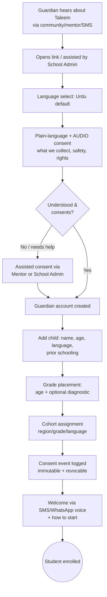
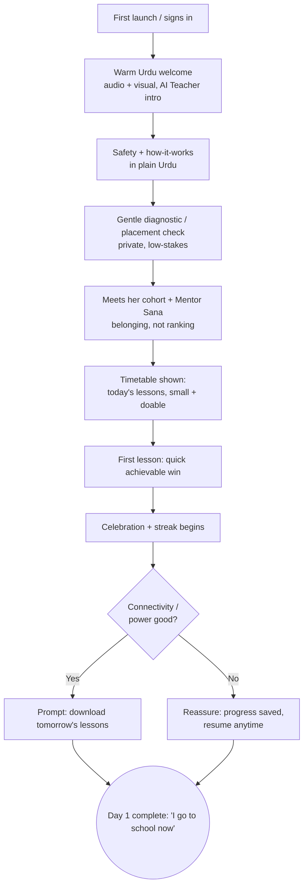
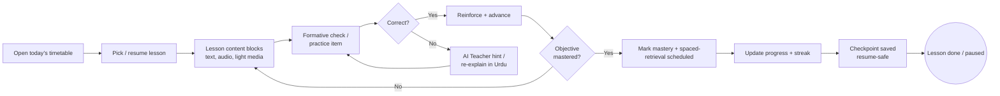
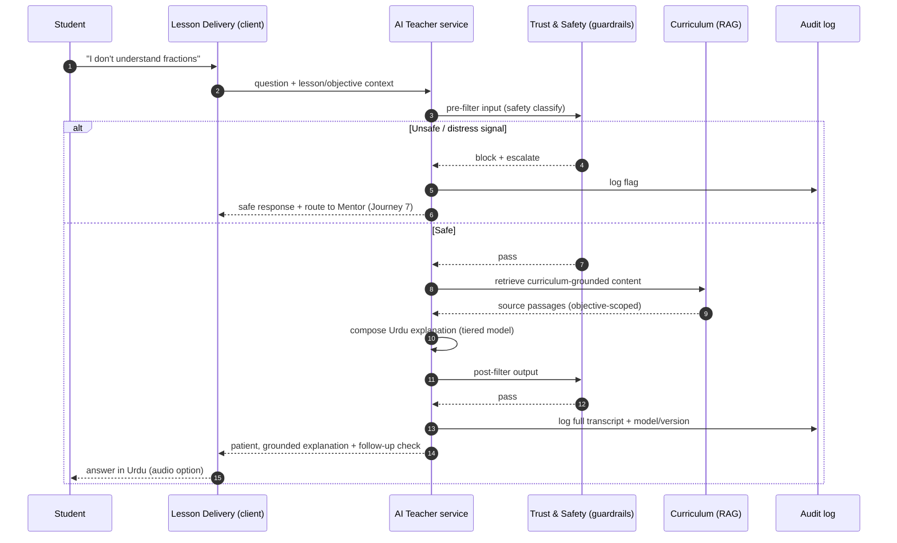
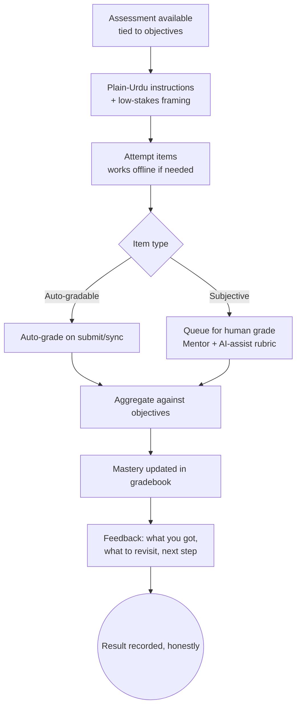
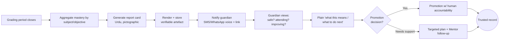
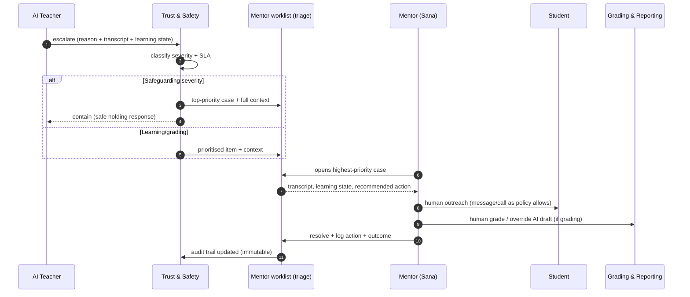

# 06 · User Journeys

| | |
|---|---|
| **Document ID** | 06 |
| **Owner** | Staff UX Researcher |
| **Status** | Draft |
| **Last updated** | 2026-07-19 |
| **Related** | [01 Vision](../00-overview/01-vision.md) · [05 Personas](05-user-personas.md) · [07 Information Architecture](07-information-architecture.md) · [08 System Architecture](../02-architecture/08-system-architecture.md) · [15 Child Safety](../03-security-privacy/15-child-safety-framework.md) · [20 Navigation](../04-design/20-navigation-structure.md) · [24 AI Teacher](../05-education/24-ai-teacher-specification.md) |

## Purpose

This document maps the end-to-end experiences that matter most in Taleem, from a guardian's first act
of consent to a student's offline day of learning. Each journey names the stages, the user's actions
and emotions, the pain points and opportunities, and — critically — the **services touched** (per the
canonical service map, [Authoring Brief §5](../_meta/authoring-brief.md)), so that architecture,
design, and safety teams can trace a lived experience to the systems that must deliver it.

## Scope

In scope: the priority journeys — guardian consent & enrolment; a student's first day; the daily
lesson loop; asking the AI Teacher for help; taking an assessment; receiving a report card; a mentor
handling an escalation; and an offline day (download → learn offline → sync). Each is illustrated with
a Mermaid flow or sequence diagram. Out of scope: screen-level UI (design docs), API contracts
([architecture]), and the item-level assessment model ([Assessment context]).

---

## 0. Conventions

- **Services** are named exactly as in the [service map](../_meta/authoring-brief.md#5): *Identity &
  Access, Enrolment & School Ops, Curriculum, Lesson Delivery, AI Teacher, Assessment, Grading &
  Reporting, Engagement & Notifications, Trust & Safety, Media, Search, Analytics, Payments &
  Sponsorship, Platform/Admin*.
- **Emotion** is tracked because retention at the bottom of the curve is emotional, not just
  technical (see [05 Personas](05-user-personas.md)).
- **Every journey is checked against Ayesha (offline/metered) and Fatima (low-literacy).** Safety and
  low-bandwidth empathy are acceptance criteria, not optional stages (Vision §1).
- Diagrams show the happy path plus the most important failure/degraded branch.

### Journey → service heat map

| Journey | Primary services | Also touches |
|---|---|---|
| 1 Consent & enrolment | Identity & Access, Enrolment & School Ops | Engagement, Trust & Safety, Analytics |
| 2 First day | Enrolment, Curriculum, Assessment, Lesson Delivery | AI Teacher, Engagement, Analytics |
| 3 Daily lesson loop | Lesson Delivery, Curriculum, AI Teacher | Assessment, Media, Analytics, Engagement |
| 4 Ask the AI Teacher | AI Teacher, Curriculum, Search | Trust & Safety, Lesson Delivery, Analytics |
| 5 Assessment | Assessment, Grading & Reporting | AI Teacher, Lesson Delivery, Trust & Safety |
| 6 Report card | Grading & Reporting, Engagement | Curriculum, Media, Analytics |
| 7 Mentor escalation | Trust & Safety, AI Teacher, Enrolment | Grading & Reporting, Engagement, Identity |
| 8 Offline day | Lesson Delivery, Media | Assessment, AI Teacher, Curriculum, Analytics |

---

## 1. Guardian consent & student enrolment

**Actors:** Fatima (Guardian, low-literacy) · Ayesha (Student) · Imran (School Admin, assisted path).
**Goal:** admit a child into a grade, with legally sound, intelligible consent.



| Stage | Guardian action | Emotion | Pain point | Opportunity | Services |
|---|---|---|---|---|---|
| Discover | Hears via trusted channel | Hopeful, cautious | Distrust of "online" schemes | Community/mentor as trust bridge | Engagement |
| Consent | Listens to Urdu audio consent | Anxious → reassured | Cannot read dense text | Voice + icons + assisted consent | Identity & Access, Trust & Safety |
| Add child | Provides child details | Committed | Forms assume literacy | Voice-guided, minimal fields | Identity & Access |
| Placement | Accepts grade / diagnostic | Proud, unsure | Fear of being judged | Private, encouraging framing | Enrolment, Assessment |
| Confirm | Receives welcome | Relieved, proud | "Did it work?" doubt | Voice confirmation on trusted channel | Engagement |

**Design mandates:** consent must be intelligible without fluent reading; assisted path is
first-class; consent is logged, versioned, and revocable ([14 Privacy](../03-security-privacy/14-privacy-model.md));
placement is decoupled from age and framed privately (Bilal, [05 §2.2](05-user-personas.md)).

---

## 2. A student's first day

**Actor:** Ayesha. **Goal:** feel she has *started school*, not opened an app — and reach a first win
fast, cheaply.



| Stage | Emotion | Pain point | Opportunity | Services |
|---|---|---|---|---|
| Welcome | Curious, shy | Cold, form-heavy onboarding | Human-warm, audio-first, AI Teacher introduced honestly (never "human") | Lesson Delivery, AI Teacher |
| Diagnostic | Nervous | Feels like a test that judges | Private, low-stakes, "helps us teach you right" | Assessment, Curriculum |
| Belonging | Wants to fit in | Isolation of solo apps | Cohort + named mentor, no leaderboard | Enrolment, Engagement |
| First win | Proud | Overwhelm / long first lesson | Small, checkpointed, celebrated | Lesson Delivery, Curriculum |
| Set up tomorrow | Motivated | Data anxiety | Offer to pre-download during good window | Media, Lesson Delivery |

**Design mandates:** first value within one short session; AI Teacher introduced transparently; the
diagnostic never shames (Bilal); a download nudge captures any good-connectivity window (Ayesha).

---

## 3. The daily lesson loop *(the core learning path)*

**Actor:** any Student. This is the loop the 99.9% availability target protects (Brief §6).



| Stage | Action | Emotion | Pain point | Opportunity | Services |
|---|---|---|---|---|---|
| Enter | Sees a *day*, not a shelf | Oriented | Infinite-content paralysis | Structured, small daily set | Lesson Delivery, Curriculum |
| Learn | Reads/listens to blocks | Engaged | Video eats data | Text/audio-first, lite mode default | Lesson Delivery, Media |
| Practice | Answers formative items | Focused/anxious | Fear of failing | Low-stakes, immediate help | Assessment, Lesson Delivery |
| Stuck | Requests help | Frustrated | No one to ask (class of 60) | AI Teacher: patient 1:1 (Journey 4) | AI Teacher |
| Master | Clears objective | Proud | No sense of progress | Mastery marked + spaced retrieval | Curriculum, Assessment |
| Pause | Power/device cut | Relieved it saved | Losing place | Frequent checkpoints, resume-anywhere | Lesson Delivery |

**Design mandates:** mastery-based, not time-based; frequent checkpoints (shared device / load-
shedding); every screen has a data budget; help is one tap away.

---

## 4. Asking the AI Teacher for help

**Actors:** Student + **AI Teacher** (bounded, curriculum-grounded, safety-governed — never an
open chatbot, Vision §3). Shown as a sequence to make the safety pipeline explicit.



| Stage | Emotion | Pain point | Opportunity | Services |
|---|---|---|---|---|
| Ask | Vulnerable | Shy to admit not knowing | Private, judgement-free, always available | AI Teacher |
| Safety | (invisible) | Harmful/off-topic drift | Pre/post guardrails + distress detection | Trust & Safety |
| Grounding | Wants a real answer | Hallucination erodes trust | RAG over curriculum; "I don't know" over bluffing (Vision §7.6) | Curriculum, Search |
| Understand | Relief, "aha" | English-only or too complex | Urdu, level-appropriate, with a follow-up check | AI Teacher |
| Trace | (guardian/safety) | Unaccountable AI | Every interaction logged + moderatable | Trust & Safety, Analytics |

**Design mandates:** grounded, tiered (cheap→powerful models by difficulty), Urdu-first, honest about
uncertainty; **every interaction logged and reconstructable** for Nadia ([05 §6](05-user-personas.md));
distress or out-of-scope routes to a human (Journey 7).

---

## 5. Taking an assessment

**Actor:** Student. **Goal:** a fair, honest measure of mastery — no inflation, no shaming (Vision
§7.6).



| Stage | Emotion | Pain point | Opportunity | Services |
|---|---|---|---|---|
| Start | Anxious | High-stakes fear | Formative-first, low-stakes framing | Assessment |
| Attempt | Focused | Loses work on cut/offline | Offline attempt + queued submit (Journey 8) | Assessment, Lesson Delivery |
| Grade | Impatient | Slow/opaque subjective grading | AI-assisted draft + human final for subjective | Grading & Reporting, AI Teacher |
| Feedback | Hopeful/deflated | "You failed" dead-end | Actionable "revisit these objectives" | Grading & Reporting, Curriculum |

**Design mandates:** items map to objectives (Kamran's traceability); subjective work is human-final
with AI assist (Sana); offline-capable attempts; feedback always points to a next action; light
integrity measures ("proctoring-lite") proportionate and privacy-respecting.

---

## 6. Receiving a report card

**Actors:** Guardian (Fatima) + Student. **Goal:** verifiable, trustworthy, legible proof of learning.



| Stage | Emotion | Pain point | Opportunity | Services |
|---|---|---|---|---|
| Generate | (system) | Jargon-heavy cards | Pictographic, plain-Urdu, low-literacy legible | Grading & Reporting, Media |
| Notify | Expectant | App she rarely opens | Voice/visual on trusted channel | Engagement |
| Understand | Proud / worried | "Is this good?" | One-line meaning + next action | Grading & Reporting |
| Promotion | Hopeful | Opaque/unfair decisions | Transparent, human-accountable, never unsupervised AI (Vision §8) | Grading & Reporting, Enrolment |

**Design mandates:** report card is a verifiable artefact; legible to a low-literacy guardian;
promotion decisions have a human in the loop; ties directly to the north-star metric (objectives
mastered, Vision §6).

---

## 7. A mentor handling an escalation

**Actor:** Sana (Mentor). **Trigger:** AI Teacher hand-off (safety/distress, repeated failure,
out-of-scope, or subjective grading) or a Trust & Safety flag.



| Stage | Sana's emotion | Pain point | Opportunity | Services |
|---|---|---|---|---|
| Surface | Alert | 150 students, no signal | Triage worklist by severity/SLA, not flat roster | Trust & Safety |
| Context | Wants full picture | Fragmented tools | One place: transcript + state + recommendation | AI Teacher, Trust & Safety |
| Act | Purposeful | Rubber-stamping blind | See reasoning; real authority to override | Grading & Reporting |
| Close | Accountable | No audit trail | Immutable log of action + outcome | Trust & Safety, Analytics |

**Design mandates:** signal over noise (Sana, [05 §4](05-user-personas.md)); safeguarding cases are
top-priority with containment; human authority is real, not decorative; everything auditable for
Nadia; safety wins over all other goals (Vision §7.1).

---

## 8. An offline day: download → learn offline → sync

**Actor:** Ayesha. **The reach-defining journey** — if this fails, the child is not reached (Vision §1).

```mermaid
flowchart TD
    subgraph Online window (brief, metered)
        A[Good signal / power] --> B[Download today/week<br/>lessons + assessment items + media]
        B --> C[Content packaged for offline<br/>data cost shown before download]
    end
    C --> D[Connectivity lost / phone shared / power cut]
    subgraph Fully offline
        D --> E[Open lessons offline]
        E --> F[Learn + practice]
        F --> G[Attempt assessment offline]
        G --> H[Progress, answers, streak<br/>queued locally, resume-safe]
        H --> I[Limited offline AI help<br/>cached hints / graceful message]
    end
    I --> J{Connectivity<br/>returns?}
    J -- Yes --> K[Background sync:<br/>upload attempts + progress, pull grades]
    K --> L{Conflict?}
    L -- No --> M((Synced: nothing lost))
    L -- Yes --> N[Deterministic merge<br/>+ flag if ambiguous]
    N --> M
    J -- No --> H
```

| Stage | Emotion | Pain point | Opportunity | Services |
|---|---|---|---|---|
| Download | Cautious (data) | Data cost fear | Show cost before download; grab any good window | Media, Lesson Delivery |
| Learn offline | Focused, free | Most apps dead offline | Full lesson + practice offline | Lesson Delivery, Curriculum |
| Assess offline | Nervous | Can't submit → lost work | Attempt offline, queue submission | Assessment |
| AI help offline | Frustrated | AI needs network | Cached hints + honest "will answer when online" | AI Teacher (degraded) |
| Sync | Relieved | Duplicate/lost data on reconnect | Idempotent, conflict-aware sync; nothing lost | Lesson Delivery, Assessment |

**Design mandates:** offline is the baseline for Ayesha, not a mode; data cost is always visible;
sync is idempotent and conflict-aware; AI degrades gracefully and honestly. No feature ships without a
documented degraded-mode (Vision §8).

---

## 9. Journey health signals (for Analytics & north-star)

| Journey | Leading signal to instrument | Feeds |
|---|---|---|
| Consent & enrolment | consent-complete rate; assisted-consent share | Imran's funnel; [Analytics] |
| First day | time-to-first-win; day-1 completion | activation; retention |
| Daily loop | objectives mastered/active day | **north-star metric** (Vision §6) |
| Ask AI | help-resolution rate; escalation rate | AI Teacher quality; safety |
| Assessment | subjective-grade latency; fairness checks | trust |
| Report card | guardian view rate on trusted channel | trust; retention |
| Mentor escalation | time-to-first-human-touch on at-risk | retention; safeguarding SLA |
| Offline day | sync-success rate; data-per-objective | reach at bottom of curve |

---

## Open questions

- **Offline AI help scope:** how much genuinely useful tutoring can be cached/on-device vs. an honest
  "answers when online"? (Depends on model tiering + device budget, [24 AI Teacher].)
- **Sync conflict policy:** exact merge rules when a shared device has two siblings' offline work, or
  the same attempt exists locally and server-side. (Lesson Delivery + Assessment.)
- **Assisted consent legality:** is mentor/community-assisted consent for a low-literacy guardian
  legally sufficient and coercion-safe? (Legal + [14 Privacy].)
- **Proctoring-lite proportionality:** what integrity measures are fair and privacy-respecting for
  children on shared devices? (Assessment + [15 Child Safety].)
- **Escalation SLA numbers:** target time-to-human for each severity tier. (Trust & Safety.)

## Change log

| Date | Change | Author |
|---|---|---|
| 2026-07-19 | Initial draft: 8 priority journeys with flow/sequence diagrams + service heat map. | Staff UX Researcher |
