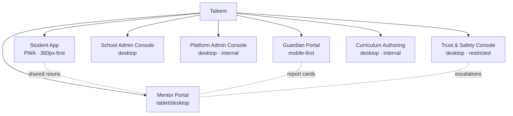
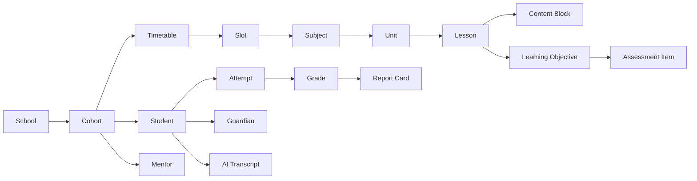
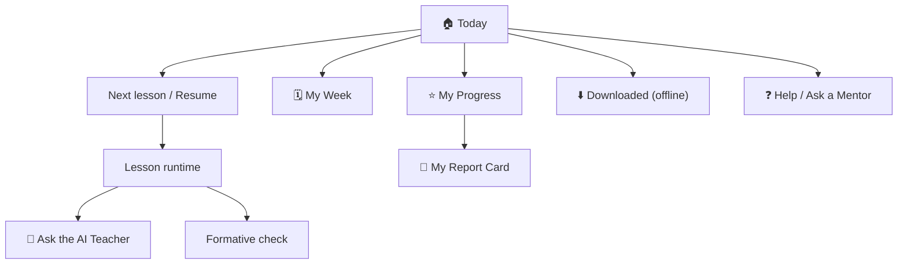

# 07 · Information Architecture

| | |
|---|---|
| **Document ID** | 07 |
| **Owner** | Head of Product Design / Staff Product Manager |
| **Status** | Draft (Phase 1) |
| **Last updated** | 2026-07-19 |
| **Related** | [02 PRD](./02-prd.md) · [05 Personas](./05-user-personas.md) · [06 Journeys](./06-user-journeys.md) · [16 Accessibility](../04-design/16-accessibility-standards.md) · [20 Navigation](../04-design/20-navigation-structure.md) · [25 Parent Portal](../06-portals/25-parent-portal.md) · [26 Student Portal](../06-portals/26-student-portal.md) · [27 Admin Portal](../06-portals/27-admin-portal.md) · [28 Mentor Portal](../06-portals/28-mentor-portal.md) · [32 Search](../02-architecture/32-search-architecture.md) |

## Purpose

This document defines **how Taleem's content and functionality are organised, labelled, and
navigated** for each role. It establishes the top-level structure of every surface, the naming
vocabulary users see, and the wayfinding rules — so that a low-literacy child on a 360px screen and a
Safety Officer at a desktop each find what they need without confusion. It is the bridge between the
product ([02 PRD](./02-prd.md)) and the design/navigation specs ([20 Navigation](../04-design/20-navigation-structure.md)).

## Scope

In scope: the surface map (which portals exist), per-role top-level structure, the content model
at an IA level (the "nouns" users navigate), labelling/vocabulary, wayfinding and search, and the
IA-level accessibility & low-bandwidth rules. Out of scope: visual design ([17 UI Design](../04-design/17-ui-design-system.md)),
component behaviour ([19 Components](../04-design/19-component-library.md)), and data schemas
([09 Database](../02-architecture/09-database-design.md)).

---

## 1. IA principles

1. **One school, many doors.** Taleem is a single school with a distinct entrance per role, not
   separate products. Shared nouns (a Student, a Lesson, a Report Card) mean the same thing everywhere.
2. **The Student's door is the simplest.** The Student surface is designed for a child, possibly
   pre-/low-literate, one-handed, on 360px. Depth is shallow; the "next right thing" is always obvious.
3. **Role-scoped, never role-confused.** A user sees only what their role permits
   ([12 Authorization](../03-security-privacy/12-authorization-model.md)); IA never dangles links to
   forbidden areas.
4. **Structure beats a firehose.** Navigation reflects the *school day* (timetable, today, next),
   not an infinite content shelf (mirrors [01 Vision §3](../00-overview/01-vision.md)).
5. **Findable in Urdu.** Labels are Urdu-first, icon+text, plain language; search is Urdu-aware.
6. **Wayfinding is offline-aware.** The IA shows what is available offline vs. needs connectivity, so
   a child is never led into a dead end on a metered link.

## 2. Surface map (the doors)

| Surface | Primary role(s) | Device target | First release | Spec |
|---|---|---|---|---|
| **Student App** | Student | Low-end Android, 360px, PWA | MVP | [26 Student Portal](../06-portals/26-student-portal.md) |
| **Guardian Portal** | Guardian | Mobile-first (shared device) | MVP | [25 Parent Portal](../06-portals/25-parent-portal.md) |
| **Mentor Portal** | Mentor | Tablet/desktop | v1 | [28 Mentor Portal](../06-portals/28-mentor-portal.md) |
| **School Admin Console** | School Admin | Desktop | v1 | [27 Admin Portal](../06-portals/27-admin-portal.md) |
| **Platform Admin Console** | Platform Admin | Desktop, internal | MVP (thin) | [27 Admin Portal](../06-portals/27-admin-portal.md) |
| **Trust & Safety Console** | Safety Officer | Desktop, restricted | MVP | [15 Child Safety](../03-security-privacy/15-child-safety-framework.md) |
| **Curriculum Authoring** | Curriculum Architect | Desktop, internal | MVP | [21 Curriculum](../05-education/21-curriculum-engine.md) |

## 3. The shared content model (the nouns)

Every surface navigates the same core "nouns". Defining them once keeps labels consistent across
seven surfaces. (Data-level detail belongs to [09 Database](../02-architecture/09-database-design.md);
this is the *user-facing* content model.)

| Noun | User-facing meaning | Owner context |
|---|---|---|
| **Subject** | Urdu, Maths, Science… | Curriculum |
| **Unit** | A themed group of lessons in a subject/grade | Curriculum |
| **Lesson** | One session a Student attends | Lesson Delivery |
| **Learning Objective** | The specific thing to master | Curriculum |
| **Assessment / Attempt** | A quiz/exam and a Student's try at it | Assessment |
| **Report Card / Transcript** | Verifiable proof of learning | Grading & Reporting |
| **Cohort / Timetable** | The Student's class and weekly schedule | Enrolment |
| **AI Teacher** | The tutor a Student talks to (always so labelled) | AI Teacher |
| **Flag / Case** | A safety concern and its handling | Trust & Safety |

## 4. Student App IA (the most important surface)

The Student App is intentionally **shallow and rhythmic**. Its home answers one question: *what do I do
now?*

| Level 0 (bottom nav / home) | Purpose | Offline? |
|---|---|---|
| **Today** | The default: next lesson, resume, streak | Yes (cached day-pack) |
| **My Week** | Timetable; what's coming | Yes |
| **My Progress** | Mastery, report card, celebrations | Partial (last-synced) |
| **Downloads** | What's available offline; manage day-packs | Yes |
| **Help** | Ask a Mentor, safety help, settings | Safety help always reachable |

**Rules for the Student App IA:**

- **≤ 5 top-level destinations**, icon+text, ≥ 44px, thumb-reachable.
- **No dead ends offline**: every tile shows an offline badge; connectivity-required actions are
  clearly marked and queue rather than fail (see [33 Offline](../02-architecture/33-offline-architecture.md)).
- **The AI Teacher is contextual**, entered from within a lesson, never a free-roaming chat home
  (enforces [02 PRD NG1](./02-prd.md)).
- **Safety help is always one tap away** from every screen (child-safety acceptance criterion).

## 5. Guardian Portal IA

Optimised for a busy, possibly low-literacy Guardian on a shared phone. Answers: *is my child learning,
and what should I do?*

| Level 0 | Content |
|---|---|
| **My Children** | Each child card: attendance, progress snapshot, alerts |
| **Report Cards** | View/download; acknowledge |
| **Messages** | Notifications, nudges, Mentor contact |
| **Consent & Privacy** | View/revoke consent, export/erase data ([14 Privacy](../03-security-privacy/14-privacy-model.md)) |
| **Help** | Support, safety concern |

Guardian IA is **read-and-acknowledge first**; the only heavy write actions are consent management
and raising a concern. Multi-child households switch child context at the top level.

## 6. Mentor Portal IA

Answers: *who in my cohort needs me, and what does the AI need me to handle?*

| Level 0 | Content |
|---|---|
| **My Cohorts** | Cohort list; at-a-glance health |
| **Needs Attention** | AI escalations, at-risk Students, distress signals ([FR-AIT-007](./03-functional-requirements.md)) |
| **Grading** | Human-grading queue for subjective work |
| **Students** | Per-student progress, transcripts (authorized), notes |
| **Messages** | Guardian/Student communication |
| **Safety** | Raise/track safeguarding concerns |

Mentor IA foregrounds a **triage queue** ("Needs Attention") because the Mentor's value is handling
what AI escalates, at scale.

## 7. Admin, Platform, Safety & Authoring IA (summary)

These are desktop, role-restricted surfaces; full IA lives in each portal spec. Top-level structure:

| Surface | Level-0 sections |
|---|---|
| **School Admin** | Enrolment · Cohorts · Timetables · Mentor Assignment · Reports |
| **Platform Admin** | Curriculum Publishing · Feature Flags/Config · Users & Roles · Audit · Operations |
| **Trust & Safety** | Triage Queue · Cases · Escalations · Audit · Policy |
| **Curriculum Authoring** | Subjects/Grades · Units/Lessons · Objectives · Standards Mapping · Versions/Publish |

## 8. Labelling & vocabulary

- **Canonical role names** ([Authoring Brief §2](../_meta/authoring-brief.md)) are used consistently;
  "User" alone is never shown.
- **Urdu-first labels**, with a clean Latin companion; **icon + text**, never icon-only, for
  low-literacy access ([16 Accessibility](../04-design/16-accessibility-standards.md)).
- **Plain, warm language** (Brief §7 tone): "Today", "My Week", "Ask the AI Teacher" — not
  "Dashboard", "Modules", "Chatbot".
- **The AI Teacher is always labelled as AI**, never implied human ([FR-AIT-006](./03-functional-requirements.md)).
- A shared **glossary** of these labels is owned by [20 Navigation](../04-design/20-navigation-structure.md)
  and localisation.

## 9. Wayfinding & search

| Mechanism | Rule |
|---|---|
| **Breadcrumbs** | Rendered on deep desktop surfaces (Admin/Authoring/Safety); shallow surfaces don't need them. |
| **Bottom nav** | Student/Guardian apps use ≤ 5 icon+text destinations; state is preserved on switch. |
| **Search** | v1: Urdu-aware search over curriculum/lessons/help, authorization-scoped ([32 Search](../02-architecture/32-search-architecture.md), [FR-SCH-003](./03-functional-requirements.md)). |
| **"You are here"** | Every screen makes current context and how-to-go-back obvious (one-handed). |
| **Offline wayfinding** | Availability (offline/online) is a first-class navigational signal. |
| **Empty/error states** | Always offer a next step; never a dead end (accessibility + reach). |

## 10. IA-level cross-cutting rules

| Rule | Authority |
|---|---|
| No navigational link ever points to a resource the current role cannot access. | [12 Authorization](../03-security-privacy/12-authorization-model.md) |
| Every navigable screen meets WCAG 2.2 AA and RTL-complete. | [16 Accessibility](../04-design/16-accessibility-standards.md) |
| Navigation shell fits the initial-route JS budget; nav is not JS-locked. | [04 NFR DATA-01](./04-non-functional-requirements.md) |
| Safety help is reachable from every Student/Guardian screen. | [15 Child Safety](../03-security-privacy/15-child-safety-framework.md) |
| Labels are localisable data, never hardcoded. | [04 NFR L10N-02](./04-non-functional-requirements.md) |

---

## Open questions

- **Bottom-nav count:** is 5 the right Student-app maximum, or should "Downloads" fold into "Today"
  to reach 4? (Usability test with children; owned with [26 Student Portal](../06-portals/26-student-portal.md).)
- **Multi-child switching:** best pattern for a Guardian with several children on one shared device
  without confusion. ([25 Parent Portal](../06-portals/25-parent-portal.md).)
- **Search entry point in the Student App:** does a young child need search at all, or only Mentors
  and older grades? (IA + [32 Search](../02-architecture/32-search-architecture.md).)
- **Terminology localisation:** finalise the Urdu labels for "cohort", "objective", "mastery" with
  educators so they are natural, not translated jargon.

## Change log

| Date | Change | Author |
|---|---|---|
| 2026-07-19 | Initial IA: surface map (7 doors), shared content model, per-role top-level structure, labelling, wayfinding/search, and cross-cutting IA rules. | Head of Product Design |
