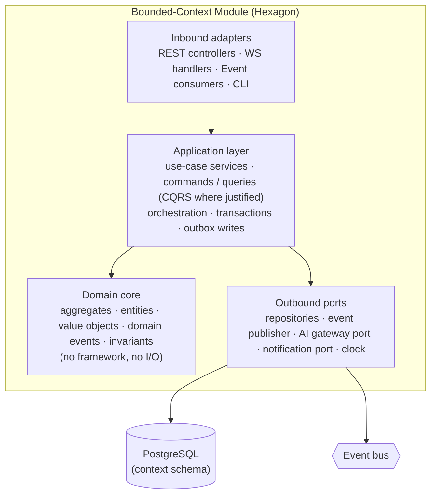
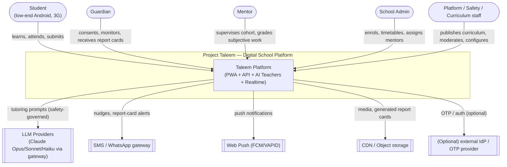
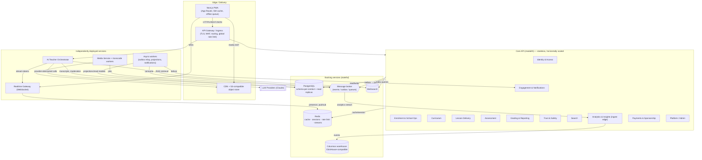
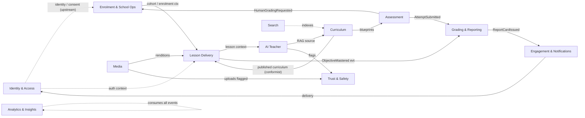
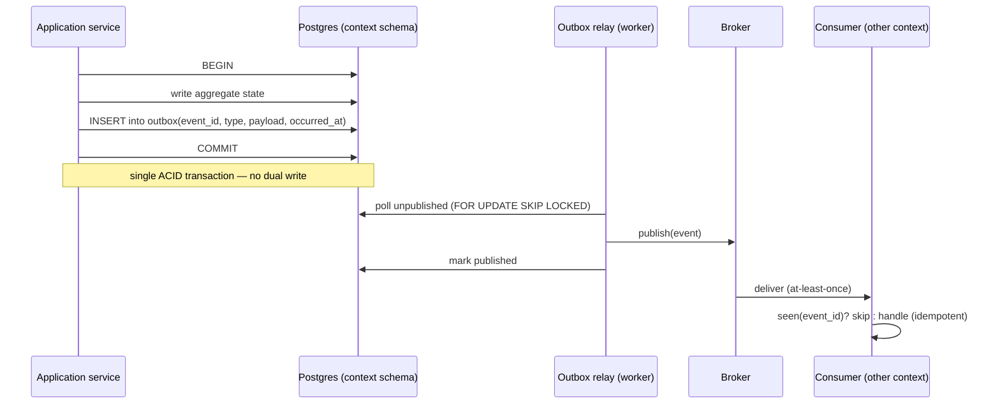
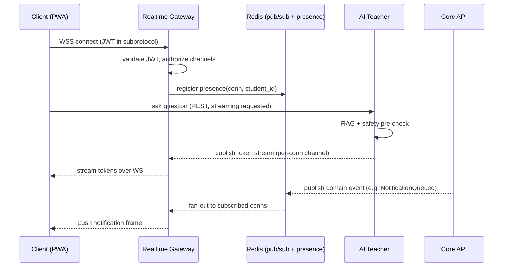
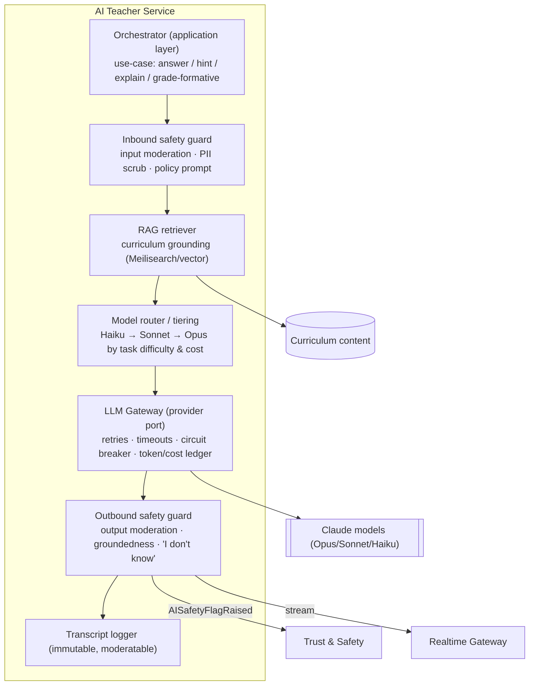
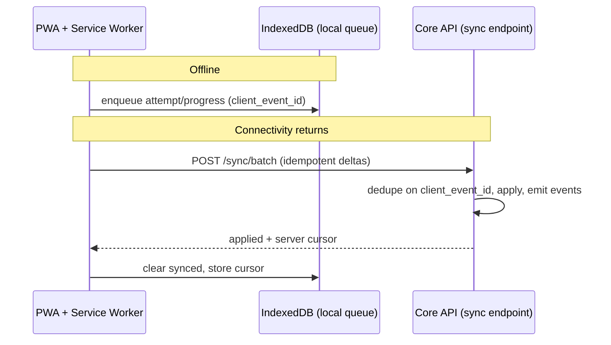

# 08 · System Architecture

| | |
|---|---|
| **Document ID** | 08 |
| **Owner** | Principal Software Architect |
| **Status** | Draft (Phase 1) |
| **Last updated** | 2026-07-19 |
| **Related** | [09 Database Design](./09-database-design.md) · [10 API Design](./10-api-design.md) · [ADR-0001 Architecture Style](./adr/ADR-0001-architecture-style.md) · [ADR-0002 Database-per-Context](./adr/ADR-0002-database-per-context.md) · [11 Authentication](../03-security-privacy/11-authentication-strategy.md) · [12 Authorization](../03-security-privacy/12-authorization-model.md) · [14 Privacy](../03-security-privacy/14-privacy-model.md) · [15 Child Safety](../03-security-privacy/15-child-safety-framework.md) · [24 AI Teacher](../05-education/24-ai-teacher-specification.md) · [36 Infrastructure](./36-infrastructure-architecture.md) · [35 Deployment Architecture](./35-deployment-architecture.md) |

## Purpose

This is the **central architecture document** for Project Taleem. It fixes the architectural style,
the module/service boundaries, the integration patterns (synchronous and asynchronous), the AI
orchestration boundary, the realtime and caching strategies, data ownership, and the concrete path to
serving **1,000,000 students** on the constraints defined in the [Vision](../00-overview/01-vision.md)
and [Authoring Brief](../_meta/authoring-brief.md). Every other architecture, engineering, and
service document must be consistent with the decisions recorded here or raise an ADR.

## Scope

In scope: the macro-architecture — style, bounded contexts, inter-context contracts, runtime
topology, cross-cutting technical concerns (realtime, caching, AI gateway, scale, resilience,
offline). Out of scope: the physical data model (owned by [09](./09-database-design.md)), the wire
contracts (owned by [10](./10-api-design.md)), deployment/infra mechanics (owned by
[36](./36-infrastructure-architecture.md)/[35](./35-deployment-architecture.md)), and
per-service internal design (owned by each service's spec).

---

## 1. Architectural principles

These principles are the tie-breakers. When a design choice is ambiguous, resolve it toward the
higher-ranked principle.

1. **Reach over elegance.** The architecture exists to reach a child on a shared low-end Android
   phone on metered 3G with a few hours of power. Every runtime cost — payload, round-trips, cold
   state — is measured against that child, not against a datacenter benchmark. (Vision §7.2)
2. **Safety is a structural property, not a feature.** Child-safety governance
   ([15](../03-security-privacy/15-child-safety-framework.md)) is an inline, non-bypassable stage of
   the AI path and the media path — not an afterthought or an async audit.
3. **Bounded contexts own their data.** Each context is the sole writer of its data and exposes it
   only through explicit contracts (API or events). No cross-context foreign keys, no shared tables.
   See [ADR-0002](./adr/ADR-0002-database-per-context.md).
4. **Synchronous only where the user is waiting; asynchronous everywhere else.** The request/response
   critical path is short and read-optimised; everything derivable, notifiable, or analytical is
   moved off the request onto events. Queue-based load leveling absorbs spikes.
5. **Stateless compute, stateful backing services.** Application processes hold no session or
   sticky state (12-Factor VI). All state lives in Postgres, Redis, object storage, or the broker,
   so any pod can serve any request and horizontal scaling is linear.
6. **Evolvable modularity.** We start as a **modular monolith with hard internal boundaries** and
   extract services only where scale, failure-isolation, or team-autonomy pressure justifies it. The
   boundaries are drawn today so extraction is a deployment change, not a rewrite. See §2 and
   [ADR-0001](./adr/ADR-0001-architecture-style.md).
7. **Contract-first.** Every context boundary is an OpenAPI contract or a versioned event schema,
   authored before implementation and enforced in CI ([10](./10-api-design.md) §OpenAPI governance).
8. **Least data, least privilege, by design.** Contexts request the minimum data they need; child
   PII is concentrated in Identity and referenced elsewhere by opaque IDs. (Vision §7.5,
   [14](../03-security-privacy/14-privacy-model.md))

---

## 2. Architectural style — decision & justification

**Decision: a modular monolith ("modulith") with strictly enforced bounded-context modules, a
message broker with the transactional outbox pattern for asynchronous integration, and a small
number of independently deployed services carved out from day one for reasons that are not merely
scale.** This is recorded formally in [ADR-0001](./adr/ADR-0001-architecture-style.md).

### 2.1 Why not full microservices from day one

| Force | Microservices-first | Modulith-first (chosen) |
|---|---|---|
| Team size in Phase 1 | Needs many teams to be worth the coordination cost | One-to-few teams; monolith keeps velocity high |
| Boundary certainty | Boundaries are guesses early; wrong network boundaries are expensive to move | Boundaries are compile-time; moving one is a refactor, not a re-platform |
| Operational surface | 14+ deployables, 14 pipelines, distributed tracing mandatory on day one | One-to-few deployables; observability grows with need |
| Transactional integrity | Cross-service consistency needs sagas everywhere immediately | In-process transactions where a use case spans modules; sagas only where truly distributed |
| Cost at low load | Pay for N always-on services before there is traffic | One horizontally scalable deployable; cheap at low load |
| **Scale to 1M** | Achievable | **Also achievable** — the monolith is stateless and scales horizontally; see §9 |

The dominant early risk is **getting boundaries wrong**, not throughput. A modulith lets us get the
boundaries right *and* run cheaply, while the outbox + event contracts mean the boundaries are
already "network-shaped" the day we need to extract one.

### 2.2 What we carve out immediately (and why — not for scale)

Three concerns are deployed as **separate services from day one**, justified by *failure isolation*
and *distinct runtime profiles*, not throughput:

- **AI Teacher orchestrator** — different failure domain (slow, external LLM calls), different
  scaling curve (concurrency-bound, not CPU-bound), and a hard blast-radius requirement: an LLM
  provider outage or a runaway prompt loop must never take down student login or lesson delivery.
- **Media** — CPU/IO-heavy transcode and packaging workloads that would starve request threads if
  co-located; naturally a queue-fed worker fleet.
- **Realtime gateway** — long-lived WebSocket connections have a fundamentally different lifecycle
  (persistent, memory-per-connection) than short REST requests and must scale on connection count.

Everything else (Identity, Enrolment, Curriculum, Lesson Delivery, Assessment, Grading, Engagement,
Trust & Safety, Search, Analytics, Payments, Platform/Admin) lives as modules inside the **core API
monolith** in Phase 1, each behind a module facade, each owning its own schema, each publishing
events. Extraction candidates and triggers are in §9.5.

### 2.3 Layering inside every module (Hexagonal + DDD)

Each module is internally a hexagon so that business logic is independent of framework, DB, and
transport (SOLID DIP; 12-Factor). This is uniform across modulith modules and extracted services.

- **Domain core** depends on nothing outward — pure Python, fully unit-testable, no `import fastapi`,
  no `import sqlalchemy`.
- **Application layer** implements use cases, owns the transaction boundary, and writes to the
  **outbox** in the same transaction as state changes.
- **Adapters** are the only place FastAPI, SQLAlchemy, Redis, and the broker appear. Swapping a
  transport or a datastore never touches the domain (Open/Closed).

---

## 3. C4 — System Context

## 4. C4 — Container diagram

---

## 5. The 14 bounded contexts — responsibilities & ownership

Names are canonical per [Authoring Brief §5](../_meta/authoring-brief.md). Each context is the sole
owner and writer of its data (§7, [ADR-0002](./adr/ADR-0002-database-per-context.md)).

| # | Context | Core responsibility | Owns (data) | Key events published |
|---|---|---|---|---|
| 1 | **Identity & Access** | Accounts, auth, sessions, RBAC/ABAC, **guardian consent** | Users, credentials, roles, consent records, sessions | `GuardianConsentGranted`, `AccountRegistered`, `RoleAssigned` |
| 2 | **Enrolment & School Ops** | Schools, cohorts, timetables, **attendance**, mentor assignment | Schools, cohorts, enrolments, timetable slots, attendance | `StudentEnrolled`, `CohortAssigned`, `AttendanceRecorded`, `TimetablePublished` |
| 3 | **Curriculum** | Subjects, grades, units, learning objectives, standards mapping, **versioning** | Curriculum graph, objectives, lesson blueprints, versions | `CurriculumVersionPublished`, `ObjectiveAdded` |
| 4 | **Lesson Delivery** | Lesson runtime, content blocks, **progress/resume**, offline sync | Lesson sessions, progress, resume points, sync deltas | `LessonStarted`, `LessonCompleted`, `ObjectiveMastered`, `ProgressSynced` |
| 5 | **AI Teacher** | AI tutoring orchestration, RAG, **safety guardrails**, transcript logging | Conversations, transcripts, moderation verdicts, token/cost ledger | `AITurnCompleted`, `AISafetyFlagRaised`, `HintRequested` |
| 6 | **Assessment** | Item bank, quizzes/exams, **attempts**, auto + human grading, proctoring-lite | Items, assessments, attempts, responses, auto-scores | `AttemptSubmitted`, `AttemptAutoGraded`, `HumanGradingRequested` |
| 7 | **Grading & Reporting** | Gradebook, **report cards**, transcripts, promotion decisions | Gradebook entries, report cards, promotion decisions | `ReportCardIssued`, `PromotionDecided`, `GradeRecorded` |
| 8 | **Engagement & Notifications** | Messaging, nudges, streaks, **multi-channel delivery** (SMS/WA/push) | Notification preferences, delivery log, streaks, nudge state | `NotificationQueued`, `NotificationDelivered`, `StreakUpdated` |
| 9 | **Trust & Safety** | Moderation, safeguarding, flag triage, audit | Flags, cases, safeguarding escalations, audit trail | `FlagRaised`, `CaseEscalated`, `CaseResolved` |
| 10 | **Media** | Upload/transcode/deliver, adaptive bitrate, **offline packaging** | Media assets, renditions, offline packages, upload sessions | `MediaIngested`, `RenditionReady`, `OfflinePackageBuilt` |
| 11 | **Search** | Indexing + query over curriculum/lessons/help | Search indices, synonyms (projection, not source of truth) | `IndexRebuilt` |
| 12 | **Analytics & Insights** | Event ingestion, learning analytics, dashboards | Event store, aggregates, learning-analytics models (warehouse) | `InsightComputed` (internal) |
| 13 | **Payments & Sponsorship** | Scholarships, sponsors/donors, fee waivers (thin in v1) | Sponsorships, waivers, ledger entries | `WaiverGranted`, `SponsorshipLinked` |
| 14 | **Platform / Admin** | Configuration, feature flags, back-office | Config, feature flags, admin actions | `FeatureFlagChanged`, `ConfigUpdated` |

### 5.1 Context map (relationships)

Relationship patterns (DDD): **Identity** is upstream to all (shared-kernel *identity token*, no
shared DB). **Curriculum → Lesson/Assessment** is a *conformist/published-language* relationship.
**Analytics** is a downstream *consumer* of the whole event stream. **Trust & Safety** is an
*open-host* that any context can raise flags to.

---

## 6. Integration: synchronous vs asynchronous

### 6.1 The rule

| Use | Pattern |
|---|---|
| A user (or another context) is **blocked waiting** for a result | **Synchronous REST** (in-process module call in the modulith; HTTP for extracted services) |
| A fact **has happened** and others may care | **Asynchronous domain event** via transactional **outbox** → broker |
| A **workload** must be leveled/retried/parallelised (transcode, notifications, projections) | **Queue** (broker work queue, competing consumers) |
| **Realtime** push to a connected client | **WebSocket** via the Realtime Gateway (§8) |

Default to asynchronous. Synchronous coupling between contexts is a design smell to be justified,
because it couples availability: if A calls B synchronously, A is down when B is down.

### 6.2 Transactional outbox (exactly-once-ish, no dual-write)

State change and event emission commit in **one Postgres transaction**; a relay publishes to the
broker with at-least-once delivery; consumers are **idempotent** (dedupe on `event_id`).

### 6.3 Domain event catalog (Phase 1)

Events are versioned, immutable, past-tense facts. Payloads carry IDs and a minimal, stable subset —
never a full aggregate (avoid coupling).

| Event | Producer | Key consumers | Purpose |
|---|---|---|---|
| `GuardianConsentGranted` | Identity | Enrolment, Trust & Safety, Analytics | Unblocks enrolment & data processing |
| `StudentEnrolled` | Enrolment | Lesson Delivery, Engagement, Grading, Analytics | Provisions learner in learning path |
| `AttendanceRecorded` | Enrolment | Grading, Engagement, Analytics | Report-card & nudge inputs |
| `CurriculumVersionPublished` | Curriculum | Lesson Delivery, Assessment, Search, Media | Fan-out of new content version |
| `LessonStarted` | Lesson Delivery | Analytics, AI Teacher | Session context, engagement telemetry |
| `LessonCompleted` | Lesson Delivery | Grading, Engagement, Analytics | Progress & streaks |
| `ObjectiveMastered` | Lesson Delivery | Grading, Curriculum (mastery graph), Analytics | Mastery-based progression |
| `AttemptSubmitted` | Assessment | Grading, AI Teacher (feedback), Analytics | Triggers grading pipeline |
| `AttemptAutoGraded` | Assessment | Grading, Engagement, Analytics | Auto-score into gradebook |
| `HumanGradingRequested` | Assessment | Enrolment (mentor routing), Engagement | Routes subjective work to a Mentor |
| `AITurnCompleted` | AI Teacher | Analytics, Grading (formative signal) | Tutoring telemetry & cost ledger |
| `AISafetyFlagRaised` | AI Teacher | Trust & Safety, Engagement (guardian) | Safeguarding escalation |
| `MediaIngested` / `RenditionReady` | Media | Lesson Delivery, Trust & Safety | Content availability & moderation |
| `OfflinePackageBuilt` | Media | Lesson Delivery, Engagement | Notifies client a download is ready |
| `AttemptSubmitted`→`ReportCardIssued` | Grading | Engagement, Analytics, Search | Guardian notification, transcript |
| `PromotionDecided` | Grading | Enrolment, Engagement, Analytics | Grade-to-grade progression |
| `FlagRaised` / `CaseEscalated` / `CaseResolved` | Trust & Safety | Engagement, Platform/Admin, Analytics | Safeguarding workflow |
| `NotificationDelivered` | Engagement | Analytics | Delivery accounting |

Full JSON schemas and versioning rules live with [10 API Design §Event API](./10-api-design.md).

---

## 7. Data ownership

- **One schema per context**, one Postgres logical database boundary per context as extraction
  proceeds; in the Phase-1 modulith these are **separate schemas in one Postgres cluster** with
  per-schema roles and **no cross-schema foreign keys** ([ADR-0002](./adr/ADR-0002-database-per-context.md)).
- A context reads another context's data **only** via that context's API or via events it has
  subscribed to and projected into its own store (read model). No context issues SQL against another
  context's tables — enforced by DB grants, not convention.
- **PII concentration:** child and guardian PII lives in **Identity**. Other contexts hold an opaque
  `student_id`/`guardian_id` reference and only the attributes they were explicitly granted
  ([14 Privacy](../03-security-privacy/14-privacy-model.md)). This shrinks the breach surface and
  makes erasure a targeted operation.
- Physical models, indexes, partitioning, and sharding are owned by [09](./09-database-design.md).

---

## 8. Realtime (WebSocket) architecture

Realtime powers: live-class presence, AI Teacher token streaming, in-lesson nudges, and notification
delivery. It is a **separate service** (§2.2) so persistent connections never contend with REST.

Design points:

- **Stateless gateway, state in Redis.** Presence and channel subscriptions live in Redis; any
  gateway pod can serve any connection. No sticky sessions required beyond the single TCP connection.
- **Redis Pub/Sub (and Streams for durable fan-out)** is the backplane so N gateway pods share one
  logical channel space and scale horizontally on connection count.
- **Auth on connect and per-channel** (short-lived JWT; see [11](../03-security-privacy/11-authentication-strategy.md)).
- **Graceful degradation:** on a dropped socket the PWA falls back to REST **long-poll** for
  notifications and to **non-streamed** AI responses. Realtime is an enhancement, never a hard
  dependency of the core learning path (Vision §8).
- **Backpressure:** slow-consumer connections are buffered to a bounded queue then dropped with a
  resync token; the client re-fetches missed state over REST.

---

## 9. Scaling to 1,000,000 students

The target is architected in, per Vision §7.7. The learning-path SLOs (99.9% availability, p95 API
< 300 ms) are the yardstick ([Brief §6](../_meta/authoring-brief.md); full detail in
[35](./35-deployment-architecture.md)).

### 9.1 Statelessness & horizontal scale

Core API, AI orchestrator, realtime gateway, and workers are **stateless** (12-Factor VI); scaling
is `replicas++` behind the ingress. Autoscaling on CPU + in-flight-requests (core), connection count
(realtime), and queue depth (workers).

### 9.2 Read/write splitting & replicas

Learning traffic is **read-heavy** (browse curriculum, resume lessons). Reads go to **Postgres read
replicas**; writes to the primary. Query routing is per-context in the persistence adapter, so
read-after-write consistency needs are handled explicitly (sticky-to-primary for a short window after
a write). See [09 §Read/Write splitting](./09-database-design.md).

### 9.3 Caching strategy (Redis)

Multi-layer, cache-aside by default; the cache never becomes a source of truth.

| Layer | What | TTL / invalidation |
|---|---|---|
| **Edge/CDN** | Static assets, media renditions, published lesson HTML fragments | Long TTL + content hash in URL |
| **HTTP** | GET responses with `ETag`/`Cache-Control`; offline sync deltas | Validated via ETag ([10](./10-api-design.md)) |
| **Redis — hot config** | Feature flags, curriculum version pointers, RBAC decisions | Event-driven bust on `ConfigUpdated`/`CurriculumVersionPublished` |
| **Redis — read models** | Timetable, cohort roster, gradebook summaries | TTL + event-driven invalidation |
| **Redis — sessions/rate-limit** | Session lookups, sliding-window rate counters | Native TTL |
| **Redis — AI cache** | RAG-chunk cache; identical-prompt formative-feedback cache | TTL; cost-driven |

Rule: **cache the derived, own the truth in Postgres.** Every cached key has a documented
invalidation trigger — no orphan caches.

### 9.4 Queue-based load leveling & failure isolation

Spiky and heavy work — notification fan-out, media transcode, analytics ingest, projection rebuilds,
report-card generation — is **queued** and processed by autoscaling workers. A national event
(e.g. exam day) is absorbed as queue depth, not as request-timeout errors. **Bulkheads**: separate
worker pools and broker queues per workload so a transcode backlog cannot starve notification
delivery. **Circuit breakers** around the LLM gateway and external SMS/push providers; **timeouts +
retries with jitter** everywhere; **dead-letter queues** for poison messages.

### 9.5 Extraction path (modulith → services)

Extract a module to its own service when a concrete trigger fires — never speculatively.

| Module | Extraction trigger |
|---|---|
| Assessment | Exam-window write spikes exceed the shared primary's headroom |
| Grading & Reporting | Report-card generation batch contends with the request path |
| Search | Index rebuild load or Meilisearch scaling needs isolation (already semi-separate) |
| Analytics | Ingest volume needs an independent pipeline (already an ingest edge) |
| Notifications | Multi-channel delivery throughput needs independent scaling |

Because each already owns its schema and communicates via events/contracts, extraction is
containerise-and-deploy, not re-architect (Principle 6).

### 9.6 Multi-region & data residency

Primary region close to Pakistan for latency and residency posture; read replicas and CDN edges
regionally; the design keeps write-locality per student cohort so a future active-active or
region-pinned model is possible. Owned by [36](./36-infrastructure-architecture.md).

---

## 10. AI Teacher orchestration boundary

The AI Teacher is a **bounded, safety-governed service** — never an open chatbot (Vision §3, §8;
[24](../05-education/24-ai-teacher-specification.md)). **No product code ever calls a provider SDK
directly**; all AI traffic passes through the LLM gateway inside the AI Teacher service
([Brief §4](../_meta/authoring-brief.md)).

Boundary guarantees:

- **Provider abstraction (SOLID DIP):** the gateway exposes a stable `LLMPort`; providers/models are
  swappable adapters. Model *tiering* (Haiku for routine feedback, Sonnet for standard tutoring, Opus
  for hard explanations) is a routing policy, not scattered call sites.
- **Grounded, not free-form:** RAG over published curriculum; the AI says "I don't know" rather than
  fabricate (Vision §7.6).
- **Two-sided safety:** inline input *and* output moderation; nothing reaches a child un-moderated.
  A safety verdict can block, rewrite, or escalate to [Trust & Safety](../03-security-privacy/15-child-safety-framework.md).
- **Everything logged:** every turn is an immutable, human-reviewable transcript with the model,
  tokens, cost, RAG sources, and safety verdicts (Brief §4).
- **Failure-isolated:** LLM slowness/outage is contained by the circuit breaker; the learning path
  degrades to cached/hinted content, never a platform outage (§9.4).

---

## 11. Offline / edge story (high level)

The core learning path must work with intermittent connectivity (Vision §7.2; Brief §6). Detail is
owned by the PWA and Lesson Delivery specs; the architectural commitments are:

- **Download-ahead packaging:** Media builds an **offline package** (lessons + assets for a day/week)
  the PWA caches via the Service Worker. `OfflinePackageBuilt` notifies the client.
- **Local-first submissions:** attempts, progress, and lesson completions are written to the client
  (IndexedDB) and **queued** for sync; the UI never blocks on the network.
- **Deterministic sync + conflict policy:** a **batch sync endpoint** ([10](./10-api-design.md))
  accepts idempotent, client-generated IDs; server resolves conflicts with documented rules
  (last-writer-wins for progress; append-only for attempts — an attempt is never overwritten).
- **Compact, resumable protocol:** delta sync, field selection, ETags, and gzip/br keep payloads
  inside the data-cost budget (Brief §6).

---

## 12. Cross-cutting concerns (summary; owned elsewhere)

| Concern | Approach | Owner doc |
|---|---|---|
| AuthN | Short-lived JWT access + rotating refresh; OTP for low-literacy flows | [11](../03-security-privacy/11-authentication-strategy.md) |
| AuthZ | RBAC + ABAC (cohort/guardian scoping), decision at the edge & in-module | [12](../03-security-privacy/12-authorization-model.md) |
| Privacy | Data minimisation, PII concentration in Identity, erasure workflow | [14](../03-security-privacy/14-privacy-model.md) |
| Child safety | Inline AI/media moderation, safeguarding escalation | [15](../03-security-privacy/15-child-safety-framework.md) |
| Observability | Structured logs, RED/USE metrics, distributed tracing across the outbox | [35](./35-deployment-architecture.md) |
| Config/secrets | 12-Factor env config; secrets in a vault; feature flags in Platform/Admin | [36](./36-infrastructure-architecture.md) |

---

## Open questions

- **Broker choice** (Kafka/Redpanda vs NATS JetStream vs RabbitMQ) — decide against ordering,
  retention, and operational-cost needs; candidate for a future ADR. (Planning assumption: a
  log-based broker for analytics fan-out.)
- **Vector store for RAG** — reuse Meilisearch hybrid search vs a dedicated vector DB; owned jointly
  with [24 AI Teacher](../05-education/24-ai-teacher-specification.md).
- **Read-after-write** windows per context — which flows genuinely need primary-stickiness vs
  tolerate replica lag (settle in [09](./09-database-design.md)).
- **Cohort → region pinning** for a future active-active topology — feasibility with guardian/school
  mobility.

## Change log

| Date | Change | Author |
|---|---|---|
| 2026-07-19 | Initial Phase-1 system architecture. Style, contexts, integration, AI boundary, realtime, scale, offline. | Principal Software Architect |
