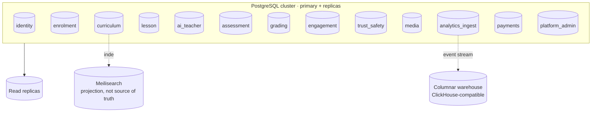
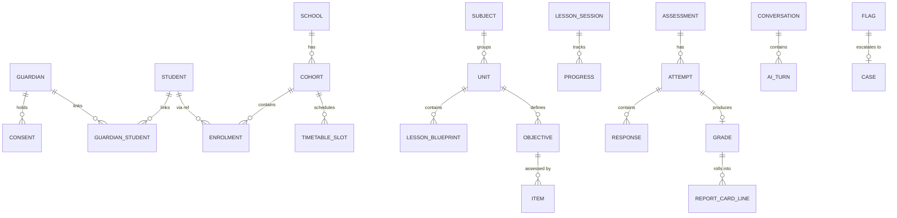

# 09 · Database Design

| | |
|---|---|
| **Document ID** | 09 |
| **Owner** | Principal Software Architect / Head of Data |
| **Status** | Draft (Phase 1) |
| **Last updated** | 2026-07-19 |
| **Related** | [08 System Architecture](./08-system-architecture.md) · [10 API Design](./10-api-design.md) · [ADR-0002 Database-per-Context](./adr/ADR-0002-database-per-context.md) · [14 Privacy](../03-security-privacy/14-privacy-model.md) · [13 Security](../03-security-privacy/13-security-model.md) · [33 Offline](./33-offline-architecture.md) · [36 Infrastructure](./36-infrastructure-architecture.md) |

## Purpose

This document defines the **data model and persistence strategy** for Project Taleem: the
schema-per-context boundary, the core conceptual model for each bounded context, keys and identifiers,
versioning of curriculum and grades, tenancy/isolation, indexing and partitioning for 1,000,000
students, read/write splitting, and the migration discipline. It realises the data-ownership rules of
[08 §7](./08-system-architecture.md) and [ADR-0002](./adr/ADR-0002-database-per-context.md).

## Scope

In scope: the logical/physical data model, identifiers, versioning, tenancy, indexing, partitioning,
read replicas, migrations, and data-integrity rules. Out of scope: wire contracts ([10 API](./10-api-design.md)),
provisioning/HA ([36 Infrastructure](./36-infrastructure-architecture.md)), and privacy lawful basis
([14 Privacy](../03-security-privacy/14-privacy-model.md)) — the classification from Privacy is applied
here, not redefined.

---

## 1. Principles

1. **One schema per bounded context; a context is the sole writer of its data** ([ADR-0002](./adr/ADR-0002-database-per-context.md)).
2. **No cross-context foreign keys or shared tables.** Cross-context references are opaque IDs;
   integrity across contexts is maintained by events, not by database constraints ([08 §7](./08-system-architecture.md)).
3. **PII concentrated in Identity.** Other contexts hold `student_ref`/`guardian_ref` opaque IDs and
   only the attributes explicitly granted ([14 Privacy](../03-security-privacy/14-privacy-model.md)).
4. **History is immutable where it matters.** Attempts, grades, consent, and audit are append-only;
   curriculum is versioned, never mutated in place.
5. **Designed for 1M from day one.** Every high-growth table has a documented indexing and
   partitioning plan ([04 NFR SCAL-04](../01-product/04-non-functional-requirements.md)).
6. **Classification drives storage.** Each field's data class ([14 §4](../03-security-privacy/14-privacy-model.md)) determines
   encryption, access, and retention.

## 2. Physical topology (Phase 1)

Per [08 §2](./08-system-architecture.md), Phase 1 is a modulith: **separate schemas in one PostgreSQL
cluster**, each with its own DB role and grants, plus **read replicas**. Extraction later moves a
schema to its own database with zero model change.

**Grants:** each schema's role can read/write only its own schema. A coding error cannot reach another
context's tables — enforced by the database, not by convention ([13 Security](../03-security-privacy/13-security-model.md)).

## 3. Identifiers & keys

| Decision | Rationale |
|---|---|
| **UUID (v7) primary keys** | Globally unique across contexts and offline clients; time-ordered v7 preserves index locality; no cross-context ID collisions; safe to generate on an offline device ([33 Offline](./33-offline-architecture.md)). |
| **`student_ref` / `guardian_ref` as opaque cross-context refs** | Contexts reference a person without holding PII ([14 Privacy](../03-security-privacy/14-privacy-model.md)). |
| **Client-generated idempotency keys** on writes | Offline replay and retries are idempotent ([04 NFR OFFL-02](../01-product/04-non-functional-requirements.md), [10 API](./10-api-design.md)). |
| **Natural keys as attributes, not PKs** | Curriculum standard codes, SKUs, etc. are indexed columns, not primary keys, so they can evolve. |

## 4. Core conceptual model per context

Only the shape is fixed here; columns/indexes live in migrations. Cross-context edges are opaque refs
(dashed), never FKs.

| Context | Key entities (conceptual) |
|---|---|
| **Identity** | `guardian`, `student`, `consent`, `guardian_student`, `credential`, `role_assignment`, `session` |
| **Enrolment** | `school`, `cohort`, `enrolment`, `timetable_slot`, `attendance`, `mentor_assignment` |
| **Curriculum** | `subject`, `grade`, `unit`, `objective`, `lesson_blueprint`, `standard_map`, `curriculum_version` |
| **Lesson Delivery** | `lesson_session`, `progress`, `resume_point`, `sync_delta` |
| **AI Teacher** | `conversation`, `ai_turn` (transcript), `moderation_verdict`, `token_cost_ledger` |
| **Assessment** | `item`, `assessment`, `attempt`, `response`, `auto_score` |
| **Grading & Reporting** | `gradebook_entry`, `report_card`, `report_card_line`, `promotion_decision`, `transcript` |
| **Engagement** | `notification`, `delivery_log`, `preference`, `streak`, `nudge_state` |
| **Trust & Safety** | `flag`, `case`, `case_note` (C4), `safety_action`, `audit_entry` |
| **Media** | `asset`, `rendition`, `offline_package`, `upload_session`, `scan_result` |
| **Analytics (ingest)** | `event_inbox` (→ warehouse) |
| **Payments** | `sponsorship`, `waiver`, `ledger_entry` |
| **Platform/Admin** | `config`, `feature_flag`, `admin_action` |

## 5. Versioning & immutability (integrity by design)

| Data | Strategy |
|---|---|
| **Curriculum** | Versioned: publishing edits a unit creates a **new `curriculum_version`**; existing records reference the exact version learned against ([FR-CUR-003](../01-product/03-functional-requirements.md)). |
| **Assessment attempts** | **Append-only**; an attempt is sealed at submission; no in-place edit ([FR-ASM-002](../01-product/03-functional-requirements.md), [13 §5](../03-security-privacy/13-security-model.md)). |
| **Grades** | Append-only event-sourced entries; a correction is a new entry with attribution, never a mutation ([FR-GRD-003](../01-product/03-functional-requirements.md)). |
| **Consent** | Versioned records; revocation is a new state, history preserved ([14 §3](../03-security-privacy/14-privacy-model.md)). |
| **Audit / safety actions** | Append-only, tamper-evident ([13 §9](../03-security-privacy/13-security-model.md)). |

## 6. Tenancy & isolation

- **School is the tenancy boundary** ([12 §4](../03-security-privacy/12-authorization-model.md)).
  Tenant-scoped tables carry a `school_id`; queries are always scoped, and **row-level security (RLS)**
  in Postgres enforces the boundary at the data layer as a second line of defence behind the PDP.
- Cross-tenant reads exist only for Platform Admin via audited, purpose-limited paths.
- The **safeguarding data class (C4)** lives in the `trust_safety` schema with field-level encryption
  and the strictest grants ([14 §4](../03-security-privacy/14-privacy-model.md), [15](../03-security-privacy/15-child-safety-framework.md)).

## 7. Indexing & partitioning for 1M students

High-growth tables get an explicit plan; the rest use standard b-tree indexes on access paths.

| Table (high-growth) | Partition strategy | Key indexes |
|---|---|---|
| `ai_turn` (transcripts) | Range-partition by month (aligns with short retention/auto-expiry) | `(conversation_id, occurred_at)` |
| `attempt` / `response` | Hash/range by `school_id` or time; archive old cycles | `(student_ref, assessment_id)`, `(assessment_id)` |
| `progress` | Partition by `school_id`; hot data in cache | `(student_ref, lesson_id)` unique |
| `event_inbox` | Time-partitioned; drained to warehouse then pruned | `(occurred_at)`, `(published)` |
| `delivery_log` | Time-partitioned | `(notification_id)`, `(occurred_at)` |
| `attendance` | Partition by term/`school_id` | `(cohort_id, date)` |

- **Retention-aligned partitioning** makes expiry a partition drop, not a mass delete
  ([14 §6](../03-security-privacy/14-privacy-model.md)).
- **Covering/partial indexes** for hot read paths (e.g. unpublished outbox rows via
  `WHERE published = false`).
- **Outbox** table per context with `(published, occurred_at)` index for the relay's
  `FOR UPDATE SKIP LOCKED` poll ([08 §6.2](./08-system-architecture.md)).

## 8. Read/write splitting & consistency

- **Learning traffic is read-heavy** (browse curriculum, resume lessons) → reads served from **read
  replicas**; writes to the **primary** ([08 §9.2](./08-system-architecture.md)).
- **Read-after-write:** flows needing immediate consistency (just-submitted attempt, just-changed
  consent) are **pinned to primary** for a short window; eventually-consistent reads (dashboards,
  rosters) tolerate replica lag.
- **Caching** (Redis read models) sits in front of replicas with event-driven invalidation
  ([08 §9.3](./08-system-architecture.md)); the cache is never the source of truth.

## 9. Offline & sync data considerations

- Client (IndexedDB) mirrors a **subset** of lesson/progress/attempt data; server IDs are UUIDv7 so
  client-generated IDs never collide ([33 Offline](./33-offline-architecture.md)).
- **Sync deltas** carry client-generated idempotency keys; the server dedupes and applies with the
  documented conflict policy: **last-writer-wins for progress**, **append-only for attempts**
  ([04 NFR OFFL-03](../01-product/04-non-functional-requirements.md)).

## 10. Migrations & schema governance

- **Migrations are code-reviewed, versioned, forward-only** with expand/contract for zero-downtime
  ([49 Dev Workflow](../07-engineering/49-development-workflow.md)); no manual production DDL.
- **Backwards-compatible rollout:** add columns/indexes online (concurrently), backfill, then switch
  reads — never a blocking lock on a 1M-row table.
- **Per-context migration ownership;** a context never migrates another's schema.
- **Backups & PITR** configured for RPO ≤ 5 min ([04 NFR REL-01](../01-product/04-non-functional-requirements.md),
  [36 Infrastructure](./36-infrastructure-architecture.md)); erasure workflow accounts for backups
  ([14 §6](../03-security-privacy/14-privacy-model.md)).

## 11. Non-relational & specialised stores

| Store | Use | Source of truth? |
|---|---|---|
| **PostgreSQL** | OLTP for every context | Yes |
| **Redis** | Cache, sessions, rate limits, streams, presence | No (derived) |
| **Meilisearch** | Search index over curriculum/lessons/help | No (projection, [32 Search](./32-search-architecture.md)) |
| **Object storage (S3-compatible)** | Media blobs, renditions, generated report cards, offline packages | Yes for blobs; metadata in Postgres |
| **Columnar warehouse** | Analytics/learning-analytics | No (event-derived, [31 Analytics](../06-portals/31-analytics-platform.md)) |
| **Vector index (RAG)** | AI Teacher grounding | No (derived from curriculum; store choice is Open Question) |

## 12. Risks

| # | Risk | Impact | Mitigation |
|---|---|---|---|
| R-1 | Cross-context coupling via shared tables/FKs | Loses modularity, blocks extraction | Schema-per-context + per-schema grants + CI fitness check ([ADR-0002](./adr/ADR-0002-database-per-context.md)). |
| R-2 | Hot table (transcripts/attempts) unpartitioned at scale | Query/expiry degradation | Time/tenant partitioning + retention-aligned drops. |
| R-3 | Replica lag breaks read-after-write | Wrong data shown post-submit | Primary-pinning window on consistency-critical flows. |
| R-4 | Erasure misses backups/derived stores | Right-to-erasure failure | Orchestrated erasure incl. backups/search/warehouse ([14 §6](../03-security-privacy/14-privacy-model.md)). |
| R-5 | Blocking migration locks 1M-row table | Outage | Expand/contract, online index builds, forward-only. |
| R-6 | RLS misconfig leaks tenant data | Privacy breach | RLS + PDP dual enforcement + tests. |

---

## Open questions

- **Vector store for RAG:** Meilisearch hybrid vs. a dedicated vector DB (shared with [08](./08-system-architecture.md)/[24](../05-education/24-ai-teacher-specification.md)).
- **Partition key for attempts/progress:** `school_id` vs. time vs. composite — settle with load
  modelling ([04 NFR](../01-product/04-non-functional-requirements.md)).
- **Read-after-write windows** per flow — exact list of primary-pinned operations ([08 open Qs](./08-system-architecture.md)).
- **Warehouse choice** (ClickHouse-compatible) — confirm via [31 Analytics](../06-portals/31-analytics-platform.md).

## Change log

| Date | Change | Author |
|---|---|---|
| 2026-07-19 | Initial data model: schema-per-context topology, per-context conceptual model, UUIDv7 keys, versioning/immutability, tenancy/RLS, indexing & partitioning for 1M, read/write splitting, migrations, specialised stores. | Principal Architect / Head of Data |
