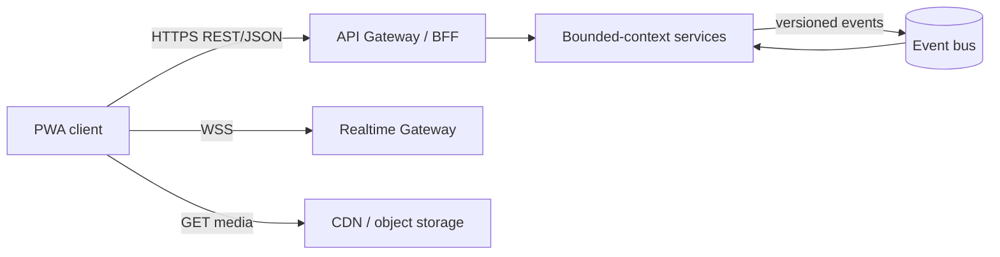

# 10 · API Design

| | |
|---|---|
| **Document ID** | 10 |
| **Owner** | Principal Software Architect / API Guild Lead |
| **Status** | Draft (Phase 1) |
| **Last updated** | 2026-07-19 |
| **Related** | [08 System Architecture](./08-system-architecture.md) · [09 Database Design](./09-database-design.md) · [11 Authentication](../03-security-privacy/11-authentication-strategy.md) · [12 Authorization](../03-security-privacy/12-authorization-model.md) · [13 Security](../03-security-privacy/13-security-model.md) · [33 Offline](./33-offline-architecture.md) · [37 CI/CD](../07-engineering/37-cicd-pipeline.md) |

## Purpose

This document defines **how clients and contexts talk to Taleem**: the API style (REST + OpenAPI,
WebSocket for realtime, versioned events for async), resource conventions, error and pagination
contracts, idempotency and the offline batch-sync endpoint, versioning and governance, and the
security controls on the wire. It is the contract authority referenced by [08](./08-system-architecture.md)
and enforced in CI ([37 CI/CD](../07-engineering/37-cicd-pipeline.md)).

## Scope

In scope: the synchronous HTTP API contract, realtime/WebSocket contract, async event API conventions,
idempotency/sync, pagination/filtering, errors, versioning, and OpenAPI governance. Out of scope:
data model ([09](./09-database-design.md)), auth internals ([11](../03-security-privacy/11-authentication-strategy.md)),
and per-endpoint payloads (owned by each service's OpenAPI spec, generated from this contract).

---

## 1. Principles

1. **Contract-first.** Every endpoint exists in an OpenAPI 3.1 spec before implementation; the spec is
   the source of truth, reviewed and versioned ([08 §Principle 7](./08-system-architecture.md)).
2. **REST for request/response, events for facts, WebSocket for push.** Match the transport to the
   interaction ([08 §6](./08-system-architecture.md)).
3. **Low-bandwidth by default.** Compact payloads, field selection, compression, ETags — every byte
   counts for a metered 3G learner ([04 NFR DATA](../01-product/04-non-functional-requirements.md)).
4. **Idempotent & retry-safe on the critical path** — offline replay and flaky networks demand it
   ([04 NFR REL-05](../01-product/04-non-functional-requirements.md)).
5. **Secure & authorized at the edge and the service** ([12](../03-security-privacy/12-authorization-model.md),
   [13](../03-security-privacy/13-security-model.md)).
6. **Predictable & consistent** — one error shape, one pagination shape, one versioning rule across all
   contexts.

## 2. API surfaces



| Surface | Protocol | Use |
|---|---|---|
| **Resource API** | REST/JSON over HTTPS, OpenAPI 3.1 | CRUD + use-case actions |
| **Realtime** | WebSocket (WSS) | AI token streaming, presence, push ([08 §8](./08-system-architecture.md)) |
| **Event API** | Versioned JSON schemas on the broker | Async inter-context integration |
| **Media** | Signed URLs / range GET on CDN | Large asset delivery ([34 Media](./34-media-architecture.md)) |

## 3. REST conventions

| Concern | Convention |
|---|---|
| **URLs** | Plural, noun resources: `/v1/cohorts/{id}/timetable`; kebab-case; no verbs in paths. |
| **Actions** | Non-CRUD use cases as sub-resources: `POST /v1/attempts/{id}:submit` (or a command sub-path). |
| **Methods** | GET (safe), POST (create/command), PUT/PATCH (replace/modify), DELETE (remove) — with correct idempotency semantics. |
| **Status codes** | 200/201/202/204; 400/401/403/404/409/422/429; 500/503 — used precisely. |
| **Media type** | `application/json`; `Accept-Encoding: br, gzip` expected; UTF-8 (Urdu-safe). |
| **Field selection** | `?fields=` to trim payloads; **partial responses** for low bandwidth ([04 NFR DATA-02](../01-product/04-non-functional-requirements.md)). |
| **Locale** | `Accept-Language` (ur default); localisation is server-aware ([04 NFR L10N](../01-product/04-non-functional-requirements.md)). |

## 4. Errors (one shape everywhere)

A single **RFC 9457 Problem Details**-style body for every error, so clients handle errors uniformly
and no internal detail leaks ([13 §4](../03-security-privacy/13-security-model.md)):

```json
{
  "type": "https://errors.taleem/validation",
  "title": "Validation failed",
  "status": 422,
  "code": "ATTEMPT_ALREADY_SEALED",
  "detail": "This attempt was already submitted and cannot be modified.",
  "instance": "/v1/attempts/018f.../submit",
  "traceId": "…",
  "errors": [{ "field": "responses[2].value", "message": "required" }]
}
```

- **No stack traces or PII** in errors; `traceId` correlates to logs ([39 Logging](../07-engineering/39-logging.md)).
- **403 vs 404:** authorization denials use uniform, non-enumerating responses
  ([11 §10](../03-security-privacy/11-authentication-strategy.md)).

## 5. Pagination, filtering, sorting

- **Cursor pagination** by default (`?cursor=&limit=`) — stable under inserts, cheap at 1M scale;
  offset pagination only for small admin lists.
- **Filtering** via explicit, allow-listed query params (never arbitrary query languages on public
  endpoints).
- **Envelope:** `{ "data": [...], "page": { "nextCursor": "...", "limit": 50 } }`.

## 6. Idempotency & the offline batch-sync contract

The critical enabler for offline-first learning ([08 §11](./08-system-architecture.md), [33 Offline](./33-offline-architecture.md)):

- **`Idempotency-Key` header** (client-generated UUIDv7) on all unsafe critical-path writes; the server
  stores the key + result and returns the same result on replay — safe under retries
  ([04 NFR REL-05](../01-product/04-non-functional-requirements.md)).
- **Batch sync endpoint** `POST /v1/sync/batch` accepts an ordered list of client-generated deltas
  (progress, lesson completions, attempts) each with a `clientEventId`; the server dedupes, applies per
  the conflict policy, and returns a server cursor + per-item result.

```json
// POST /v1/sync/batch
{
  "cursor": "client-last-server-cursor",
  "deltas": [
    { "clientEventId": "018f...", "type": "progress.updated", "payload": { "lessonId": "…", "block": 7 } },
    { "clientEventId": "018f...", "type": "attempt.submitted", "payload": { "assessmentId": "…", "sealedAt": "…", "responses": [] } }
  ]
}
```

- **Conflict policy:** last-writer-wins for progress; append-only for attempts (an attempt is never
  overwritten) ([09 §9](./09-database-design.md), [04 NFR OFFL-03](../01-product/04-non-functional-requirements.md)).
- **Response** reports `applied` / `duplicate` / `conflict` per `clientEventId`, so the client can clear
  its queue deterministically.

## 7. Caching & conditional requests

- **ETags + `Cache-Control`** on cacheable GETs; clients revalidate with `If-None-Match` → 304 saves
  bytes ([08 §9.3](./08-system-architecture.md)).
- **Immutable content** (published curriculum versions, media renditions) uses content-hash URLs with
  long TTL ([04 NFR DATA](../01-product/04-non-functional-requirements.md)).
- **Delta sync** endpoints return only changes since the client cursor.

## 8. Realtime (WebSocket) contract

- **Connect** with a short-lived access token in the WS subprotocol; the gateway authenticates and
  authorizes channels ([08 §8](./08-system-architecture.md)).
- **Message envelope:** `{ "type": "ai.token" | "notification" | "presence", "channel": "...", "seq": n, "data": {...} }`.
- **Resync:** on reconnect the client sends its last `seq`; missed state is re-fetched over REST
  (realtime is an enhancement, never a hard dependency).
- **Backpressure:** slow consumers are bounded then dropped with a resync token ([08 §8](./08-system-architecture.md)).

## 9. Async event API

- **Events are versioned, immutable, past-tense facts** with a stable envelope
  ([08 §6.3](./08-system-architecture.md)):

```json
{
  "eventId": "018f...", "type": "ObjectiveMastered", "version": 1,
  "occurredAt": "2026-07-19T10:00:00Z", "producer": "lesson-delivery",
  "subject": { "studentRef": "…", "objectiveId": "…" }, "traceId": "…"
}
```

- **Minimal payloads** (IDs + stable subset), never a full aggregate, to avoid coupling.
- **Idempotent consumers** dedupe on `eventId` ([08 §6.2](./08-system-architecture.md)).
- **Schema registry & compatibility:** additive changes bump minor; breaking changes are a new
  `version` with a migration window.

## 10. Versioning & deprecation

| Rule | Detail |
|---|---|
| **URL major version** | `/v1/...`; breaking changes → `/v2`. |
| **Additive is non-breaking** | New optional fields/endpoints do not bump the major. |
| **Deprecation** | `Deprecation` + `Sunset` headers; documented window; clients warned before removal. |
| **Offline clients** | Old app versions may be offline for weeks → the sync contract keeps N-version backward compatibility ([33 Offline](./33-offline-architecture.md)). |

## 11. Security on the wire

- **TLS 1.2+**, HSTS; **AuthN at gateway + service**, **AuthZ at the PDP** ([12](../03-security-privacy/12-authorization-model.md)).
- **Input validation** from the OpenAPI schema (server-side, reject-unknown-fields) ([13 §4](../03-security-privacy/13-security-model.md)).
- **Rate limiting** per identity/device/IP; stricter on auth and AI endpoints
  ([11 §10](../03-security-privacy/11-authentication-strategy.md)).
- **CORS** strict allowlist; **CSRF** protection for cookie-based flows; **no verbose errors**.
- **Idempotency + replay protection** on sensitive commands.

## 12. OpenAPI governance (CI-enforced)

- Every service publishes an **OpenAPI 3.1** spec; the spec is the contract, generated types on both
  sides.
- **CI gates** ([37 CI/CD](../07-engineering/37-cicd-pipeline.md)): spec lint (style rules), **breaking-
  change detection** vs. the previous version, example validation, and a check that **every route has
  an auth policy binding** ([12 §9](../03-security-privacy/12-authorization-model.md)).
- **Contract tests** verify provider and consumer conform to the spec/event schema.

## 13. Risks

| # | Risk | Impact | Mitigation |
|---|---|---|---|
| R-1 | Non-idempotent write replayed offline → duplicate grade/attempt | Data corruption | Idempotency-Key + append-only attempts + dedupe. |
| R-2 | Breaking API change strands offline clients | Learners locked out | Versioning + N-version back-compat + breaking-change CI gate. |
| R-3 | Chatty/heavy endpoints blow data budget | Cost + slow on 3G | Field selection, cursor pagination, ETags, compression, budget checks. |
| R-4 | Unauthenticated/unauthorized route ships | Breach | CI fitness function: every route needs a policy binding. |
| R-5 | Verbose errors leak internals/PII | Info disclosure | Uniform Problem Details, no traces/PII, traceId only. |

---

## Open questions

- **Command vs. sub-resource style** for non-CRUD actions (`:submit` vs. `/submissions`) — settle the
  house convention with the API Guild.
- **GraphQL BFF** for portal read-aggregation — evaluated but out of scope for Phase 1; revisit if
  portal over-fetching becomes a data-budget problem.
- **Event schema registry** technology choice — ADR pending ([adr/](./adr/)).
- **Sync batch size caps** vs. data-budget on very intermittent connections ([33 Offline](./33-offline-architecture.md)).

## Change log

| Date | Change | Author |
|---|---|---|
| 2026-07-19 | Initial API design: REST+OpenAPI conventions, uniform errors, cursor pagination, idempotency & offline batch-sync contract, caching, WebSocket & event APIs, versioning, wire security, CI governance. | Principal Architect / API Guild |
