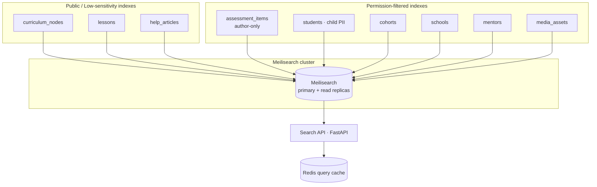
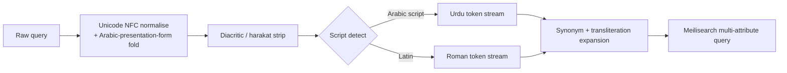
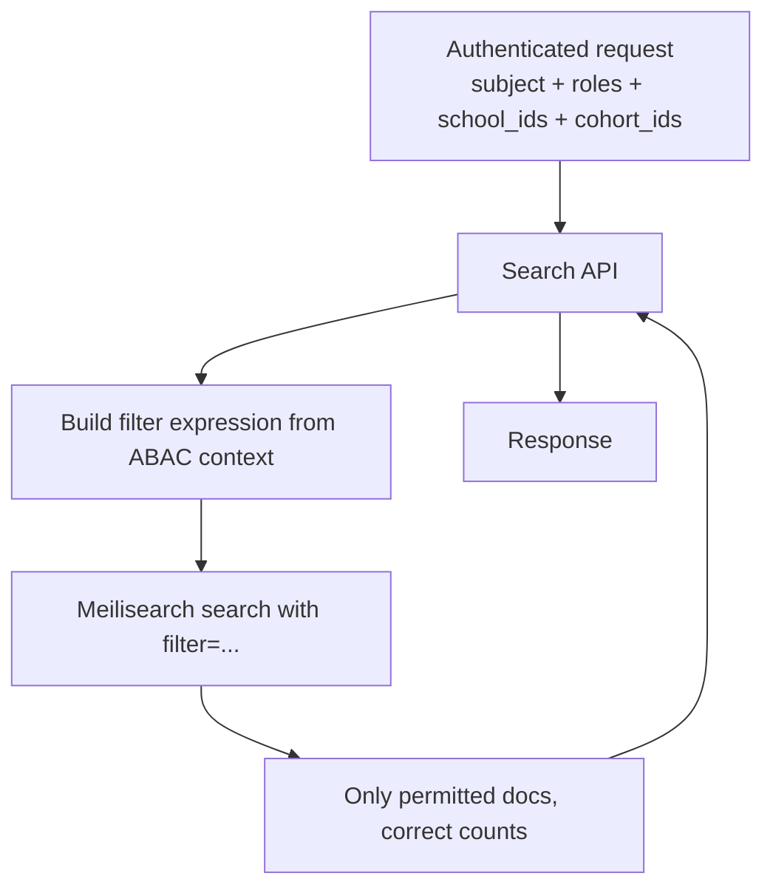
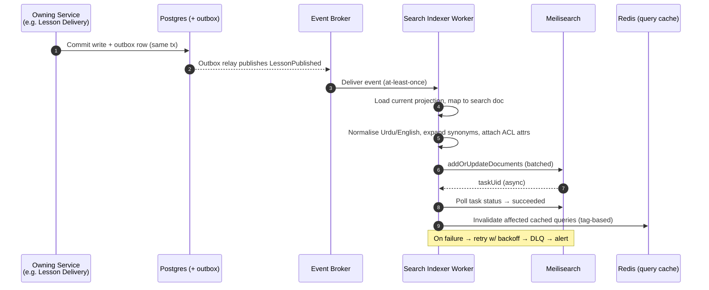
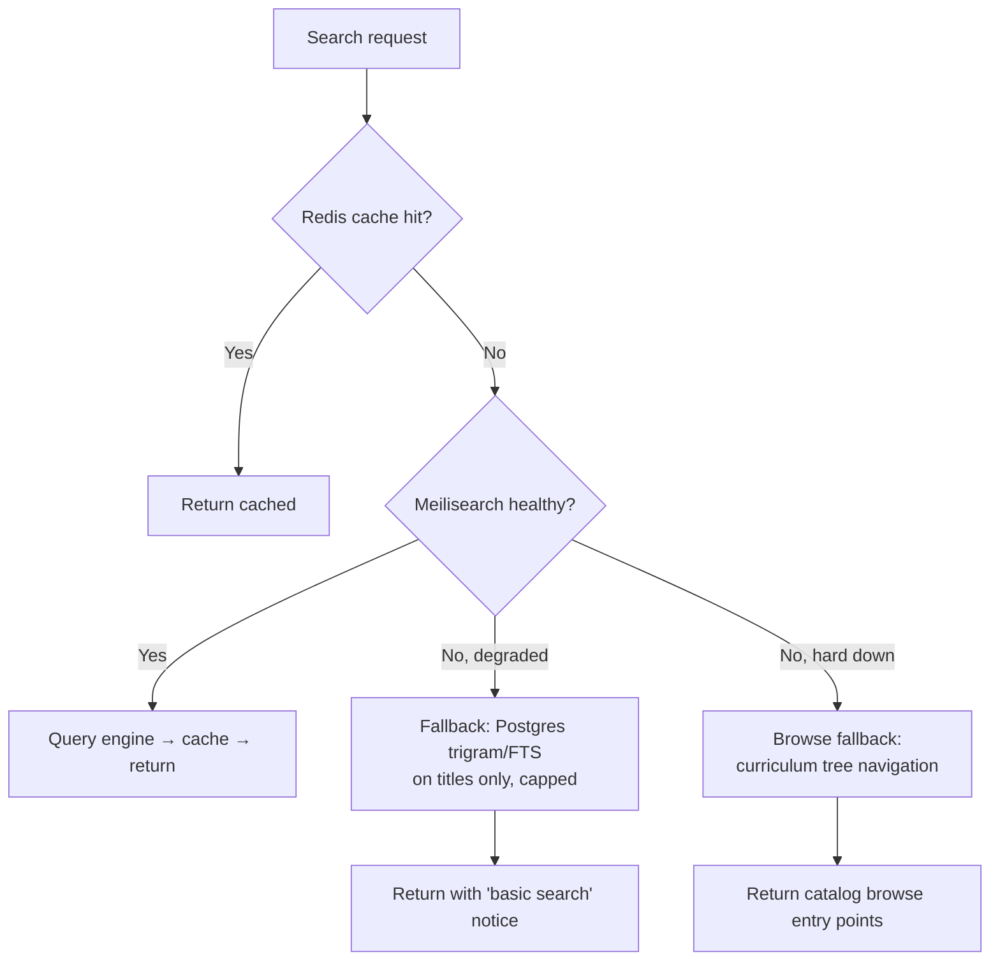

# 32 · Search Architecture

| | |
|---|---|
| **Document ID** | 32 |
| **Owner** | Staff Platform/Infrastructure Architect |
| **Status** | Draft (Phase 1) |
| **Last updated** | 2026-07-19 |
| **Related** | [08 System Architecture](08-system-architecture.md) · [09 Database Design](09-database-design.md) · [10 API Design](10-api-design.md) · [33 Offline](33-offline-architecture.md) · [12 Authorization Model](../03-security-privacy/12-authorization-model.md) · [21 Curriculum Engine](../05-education/21-curriculum-engine.md) · [31 Analytics Platform](../06-portals/31-analytics-platform.md) |

## Purpose

This document specifies how search works across Project Taleem: what is searchable, how indexes are
designed, how relevance and typo-tolerance are tuned for a **bilingual Urdu (RTL) + English** learner
base, how the event-driven indexing pipeline keeps indexes fresh, how results are permission-filtered
across tenants and roles, and how search degrades gracefully at the bottom of the connectivity curve.
Search is powered by **Meilisearch** (fixed decision, authoring brief §4).

## Scope

In scope: the search subsystem (index topology, ranking, indexing pipeline, query API surface,
low-bandwidth query UX, failure/fallback, multi-tenant permission filtering). Out of scope: the
document data models themselves (owned by [09 Database Design](09-database-design.md) and the
educational-engine docs), full-text analytics/BI querying (owned by [31 Analytics](../06-portals/31-analytics-platform.md)),
and RAG retrieval for the AI Teacher (owned by [24 AI Teacher](../05-education/24-ai-teacher-specification.md) —
see §11 for the boundary).

---

## 1. Decisions at a glance

| # | Decision | Rationale | Alternatives rejected |
|---|---|---|---|
| D1 | **Meilisearch** as the search engine, self-hosted on the cluster. | Fixed in authoring brief §4. Sub-50 ms typo-tolerant search, tiny footprint, first-class prefix search for as-you-type, low ops burden vs Elasticsearch. | Elasticsearch/OpenSearch (heavy, JVM, ops-costly at our scale); Postgres FTS (no typo tolerance, weak ranking, poor bilingual). |
| D2 | **One index per entity type per language pair**, not one giant index. | Independent settings (ranking rules, stop-words, synonyms) per entity; cheaper partial reindex; permission model differs per entity. | Single mega-index (blunt ranking, unsafe permission mixing). |
| D3 | **Permission filtering at query time** via Meilisearch `filter` on denormalised ACL attributes, never post-filtering in the app. | Correctness (no leakage), correct pagination counts, one round trip. | App-side post-filtering (leaks counts, breaks pagination, slow). |
| D4 | **Event-driven reindex** via the outbox → broker → indexer worker; Meilisearch is a **derived read model**, never a source of truth. | Decouples write path from search; survives Meilisearch loss (rebuild from Postgres). | Synchronous dual-writes (couples latency, risks partial writes). |
| D5 | **Bilingual handling**: store Urdu and English fields side-by-side in one document; use language-scoped searchable attributes + a shared **transliteration/synonym layer** (Roman-Urdu ↔ Urdu). | A Pakistani child searches "hisaab", "حساب", or "maths" for the same concept. | Separate per-language documents (duplication, cross-language recall loss). |
| D6 | **Server-authoritative search only in v1** for catalog/curriculum; **offline search** is a bounded on-device prefix index over *downloaded* content (see [33 Offline](33-offline-architecture.md) §9). | Meilisearch cannot run on a low-end phone; but a child offline must still find their downloaded lesson. | Shipping a WASM search engine to the client (payload + battery cost unacceptable). |
| D7 | **Search is a read-through cache pattern**: Redis caches hot queries; Meilisearch is the engine; Postgres is truth. | Protects the engine under viral/duplicate query storms at 1M scale. | No caching (engine hotspots on identical queries). |

---

## 2. What is searchable

Search is a cross-cutting capability consumed by multiple portals. Each searchable domain maps to one
or more indexes with distinct owners, audiences, and permission rules.

| Domain | Index(es) | Primary audience | Searchable content | Sensitivity |
|---|---|---|---|---|
| **Curriculum** | `curriculum_nodes` | Student, Mentor, Curriculum Architect | Subjects, grades, units, learning objectives, standards codes (SNC) | Low (published catalog) |
| **Lessons** | `lessons` | Student, Mentor | Lesson titles, summaries, content-block text, keywords, transcript captions | Low–Med (published; draft lessons restricted) |
| **Help / Support** | `help_articles` | All roles | Help centre articles, FAQs, how-to, troubleshooting (Urdu + English) | Public |
| **Assessment items** | `assessment_items` | Curriculum Architect, Mentor (authoring) | Item bank stems, tags, objectives — **never student-facing** | High (leaking items = cheating) |
| **Admin entities** | `students`, `cohorts`, `schools`, `mentors` | School Admin, Platform Admin, Mentor (own cohort) | Names, enrolment IDs, cohort names, grade, status | **High (child PII)** — strict ABAC |
| **Content ops** | `media_assets` | Platform Admin, Media ops | Media titles, captions, tags, alt-text, checksum | Med |

**Non-goals for search:** free-text mining of AI Teacher transcripts (safety-governed, queried only via
Trust & Safety tooling), payment records, and audit logs — these are queried through purpose-built,
access-logged paths, not the general search index.

---

## 3. Index topology



### 3.1 Document shape (illustrative — `lessons`)

```jsonc
{
  "id": "lesson_9f3a...",           // primary key (stable, opaque)
  "type": "lesson",
  "grade": 5,
  "subject_code": "MATH",
  "unit_id": "unit_123",
  "title_ur": "اعشاریہ کسر",
  "title_en": "Decimal Fractions",
  "summary_ur": "...", "summary_en": "...",
  "body_text_ur": "...",            // flattened, stripped content-block text
  "body_text_en": "...",
  "keywords": ["decimals", "kasr", "اعشاریہ", "hisaab"],
  "roman_ur": ["aashariya kasr"],   // transliteration aid (see §5)
  "status": "published",            // draft|published|archived (filterable)
  // ---- denormalised ACL attributes (see §7) ----
  "acl_visibility": "public",       // public|cohort|school|role
  "acl_school_ids": [],             // empty = all schools
  "acl_min_grade": null,
  "updated_at": 1752940800,
  "popularity": 0.42                // relevance signal (see §6)
}
```

Design rules:
- **Never store secrets or full child PII** beyond what a permitted searcher may already see in the UI.
  Student index stores display name + enrolment ID + cohort, not medical/consent data.
- **Flatten for search, link for detail.** The index holds enough to rank and preview; the app fetches
  the full record from Postgres by `id`. Keeps documents small (payload budget, authoring brief §6).
- Every restricted document carries `acl_*` filter attributes so the engine can enforce visibility.

---

## 4. Ranking, typo-tolerance, and matching

Meilisearch ranks by an ordered chain of **ranking rules**. Our tuned chain per index type:

| Order | Rule | Why for Taleem |
|---|---|---|
| 1 | `words` | Documents matching more query terms rank first. |
| 2 | `typo` | Tolerate misspellings — critical for children and Roman-Urdu spelling variance. |
| 3 | `proximity` | Terms close together (phrase intent). |
| 4 | `attribute` | Title/keyword matches beat body matches (searchable-attribute order). |
| 5 | `sort` | Explicit user sort (e.g. grade asc) when requested. |
| 6 | `exactness` | Exact tokens beat prefix matches. |
| 7 | `popularity:desc` (custom) | Tie-break by engagement signal (§6). |

**Typo tolerance** is tuned *up* from defaults because our users are children spelling phonetically:
- `minWordSizeForTypos`: `{ oneTypo: 4, twoTypos: 7 }` (Meilisearch default 5/9) — allows one typo on
  4-letter words like "math"/"maths"/"matg".
- Numerals, standards codes (e.g. `SNC-MATH-5-3`), and enrolment IDs are added to `disableOnWords` /
  treated as exact — you must not "typo-correct" an ID.
- Urdu tokens: typo tolerance operates on Unicode grapheme clusters; we verify Nastaʿlīq joining forms
  normalise (see §5) before edit-distance is computed.

**Prefix (as-you-type) search** is enabled (`matchingStrategy: last`) so results appear from the 2nd
character — essential because a metered user will not type a full query and wait.

---

## 5. Urdu + English, RTL, and transliteration

This is the load-bearing section for reach. A child may express one concept as **حساب**, **hisaab**,
**hisab**, or **maths**. Recall must survive all four.



Handling rules:

1. **Normalisation (index + query, identical pipeline).** NFC-normalise; fold Arabic presentation
   forms (U+FE70–FEFF) to base letters; strip harakat/diacritics (U+064B–U+0652); normalise Urdu Yeh
   (ی/ي), Heh (ہ/ه), and Kaf variants to canonical Urdu code points. Meilisearch's tokenizer is
   configured with these as a **custom normalization pre-pass** in the indexer and mirrored in the
   query service so index and query tokens always agree.
2. **RTL correctness.** Urdu is stored and returned as logical-order Unicode; the **client** owns
   visual RTL rendering (`dir="rtl"`, `unicode-bidi: plaintext`). The search engine is
   direction-agnostic — a wrong bidi mark must never leak into a stored token. We reject/normalise
   stray RLM/LRM marks at index time.
3. **Transliteration (Roman-Urdu ↔ Urdu).** Maintained as a **curated synonym set** plus a
   deterministic Roman→Urdu candidate generator, seeded from the curriculum glossary
   ([21 Curriculum](../05-education/21-curriculum-engine.md)) — e.g. `hisaab→حساب`, `kitaab→کتاب`,
   `sawaal→سوال`. Curriculum Architects extend this glossary; it is versioned and reindexed on change.
   We deliberately avoid a heavy statistical transliteration model in v1 (cost, latency, non-determinism);
   the curated set covers the finite curriculum vocabulary.
4. **Cross-language synonyms.** `maths↔math↔hisaab↔حساب`, `science↔sains↔سائنس` registered as
   Meilisearch synonyms so an English query recalls Urdu documents and vice-versa.
5. **Stop-words per language.** Separate Urdu and English stop-word lists (کا/کے/کی/اور … ; the/a/of …)
   so common function words don't dominate ranking.

**Open risk:** phonetic Roman-Urdu has no single spelling standard. Mitigation: typo-tolerance +
curated synonyms + logging zero-result queries (§9) to grow the glossary. Tracked in Open Questions.

---

## 6. Relevance tuning

| Signal | Source | Use |
|---|---|---|
| `popularity` | Analytics event stream ([31 Analytics](../06-portals/31-analytics-platform.md)) — lesson opens, completions, help-article helpful-votes | Custom `popularity:desc` tie-break ranking rule; recomputed nightly, written as a document attribute. |
| Grade/subject context | Query context (student's enrolled grade) | Boost via `filter` (soft) — a Grade-5 student's results bias to Grade-5 content, without hiding others. |
| Recency | `updated_at` | Optional sort for admin/content ops; not default for learners. |
| Zero-result & refinement logs | Search API telemetry | Drive synonym/glossary additions; measured weekly. |

**Relevance guardrails (honesty principle, vision §7.6):** popularity boosts must never bury a
*curriculum-correct* result beneath a merely popular one. Curriculum objectives are ranked primarily by
match quality; popularity is a **tie-break only**, never a primary rule. Assessment-item search is
ranked purely by match + tags — never by popularity, to avoid leaking which items are "used a lot".

---

## 7. Multi-tenant & permission-filtered results

Taleem is multi-tenant by **school** and multi-role. A search must return **only what the searcher is
allowed to see**, computed at query time. Authoritative rules live in
[12 Authorization Model](../03-security-privacy/12-authorization-model.md); search enforces them via
denormalised filter attributes.



Enforcement pattern:
- The Search API **derives the filter server-side from the verified session** (never from client input).
  Example for a Mentor searching students:
  `acl_visibility = cohort AND acl_cohort_ids IN [<mentor's cohorts>]`.
- Filter attributes are declared `filterableAttributes` and indexed; filtering is O(log) via the engine,
  not app post-filtering (D3).
- **Defence in depth:** the API also re-checks the top-N returned IDs against the authorization service
  before hydrating full records from Postgres — a belt-and-braces check so a stale ACL attribute cannot
  leak a child's record. Stale-window is bounded by reindex latency (§8, target < 5 s).
- **Tenant isolation:** `acl_school_ids` scopes admin entities; a School Admin can never match another
  school's students. Platform Admin/Safety Officer scopes are explicit and **audit-logged** on every
  child-PII search (privacy by design, vision §7.5).
- **Assessment items** are filtered to authoring roles only and are physically never queried by the
  student-facing search API surface (separate API route + separate API key/tenant in Meilisearch).

**Meilisearch tenancy:** we use **scoped API keys / tenant tokens** so the student-facing service can
only ever address public indexes with a pre-baked filter, structurally preventing a code bug in one
service from querying the student PII index.

---

## 8. Indexing pipeline (event-driven)

Meilisearch is a **derived read model**. Source-of-truth writes in each bounded context emit domain
events via the **outbox pattern** (authoring brief §4); a Search Indexer worker consumes them and
projects documents into the relevant index.



Pipeline properties:

| Property | Design |
|---|---|
| **Freshness target** | New/updated content searchable in **< 5 s p95** (planning assumption); admin PII edits < 2 s. |
| **Delivery** | At-least-once; indexer is **idempotent** (upsert by stable `id`), so replays are safe. |
| **Batching** | Documents batched (size/time window) to amortise Meilisearch task overhead at 1M scale. |
| **Deletes/soft-deletes** | Unpublish/archive/GDPR-erase events remove or re-project the document; **child data-erasure requests propagate to the index within the privacy SLA** ([14 Privacy](../03-security-privacy/14-privacy-model.md)). |
| **Full rebuild** | A `reindex` command replays a snapshot from Postgres into a **new index**, then atomically **swaps** (Meilisearch index alias/swap) with zero downtime. Used for schema/settings changes and DR. |
| **Backpressure** | Indexer is horizontally scaled by partitioned consumer; lag is a monitored SLO ([38 Monitoring](../07-engineering/38-monitoring.md)). |
| **Failure handling** | Retries with exponential backoff → dead-letter queue → alert. Search *staleness* never blocks the write path (D4). |

---

## 9. Low-bandwidth query UX

Search is a metered-data interaction; the UX is engineered to the data-cost budget (authoring brief §6).

| Technique | Detail |
|---|---|
| **Debounced, thin requests** | As-you-type debounced (≈250 ms); request is a short query string + context token, not a payload. |
| **Lean responses** | Return only `id`, localized title, a **≤120-char** highlighted snippet, type, and grade — never full bodies. Full record fetched on tap. Response gzip/br-compressed; target **< 8 KB** per result page. |
| **Capped pagination** | Default 10 hits/page; infinite scroll fetches next page only on explicit intent. `limit` hard-capped server-side. |
| **Result caching** | Redis caches hot queries (D7); client caches the last query results in the offline store so re-opening search costs no data. |
| **Lite mode** | On slow links, suppress thumbnails in results (text + type icon only), matching global "lite mode" default. |
| **No speculative prefetch** | We do not prefetch result media; a metered user pays only for what they open. |
| **Zero-result guidance** | On no results, suggest transliteration alternatives and nearby curriculum nodes offline-cheaply, and log the query (§6) to improve the glossary. |

---

## 10. Failure, fallback, and degradation

Search is **not** on the critical learning path (a child can still open their timetable and lessons
without it), so it degrades rather than blocks.



| Failure | Behaviour |
|---|---|
| Meilisearch degraded/slow | Circuit-breaker trips → **Postgres fallback** (`pg_trgm` / FTS on titles + keywords only). Lower quality, but title lookup still works. UI shows a subtle "basic search" state. |
| Meilisearch hard down | Fall back to **browse** — curriculum-tree navigation and category entry points (which are statically cacheable). The child never hits a dead end. |
| Index stale (indexer lag) | Search still serves; content appears late. Lag SLO alerts ops. Never blocks writes. |
| Meilisearch data loss | **Rebuild from Postgres** via full-reindex snapshot swap (D4/§8). RPO for the search index is effectively 0 because it is derived. |
| Offline (no network) | On-device prefix search over downloaded content only (see [33 Offline](33-offline-architecture.md) §9); server search unavailable is expected, not an error. |

---

## 11. Boundary with AI Teacher RAG

Search (Meilisearch) and RAG retrieval for the [AI Teacher](../05-education/24-ai-teacher-specification.md)
are **distinct systems** and must not be conflated:

- **Meilisearch** = human-facing lexical/typo-tolerant search over titles/text with permission filtering.
- **RAG** = machine-facing semantic retrieval (vector embeddings) over curriculum passages to ground AI
  answers.

They may share the *same source content* and the same indexing events, but use different stores
(Meilisearch vs the vector store) and different query paths. This document owns the former only. A future
ADR may consolidate ingestion pipelines; it will not merge the query engines.

---

## 12. Capacity & scale notes (1M students)

- **Read-heavy, write-light.** Curriculum/lessons/help change rarely; students query constantly. Scale
  **read replicas** of Meilisearch behind the Search API; the primary handles indexing writes.
- **Query volume (planning assumption):** peak ~ a few thousand searches/sec at 1M scale; absorbed by
  Redis caching + replicas. Sized in [36 Infrastructure](36-infrastructure-architecture.md).
- **Index size:** curriculum + lessons + help are modest (KG–10, six subjects) — comfortably in RAM.
  Admin-entity indexes (students/cohorts) grow with enrolment; still small documents. Total index RAM
  budget tracked in the infra capacity model.
- **Isolation:** student-PII indexes run on separate scoped keys and may run on a **dedicated Meilisearch
  instance** from public content indexes, so a load spike on public search cannot degrade admin PII
  search and vice-versa.

---

## Open questions

- **Roman-Urdu normalisation depth:** is the curated transliteration glossary sufficient, or do we need a
  lightweight statistical transliteration fallback for out-of-glossary terms? (Measure via zero-result logs.)
- **Dedicated vs shared Meilisearch tenants** for student-PII: cost vs isolation trade-off — decide with
  the [36 Infra](36-infrastructure-architecture.md) cost model.
- **Cross-language ranking fairness:** do Urdu-primary learners get equal-quality recall when English
  metadata is richer? Needs an evaluation set of real learner queries.
- **Offline search index format & size budget** — finalised jointly with [33 Offline](33-offline-architecture.md).
- **Provincial-language expansion** (Sindhi/Pashto/Punjabi/Balochi): additional normalisation and
  stop-word sets — sequencing tied to the language rollout (vision Open Questions).

## Change log

| Date | Change | Author |
|---|---|---|
| 2026-07-19 | Initial Phase-1 draft. | Staff Platform/Infrastructure Architect |
