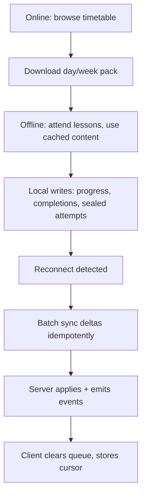
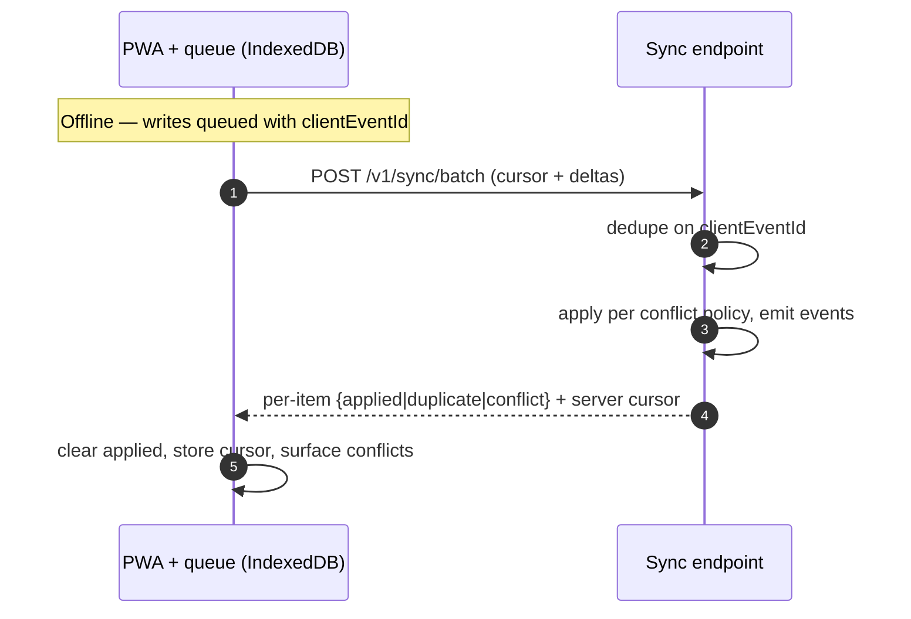

# 33 · Offline Architecture

| | |
|---|---|
| **Document ID** | 33 |
| **Owner** | Principal Frontend Architect / Lesson Delivery Lead |
| **Status** | Draft (Phase 1) |
| **Last updated** | 2026-07-19 |
| **Related** | [08 System Architecture](./08-system-architecture.md) · [09 Database Design](./09-database-design.md) · [10 API Design](./10-api-design.md) · [34 Media](./34-media-architecture.md) · [04 NFR](../01-product/04-non-functional-requirements.md) · [22 Lesson Engine](../05-education/22-lesson-engine.md) · [11 Authentication](../03-security-privacy/11-authentication-strategy.md) |

## Purpose

This document defines **how Project Taleem works with intermittent or no connectivity** — the single
most important architectural property for reaching a child on 3G with a few hours of power. It fixes
the offline-first PWA model, the day/week **offline packaging**, local storage, the deterministic
**sync-and-conflict** protocol, offline authentication, and the data-budget discipline that keeps it
affordable. It realises [08 §11](./08-system-architecture.md) and [04 NFR §5 OFFL](../01-product/04-non-functional-requirements.md).

## Scope

In scope: offline capability model, service worker & caching, offline packages, local persistence,
sync protocol & conflict resolution, offline auth, and degraded-mode UX. Out of scope: the server sync
endpoint contract ([10 API §6](./10-api-design.md)), media packaging internals ([34 Media](./34-media-architecture.md)),
and server data model ([09](./09-database-design.md)) — referenced, not redefined.

---

## 1. Principles

1. **Offline is the default assumption, not an edge case.** The core learning path is designed to run
   with no network and sync opportunistically ([01 Vision §7.2](../00-overview/01-vision.md)).
2. **Local-first writes.** Progress, completions, and attempts are written locally and never block on
   the network ([04 NFR OFFL-01](../01-product/04-non-functional-requirements.md)).
3. **Deterministic sync, no silent loss.** Every offline change syncs idempotently with documented
   conflict rules ([04 NFR OFFL-02/03](../01-product/04-non-functional-requirements.md)).
4. **Data is money.** Downloads are explicit, sized, and shown before they happen ([04 NFR DATA-04](../01-product/04-non-functional-requirements.md)).
5. **Offline is still authenticated and safe.** An offline session is attributable, revocable, and
   safety-governed ([11 §6](../03-security-privacy/11-authentication-strategy.md)).

## 2. The offline capability model

| Capability | Offline? |
|---|---|
| Attend downloaded lessons, view content blocks | ✅ Fully |
| Formative checks + exam attempts (sealed locally) | ✅ Queued |
| Progress / resume | ✅ Local |
| AI Teacher (live) | ⚠️ Degraded — cached hints/FAQ offline; full tutoring needs connectivity |
| New content not in the pack | ❌ Requires download |
| Report card (last-synced) | ✅ View cached; new issuance needs sync |

## 3. PWA & service worker

- **Next.js PWA** with a **service worker** implementing an app-shell + runtime caching strategy;
  the shell is cached for instant, offline loads ([04 NFR PERF-06](../01-product/04-non-functional-requirements.md)).
- **Caching strategies:** app shell → cache-first; published lesson content → stale-while-revalidate;
  API GETs → network-first with cache fallback + ETag ([10 §7](./10-api-design.md)).
- **Precache the critical route JS** within the ≤150 KB budget ([04 NFR DATA-01](../01-product/04-non-functional-requirements.md)).
- **Background Sync** (where supported) flushes the write queue on reconnect; a foreground fallback
  handles WebViews without it.

## 4. Offline packages (day/week packs)

- **Media builds an offline package** — lessons + assets for a configurable day/week — that the client
  downloads once and verifies by checksum ([34 Media](./34-media-architecture.md), [FR-LSN-003](../01-product/03-functional-requirements.md)).
- `OfflinePackageBuilt` notifies the client a pack is ready ([08 §5](./08-system-architecture.md)).
- **Explicit, sized download:** the client shows the pack size before download and respects
  Save-Data/metered-link signals; lite variants are packaged by default ([04 NFR DATA-04/05](../01-product/04-non-functional-requirements.md)).
- **Integrity:** each asset is checksum-verified; a corrupt asset re-downloads, never renders broken.

## 5. Local persistence

| Data | Store | Notes |
|---|---|---|
| App shell, static assets | Cache Storage (SW) | Cache-first |
| Lesson content, packaged assets | Cache Storage + IndexedDB manifest | Checksum-verified |
| Progress, completions | IndexedDB (write queue) | Client-generated UUIDv7 IDs |
| Sealed attempts | IndexedDB (append-only, encrypted) | Sealed at submission ([04 NFR OFFL-05](../01-product/04-non-functional-requirements.md)) |
| Session/offline token | Secure storage, encrypted | Device-bound, short TTL ([11 §7](../03-security-privacy/11-authentication-strategy.md)) |

- **Per-profile namespacing & encryption** on shared devices — no cross-profile bleed
  ([11 §6](../03-security-privacy/11-authentication-strategy.md)).
- **Storage-pressure policy:** least-recently-used packs are evicted first; queued writes are **never**
  evicted before sync.

## 6. Sync & conflict resolution (deterministic)

The client flushes queued deltas via `POST /v1/sync/batch` ([10 §6](./10-api-design.md)):

> **Clock-skew fix (audit AR-H-28):** shared low-end phones have no reliable NTP and lose power, so a
> skewed device clock must never decide a merge. Ordering uses **server-incremented version counters +
> a hybrid logical clock (HLC)/Lamport sequence**, with **server-receive time as the tiebreaker — never
> raw client wall-clock.**

| Data type | Conflict rule |
|---|---|
| **Progress / resume** | Monotonic max-progress merge (never regress a completed block); ties broken by server version counter, not client clock. |
| **Lesson completion** | Idempotent set; once completed, stays completed. |
| **Assessment attempt** | **Append-only, merge by union** — an attempt is sealed and never overwritten; a second submission is a new attempt or rejected as duplicate (no attempt is ever lost to LWW). |
| **Preferences** | Server version counter wins; server-receive time as tiebreaker. |

- **Idempotency** via `clientEventId`/`Idempotency-Key`; replaying the same queue twice yields
  identical server state ([04 NFR OFFL-02](../01-product/04-non-functional-requirements.md)).
- **Ordering:** deltas carry an HLC/Lamport sequence; the server applies deterministically by version,
  not by client wall-clock.
- **No silent loss:** unresolvable conflicts surface to the user/Mentor rather than being dropped.

## 7. Offline authentication

- A **device-bound, time-boxed offline session token** lets a known child resume school with no
  network, scoped only to cached-lesson + queued-submission capability — it cannot mutate grades or
  read cross-child data ([11 §5/§7](../03-security-privacy/11-authentication-strategy.md)).
- On reconnect the token is re-validated; a revoked session drops on next sync.
- Offline TTL is short and configurable per cohort (planning assumption) to bound lost-device risk
  ([11 R-5](../03-security-privacy/11-authentication-strategy.md)).

## 8. Offline safety

- **No generative AI offline, ever** (audit AR-C-06) — offline serves only static, pre-moderated,
  input-independent content; no dynamically generated text is shown offline ([15 §3](../03-security-privacy/15-child-safety-framework.md)).
- Packaged content is already moderated at publish/packaging time ([15 §4](../03-security-privacy/15-child-safety-framework.md)).
- **Offline crisis affordance** — safety help + a "reach a human" action are cached and available
  offline; using it **queues a safety flag that fires on reconnect** so a child in distress offline is
  not lost ([15 §3/§5](../03-security-privacy/15-child-safety-framework.md), [52 Crisis Protocol](../03-security-privacy/52-safeguarding-crisis-protocol.md), [07 IA §10](../01-product/07-information-architecture.md)).

## 9. Degraded-mode UX

- **No dead ends:** every screen shows offline state and a next step; queued actions show as "will
  send when online" ([04 NFR OFFL-04](../01-product/04-non-functional-requirements.md)).
- **Connectivity-required actions** (full AI tutoring, new downloads) are clearly marked and queue
  rather than error.
- **Sync status** is visible and honest (queued/syncing/synced/conflict).

## 10. Risks

| # | Risk | Impact | Mitigation |
|---|---|---|---|
| R-1 | Sync data loss on reconnect | Lost learning/grades | Idempotent append-only attempts, durable queue, never-evict-before-sync. |
| R-2 | Conflicting offline edits corrupt state | Wrong progress/grade | Deterministic conflict policy; surface unresolvable conflicts. |
| R-3 | Oversized packs blow data budget | Cost to family | Sized/explicit downloads, lite-by-default, Save-Data respect. |
| R-4 | Lost device with offline token/cache | Unauthorised access | Device-bound short-TTL token, per-profile encryption, remote revoke on sync. |
| R-5 | WebView lacks Background Sync | Queue not flushed | Foreground flush fallback + retry on next launch. |
| R-6 | Un-moderated AI offline | Child safety | Only cached pre-moderated AI offline; generative AI online-only. |

---

## Open questions

- **Default pack window** (day vs. week) and size caps per cohort/data reality — pilot-tuned.
- **Offline TTL** balancing continuity of learning vs. lost-device risk ([11 O-3](../03-security-privacy/11-authentication-strategy.md)).
- **Background Sync coverage** on the low-end Android WebView baseline ([04 NFR COMPAT-01](../01-product/04-non-functional-requirements.md)).
- **Conflict UX for children** — how to surface a rare conflict age-appropriately vs. route it to a Mentor.

## Change log

| Date | Change | Author |
|---|---|---|
| 2026-07-19 | Initial offline architecture: offline-first PWA/service-worker model, sized offline packages, local persistence, deterministic sync & conflict policy, offline auth & safety, degraded-mode UX. | Principal Frontend Architect |
