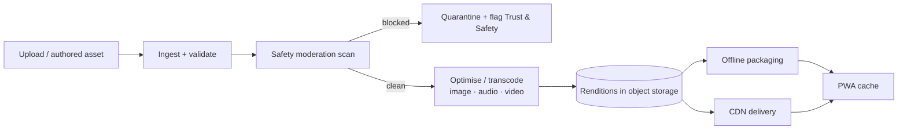

# 34 · Media Architecture

| | |
|---|---|
| **Document ID** | 34 |
| **Owner** | Principal Architect / Media Platform Lead |
| **Status** | Draft (Phase 1) |
| **Last updated** | 2026-07-19 |
| **Related** | [08 System Architecture](./08-system-architecture.md) · [33 Offline](./33-offline-architecture.md) · [10 API Design](./10-api-design.md) · [15 Child Safety](../03-security-privacy/15-child-safety-framework.md) · [04 NFR](../01-product/04-non-functional-requirements.md) · [36 Infrastructure](./36-infrastructure-architecture.md) |

## Purpose

This document defines the **Media context**: how images, audio, and (later) video are ingested,
moderated, optimised, packaged for offline, and delivered within strict data budgets to a low-end
Android phone on metered 3G. Media is a failure-isolated service ([08 §2.2](./08-system-architecture.md))
because transcode/packaging is CPU/IO-heavy and must never contend with the request path.

## Scope

In scope: media ingestion & upload, moderation hook, optimisation/transcoding, offline packaging,
delivery/CDN, and lifecycle/retention. Out of scope: the offline sync protocol ([33 Offline](./33-offline-architecture.md)),
child-safety policy ([15](../03-security-privacy/15-child-safety-framework.md)), and infra provisioning
([36 Infrastructure](./36-infrastructure-architecture.md)) — referenced.

---

## 1. Principles

1. **Every byte is metered money.** Media is optimised aggressively to fit lesson data budgets
   ([04 NFR DATA-02/03](../01-product/04-non-functional-requirements.md)).
2. **Nothing un-moderated reaches a child.** All AI output and user uploads pass safety moderation
   before delivery ([15 §4](../03-security-privacy/15-child-safety-framework.md), [FR-MED-004](../01-product/03-functional-requirements.md)).
3. **Degraded mode always exists.** No media feature ships without an audio/transcript/text fallback
   for poor links ([04 NFR DATA-06](../01-product/04-non-functional-requirements.md), [FR-MED-005](../01-product/03-functional-requirements.md)).
4. **Failure-isolated & queue-fed.** Heavy work runs on autoscaling workers off the request path
   ([08 §9.4](./08-system-architecture.md)).
5. **Deliver from the edge.** Optimised renditions are served from a CDN close to learners
   ([36 Infrastructure](./36-infrastructure-architecture.md)).

## 2. Media pipeline

- **Ingest** validates type/size, generates a media record ([09 §4](./09-database-design.md)), and
  emits `MediaIngested`.
- **Moderation** (automated classifiers + known-bad hashing; human review for edge cases) gates
  everything before any rendition is deliverable ([15 §4](../03-security-privacy/15-child-safety-framework.md));
  a hit quarantines and raises a flag.
- **Optimisation** produces device-appropriate renditions; `RenditionReady` signals availability.

## 3. Image optimisation

| Control | Rule |
|---|---|
| **Format** | Modern formats (WebP/AVIF) with fallback; content-hash URLs for long-cache. |
| **Resolution** | Responsive renditions sized to device; never ship a 4K image to a 360px screen. |
| **Compression** | Target ≤ 60 KB typical per image, hard cap enforced in the pipeline ([04 NFR DATA-03](../01-product/04-non-functional-requirements.md)). |
| **Lazy/priority** | Above-the-fold priority; the rest lazy-loaded; lite mode strips non-essential imagery ([04 NFR DATA-05](../01-product/04-non-functional-requirements.md)). |

## 4. Audio

- **Primary rich medium for low bandwidth** — audio explanations are far cheaper than video and
  effective for low-literacy learners.
- Efficient codecs, low-bitrate variants, and a **transcript** always available (accessibility +
  degraded mode) ([16 Accessibility](../04-design/16-accessibility-standards.md)).
- Packageable for offline ([33](./33-offline-architecture.md)).

## 5. Video (v1+)

- **Adaptive bitrate** with a **mandatory degraded-mode fallback** to audio+transcript on poor links
  — no video ships without it ([FR-MED-005](../01-product/03-functional-requirements.md)).
- Transcoded to a small ladder of resolutions/bitrates; lowest rung usable on the reference 3G
  baseline ([04 NFR COMPAT-01](../01-product/04-non-functional-requirements.md)).
- Captions/subtitles (Urdu-first) required for accessibility.

## 6. Offline packaging

- Builds a **verified offline package** of the renditions a day/week of lessons needs
  ([33 §4](./33-offline-architecture.md), [FR-MED-002](../01-product/03-functional-requirements.md)).
- **Lite variants by default**; the pack manifest carries checksums and a declared total size shown to
  the user before download ([04 NFR DATA-04](../01-product/04-non-functional-requirements.md)).
- Emits `OfflinePackageBuilt`.

## 7. Delivery

- **CDN + object storage**; signed/short-lived URLs for access-controlled assets ([13 §4](../03-security-privacy/13-security-model.md)).
- **Range requests** for audio/video; content-hash immutable URLs for cacheability
  ([10 §7](./10-api-design.md)).
- Delivery is **authorization-aware** — a child never receives an asset they cannot access
  ([12](../03-security-privacy/12-authorization-model.md)).

## 8. Uploads (child work)

- Child/Mentor uploads (photos/audio of work) go through the **same moderation gate** before any other
  user can see them ([15 §4](../03-security-privacy/15-child-safety-framework.md)).
- Uploads are size/type-validated, virus/known-bad scanned, and stored under the uploader's scope;
  EXIF/location metadata is stripped (privacy — [14](../03-security-privacy/14-privacy-model.md)).

## 9. Lifecycle & retention

- **Storage lifecycle policies** move cold renditions to cheaper tiers and expire derived artifacts
  ([04 NFR COST-04](../01-product/04-non-functional-requirements.md)).
- Retention aligns with privacy: user-uploaded child media follows the child-data retention/erasure
  rules ([14 §6](../03-security-privacy/14-privacy-model.md)).
- Generated report-card PDFs are stored per grading/reporting retention.

## 10. Risks

| # | Risk | Impact | Mitigation |
|---|---|---|---|
| R-1 | Un-moderated media reaches a child | Child safety | Moderation gate before any rendition is deliverable; quarantine on hit. |
| R-2 | Heavy transcode starves request path | Latency | Failure-isolated queue-fed workers ([08 §2.2](./08-system-architecture.md)). |
| R-3 | Oversized media blows data budget | Cost to family | Hard per-asset caps, lite-by-default, responsive renditions. |
| R-4 | Video with no degraded mode | Unreachable on 3G | Mandatory audio/transcript fallback gate. |
| R-5 | Upload EXIF leaks child location | Privacy/safety | Metadata stripping on ingest. |
| R-6 | Storage cost unbounded | Sustainability | Lifecycle tiering + retention expiry. |

---

## Open questions

- **Vector/thumbnail strategy** for authored curriculum imagery vs. photographic content.
- **Video pipeline build vs. managed** transcoding service under data-residency constraints
  ([36 Infrastructure](./36-infrastructure-architecture.md), [14 §10](../03-security-privacy/14-privacy-model.md)).
- **Moderation classifier choice** for images/audio and human-review staffing ([15](../03-security-privacy/15-child-safety-framework.md)).
- **Per-cohort pack size caps** aligned with real data affordability.

## Change log

| Date | Change | Author |
|---|---|---|
| 2026-07-19 | Initial media architecture: failure-isolated pipeline, moderation-first gate, image/audio/video optimisation with mandatory degraded mode, offline packaging, authorization-aware CDN delivery, upload handling, lifecycle/retention. | Media Platform Lead |
