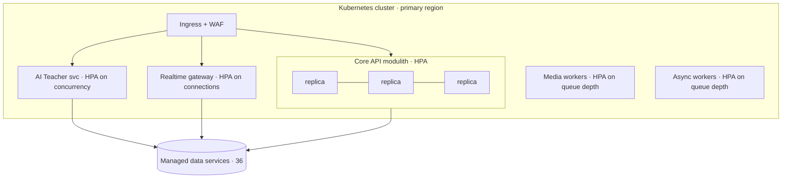

# 35 · Deployment Architecture

| | |
|---|---|
| **Document ID** | 35 |
| **Owner** | Head of Platform Engineering / SRE Lead |
| **Status** | Draft (Phase 1) |
| **Last updated** | 2026-07-19 |
| **Related** | [08 System Architecture](./08-system-architecture.md) · [36 Infrastructure](./36-infrastructure-architecture.md) · [37 CI/CD](../07-engineering/37-cicd-pipeline.md) · [38 Monitoring](../07-engineering/38-monitoring.md) · [04 NFR](../01-product/04-non-functional-requirements.md) · [13 Security](../03-security-privacy/13-security-model.md) |

## Purpose

This document defines **how Taleem is deployed, scaled, released, and kept resilient**: environments,
containerisation and orchestration, release strategy, scaling policy toward 1,000,000 students,
resilience/HA, disaster recovery, and rollback. It turns the architecture of [08](./08-system-architecture.md)
into an operable running system and meets the availability/reliability targets of
[04 NFR §7](../01-product/04-non-functional-requirements.md).

## Scope

In scope: environments, deploy topology, release & rollback strategy, autoscaling, resilience/HA, DR
(RPO/RTO). Out of scope: physical cloud/network provisioning ([36 Infrastructure](./36-infrastructure-architecture.md)),
the pipeline mechanics ([37 CI/CD](../07-engineering/37-cicd-pipeline.md)), and runtime observability
([38 Monitoring](../07-engineering/38-monitoring.md)) — referenced.

---

## 1. Principles

1. **Immutable, containerised deploys.** Every release is an immutable, signed image; no in-place
   mutation ([13 §8](../03-security-privacy/13-security-model.md)).
2. **IaC only.** All infrastructure and deploy config is code; no manual production changes
   ([04 NFR MNT-04](../01-product/04-non-functional-requirements.md)).
3. **Stateless compute, scale horizontally.** Replicas++ behind the ingress ([08 §9.1](./08-system-architecture.md)).
4. **Zero-downtime by default.** Rolling/blue-green with health gates; offline learners are never
   disrupted by a deploy ([04 NFR AVAIL-03](../01-product/04-non-functional-requirements.md)).
5. **Fail safe & degrade gracefully.** A dependency outage degrades a feature, never the core path
   ([04 NFR REL-03](../01-product/04-non-functional-requirements.md)).
6. **Region close to Pakistan.** Primary presence for latency + data residency
   ([14 §10](../03-security-privacy/14-privacy-model.md), [36](./36-infrastructure-architecture.md)).

## 2. Environments

| Env | Purpose | Data |
|---|---|---|
| **Local** | Dev; one-command bring-up (`make up`) ([04 NFR MNT-03](../01-product/04-non-functional-requirements.md)) | Synthetic |
| **CI** | Automated tests/gates ([37](../07-engineering/37-cicd-pipeline.md)) | Ephemeral |
| **Staging** | Prod-like; pre-release verification, DAST, load tests | Synthetic / anonymised |
| **Production** | Live | Real (encrypted, residency-bound) |

Environment parity (12-Factor X); config differs only by environment variables/secrets.

## 3. Deploy topology

- **Kubernetes-ready** orchestration ([Authoring Brief §4](../_meta/authoring-brief.md)); each
  deployable has resource requests/limits, liveness/readiness probes, and a PodDisruptionBudget.
- **Separately scaled deployables** for the failure-isolated services ([08 §2.2](./08-system-architecture.md)):
  core API, AI Teacher, realtime gateway, media/async workers.

## 4. Release strategy

| Mechanism | Use |
|---|---|
| **Rolling update** | Default for stateless services; surge + health-gated. |
| **Blue-green / canary** | High-risk releases; shift a small traffic slice, watch SLOs, then ramp ([38](../07-engineering/38-monitoring.md)). |
| **Feature flags** | Decouple deploy from release; gradual per-cohort rollout ([FR-ADM-001](../01-product/03-functional-requirements.md)). |
| **DB migrations** | Expand/contract, online, backward-compatible ([09 §10](./09-database-design.md)). |
| **Rollback** | One-command rollback to the previous immutable image; migrations designed reversible/compatible. |

**Progressive delivery:** deploy dark → flag on for a pilot cohort → observe → ramp. Any SLO breach or
error-budget burn auto-halts the ramp.

## 5. Scaling policy (toward 1M)

- **Autoscaling signals:** CPU + in-flight requests (core), connection count (realtime), queue depth
  (workers), concurrency (AI Teacher) ([08 §9.1](./08-system-architecture.md)).
- **Read replicas** absorb read-heavy learning traffic ([09 §8](./09-database-design.md)).
- **Queue-based load leveling** absorbs national spikes (exam day) as depth, not errors
  ([08 §9.4](./08-system-architecture.md)).
- **Capacity model documented**; no component caps below 1M without a shard/partition plan
  ([04 NFR SCAL-02](../01-product/04-non-functional-requirements.md)).
- **Scale-to-need** (cost): scale down at low load; no idle over-provisioning ([04 NFR COST-03](../01-product/04-non-functional-requirements.md)).

## 6. Resilience & HA

- **No SPOF on the core path** ([04 NFR REL-04](../01-product/04-non-functional-requirements.md)):
  multi-AZ, ≥2 replicas per critical service, managed multi-AZ data services.
- **Bulkheads** (separate worker pools/queues), **circuit breakers** around LLM/SMS/push,
  **timeouts + retries with jitter**, **dead-letter queues** ([08 §9.4](./08-system-architecture.md)).
- **Graceful degradation matrix:**

| Dependency down | Behaviour |
|---|---|
| LLM provider | AI Teacher degrades to cached hints; lessons/assessment unaffected ([15](../03-security-privacy/15-child-safety-framework.md)). |
| Realtime gateway | Client falls back to REST long-poll / non-streamed AI ([08 §8](./08-system-architecture.md)). |
| Search | Browse/timetable still work; search shows a graceful message. |
| SMS/push | Notifications queue + retry; critical messages fall back across channels ([FR-ENG-005](../01-product/03-functional-requirements.md)). |

## 7. Disaster recovery

| Target | Value | Mechanism |
|---|---|---|
| **RPO** | ≤ 5 min | Continuous backup / streaming replication ([04 NFR REL-01](../01-product/04-non-functional-requirements.md)). |
| **RTO** | ≤ 30 min core path | Automated restore + runbook + regular DR drills ([04 NFR REL-02](../01-product/04-non-functional-requirements.md)). |
| **Backups** | Encrypted, tested, PITR | Restore tested regularly; erasure-aware ([14 §6](../03-security-privacy/14-privacy-model.md)). |

DR drills (game-days) validate RTO/RPO and the runbooks; results feed improvements.

## 8. Deploy-time security

- **Signed images + provenance/attestation**; no critical vulns ship ([13 §8](../03-security-privacy/13-security-model.md)).
- **Secrets from a managed store at runtime**, never baked into images ([13 §7](../03-security-privacy/13-security-model.md)).
- **Least-privilege workload identities**; network policies default-deny ([36](./36-infrastructure-architecture.md)).

## 9. Risks

| # | Risk | Impact | Mitigation |
|---|---|---|---|
| R-1 | Deploy disrupts offline learners | Learning interrupted | Backward-compatible APIs + offline queue tolerant of N-version skew ([33](./33-offline-architecture.md)). |
| R-2 | Bad release reaches all users | Outage | Canary + SLO auto-halt + one-command rollback. |
| R-3 | Migration locks large table | Downtime | Expand/contract, online DDL ([09 §10](./09-database-design.md)). |
| R-4 | Region failure | Availability loss | Multi-AZ HA + tested DR; multi-region roadmap ([36](./36-infrastructure-architecture.md)). |
| R-5 | Autoscaling lag on spike | Errors under load | Queue leveling + pre-scaling for known events + headroom. |

---

## Open questions

- **Managed Kubernetes vs. lighter orchestration** for early cost — decide with [36](./36-infrastructure-architecture.md).
- **Multi-region topology & timing** (active-passive → active-active) and cohort/region pinning
  ([08 open Qs](./08-system-architecture.md)).
- **Canary automation** tooling and SLO auto-halt thresholds ([38](../07-engineering/38-monitoring.md)).

## Change log

| Date | Change | Author |
|---|---|---|
| 2026-07-19 | Initial deployment architecture: environments, containerised K8s topology, progressive release & rollback, scaling policy toward 1M, resilience/HA & degradation matrix, DR (RPO≤5m/RTO≤30m), deploy-time security. | Head of Platform Eng / SRE |
