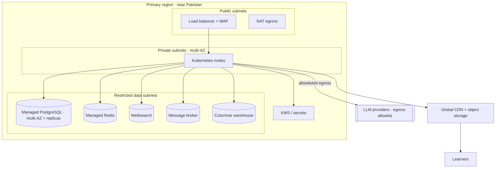

# 36 · Infrastructure Architecture

| | |
|---|---|
| **Document ID** | 36 |
| **Owner** | Head of Platform Engineering / Cloud Architect |
| **Status** | Draft (Phase 1) |
| **Last updated** | 2026-07-19 |
| **Related** | [08 System Architecture](./08-system-architecture.md) · [35 Deployment](./35-deployment-architecture.md) · [13 Security](../03-security-privacy/13-security-model.md) · [14 Privacy](../03-security-privacy/14-privacy-model.md) · [37 CI/CD](../07-engineering/37-cicd-pipeline.md) · [38 Monitoring](../07-engineering/38-monitoring.md) · [04 NFR](../01-product/04-non-functional-requirements.md) |

## Purpose

This document defines the **physical/cloud infrastructure** underneath Taleem: compute, network,
managed data services, CDN/edge, secrets/KMS, infrastructure-as-code, data residency, and multi-region
posture. It provisions what [35 Deployment](./35-deployment-architecture.md) runs on and enforces the
security ([13](../03-security-privacy/13-security-model.md)) and privacy/residency ([14](../03-security-privacy/14-privacy-model.md))
requirements at the infrastructure layer.

## Scope

In scope: cloud topology, network segmentation, compute, managed data stores, CDN/edge, secrets/KMS,
IaC, residency, and multi-region roadmap. Out of scope: application deploy/release ([35](./35-deployment-architecture.md)),
app-level security controls ([13](../03-security-privacy/13-security-model.md)) — provisioned here,
governed there.

---

## 1. Principles

1. **Everything as code.** All infra is Terraform-managed, reviewed, and drift-detected — no click-ops
   ([04 NFR MNT-04](../01-product/04-non-functional-requirements.md)).
2. **Least privilege & default-deny network.** Private subnets, default-deny security groups, no direct
   public access to data ([13 §4](../03-security-privacy/13-security-model.md)).
3. **Managed where it reduces risk.** Prefer managed, multi-AZ data services over self-run at Phase 1
   scale; keep portability via open engines (Postgres, Redis, S3-compatible).
4. **Residency close to Pakistan.** Primary region for latency + data-protection posture
   ([14 §10](../03-security-privacy/14-privacy-model.md)).
5. **Cost-aware & elastic.** Right-sized, autoscaling, lifecycle-tiered storage ([04 NFR COST](../01-product/04-non-functional-requirements.md)).
6. **Portable & open.** Open engines and Kubernetes keep us cloud-portable; no lock-in that caps
   residency or cost choices.

## 2. Cloud topology

## 3. Network segmentation

| Zone | Contents | Access |
|---|---|---|
| **Public** | Load balancer, WAF, NAT | Internet-facing; TLS termination + WAF ([13 §4](../03-security-privacy/13-security-model.md)) |
| **Private app** | Kubernetes nodes / pods | No public IPs; egress via NAT allowlist |
| **Restricted data** | Postgres, Redis, broker, warehouse | Reachable only from app zone; no public route |
| **Safeguarding** | C4 data path | Strictest controls, isolated access ([15](../03-security-privacy/15-child-safety-framework.md)) |

- **Default-deny** security groups / network policies; explicit allowlists between zones.
- **mTLS or gateway-terminated internal encryption** in the app zone ([13 §6](../03-security-privacy/13-security-model.md)).
- **AI egress** only from the AI Teacher gateway to allowlisted provider endpoints ([13 §4](../03-security-privacy/13-security-model.md)).

## 4. Compute

- **Kubernetes** cluster, multi-AZ node groups; autoscaling node pools sized to workload class
  (general, memory-heavy realtime, CPU-heavy media) ([35 §5](./35-deployment-architecture.md)).
- Resource requests/limits, probes, and PodDisruptionBudgets per deployable.
- Spot/preemptible capacity for stateless batch workers where safe (cost).

## 5. Managed data services

| Service | Choice | HA |
|---|---|---|
| **PostgreSQL** | Managed, multi-AZ, primary + read replicas, PITR ([09](./09-database-design.md)) | Auto-failover |
| **Redis** | Managed, HA | Replica failover |
| **Meilisearch** | Managed/self-hosted, replicated ([32 Search](./32-search-architecture.md)) | Multi-instance |
| **Message broker** | Log-based or JetStream (Open Q) | Replicated |
| **Object storage** | S3-compatible, lifecycle-tiered, versioned | Region-redundant |
| **Warehouse** | ClickHouse-compatible ([31 Analytics](../06-portals/31-analytics-platform.md)) | Replicated |

## 6. CDN & edge

- **Global CDN** for static assets, media renditions, and cacheable API responses; edges near learners
  cut latency and data cost ([04 NFR PERF/DATA](../01-product/04-non-functional-requirements.md)).
- Content-hash immutable URLs, long TTL, Brotli/gzip; signed URLs for access-controlled media
  ([34 Media §7](./34-media-architecture.md)).

## 7. Secrets & key management

- **KMS/HSM-backed** keys; envelope encryption for sensitive fields ([13 §6](../03-security-privacy/13-security-model.md)).
- **Managed secret store**; runtime injection; automatic rotation; per-environment/per-data-class key
  separation.
- CI **secret-scanning** prevents leakage into code/images ([37 CI/CD](../07-engineering/37-cicd-pipeline.md)).

## 8. Infrastructure as code

- **Terraform** modules per environment; state remote + locked; changes via PR + plan review + apply in
  CI ([04 NFR MNT-04](../01-product/04-non-functional-requirements.md)).
- **Drift detection** alerts on manual changes; production is reconciled to code.
- Reusable modules keep environments consistent (parity).

## 9. Data residency & multi-region

- **Primary region close to Pakistan**; data classes that cannot lawfully leave the region are pinned
  ([14 §10](../03-security-privacy/14-privacy-model.md)).
- **Cross-border transfers** (e.g. LLM inference regions) are minimised, documented, and use
  minimal/pseudonymised data ([14 §8/§10](../03-security-privacy/14-privacy-model.md)).
- **Multi-region roadmap:** start multi-AZ single-region HA; evolve to active-passive then evaluate
  active-active with cohort/region pinning ([35 §7](./35-deployment-architecture.md), [08 open Qs](./08-system-architecture.md)).

## 10. Observability & backup infra

- Provisioning for metrics, logs, traces, and dashboards/alerting ([38 Monitoring](../07-engineering/38-monitoring.md),
  [39 Logging](../07-engineering/39-logging.md)).
- Encrypted, tested backups with PITR; DR restore paths ([35 §7](./35-deployment-architecture.md)).

## 11. Risks

| # | Risk | Impact | Mitigation |
|---|---|---|---|
| R-1 | Data store publicly reachable | Breach | Restricted subnets, default-deny, no public route. |
| R-2 | Residency violation via managed service region | Compliance breach | Region-pinned services, documented transfers, class-based pinning. |
| R-3 | IaC drift / click-ops | Inconsistent, insecure infra | Terraform + drift detection + PR-only changes. |
| R-4 | Cloud lock-in caps residency/cost options | Strategic risk | Open engines + Kubernetes portability. |
| R-5 | Key/secret compromise | Data exposure | KMS/HSM, rotation, per-class keys, least privilege. |
| R-6 | Single-region outage | Availability | Multi-AZ HA now; multi-region roadmap. |

---

## Open questions

- **Cloud provider(s)** with a compliant region near Pakistan and the right managed services — an ADR
  ([adr/](./adr/)).
- **Broker technology** ([08 open Qs](./08-system-architecture.md)).
- **Managed vs. self-hosted Meilisearch/warehouse** at target scale and cost.
- **LLM inference residency** — in-region options vs. cross-border with minimised data
  ([14 O-3](../03-security-privacy/14-privacy-model.md)).

## Change log

| Date | Change | Author |
|---|---|---|
| 2026-07-19 | Initial infrastructure architecture: cloud topology, network segmentation, compute, managed data services, CDN/edge, secrets/KMS, Terraform IaC, data residency & multi-region roadmap. | Head of Platform Eng / Cloud Architect |
