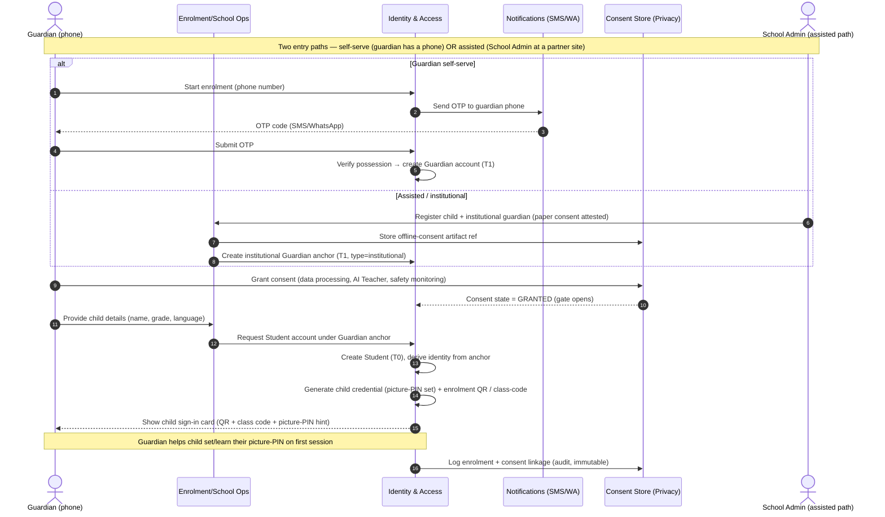
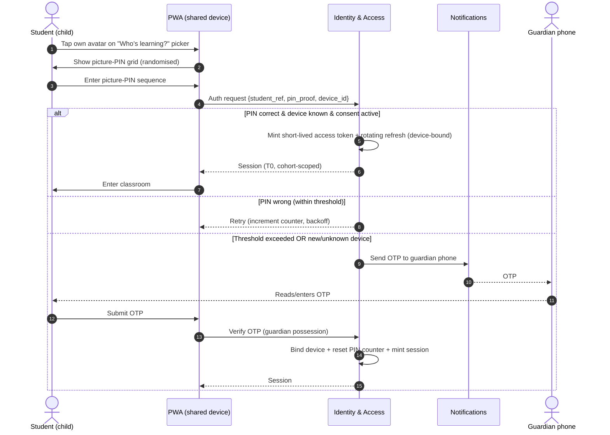
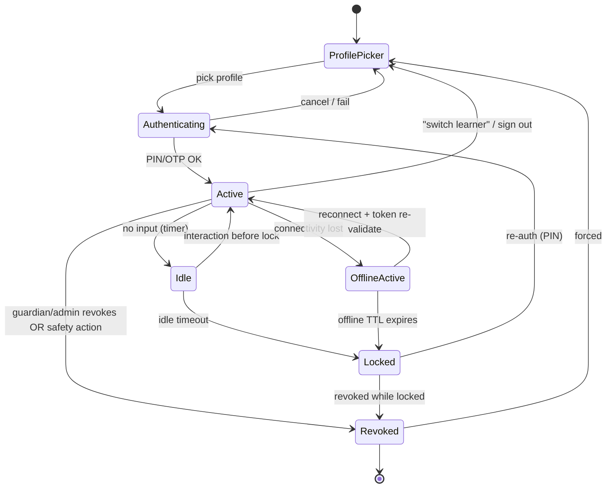

# 11 · Authentication Strategy

| | |
|---|---|
| **Document ID** | 11 |
| **Owner** | CISO / Head of Identity & Access |
| **Status** | Draft (Phase 1) |
| **Last updated** | 2026-07-19 |
| **Related** | [12 Authorization](12-authorization-model.md) · [13 Security Model](13-security-model.md) · [14 Privacy](14-privacy-model.md) · [15 Child Safety](15-child-safety-framework.md) · [08 System Architecture](../02-architecture/08-system-architecture.md) · [33 Offline Architecture](../02-architecture/33-offline-architecture.md) · [24 AI Teacher](../05-education/24-ai-teacher-specification.md) |

## Purpose

This document defines **how every actor proves who they are** to Project Taleem — with the central,
hard problem front and centre: authenticating **children** who frequently have no phone, no email, no
government ID, low literacy, and a **shared** device. It fixes the account model (guardian-anchored),
the child sign-in methods, session handling on shared devices, passwordless recovery, elevated
authentication for adults with power over children, and the token, device-binding, and abuse-defence
strategy that ties it together.

## Scope

**In scope:** identity proofing tiers, enrolment and consent anchoring, child login methods, session
lifecycle on shared/offline devices, credential recovery without email, mentor/admin/staff MFA, token
and refresh strategy, device binding, and brute-force / abuse protection. **Out of scope:** *what* an
authenticated actor may do (owned by [12 Authorization](12-authorization-model.md)), the wider threat
model and crypto/key management (owned by [13 Security Model](13-security-model.md)), and consent
*lawful basis and lifecycle* (owned by [14 Privacy](14-privacy-model.md) — referenced here, not
redefined). Owning service: **Identity & Access** (service #1 in the canonical map).

---

## 1. Principles (authentication-specific)

These specialise the vision's non-negotiables (principles 1, 4, 5) and the brief's "security by
default" for the auth surface.

1. **A child must never be blocked from school by a credential they cannot own.** No email, no
   personal phone, no ID, and no literacy are all *expected* states, not error states. Every child
   sign-in path must work for a 6-year-old on a borrowed phone.
2. **The guardian is the anchor of trust, the child is the learner.** Legal identity, consent, and
   recovery authority live with the **Guardian**; day-to-day low-friction access lives with the
   **Student**. We separate *consent authority* from *daily authenticator*.
3. **Assurance scales with power over children.** A 7-year-old logging in with a picture-PIN and a
   Safety Officer who can read safeguarding disclosures are not authenticated the same way. Higher
   privilege ⇒ strictly stronger authentication (MFA mandatory for all staff/adult privileged roles).
4. **Shared devices are the default, not the exception.** Sessions must be short, explicitly
   attributable, fast to switch, and never silently persist one child's identity into another child's
   session.
5. **Passwordless-first.** Passwords are a fallback for adults, never the primary child mechanism.
   Knowledge factors a child cannot reliably remember or type are a barrier, not a control.
6. **Offline must still be authenticated.** A child on 4 hours of power learning offline still has an
   attributable, revocable session (see [33 Offline Architecture](../02-architecture/33-offline-architecture.md)).
7. **Least data to authenticate.** We do not collect a child's biometrics, government ID, or precise
   location to log them in. Minimal-data authentication is a privacy control (see [14](14-privacy-model.md)).

---

## 2. Identity assurance tiers (decision)

We define four **Identity Assurance Levels (IAL)** and four **Authenticator Assurance Levels (AAL)**,
loosely mapped to NIST SP 800-63 vocabulary but deliberately relaxed on *proofing* for children and
*strengthened* on *authenticators* for adults. **Assurance is a property of the session, evaluated at
the Policy Decision Point** (see [12](12-authorization-model.md)), not a static account attribute.

| Tier | Actor | Identity proofing (IAL) | Authenticator (AAL) | Rationale |
|---|---|---|---|---|
| **T0 — Child, low-friction** | Student | IAL0: none direct; identity **derived** from guardian anchor + enrolment record | AAL1: single factor (picture-PIN, class-code, guardian-OTP-issued session) | A child cannot self-prove; friction must be near-zero. Power is minimal and cohort-scoped. |
| **T1 — Guardian** | Guardian | IAL1: self-asserted + phone-number possession (OTP) | AAL1→AAL2: phone possession; step-up OTP for sensitive actions | Guardian holds consent + recovery authority; phone is the realistic possession factor in Pakistan. |
| **T2 — Mentor** | Mentor | IAL2: identity verified during vetting (CNIC check, human onboarding — see [15](15-child-safety-framework.md) §mentor vetting) | AAL2 **mandatory MFA**: password + TOTP/passkey | Mentors have access to many children; compromise is a safeguarding event. |
| **T3 — Staff / privileged** | School Admin, Platform Admin, Safety Officer, Curriculum Architect | IAL2 + HR onboarding | AAL3: password + **phishing-resistant** factor (WebAuthn/passkey, hardware where feasible); Safety Officers additionally hardware-key-gated | Highest blast radius; Safety Officers read the most sensitive child data on the platform. |

**Decision:** child identity is **derived, not proofed**. The child's real-world identity assurance is
inherited transitively from the guardian's consent act and the school admin's enrolment act. This is
the only workable model for the target learner and is the single most important auth decision in the
document.

---

## 3. Account & consent anchoring model

### 3.1 The guardian anchor (decision)

Every **Student** account is created under, and permanently linked to, at least one **Guardian**
anchor. A student account **cannot exist without an active guardian consent record** (see
[14 Privacy §consent](14-privacy-model.md)). The guardian relationship is the root of:

- **Consent** — lawful basis to process the child's data (Privacy owns the record; Identity enforces
  the gate).
- **Recovery** — the guardian's possession factor (phone/OTP) is the child's account-recovery path.
- **Oversight** — guardian visibility into the child's activity (Parent Portal, doc 25).

**One guardian may anchor many students** (siblings). **A student may have more than one guardian**
(mother + father, or guardian + school-sponsor guardian for orphan/displaced children). A
**relationship record** (`guardian_id ↔ student_id`, role, consent state, verified-at) is the
authoritative link and is the substrate for relationship-based authorization in [12](12-authorization-model.md).

### 3.2 The delegated / institutional guardian (decision)

Many target children have no literate, phone-owning parent. We must not exclude them.

- **School-sponsored guardianship:** where a partner NGO/school enrols a cohort of children (e.g. an
  orphanage, a displaced-persons camp), a **School Admin** may act as the **institutional guardian of
  record**, subject to documented offline consent (paper consent captured and attested — see
  [14](14-privacy-model.md)). This is a distinct `guardian_type = institutional` with its own audit
  and cannot be silently converted to a personal guardian.
- **Shared guardian phone:** one phone number may anchor multiple guardians only via distinct
  guardian accounts, never by conflating two adults on one identity.

**Open question (O-1):** legal sufficiency of institutional consent under Pakistani PDPB — flagged to
Privacy Counsel; treat as planning assumption until confirmed.

---

## 4. Enrolment & consent flow (the trust-establishing act)

Enrolment is where identity assurance is *minted*. It is deliberately the highest-friction moment so
that everyday login can be the lowest.

**Decisions embedded above:**

- **Consent gates account activation.** The Student account is created but **inactive** until the
  linked consent record is `GRANTED`. No lessons, no AI Teacher, no data collection beyond the minimum
  needed to hold the pending record. (Privacy owns state machine; Identity enforces the gate at PDP.)
- **Enrolment artifacts are printable/offline-usable.** The child sign-in card (QR + human-readable
  class code + picture-PIN) works when a guardian later hands the phone to the child with no
  connectivity.
- **The child never types an email or password to enrol.** Ever.

---

## 5. Child sign-in methods (the core problem)

We support a **portfolio** of child authenticators; a school/cohort configures which are enabled.
All are AAL1 by design — the child's *power* is minimal and cohort-scoped, so the risk of AAL1 is
bounded by authorization, not by the authenticator.

| Method | How it works | Best for | Trade-off / risk | Mitigation |
|---|---|---|---|---|
| **Picture-PIN** | Child selects an ordered sequence of 3–4 pictures (animals, fruit) from a randomised grid; stored as a salted hash of the sequence. | Ages 5–9, low literacy. | Shoulder-surfing; guessable if grid small. | Randomise grid position each render; rate-limit (§10); short offline TTL; no high-value authz. |
| **Numeric/pattern PIN** | 4–6 digit PIN or 3×3 pattern. | Ages 9+, comfortable with numbers. | Common PINs (1234). | Ban top-N PINs; lockout backoff. |
| **Guardian phone + OTP** | Child login initiated on device; OTP sent to **guardian's** phone; guardian reads it to child or enters it. | First login on a new device; recovery; children with no memorable secret. | Depends on guardian availability + connectivity. | Falls back to class-code; OTP cached for offline pre-provisioning where policy allows. |
| **QR / class-code enrolment** | Mentor/School Admin displays a rotating cohort QR or short class code; child scans/enters to join a session on a managed device. | Classroom / community-centre managed devices; bulk onboarding. | A leaked code lets an outsider join a cohort session. | Codes are short-lived (rotating), cohort-scoped, and yield only a **provisional** session pending picture-PIN confirmation. |
| **Offline session token** | A pre-provisioned, device-bound, time-boxed token lets a known child resume school with no network. | Intermittent-power / no-signal learning. | Token theft on a lost device. | Device-bound (§8), short TTL, encrypted at rest, revocable on next sync. |

**Explicit non-choices:** no biometrics for children (privacy + consent + device reality); no
email/password for children (literacy + no email); no SMS OTP to the *child* (children lack phones);
no security questions (literacy + guessability).

### 5.1 Child login flow

**Decision:** an **unknown device** for a child *always* escalates to the guardian-OTP possession
factor before a session is minted. This turns the low-strength picture-PIN into an effectively
two-factor flow the moment context is unusual (new device, geo shift, post-lockout), without adding
friction on the child's normal, known device.

---

## 6. Session management on shared devices

The shared low-end Android phone is the design centre. Session handling must assume the *next* person
to touch the screen is a different child, a sibling, or a parent.

**Decisions:**

- **"Who's learning?" profile picker** is the entry surface on any device with more than one known
  profile — an OS-style multi-profile chooser using avatars, not typed usernames.
- **Short foreground sessions.** Child access tokens are short-lived (target **15 min**, planning
  assumption; tuned in [13](13-security-model.md)); refresh tokens are longer but **device-bound and
  rotating** (§7).
- **Fast, explicit switch and lock.** A prominent "I'm done / switch learner" control ends the session
  and returns to the picker. Inactivity auto-locks to the picker (target **10 min** idle for children,
  shorter on assisted classroom devices).
- **No cross-profile bleed.** Each profile's tokens, cache, offline content, and AI Teacher transcript
  are namespaced per `student_ref`; a switch never exposes another child's state. Storage is per-profile
  encrypted (key derived per profile — see [13](13-security-model.md) §key management).
- **Device trust ≠ session trust.** A device can be *known/bound* (so PIN-only login is allowed) while
  each *session* remains short and independently revocable.
- **Guardian and child never share a live session.** Guardian actions (consent changes, viewing report
  cards, managing children) require a *distinct guardian session* (T1), even on the same phone, reached
  via the guardian's own OTP-backed sign-in.

### 6.1 Session state machine

---

## 7. Token strategy

**Decision:** stateless short-lived **access tokens (JWT)** + stateful, rotating **refresh tokens**,
with a server-side session/revocation registry in Redis (see brief §4 data). We do **not** rely on JWT
alone for anything revocable.

| Token | Type | Lifetime (planning assumption) | Storage | Notes |
|---|---|---|---|---|
| **Access token** | Signed JWT (asymmetric, rotating signing keys) | Child 15 min · Guardian 30 min · Staff 10 min | In-memory / non-persistent web storage; never localStorage for staff | Carries `sub`, role, tenancy scope, cohort claims, `aal`, `device_id`, `sid`. Verified at every service edge. |
| **Refresh token** | Opaque, high-entropy, single-use | Child 30 days (device-bound) · Guardian 30 days · Staff 8 hours | HttpOnly, Secure, SameSite cookie (web) / secure keystore (PWA) | **Rotating**: each use issues a new refresh + invalidates the prior. Reuse of a rotated token ⇒ **breach signal → revoke session family**. |
| **Offline session token** | Signed, device-bound, capability-limited | ≤ 24–72h configurable per cohort | Encrypted at rest on device | Grants only cached-lesson + queued-submission scope; cannot mutate grades or read cross-child data. Reconciled on sync. |
| **Step-up / action token** | Short-lived, single-purpose | ≤ 5 min | Memory | Minted after fresh OTP/MFA for sensitive actions (consent change, mentor grade override, safety data access). |

**Rotation & revocation decisions:**

- **Signing keys rotate** on a schedule with overlapping validity (JWKS); compromise of one key does
  not require global logout. Key management owned by [13](13-security-model.md).
- **Refresh-token reuse detection** is mandatory: a replayed (already-rotated) refresh token invalidates
  the whole token family and raises a security event (§10, and [13](13-security-model.md) §audit).
- **Global and targeted revocation:** the session registry supports "revoke this session", "revoke all
  sessions for this student", and "revoke by device" — needed for lost devices and for safety-driven
  account holds initiated from Trust & Safety (see [15](15-child-safety-framework.md)).
- **Claims are minimal.** No PII in JWT beyond opaque `sub`/`student_ref`; names, guardian phone, etc.
  are never in the token (privacy — [14](14-privacy-model.md)).

---

## 8. Device binding

**Decision:** child PIN-only login is permitted **only on a device bound to that child's profile**;
binding is what makes low-strength authenticators safe.

- On first successful full auth (enrolment card or guardian-OTP), the device is issued a **device
  identity**: a keypair generated in the device keystore (WebAuthn/`navigator.credentials` where
  available; software-keystore fallback for low-end Android WebViews). The public key + a coarse device
  fingerprint register as a **known device** for that profile.
- Refresh and offline tokens are **cryptographically bound** to the device key (proof-of-possession);
  a token exported to another device fails binding validation.
- **Unbinding** happens on: guardian "remove device", admin action, lost-device report, or long
  inactivity. A managed classroom device can be bound to *many* child profiles (shared-device mode) but
  each binding is independent and independently revocable.
- Binding is **advisory context, not sole trust** for adults — staff always additionally present MFA;
  device binding merely reduces MFA prompts on recognised staff devices, never replaces the factor.

---

## 9. Recovery flows without email

No child, and many guardians, will have email. Recovery is therefore **relationship-** and
**possession-**based, never email-based.

| Who lost access | Recovery path | Fallback |
|---|---|---|
| **Child forgot picture-PIN** | Guardian-OTP flow re-authenticates and lets the child (with guardian help) set a new PIN. | On managed device, a **Mentor/School Admin** can trigger a supervised PIN reset that still notifies the guardian. |
| **Child on a new/replacement device** | Enrolment QR/class-code + guardian-OTP re-binds. | Institutional guardian (School Admin) re-issues sign-in card. |
| **Guardian lost phone (new number)** | Identity-verification via School Admin (assisted) OR secondary guardian confirmation OR knowledge of enrolment details + child's cohort; number change is a **sensitive, audited** event with a cool-down. | Institutional path: School Admin re-verifies against enrolment record. |
| **Guardian lost phone (same number, new SIM)** | Standard OTP to the same number. | — |
| **Mentor/Staff** | Standard enterprise recovery: verified identity + admin-issued MFA re-enrolment; **never** self-serve email reset. | Break-glass via Platform Admin with dual-control (two-person) approval, fully audited. |

**Decisions:**

- **Guardian phone-number change is the single most sensitive recovery event** (it can hand a child's
  account to a new person). It requires either assisted verification or multi-signal confirmation, a
  **cool-down window** during which both old and new numbers are notified, and an immutable audit entry.
  This is a deliberate anti-account-takeover / anti-grooming control (see [15](15-child-safety-framework.md)).
- **No knowledge-only recovery** (no "mother's maiden name"). Recovery is always tied to a possession
  factor or an in-person/attested assisted flow.

---

## 10. Abuse, brute-force & bot protection

Because child authenticators are intentionally low-entropy, **the compensating control is the
authentication *system*, not the secret.**

**Decisions:**

- **Rate limiting + exponential backoff** per identity, per device, and per IP on all auth endpoints
  (Redis-backed; see [13](13-security-model.md) §rate limiting). Child PIN attempts: small burst then
  backoff then escalate to guardian-OTP — **never a hard permanent lockout of a child** (a locked-out
  child is a child denied school). Lockout for children means "escalate to guardian-OTP", not "denied".
- **Progressive challenge for adults:** staff/guardian endpoints add CAPTCHA/PoW and, on anomaly,
  device-attestation checks.
- **OTP hardening:** rate-limited issuance, single-use, short TTL, per-number and per-IP caps to prevent
  SMS-pumping/toll-fraud; delivered via Notifications (doc 30) with fraud monitoring.
- **Credential-stuffing defence:** breach-password screening for adult passwords; child PINs are
  per-profile and device-bound, so stuffing has little surface.
- **Enumeration resistance:** uniform responses and timing on "does this account exist"; profile pickers
  never reveal other children's names to an unauthenticated viewer beyond the device's own bound
  profiles.
- **Anomaly signals feed the session risk score** (new device, geo/velocity impossibility, refresh
  reuse, mass class-code entry) → step-up or hold. High-severity auth anomalies raise events to Trust &
  Safety and Security (see [13](13-security-model.md) §incident response, [15](15-child-safety-framework.md)).
- **Class-code abuse:** rotating, cohort-scoped, low-value provisional sessions; bulk redemption from
  one IP throttled and flagged.

---

## 11. Mentor, admin & staff authentication (elevated)

Adults with power over children are the highest-value target. **MFA is mandatory and non-optional.**

- **Mentor (T2):** password (breach-screened, strong) **+** TOTP or passkey. Session 8h max, re-auth for
  sensitive actions (human grade override, viewing a child's transcript, messaging a child). Identity
  verified during safeguarding vetting ([15](15-child-safety-framework.md)).
- **Staff / Safety Officer / Platform & School Admin (T3):** password **+ phishing-resistant WebAuthn
  passkey/hardware key** (AAL3). **Safety Officers** — who read the platform's most sensitive
  safeguarding data — are additionally gated behind hardware-key and, for the most sensitive record
  classes, **dual-control** (two-person access) and just-in-time elevation.
- **No shared staff accounts, ever.** Every privileged action is attributable to a natural person.
- **Session step-up:** all destructive/child-impacting admin actions require a fresh MFA step-up token
  (§7), regardless of session age.
- **Just-in-time / break-glass:** standing admin privilege is minimised; elevation is time-boxed,
  reason-logged, and reviewed (aligns with least-privilege in [12](12-authorization-model.md) and
  audit in [13](13-security-model.md)).

---

## 12. Enforcement across services (how auth plugs into the system)

- **Identity & Access** is the sole issuer/verifier of tokens and the owner of the session registry.
- Every other service is a **resource server**: it validates the access-token signature (JWKS), checks
  `aal`/scope/`device_id`, and delegates the *authorization* decision to the PDP described in
  [12 Authorization](12-authorization-model.md). Authentication answers *who*; authorization answers
  *may they*. Services never re-implement either.
- The **API gateway / BFF** performs first-line token validation, revocation-registry checks, and rate
  limiting before requests reach a service (defence in depth — [13](13-security-model.md)).
- **AI Teacher** (doc 24) receives the authenticated, scoped identity as context; it can never elevate
  privilege and every AI session is bound to the authenticated child session for transcript
  attribution and safety ([15](15-child-safety-framework.md)).
- **WebSocket/realtime** connections authenticate with the same access token at handshake and re-check
  on token refresh; a revoked session drops the socket.

---

## 13. OWASP ASVS alignment (authentication chapter)

Target **ASVS L2** for the auth verticals (V2 Authentication, V3 Session Management, partial V6
credential storage). Highlights of how we meet or *intentionally adapt* the standard for child users:

| ASVS area | Standard expectation | Taleem decision |
|---|---|---|
| Password strength (V2.1) | Long passwords, breach-checked | Applies to **adults**; children use device-bound low-entropy authenticators compensated by binding + escalation. Documented deviation. |
| MFA (V2.8) | MFA for privileged | Mandatory T2/T3; risk-based step-up (guardian-OTP) for children on anomaly. |
| Credential storage (V2.4/V6) | Salted, strong KDF hashing | PINs/patterns stored as salted strong-KDF hashes; no reversible storage. |
| Session tokens (V3) | Secure, rotated, revocable, short-lived | Rotating device-bound refresh + short JWT + revocation registry. |
| Session termination (V3.3) | Logout + idle + absolute timeouts | Profile-switch, idle-lock, absolute expiry, offline TTL. |
| Recovery (V2.5) | No insecure knowledge-based recovery | Possession/relationship-based; no security questions. |

Full ASVS control mapping is consolidated in [13 Security Model](13-security-model.md).

---

## 14. Risks

| # | Risk | Impact | Mitigation |
|---|---|---|---|
| R-1 | Shared device → wrong child attributed / data bleed | Wrong grades, privacy breach | Per-profile namespacing + encryption, profile picker, short sessions, idle lock. |
| R-2 | Guardian phone-number takeover → child account hijack (grooming vector) | Critical child-safety | Sensitive audited number-change flow, cool-down, dual-notify, assisted verification. |
| R-3 | Low-entropy child PIN guessed on a bound device by a household member | Session misuse | Bounded authz (T0 is cohort-scoped, no sensitive data), backoff, escalation, guardian oversight. |
| R-4 | OTP SMS-pumping / toll fraud | Cost + DoS | Issuance rate limits, per-number/IP caps, fraud monitoring (doc 30). |
| R-5 | Lost/stolen bound device with offline token | Unauthorized offline access | Short offline TTL, device-bound crypto, remote revoke on next sync, encrypted-at-rest cache. |
| R-6 | Staff credential phishing | Mass child-data exposure | Phishing-resistant WebAuthn (AAL3), Safety-Officer hardware keys + dual control. |
| R-7 | Institutional-guardian consent legally insufficient | Compliance / lawful-basis gap | Privacy Counsel review (O-1); attested offline consent artifacts; conservative default. |

---

## Open questions

- **O-1:** Legal sufficiency of *institutional guardian* consent for children under Pakistani PDPB and
  the strictest-of GDPR-K/COPPA planning baseline. Owner: Privacy Counsel ([14](14-privacy-model.md)).
- **O-2:** WebAuthn/passkey availability on the low-end Android WebView baseline — how large is the
  software-keystore-fallback population, and does it weaken device binding meaningfully? Owner: CISO +
  Mobile/PWA lead ([33](../02-architecture/33-offline-architecture.md)).
- **O-3:** Exact child session/idle/offline TTLs pending real device + power-availability field data;
  current values are planning assumptions.
- **O-4:** Whether guardian-OTP over WhatsApp vs SMS materially changes deliverability/fraud posture in
  target regions. Owner: Notifications (doc 30).
- **O-5:** Minimum age at which a child may self-manage a PIN reset without guardian involvement (age-
  appropriate design — see [15](15-child-safety-framework.md)).

## Change log

| Date | Change | Author |
|---|---|---|
| 2026-07-19 | Initial draft (Phase 1): guardian-anchored child identity, child sign-in portfolio, shared-device sessions, tokens/device-binding, no-email recovery, staff MFA, abuse defence. | CISO / Head of Identity & Access |
