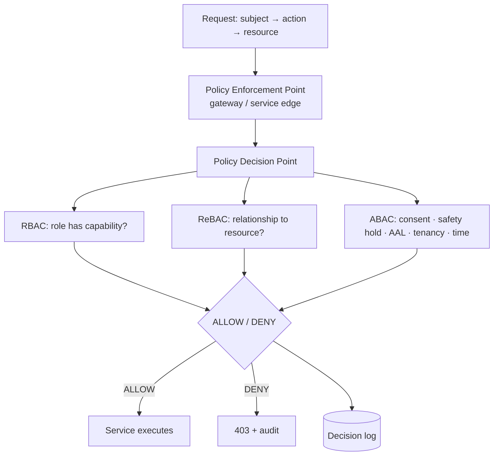
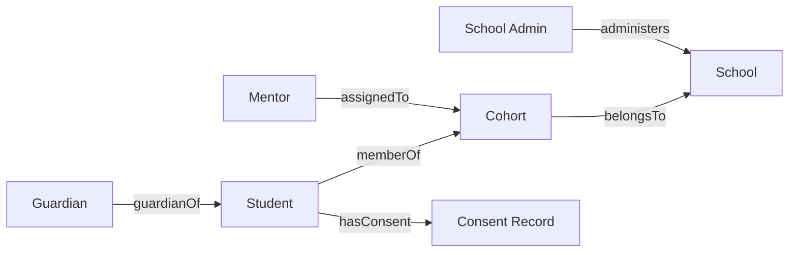
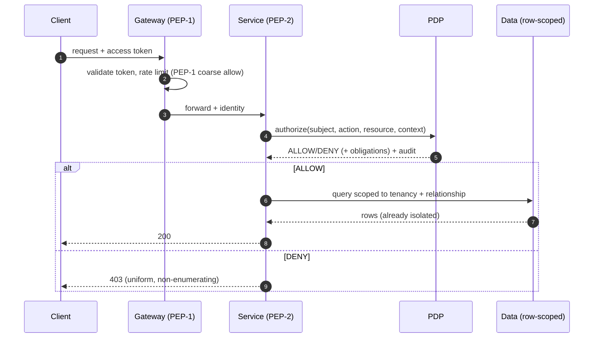

# 12 · Authorization Model

| | |
|---|---|
| **Document ID** | 12 |
| **Owner** | CISO / Head of Identity & Access |
| **Status** | Draft (Phase 1) |
| **Last updated** | 2026-07-19 |
| **Related** | [11 Authentication](11-authentication-strategy.md) · [13 Security Model](13-security-model.md) · [14 Privacy](14-privacy-model.md) · [15 Child Safety](15-child-safety-framework.md) · [08 System Architecture](../02-architecture/08-system-architecture.md) · [10 API Design](../02-architecture/10-api-design.md) · [28 Mentor Portal](../06-portals/28-mentor-portal.md) |

## Purpose

This document defines **what an authenticated actor is allowed to do** in Project Taleem. Where
[11 Authentication](11-authentication-strategy.md) answers *who are you*, this answers *may you*. It
fixes the authorization paradigm (role-based, refined by relationships and attributes), the canonical
role→permission model, the relationship graph that scopes access to *this Guardian's child* and *this
Mentor's cohort*, the Policy Decision Point architecture, and the tenancy/data-isolation rules that
make a 1,000,000-student multi-school platform safe.

## Scope

In scope: the authorization paradigm (RBAC + ReBAC + ABAC), the role/permission matrix, relationship-
and attribute-scoping, the PDP/PEP architecture, tenancy isolation, elevation/consent gates, and
authorization auditing. Out of scope: authentication and sessions ([11](11-authentication-strategy.md)),
crypto/threat model ([13](13-security-model.md)), consent lawful basis ([14](14-privacy-model.md)),
and safeguarding policy ([15](15-child-safety-framework.md)) — each referenced, not redefined. Owning
service: **Identity & Access** (canonical service #1).

---

## 1. Principles

1. **Least privilege by default.** Every principal gets the minimum access to do its job; access is
   granted explicitly, never inherited by accident ([04 NFR SEC-03](../01-product/04-non-functional-requirements.md)).
2. **Deny by default.** Absence of an explicit allow is a deny. New endpoints are unreachable until a
   policy authorises them.
3. **Relationship-scoped over role-broad.** "A Guardian may view report cards" is meaningless without
   *whose*. Authorization is scoped to the **relationship graph** — a Guardian sees *their* children, a
   Mentor *their* cohorts.
4. **Consent is an authorization input.** No processing of a child's data is authorised unless a
   `GRANTED` consent record exists ([14](14-privacy-model.md)); consent revocation instantly narrows
   access.
5. **Safety can override.** A Trust & Safety hold ([15](15-child-safety-framework.md)) can restrict
   access regardless of role — safety outranks convenience ([01 Vision §7](../00-overview/01-vision.md)).
6. **Decisions are centralised, enforced everywhere.** One Policy Decision Point; many Policy
   Enforcement Points. Services never invent their own authorization logic.
7. **Every decision is auditable.** Sensitive access decisions are logged with subject, resource,
   action, and verdict ([04 NFR GC-5](../01-product/03-functional-requirements.md)).

## 2. Authorization paradigm (decision)

Taleem uses a **layered model**: **RBAC** for coarse capability, **ReBAC** (relationship-based) for
scoping to the right child/cohort/school, and **ABAC** (attribute-based) for contextual conditions
(consent state, safety holds, assurance level, time/locale). This is the smallest model that expresses
"a Mentor may grade the subjective work *of a Student in a cohort they are assigned to*, *if consent is
active*, *from an AAL2 session*."

**Why not pure RBAC:** roles alone cannot express "this Guardian, this child." **Why not pure ABAC:**
too easy to get wrong and hard to audit. The layered model keeps roles legible while relationships and
attributes provide precision.

## 3. Canonical roles & capabilities

Roles are the canonical eight from [Authoring Brief §2](../_meta/authoring-brief.md). Capabilities are
coarse; **scope** (§4) narrows each to specific resources.

| Capability (examples) | Student | Guardian | Mentor | School Admin | Platform Admin | Safety Officer | Curriculum Architect |
|---|:--:|:--:|:--:|:--:|:--:|:--:|:--:|
| Attend lessons / use AI Teacher | ✅(own) | — | — | — | — | — | — |
| Submit assessment attempts | ✅(own) | — | — | — | — | — | — |
| View report card | ✅(own) | ✅(children) | ✅(cohort) | ✅(school) | — | — | — |
| Manage consent / privacy | — | ✅(children) | — | — | — | — | — |
| Human-grade subjective work | — | — | ✅(cohort) | — | — | — | — |
| View AI transcript | — | ✅(child, per policy) | ✅(cohort, per policy) | — | — | ✅(safety) | — |
| Assign Mentors / manage cohorts | — | — | — | ✅(school) | — | — | — |
| Enrol / place Students | — | ✅(self-serve) | — | ✅(school) | — | — | — |
| Publish curriculum | — | — | — | — | ✅ | — | authors, submits |
| Author curriculum content | — | — | — | — | — | — | ✅ |
| Feature flags / platform config | — | — | — | — | ✅ | — | — |
| Triage flags / safeguarding cases | — | — | (raise) | — | — | ✅ | — |
| Apply account/safety hold | — | — | (recommend) | — | — | ✅ | — |
| Read audit logs | — | — | — | ✅(school scope) | ✅ | ✅(safety scope) | — |

"✅(scope)" means the capability is always further constrained by the relationship/tenancy scope in §4.
No role is a superuser: even Platform Admin cannot read raw safeguarding disclosures without the Safety
Officer path and dual-control ([11 §11](11-authentication-strategy.md)).

## 4. Relationship & tenancy scoping (ReBAC)

The **relationship graph** is the substrate of scoping. Edges are authoritative records owned by
Identity & Access and Enrolment.

| Relationship | Grants (scoped) |
|---|---|
| `guardianOf(G,S)` | G may view/act on S's learning, report cards, consent, safety concerns — **only for S**. |
| `assignedTo(M,C)` + `memberOf(S,C)` | M may grade, view transcripts (per policy), and mentor **S**, only while assignment is active. |
| `administers(SA,Sc)` + `belongsTo(C,Sc)` | SA may manage cohorts/timetables/enrolment for **Sc only**. |
| `hasConsent(S,CO)` = GRANTED | Unlocks any processing of S's data (ABAC gate, §5). |

**Tenancy isolation (decision):** **School** is the primary tenancy boundary. A School Admin, Mentor,
or cohort in School A can never read School B's Students. Isolation is enforced at the data layer
(row-level scoping / logical partitioning — [09 Database](../02-architecture/09-database-design.md))
**and** at the PDP, so a coding error in one layer is caught by the other (defence in depth). Platform
Admins operate cross-tenant only through audited, purpose-limited paths.

## 5. Attribute conditions (ABAC)

Even with the right role and relationship, a decision can be denied by context:

| Attribute | Effect |
|---|---|
| **Consent state** | `≠ GRANTED` → deny all child-data processing (except the minimal record needed to hold consent). Revocation takes effect immediately ([14](14-privacy-model.md)). |
| **Safety hold** | An active Trust & Safety hold on a Student/Mentor/device narrows or suspends access regardless of role ([15](15-child-safety-framework.md)). |
| **Assurance level (`aal`)** | Sensitive actions require a minimum AAL / fresh step-up (e.g. mentor grade override needs AAL2 step-up) ([11 §7](11-authentication-strategy.md)). |
| **Purpose / just-in-time** | Privileged cross-tenant reads require an explicit, time-boxed, reason-logged elevation. |
| **Time / locale** | Optional constraints (e.g. exam-window actions) where justified. |
| **Data class** | The most sensitive classes (safeguarding disclosures) require dual-control ([13](13-security-model.md)). |

## 6. PDP / PEP architecture (decision)

- **One logical Policy Decision Point.** Policies are declarative (policy-as-code, versioned,
  reviewed like any change) and evaluated against subject/action/resource/context. The PDP is
  co-located for latency (sidecar/library) but sourced from a single policy repository, so there is one
  source of truth and one audit.
- **Policy Enforcement Points** live at the **API gateway/BFF** (first line) and at **every service
  edge** (authoritative). A service NEVER trusts the gateway alone — it re-checks with the PDP using the
  authenticated identity from [11](11-authentication-strategy.md). Authorization is not optional
  middleware a route can forget: the default route posture is deny, and access requires an explicit
  policy binding.
- **Fail closed.** If the PDP is unreachable, the decision is **deny** for sensitive resources
  (availability of authorization must never become a bypass).
- **Decision caching** is short-lived and invalidated on consent change, safety hold, role change, or
  relationship change — so revocation is fast.

## 7. Sensitive-action gates

Certain actions carry child-impact and require more than role+relationship:

| Action | Required gate |
|---|---|
| Guardian consent change / data export/erasure | AAL2 step-up + audit ([14](14-privacy-model.md)). |
| Mentor human-grade override | AAL2 step-up + attribution + immutable trail ([FR-GRD-003](../01-product/03-functional-requirements.md)). |
| Promotion decision | Human accountable in loop; AI may recommend, never decide ([FR-GRD-004](../01-product/03-functional-requirements.md)). |
| Read safeguarding disclosure | Safety Officer + hardware key + dual-control ([15](15-child-safety-framework.md)). |
| Cross-tenant platform action | Just-in-time elevation, reason-logged, time-boxed. |
| Apply/lift safety hold | Safety Officer; every change audited. |

## 8. Authorization for the AI Teacher

The AI Teacher runs **as a scoped delegate of the authenticated Student session**, never with ambient
privilege ([11 §12](11-authentication-strategy.md)). It:

- can only retrieve curriculum content the Student is entitled to, and only the Student's *own*
  transcript context;
- cannot read another child's data, cannot mutate grades, and cannot elevate;
- passes every input/output through safety guardrails ([15](15-child-safety-framework.md)) that can
  themselves deny an action.

## 9. Authorization auditing

- Every **DENY on a sensitive resource** and every **ALLOW on a sensitive action** (§7) is logged with
  subject, resource, action, decision, policy version, and context (consent/safety/AAL) — feeding the
  immutable audit log in [13](13-security-model.md).
- **Access reviews:** periodic recertification of Mentor/Admin/Staff grants; stale `assignedTo`/
  `administers` edges are expired.
- **Fitness function in CI:** an architecture test asserts that every new route has an explicit policy
  binding (no unauthenticated/unauthorized route ships) — enforced in [37 CI/CD](../07-engineering/37-cicd-pipeline.md).

## 10. Risks

| # | Risk | Impact | Mitigation |
|---|---|---|---|
| R-1 | Missing PEP on a new route → open access | Data breach | Deny-by-default routing + CI fitness function requiring explicit policy binding. |
| R-2 | Cross-tenant leak via query bug | School A sees School B's children | Dual enforcement: PDP scope **and** row-level data isolation. |
| R-3 | Stale relationship grant (ex-Mentor retains access) | Unauthorised child access | Assignment expiry + access recertification + fast cache invalidation. |
| R-4 | Consent revoked but cached ALLOW persists | Unlawful processing | Short cache TTL + explicit invalidation on consent change. |
| R-5 | Over-broad admin standing privilege | Large blast radius | JIT elevation, dual-control on most sensitive classes, least privilege. |
| R-6 | PDP outage treated as allow | Bypass | Fail-closed for sensitive resources. |

---

## Open questions

- **Transcript visibility policy:** exactly which of a child's AI transcripts a Guardian vs. Mentor may
  read, balancing oversight against the child's dignity and safeguarding. Owner: [15](15-child-safety-framework.md)
  - Privacy.
- **PDP technology:** policy-as-code engine choice (e.g. OPA/Cedar-style) is an ADR — pending
  ([02-architecture/adr](../02-architecture/adr/)).
- **Cross-tenant analytics:** how Platform Admins get aggregate insight without cross-tenant PII access
  ([31 Analytics](../06-portals/31-analytics-platform.md)).
- **Sibling data on shared device:** authorization nuance when two children share one device and one
  Guardian (avoid over-broad grants).

## Change log

| Date | Change | Author |
|---|---|---|
| 2026-07-19 | Initial draft: layered RBAC+ReBAC+ABAC model, role/capability matrix, relationship & tenancy scoping, PDP/PEP architecture, sensitive-action gates, AI-Teacher delegation, auditing. | CISO / Head of Identity & Access |
