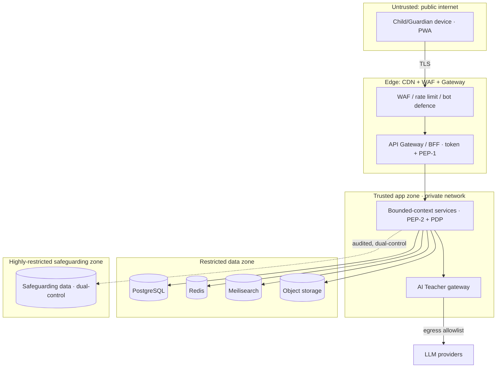

# 13 · Security Model

| | |
|---|---|
| **Document ID** | 13 |
| **Owner** | CISO / Head of Security Engineering |
| **Status** | Draft (Phase 1) |
| **Last updated** | 2026-07-19 |
| **Related** | [11 Authentication](11-authentication-strategy.md) · [12 Authorization](12-authorization-model.md) · [14 Privacy](14-privacy-model.md) · [15 Child Safety](15-child-safety-framework.md) · [08 System Architecture](../02-architecture/08-system-architecture.md) · [10 API Design](../02-architecture/10-api-design.md) · [36 Infrastructure](../02-architecture/36-infrastructure-architecture.md) · [37 CI/CD](../07-engineering/37-cicd-pipeline.md) · [39 Logging](../07-engineering/39-logging.md) |

## Purpose

This document defines the **overall security model** for Project Taleem: the threat model, trust
boundaries, defence-in-depth controls, cryptography and key management, secrets, network and workload
security, secure SDLC, vulnerability management, incident response, and the OWASP ASVS L2 conformance
target. It is the umbrella that [11](11-authentication-strategy.md) and [12](12-authorization-model.md)
plug into and the authority for [04 NFR §8 SEC](../01-product/04-non-functional-requirements.md).

## Scope

In scope: assets and adversaries, trust boundaries, application/network/data/infra controls, crypto &
key management, secrets, secure SDLC and supply chain, vuln management, logging/audit for security,
and incident response. Out of scope: privacy lawful basis ([14](14-privacy-model.md)) and safeguarding
policy ([15](15-child-safety-framework.md)) — this document secures the platform those depend on.

---

## 1. Security principles

1. **Defence in depth.** No single control is trusted; each layer assumes the one above it may fail.
2. **Secure by default, fail closed.** The safe state is the default; on error, deny.
3. **Least privilege everywhere** — humans, services, and workloads ([12](12-authorization-model.md)).
4. **Minimise the attack surface & the data.** Less data and fewer entry points = less to breach
   ([14 Privacy](14-privacy-model.md)).
5. **Assume breach.** Detect, contain, and recover fast; segment blast radius.
6. **Protecting children is the highest-value asset class.** Safeguarding data gets the strongest
   controls on the platform ([15](15-child-safety-framework.md)).
7. **Shift left.** Security is built and tested in CI, not bolted on ([37 CI/CD](../07-engineering/37-cicd-pipeline.md)).

## 2. Assets & adversaries (threat model)

We threat-model with **STRIDE** per trust boundary and prioritise by child impact.

| Asset (ranked) | Why it matters |
|---|---|
| **Children's safety & safeguarding data** | Highest: disclosure could physically endanger a child. |
| **Child PII & learning records** | Privacy harm; identity of vulnerable minors. |
| **Authentication/session material** | Account takeover → child access (grooming vector). |
| **Assessment integrity & grades** | Honesty of the report card = the product's trust. |
| **AI Teacher pipeline** | Poisoned output could harm or mislead a child. |
| **Platform availability** | A down platform is a child denied school. |

| Adversary | Motivation | Primary threats |
|---|---|---|
| **Predator / groomer** | Access to or contact with a child | Account takeover, impersonation, safety-control bypass |
| **Opportunistic attacker** | Data theft, resource abuse | Injection, credential stuffing, scraping, DoS |
| **Malicious insider** | Data exfiltration, abuse of power | Privilege misuse, audit evasion |
| **Fraudster** | SMS-pump/toll fraud, sponsorship fraud | OTP abuse, payment abuse |
| **Nation-state / hacktivist** | Disruption, surveillance | Supply chain, infra compromise |

**STRIDE coverage (summary):** Spoofing → [11](11-authentication-strategy.md); Tampering → integrity
controls §5/§6; Repudiation → immutable audit §9; Information disclosure → encryption §6 + authz
[12](12-authorization-model.md); DoS → rate limits/WAF §4; Elevation → least privilege + JIT §7.

## 3. Trust boundaries

Each arrow crossing a boundary authenticates, authorizes, encrypts, and is logged. The **safeguarding
zone** is the most restricted: separate access path, dual-control, hardware-key-gated Safety Officers
([11 §11](11-authentication-strategy.md)).

## 4. Application & network controls

| Layer | Controls |
|---|---|
| **Edge** | TLS 1.2+ everywhere (HSTS), CDN, **WAF**, DDoS protection, rate limiting & bot defence, geo/velocity anomaly signals ([11 §10](11-authentication-strategy.md)). |
| **Input** | Server-side validation of every input (schema-driven, OpenAPI-contract — [10 API](../02-architecture/10-api-design.md)); output encoding; parameterised queries only (no string SQL); strict content types. |
| **Web** | CSP, `X-Content-Type-Options`, `Referrer-Policy`, `Permissions-Policy`, SameSite cookies, anti-CSRF for cookie-based flows, subresource integrity where applicable. |
| **API** | AuthN at the edge + service; AuthZ at the PDP; idempotency keys on critical writes; strict CORS allowlist; no verbose error leakage. |
| **AI egress** | The AI Teacher gateway is the **only** component allowed to reach LLM providers, over an egress allowlist; prompt-injection and output-safety controls ([15](15-child-safety-framework.md), [24 AI Teacher](../05-education/24-ai-teacher-specification.md)). |
| **Network** | Private subnets for app/data zones; default-deny security groups; segmentation between contexts and the safeguarding zone; no direct public access to data stores ([36 Infrastructure](../02-architecture/36-infrastructure-architecture.md)). |

OWASP **Top 10** and **ASVS L2** are the checklist; §11 maps conformance.

## 5. Data integrity & assessment/grade protection

Honesty is a product principle ([01 Vision §7](../00-overview/01-vision.md)), so integrity is a
security control, not just a data concern:

- **Append-only** assessment attempts and grade events; edits create new versioned records, never
  mutate history ([FR-ASM-002](../01-product/03-functional-requirements.md), [FR-GRD-003](../01-product/03-functional-requirements.md)).
- **Sealed submissions:** an attempt is cryptographically sealed at submission (incl. offline) so
  post-hoc tampering is detectable ([04 NFR OFFL-05](../01-product/04-non-functional-requirements.md)).
- **Idempotent, retry-safe writes** on the critical path prevent duplication under client retries
  ([04 NFR REL-05](../01-product/04-non-functional-requirements.md)).
- **Tamper-evident audit** (§9) covers every grade override and privileged action.

## 6. Cryptography & key management

| Concern | Decision |
|---|---|
| **In transit** | TLS 1.2+ (prefer 1.3), modern ciphers, HSTS, cert automation. Internal service-to-service mTLS in the app zone. |
| **At rest** | AES-256 for databases, object storage, backups, and per-profile device caches ([11 §6](11-authentication-strategy.md)). |
| **Field-level** | The most sensitive fields (safeguarding notes, guardian contact) get application-layer envelope encryption above storage encryption. |
| **Key management** | Central KMS/HSM-backed; keys never in code/images; **rotation** on schedule with overlapping validity; separate keys per environment and per sensitive data class; access to keys is least-privilege and audited. |
| **Token signing** | Asymmetric, rotating JWKS keys ([11 §7](11-authentication-strategy.md)). |
| **Hashing** | Strong KDF (e.g. Argon2id) for adult passwords and child PIN/pattern proofs; unique salts. |
| **Randomness** | CSPRNG for all tokens, codes, and salts. |

## 7. Secrets, identity of workloads & least privilege

- **No secrets in code or images.** Secrets come from a managed secret store at runtime; CI enforces a
  **secret-scanning gate** ([04 NFR SEC-05](../01-product/04-non-functional-requirements.md)).
- **Workload identity:** each service runs as its own least-privilege identity; no shared credentials;
  short-lived, automatically rotated service credentials.
- **Human standing privilege is minimised;** elevation is **just-in-time**, time-boxed, reason-logged,
  dual-control for the most sensitive classes ([12 §7](12-authorization-model.md)).

## 8. Secure SDLC & supply chain

Security is enforced in the pipeline ([37 CI/CD](../07-engineering/37-cicd-pipeline.md)):

| Stage | Control |
|---|---|
| **Design** | Threat modelling for new contexts; ADR for security-affecting decisions. |
| **Code** | Mandatory review (CODEOWNERS), secure coding standards ([41 Coding Standards](../07-engineering/41-coding-standards.md)), no direct provider SDK calls outside gateways. |
| **Build** | SAST, secret scanning, **SCA** (dependency vulnerabilities), container image scanning; **SBOM** generated; pinned/verified dependencies. |
| **Test** | DAST on staging, authz fitness functions, security regression tests. |
| **Release** | Signed artifacts, provenance/attestation, immutable images; no critical vulns ship. |
| **Runtime** | Drift detection (IaC), runtime monitoring, egress controls. |

**Supply-chain posture:** least-privilege CI, protected branches, required checks, dependency pinning
and review, provenance attestation to resist a compromised dependency or build.

## 9. Security logging & audit

- **Immutable, tamper-evident audit log** for authentication events, authorization decisions on
  sensitive resources, grade overrides, consent changes, safety actions, and privileged/admin actions.
- **No child PII or secrets in logs** ([04 NFR OBS-05](../01-product/04-non-functional-requirements.md));
  structured, correlated logs feed detection ([39 Logging](../07-engineering/39-logging.md)).
- **Detection & alerting:** anomaly signals (refresh-token reuse, geo-velocity, mass class-code
  redemption, privilege spikes) raise security events; high-severity events page on-call and, when
  child-safety-relevant, Trust & Safety ([15](15-child-safety-framework.md)).
- **Retention** of security logs per policy, balanced against privacy minimisation ([14](14-privacy-model.md)).

## 10. Vulnerability & incident management

- **Vulnerability management:** continuous scanning (SCA/image/DAST), risk-ranked SLAs for remediation
  (criticals fastest), and a coordinated-disclosure/**responsible-disclosure** channel.
- **Patch cadence:** dependencies and base images updated on a schedule and out-of-band for criticals.
- **Incident response:** a documented IR plan — detect → triage → contain → eradicate → recover →
  learn — with severity tiers. **Any incident with potential child-safety impact is automatically top
  severity** and jointly owned with Trust & Safety. Post-incident reviews are blameless and produce
  tracked actions.
- **Breach notification:** if child data is exposed, guardian/regulatory notification follows the
  privacy playbook ([14](14-privacy-model.md)).

## 11. OWASP ASVS L2 conformance

Target **ASVS Level 2** across surfaces, core path first ([04 NFR SEC-01](../01-product/04-non-functional-requirements.md)).

| ASVS chapter | Where satisfied |
|---|---|
| V1 Architecture | This doc + [08 Architecture](../02-architecture/08-system-architecture.md) |
| V2 Authentication | [11 Authentication](11-authentication-strategy.md) |
| V3 Session Management | [11 §6–7](11-authentication-strategy.md) |
| V4 Access Control | [12 Authorization](12-authorization-model.md) |
| V5 Validation/Encoding/Injection | §4 |
| V6 Cryptography | §6 |
| V7 Error/Logging | §9, [39 Logging](../07-engineering/39-logging.md) |
| V8 Data Protection | §6, [14 Privacy](14-privacy-model.md) |
| V9 Communications | §4/§6 (TLS/mTLS) |
| V10 Malicious Code / Supply Chain | §8 |
| V11 Business Logic | §5 (integrity), [15](15-child-safety-framework.md) |
| V12 Files/Resources | Media scanning [34 Media](../02-architecture/34-media-architecture.md) |
| V13 API | [10 API Design](../02-architecture/10-api-design.md) |
| V14 Configuration | §7, [36 Infrastructure](../02-architecture/36-infrastructure-architecture.md) |

A living ASVS control checklist is maintained by Security Engineering and gated in CI where automatable.

## 12. Risks

| # | Risk | Impact | Mitigation |
|---|---|---|---|
| R-1 | Safeguarding-data exposure | Physical danger to a child | Safeguarding zone: dual-control, hardware keys, field encryption, strict audit. |
| R-2 | Supply-chain compromise | Broad breach | SCA, pinning, SBOM, provenance, least-privilege CI. |
| R-3 | Prompt injection via curriculum/user content | Unsafe AI output | AI egress isolation + input/output guardrails ([15](15-child-safety-framework.md)). |
| R-4 | Insider privilege misuse | Data exfiltration | Least privilege, JIT elevation, dual-control, immutable audit, anomaly detection. |
| R-5 | DoS on core path | Children denied school | WAF/CDN, rate limits, autoscaling, graceful degradation ([04 NFR REL-03](../01-product/04-non-functional-requirements.md)). |
| R-6 | Secret leakage | Credential compromise | Secret store, CI secret-scanning, rotation. |

---

## Open questions

- **KMS/HSM choice** and per-data-class key topology — an ADR ([adr/](../02-architecture/adr/)).
- **mTLS mesh vs. gateway-only** internal encryption at 1M scale — cost/latency trade-off with
  [36 Infrastructure](../02-architecture/36-infrastructure-architecture.md).
- **Pen-test cadence & scope** for a child-safety platform (independent assessor selection).
- **Regulatory breach-notification thresholds** under Pakistani PDPB vs. the strictest-of baseline
  ([14](14-privacy-model.md)).

## Change log

| Date | Change | Author |
|---|---|---|
| 2026-07-19 | Initial draft: threat model, trust boundaries, defence-in-depth controls, crypto/key management, secrets, secure SDLC/supply chain, audit, incident response, ASVS L2 mapping. | CISO / Head of Security Engineering |
