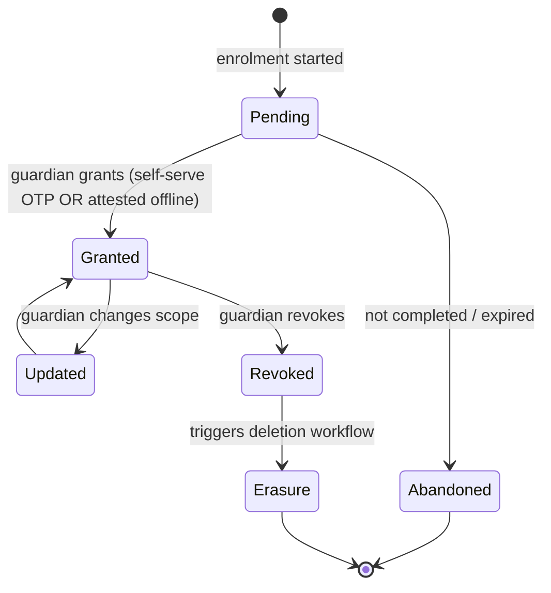

# 14 · Privacy Model

| | |
|---|---|
| **Document ID** | 14 |
| **Owner** | Data Protection Officer / Privacy Counsel |
| **Status** | Draft (Phase 1) |
| **Last updated** | 2026-07-19 |
| **Related** | [11 Authentication](11-authentication-strategy.md) · [12 Authorization](12-authorization-model.md) · [13 Security](13-security-model.md) · [15 Child Safety](15-child-safety-framework.md) · [02 PRD](../01-product/02-prd.md) · [09 Database](../02-architecture/09-database-design.md) · [24 AI Teacher](../05-education/24-ai-teacher-specification.md) · [31 Analytics](../06-portals/31-analytics-platform.md) |

## Purpose

This document defines **how Project Taleem protects the privacy of children and their guardians**: the
lawful basis and consent lifecycle, data minimisation, the data inventory and classification, data
subject rights, retention and deletion, purpose limitation (including the absolute stance on
monetisation and third-party model training), data residency, and the AI-specific privacy controls. It
is the authority for [04 NFR §9 PRIV](../01-product/04-non-functional-requirements.md) and the consent
substrate that [11](11-authentication-strategy.md) and [12](12-authorization-model.md) enforce.

## Scope

In scope: privacy principles, regulatory baseline, consent model & lifecycle, data map &
classification, minimisation, data-subject rights, retention/erasure, purpose limitation, third-party
processors, residency, and AI privacy. Out of scope: security controls that *enforce* privacy
([13](13-security-model.md)) and safeguarding *policy* ([15](15-child-safety-framework.md)) — both
referenced.

---

## 1. Privacy principles

1. **Minimal data.** Collect only what teaching and protecting a child require; every field must be
   justified ([04 NFR PRIV-01](../01-product/04-non-functional-requirements.md)).
2. **Consent before processing.** No child-data processing without an active guardian consent record
   ([11 §3](11-authentication-strategy.md)); consent is informed, specific, and revocable.
3. **Purpose limitation.** Data is used only for the purpose it was collected for; **never** sold,
   ad-targeted, or used to train third-party models ([01 Vision §8](../00-overview/01-vision.md)).
4. **The child's dignity.** Privacy design respects a child's dignity — oversight is for safety and
   support, not surveillance.
5. **Transparency in-language.** Notices are Urdu-first, plain, and understandable by a low-literacy
   guardian ([16 Accessibility](../04-design/16-accessibility-standards.md)).
6. **Privacy by design & default.** The most protective setting is the default; privacy is designed
   in, not configured on.
7. **Accountability.** We can show, on demand, what we hold, why, and under what basis.

## 2. Regulatory baseline (planning assumption)

We design to the **strictest of** the applicable regimes so we are compliant everywhere we operate:

| Regime | What we take from it |
|---|---|
| **Pakistan PDPB (draft) / PECA** | Local lawful basis, data-residency expectations, breach handling. |
| **GDPR-K principles** | Consent, minimisation, subject rights, DPIA, processor obligations, "best interests of the child." |
| **COPPA-equivalent** | Verifiable guardian consent for under-13s; no behavioural ad targeting of children. |

This is a **planning assumption** pending Privacy Counsel confirmation (see Open Questions); the
architecture assumes the strictest interpretation so tightening later needs no rework.

## 3. Consent model & lifecycle (decision)

**The Guardian is the lawful consent-holder** ([11 §3](11-authentication-strategy.md)); the Student is
the data subject. Consent is **granular, versioned, and revocable**.

**Granular consent scopes** (each independently grantable where lawful; core-learning consent is
required to enrol, others are optional):

| Scope | Purpose | Required for enrolment? |
|---|---|---|
| **Core learning** | Store enrolment, deliver lessons, record progress/grades. | Yes (else no school). |
| **AI Teacher** | Process a child's questions through the AI Teacher; log transcripts for safety. | Yes (core pedagogy) — with safety logging disclosed. |
| **Safety monitoring** | Moderation/safeguarding of AI + uploads. | Yes (non-negotiable safety). |
| **Engagement messaging** | Non-essential nudges/streak reminders to guardian. | No (opt-in). |
| **Media uploads** | Child submits photos/audio of work. | No (opt-in; moderated). |

**Decisions:**

- **Consent gates activation** — the Student account is inactive until core/AI/safety consent is
  `GRANTED` ([11 §4](11-authentication-strategy.md)); the PDP treats consent as an ABAC input
  ([12 §5](12-authorization-model.md)).
- **Institutional consent** — for children with no phone-owning guardian, a School Admin as
  institutional guardian records **attested offline (paper) consent** ([11 §3.2](11-authentication-strategy.md));
  legal sufficiency is Open Question O-1.
- **Revocation is fast and real** — revoking narrows access immediately (cache invalidation,
  [12 §6](12-authorization-model.md)) and triggers the erasure workflow (§6).
- **No dark-pattern consent** — no pre-ticked boxes, no bundling optional scopes into required ones,
  no nagging; declining optional scopes never degrades core learning.

## 4. Data inventory & classification

Every field is classified; the classification drives encryption ([13 §6](13-security-model.md)),
access ([12](12-authorization-model.md)), retention (§6), and logging rules.

| Class | Examples | Handling |
|---|---|---|
| **C4 — Safeguarding** | Safety disclosures, abuse reports, distress signals | Safeguarding zone: dual-control, field encryption, strictest audit ([15](15-child-safety-framework.md)). |
| **C3 — Sensitive child PII** | Child name, age, grade, guardian phone, location coarse | Field/at-rest encryption, least-privilege, no logging. |
| **C2 — Learning data** | Progress, attempts, grades, AI transcripts | Encrypted at rest, relationship-scoped, retention-limited. |
| **C1 — Operational** | Pseudonymous IDs, device IDs, telemetry | Pseudonymised; no raw PII in analytics. |
| **C0 — Public/curriculum** | Curriculum content, help articles | Public within the product. |

A living **data map** (owned with [09 Database](../02-architecture/09-database-design.md)) records, per
field: purpose, lawful basis/consent scope, class, retention, and processor exposure. A field without
a justified purpose is a defect ([04 NFR PRIV-01](../01-product/04-non-functional-requirements.md)).

## 5. Data minimisation in practice

- **No email, no government ID, no biometrics, no precise location** to authenticate or teach a child
  ([11 §1](11-authentication-strategy.md)).
- **Pseudonymous identifiers** (`student_ref`) flow through tokens, logs, and analytics; names live
  only where needed and never in a JWT or a log ([11 §7](11-authentication-strategy.md), [13 §9](13-security-model.md)).
- **Collect at point of need**, not "just in case"; optional fields are optional.
- **Aggregate over identify** for analytics — dashboards use pseudonymised, aggregated data with no raw
  child PII ([31 Analytics](../06-portals/31-analytics-platform.md), [04 NFR PRIV-05](../01-product/04-non-functional-requirements.md)).

## 6. Data-subject rights, retention & erasure

**Rights** (exercised by the Guardian on the child's behalf, self-serve where possible —
[FR-IDN-005](../01-product/03-functional-requirements.md)):

| Right | How Taleem delivers it |
|---|---|
| **Access** | Guardian sees what we hold about their child in the Guardian Portal ([25](../06-portals/25-parent-portal.md)). |
| **Export (portability)** | Machine-readable export of the child's learning record on request. |
| **Rectification** | Correct inaccurate details (with audit). |
| **Erasure** | Revocation/erasure request deletes/anonymises per §6 within SLA. |
| **Restriction/Objection** | Withdraw optional scopes; object to non-essential processing. |

**Retention (planning assumption; per data class):**

| Data | Retention default |
|---|---|
| Active learning records | While enrolled + a defined period, then archive/anonymise. |
| AI transcripts | Short retention for safety review, then auto-expire ([04 NFR PRIV-07](../01-product/04-non-functional-requirements.md)). |
| Security/audit logs | Retained per security policy, PII-minimised ([13 §9](13-security-model.md)). |
| Safeguarding records (C4) | Retained per legal obligation; access-restricted throughout. |

**Erasure workflow:** revocation or an erasure request enqueues a deletion job that removes/anonymises
across primary stores, caches, search index, backups (per backup-cycle policy), and processors —
recorded in an audit trail. Some records (e.g. legal safeguarding obligations, verifiable credential
integrity) may be retained under a documented legal basis, and the Guardian is told what and why.

## 7. Purpose limitation & the monetisation stance (non-negotiable)

Restating [01 Vision §8](../00-overview/01-vision.md) as binding policy:

- **No sale of child data. Ever.**
- **No advertising or ad-targeting** to children ([04 NFR PRIV-04](../01-product/04-non-functional-requirements.md)).
- **No use of child data to train third-party models.** The AI Teacher uses providers under contracts
  that **prohibit training on our data**; where a provider cannot guarantee this, we do not use it for
  child data (§9).
- **No secondary use** beyond the consented purpose without fresh, specific consent.

These are enforced by contract (processors, §8), by architecture (data-flow review, [13 §2](13-security-model.md)),
and by the absence of any ad/tracking SDK on the critical path ([04 NFR DATA-06](../01-product/04-non-functional-requirements.md)).

## 8. Third-party processors

- Every processor (LLM provider, SMS/WhatsApp gateway, object storage, analytics) is under a **data
  processing agreement** with minimisation, purpose limitation, no-training/no-resale, breach
  notification, and sub-processor controls.
- A **processor register** lists each processor, data classes exposed, purpose, and residency.
- **LLM providers** receive only the minimum context needed, pseudonymised where possible, under
  no-training terms; the AI Teacher gateway is the sole egress point ([13 §4](13-security-model.md)).
- **SMS/WhatsApp** receive only what a message requires (guardian phone + message), never learning
  data ([30 Notifications](../06-portals/30-notification-system.md)).

## 9. AI-specific privacy controls

The AI Teacher is the highest-novelty privacy surface:

| Control | Rule |
|---|---|
| **Minimal prompt context** | Only the curriculum + the child's own relevant context is sent; no cross-child data, no unnecessary PII. |
| **Pseudonymisation** | Provider sees pseudonymous references, not a child's real identity, wherever feasible. |
| **No training on our data** | Contractual + technical: provider terms prohibit training on Taleem data (§7). |
| **Transcript retention** | Short, purpose-limited (safety), auto-expiring ([04 NFR PRIV-07](../01-product/04-non-functional-requirements.md)). |
| **Transparency** | Guardians are told the AI Teacher processes their child's questions and that transcripts are kept briefly for safety. |
| **Access to transcripts** | Governed by [12 §8](12-authorization-model.md); safeguarding access via the C4 path. |

## 10. Data residency

- **Primary data residency close to Pakistan** for latency and data-protection posture
  ([04 NFR PRIV-06](../01-product/04-non-functional-requirements.md), [36 Infrastructure](../02-architecture/36-infrastructure-architecture.md)).
- **Cross-border transfers** (e.g. to an LLM provider region) are minimised, documented, lawful-basis-
  backed, and use pseudonymised/minimal data; where a data class cannot lawfully leave the region, it
  does not.

## 11. Governance: DPIA & accountability

- A **Data Protection Impact Assessment** is required for the platform and for any new high-risk
  processing (especially anything involving the AI Teacher, safeguarding data, or new data classes).
- **Privacy review is part of Definition of Done** ([50](../07-engineering/50-definition-of-done.md))
  for any change touching child data.
- The **DPO** owns the data map, processor register, consent records, and rights-request handling; the
  posture is auditable end to end (accountability principle).

## 12. Risks

| # | Risk | Impact | Mitigation |
|---|---|---|---|
| R-1 | Institutional consent legally insufficient | Unlawful processing of vulnerable children's data | Conservative default, attested artifacts, Counsel review (O-1). |
| R-2 | Child PII leaks into logs/analytics/JWT | Privacy breach | Pseudonymisation, PII-in-logs scanning ([13 §9](13-security-model.md)), analytics PII scan. |
| R-3 | LLM provider trains on child data | Irreversible privacy harm | No-training contracts, minimal/pseudonymised context, provider gating. |
| R-4 | Erasure incomplete across backups/search/processors | Right-to-erasure failure | Orchestrated erasure workflow incl. processors + backup-cycle policy. |
| R-5 | Consent dark patterns creep in | Invalid consent | No pre-ticked/bundled consent; UX privacy review. |
| R-6 | Cross-border transfer without lawful basis | Regulatory breach | Residency controls, minimised transfers, documented basis. |

---

## Open questions

- **O-1:** Legal sufficiency of institutional (School-Admin) consent and attested offline consent under
  PDPB and the strictest-of baseline. Owner: Privacy Counsel (shared with [11](11-authentication-strategy.md)).
- **O-2:** Definitive retention periods per data class (transcripts, learning records, audit) pending
  legal + safety input.
- **O-3:** In-region hosting and lawful cross-border mechanisms for LLM inference
  ([36 Infrastructure](../02-architecture/36-infrastructure-architecture.md), [24 AI Teacher](../05-education/24-ai-teacher-specification.md)).
- **O-4:** "Out-of-school at enrolment" flag — capturing it lawfully and without stigma for the
  north-star segmentation (shared with [02 PRD](../01-product/02-prd.md)).
- **O-5:** Age of digital consent applicable in Pakistan and its effect on any child self-service.

## Change log

| Date | Change | Author |
|---|---|---|
| 2026-07-19 | Initial draft: privacy principles, regulatory baseline, granular consent lifecycle, data map & classification, minimisation, subject rights, retention/erasure, monetisation stance, processors, AI privacy, residency, DPIA governance. | DPO / Privacy Counsel |
