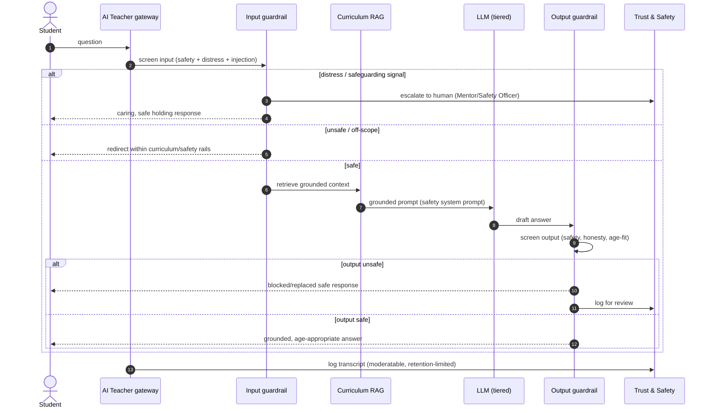
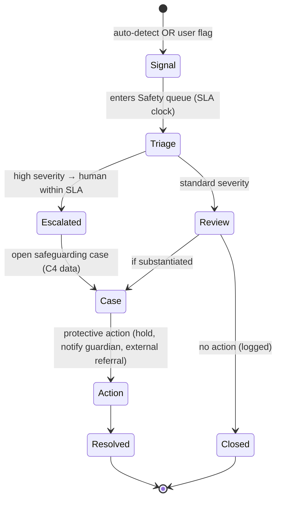

# 15 · Child Safety Framework

| | |
|---|---|
| **Document ID** | 15 |
| **Owner** | Head of Trust & Safety / Chief Safeguarding Officer |
| **Status** | Approved (Phase 1) |
| **Last updated** | 2026-07-19 |
| **Related** | [01 Vision](../00-overview/01-vision.md) · [11 Authentication](11-authentication-strategy.md) · [12 Authorization](12-authorization-model.md) · [13 Security](13-security-model.md) · [14 Privacy](14-privacy-model.md) · [24 AI Teacher](../05-education/24-ai-teacher-specification.md) · [28 Mentor Portal](../06-portals/28-mentor-portal.md) · [30 Notifications](../06-portals/30-notification-system.md) · [34 Media](../02-architecture/34-media-architecture.md) · [50 Definition of Done](../07-engineering/50-definition-of-done.md) |

## Purpose

This document defines the **child safety and safeguarding framework** that governs everything Project
Taleem builds. Child safety is the platform's first non-negotiable ([01 Vision §7](../00-overview/01-vision.md)):
when safety conflicts with any other goal, safety wins. This framework establishes the safety
principles, the AI Teacher guardrails, content moderation, the safeguarding escalation and case
workflow, human roles and vetting, age-appropriate design, and the acceptance criteria that make
"safe" testable for every feature.

## Scope

In scope: safety principles, threat/harm model for children, AI guardrails, content & upload
moderation, safeguarding detection/escalation/case management, human roles & vetting, grooming/contact
prevention, age-appropriate design, incident handling, and per-feature safety acceptance criteria. Out
of scope: the technical security controls that enforce this ([13](13-security-model.md)) and the
privacy lawful basis ([14](14-privacy-model.md)) — both referenced. **This framework binds every other
document.**

---

## 1. Safety principles (binding)

1. **Safety is absolute and outranks everything.** No feature, metric, or deadline justifies a
   child-safety compromise.
2. **Safety is an acceptance criterion, not a module.** Every feature ships with safety criteria met
   (§11); "we'll add safety later" is not permitted ([50 DoD](../07-engineering/50-definition-of-done.md)).
3. **Default to protection.** The safe state is the default; uncertainty resolves toward protecting the
   child.
4. **A human is always accountable.** AI may assist detection but never makes an unsupervised
   high-stakes decision about a child ([12 §7](12-authorization-model.md)).
5. **Minimise contact surfaces.** The platform is a school, not a social network; adult↔child and
   child↔child contact is bounded, mediated, and monitored.
6. **Detect, escalate, act, learn.** Every safety signal has a path to a human within SLA and a
   feedback loop.
7. **Respect the child's dignity.** Protection is not surveillance-for-its-own-sake; monitoring is
   purpose-limited to safety ([14 §1](14-privacy-model.md)).

## 2. Harm model — what we protect children from

| Harm | Vector on Taleem | Primary controls |
|---|---|---|
| **Grooming / predatory contact** | Account takeover, adult impersonation, unmonitored messaging | Guardian-anchored identity + sensitive number-change control ([11 §9](11-authentication-strategy.md)); bounded, monitored messaging; vetted mentors. |
| **Exposure to harmful content** | AI output, uploaded media, curriculum errors | AI guardrails (§3), moderation (§4), curriculum review. |
| **Self-harm / distress** | Child expresses distress to AI or Mentor | Distress detection → human escalation (§5). |
| **Bullying / peer harm** | Cohort interactions | Monitored interactions, flagging, mentor oversight. |
| **Exploitation / fraud targeting children** | Scams, data misuse | Privacy stance ([14](14-privacy-model.md)), no monetisation of children. |
| **Psychological harm from AI** | Manipulation, false authority, unsafe advice | AI honesty + guardrails + "escalate to human" (§3). |
| **Data-driven harm** | Leak of a vulnerable child's identity/location | Security ([13](13-security-model.md)) + privacy ([14](14-privacy-model.md)). |

## 3. AI Teacher safety guardrails (the core novel risk)

Every AI input and output is governed **before it reaches a child** ([FR-AIT-002](../01-product/03-functional-requirements.md)).
Full mechanism in [24 AI Teacher](../05-education/24-ai-teacher-specification.md); the safety contract:

**Guardrail decisions:**

- **Grounded, not open-ended** — the AI Teacher answers from curriculum (RAG), redirecting off-syllabus
  prompts; it is not a general chatbot ([02 PRD NG1](../01-product/02-prd.md)).
- **Input screening** — every prompt is screened for safety, distress/safeguarding signals, and
  prompt-injection before any generation.
- **Output screening** — every generation is screened for unsafe content, false authority, and
  age-appropriateness before display; unsafe outputs are blocked/replaced and logged.
- **Honesty over hallucination** — the AI says "I don't know / let's ask your Mentor" rather than
  fabricate ([FR-AIT-004](../01-product/03-functional-requirements.md)).
- **Never human** — always labelled "AI Teacher"; never claims to be a person ([FR-AIT-006](../01-product/03-functional-requirements.md)).
- **Distress → human** — a detected distress or safeguarding signal escalates to a human within SLA and
  gives the child a caring, safe holding response, never a clinical dead end (§5).
- **Full transcript logging** — moderatable, retention-limited ([14 §9](14-privacy-model.md)).
- **Red-team tested** — a standing adversarial eval set gates AI releases ([40 Testing](../07-engineering/40-testing-strategy.md)).

## 4. Content & upload moderation

- **All AI output and all user uploads are moderated before a child sees them** ([FR-TNS-001](../01-product/03-functional-requirements.md),
  [FR-MED-004](../01-product/03-functional-requirements.md)).
- **Uploads** (child work photos/audio) are scanned (safety classification, known-bad hashing) in the
  Media pipeline ([34 Media](../02-architecture/34-media-architecture.md)) before delivery; nothing
  unmoderated is ever shown to another child.
- **Curriculum content** is reviewed before publish ([FR-ADM-002](../01-product/03-functional-requirements.md));
  publishing is gated and reversible.
- **Layered moderation** — automated classifiers as the first pass, human review for edge/ high-severity
  cases; the automated layer never has the final word on a high-severity child-safety decision.

## 5. Safeguarding: detection, escalation & case management

- **Signals:** automated (AI distress detection, moderation hits, auth anomalies) and human (any user
  can flag — [FR-TNS-002](../01-product/03-functional-requirements.md)).
- **Triage queue** with SLA tracking; high-severity signals reach a human within the safeguarding SLA
  ([FR-TNS-005](../01-product/03-functional-requirements.md)).
- **Cases** hold the most sensitive data class (**C4**, [14 §4](14-privacy-model.md)) in the
  safeguarding zone: dual-control, hardware-key-gated Safety Officers ([11 §11](11-authentication-strategy.md)),
  field-encrypted ([13 §6](13-security-model.md)), fully audited.
- **Protective actions:** account/session hold ([11 §7](11-authentication-strategy.md), [12 §5](12-authorization-model.md)),
  guardian notification, mentor involvement, and, where a child is at real-world risk, **referral to
  appropriate external authorities** per the safeguarding escalation policy.
- **Immutable audit** of every safety action ([FR-TNS-004](../01-product/03-functional-requirements.md)).

## 6. Human roles & vetting

Humans are essential to safeguarding — AI cannot be the last line.

| Role | Safety responsibility | Vetting |
|---|---|---|
| **Mentor** | Handle AI escalations, watch cohort well-being, human-grade, first human contact for a child. | Identity-verified (CNIC), **safeguarding-vetted**, trained, MFA (T2, [11](11-authentication-strategy.md)); access relationship-scoped ([12](12-authorization-model.md)). |
| **Safety Officer** | Triage flags, run safeguarding cases, apply holds, external referral. | Highest vetting; hardware-key + dual-control for C4 data. |
| **Platform Admin** | Publish/config safely; cannot read C4 without the safety path. | Vetted; audited; least privilege. |
| **Curriculum Architect** | Ensure content is age-appropriate and accurate. | Content-review responsibility. |

**Mentor vetting is a release-critical dependency** ([02 PRD D8](../01-product/02-prd.md)): no Mentor
supervises children without completing safeguarding vetting and training.

## 7. Grooming & contact-prevention controls

Because grooming is the gravest threat, contact is engineered to be hard to abuse:

- **Guardian-anchored identity** and the **audited, cooled-down guardian-number-change** control resist
  account-takeover hijacks ([11 §9](11-authentication-strategy.md)).
- **Bounded messaging** — communication is school-mediated (Mentor↔Guardian/Student within scope), not
  open DMs; content is monitored and flaggable.
- **No open discovery** — children are not searchable/contactable by strangers; the platform is not a
  social network.
- **Mentor access is scoped and time-bound** ([12 §4](12-authorization-model.md)); ex-Mentors lose
  access immediately.
- **Anomaly detection** on contact patterns feeds Trust & Safety ([13 §9](13-security-model.md)).

## 8. Age-appropriate design

Aligned to age-appropriate-design-code principles ([14 §2](14-privacy-model.md)):

- **Best interests of the child** is the design default; highest-privacy, highest-safety settings on by
  default.
- **No dark patterns, no engagement exploitation** ([01 Vision §8](../00-overview/01-vision.md));
  streaks/celebrations are motivational, safety-reviewed, and frequency-capped ([FR-ENG-003/004](../01-product/03-functional-requirements.md)).
- **Age-tiered experience** — content, AI tone, and permissions adapt to age band (KG vs. Grade 10).
- **Plain, in-language, low-literacy-friendly** safety help, reachable from every screen
  ([07 IA §10](../01-product/07-information-architecture.md)).

## 9. Safety incident handling

- **Any incident with potential child-safety impact is automatically top severity** and jointly owned
  with Security ([13 §10](13-security-model.md)).
- A documented **safeguarding incident playbook**: protect the child first, preserve evidence, notify
  guardians and (where required) authorities, remediate, and run a blameless review with tracked
  actions.
- **Zero tolerance metric:** 100% of safety flags triaged within SLA; child-safety failures are treated
  as the most serious failure the platform can have ([02 PRD §6](../01-product/02-prd.md)).

## 10. Reporting & transparency

- **Easy reporting** — any user can raise a safety concern in one tap, in-language
  ([FR-TNS-002](../01-product/03-functional-requirements.md)).
- **Guardian transparency** — guardians are informed of safety-relevant events affecting their child,
  per policy ([30 Notifications](../06-portals/30-notification-system.md)).
- **Internal transparency** — safety metrics and case outcomes are reviewed by leadership; external
  transparency reporting is a maturity goal.

## 11. Per-feature safety acceptance criteria (the gate)

Every feature must pass these before release ([50 DoD](../07-engineering/50-definition-of-done.md)).
This turns "child safety" from a value into a checklist:

| # | Criterion |
|---|---|
| SAC-1 | No path exposes a child to unmoderated AI output or user content. |
| SAC-2 | Any new contact/interaction surface is bounded, monitored, and flaggable. |
| SAC-3 | Any AI interaction passes input+output guardrails and logs a transcript. |
| SAC-4 | Distress/safeguarding signals reachable in the feature escalate to a human within SLA. |
| SAC-5 | No unsupervised high-stakes AI decision about a child. |
| SAC-6 | Age-appropriate content, tone, and defaults for the target age band. |
| SAC-7 | Safety help reachable from the feature; reporting is one tap. |
| SAC-8 | The feature's safety behaviour is covered by tests/red-team evals. |
| SAC-9 | Data handled per its classification ([14 §4](14-privacy-model.md)); no C3/C4 leakage. |
| SAC-10 | Every protective/safety action is audited. |

## 12. Risks

| # | Risk | Impact | Mitigation |
|---|---|---|---|
| R-1 | AI generates harmful content despite guardrails | Direct child harm | Layered input/output screening, red-team eval gate, block-and-log, human review. |
| R-2 | Grooming via account takeover | Grave child-safety | Guardian-anchored ID, audited number-change, bounded/monitored contact, anomaly detection. |
| R-3 | Missed distress signal | Child in crisis unhelped | Detection + human-in-loop escalation SLA + caring holding response + Mentor training. |
| R-4 | Unvetted adult gains cohort access | Predatory contact | Mandatory vetting, scoped/time-bound access, MFA, immediate revocation. |
| R-5 | Safeguarding data exposure | Physical danger | C4 safeguarding zone, dual-control, field encryption ([13](13-security-model.md)). |
| R-6 | Safety treated as later work | Systemic failure | Safety acceptance criteria in DoD; release-blocking. |

---

## Open questions

- **External referral pathways:** the exact legal/operational channels for referring an at-risk child to
  Pakistani authorities, and mandatory-reporting obligations. Owner: Safeguarding + Legal.
- **Distress-detection efficacy:** false-negative/false-positive tolerances for AI distress detection,
  and the human-review staffing model at scale. Owner: Trust & Safety + [24 AI Teacher](../05-education/24-ai-teacher-specification.md).
- **Mentor vetting pipeline:** capacity to safeguard-vet Mentors at the scale of a growing cohort
  ([02 PRD D8](../01-product/02-prd.md)). Owner: Business/Ops.
- **Cross-child interaction scope:** how much peer interaction (cohort/houses) is safe to enable, and
  under what monitoring ([FR-ENG-004](../01-product/03-functional-requirements.md)).
- **Transcript access balance:** reconciling guardian oversight with a child's dignity and safeguarding
  confidentiality (shared with [12 §8](12-authorization-model.md)).

## Change log

| Date | Change | Author |
|---|---|---|
| 2026-07-19 | Initial approved framework (Phase 1): safety principles, child harm model, AI guardrail contract, moderation, safeguarding escalation & case workflow, human roles & vetting, grooming prevention, age-appropriate design, incident handling, and 10 per-feature safety acceptance criteria. | Head of Trust & Safety |
