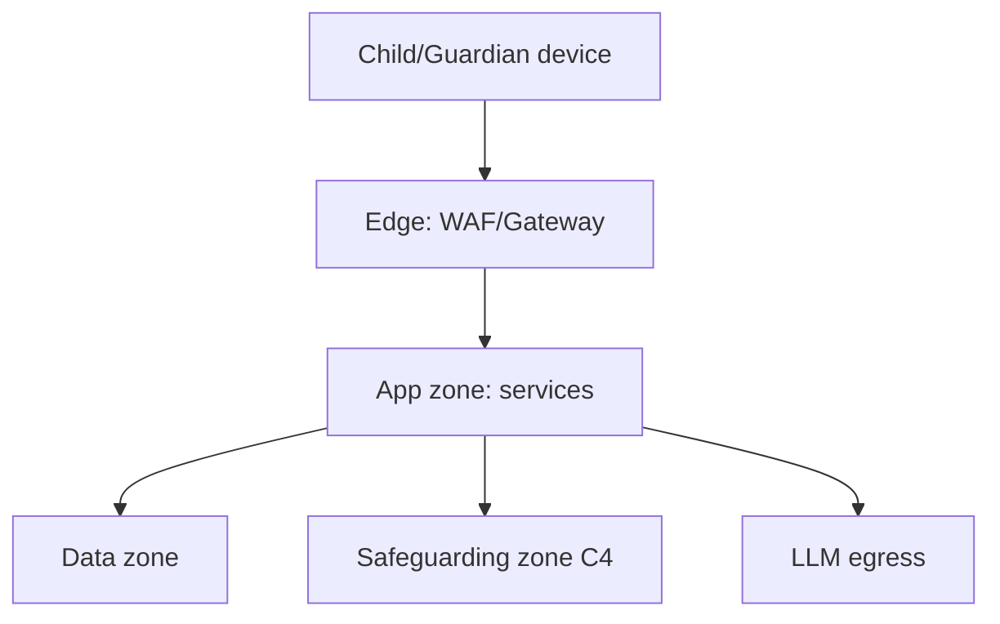

# 51 · Threat Model

| | |
|---|---|
| **Document ID** | 51 (Phase 1.5 remediation) |
| **Owner** | CISO / Head of Trust & Safety |
| **Status** | Draft |
| **Last updated** | 2026-07-19 |
| **Closes** | AR-C-02, AR-H-12 (household-as-adversary + formal threat model) |
| **Related** | [13 Security](./13-security-model.md) · [15 Child Safety](./15-child-safety-framework.md) · [11 Authentication](./11-authentication-strategy.md) · [12 Authorization](./12-authorization-model.md) |

## Purpose

This is the standalone threat-model artifact the blueprint referenced but lacked ([13 §2](./13-security-model.md)
had only a summary table). It decomposes threats per trust boundary with STRIDE, builds attacker-goal
trees for the named adversaries, and — critically — adds the **household/guardian as a first-class
adversary**, which the original design never modeled.

## Scope

In scope: assets, adversaries (incl. in-household), per-boundary STRIDE, attacker-goal trees, and the
control mapping. Out of scope: control *implementation* (owned by [11](./11-authentication-strategy.md)–[15](./15-child-safety-framework.md)).

---

## 1. The adversary the original design missed: the household

The blueprint's identity/oversight model assumed the guardian and household are safe. A large share of
child-safety incidents originate in the home. We add:

| Adversary | Goal | Capability |
|---|---|---|
| **Abusive guardian/household member** | Surveil, control, or silence the child; read the child's disclosures | Owns/controls the shared device; is the consent-holder; receives all notifications; can shoulder-surf the picture-PIN; may hold the guardian phone |

This adversary defeats several original controls (device-binding, guardian oversight, transcript access,
number-change notification). Countermeasures are now required (and partly applied):

| Threat | Control (see) |
|---|---|
| Guardian reads child's abuse disclosure via transcript access | Transcript confidentiality default + safeguarding carve-out ([12](./12-authorization-model.md), [15](./15-child-safety-framework.md)) |
| Household member logs in as child (shoulder-surfed PIN) | Distress-classified content never shown in child's own session UI; anti-shoulder-surf PIN entry ([11](./11-authentication-strategy.md)) |
| Guardian discovers the child used a safety feature | Discreet/disguised safety exit; quick-exit leaving no shared-history trace ([15](./15-child-safety-framework.md)) |
| Guardian exports child's full record as surveillance | Safeguarding carve-out on guardian access/export ([14](./14-privacy-model.md)) |
| Guardian re-points the account (number change) | Independent re-verification + safeguarding review; two-person institutional guardianship ([11](./11-authentication-strategy.md)) |

## 2. Assets & external adversaries (from [13 §2](./13-security-model.md), retained)

Ranked assets: safeguarding data (C4) > child PII/learning records > auth material > assessment
integrity > AI pipeline > availability. External adversaries: predator/groomer, opportunistic attacker,
malicious insider, fraudster, nation-state/hacktivist.

## 3. Per-boundary STRIDE

| Boundary | S | T | R | I | D | E |
|---|---|---|---|---|---|---|
| Device → Edge | Impersonation via stolen token/PIN | Tampered offline cache | — | Cache/transcript theft | OTP/SMS pump | — |
| Edge → App | Forged JWT | Request tampering | — | Verbose errors | L7 flood | — |
| App → Data | — | Cross-shard/tenant write | Audit gaps | Cross-tenant read (RLS bypass) | — | Priv-esc via missing PEP |
| App → Safeguarding (C4) | Insider spoof | Case tampering | **Audit tamper** | **C4 disclosure** | — | Insider elevation |
| App → LLM egress | — | Prompt injection | — | **Cross-border child disclosure** | Cost/DoS | Jailbreak → guardrail bypass |

Bolded cells are the highest-severity paths and map to Critical findings (AR-C-03/07/09/10/21).

## 4. Attacker-goal trees (abbreviated)

**Goal: reach/contact a specific child**

- via account takeover → guardian number-change (AR-C-09) → **now gated** by independent re-verification
- via unvetted mentor access (AR-H-19) → **gated** by vetting + scoped/time-bound access
- via unmonitored messaging (AR-H-01) → **gated** by in-platform moderated comms
- via classroom-device roster enumeration → gated by staff-unlock picker

**Goal: read a child's disclosures**

- via guardian transcript access (AR-C-03) → **gated** by confidentiality carve-out
- via in-household login (AR-C-10) → **gated** by not rendering distress content in child session
- via cross-border LLM copy (AR-C-07) → gated by in-region classification + zero-retention (DECISION REQUIRED)

## 5. Control-coverage matrix

Every bolded threat traces to a control in [11](./11-authentication-strategy.md)–[15](./15-child-safety-framework.md).
Threats with residual **DECISION REQUIRED** status (LLM residency, mandatory-reporting, lawful basis) are
tracked in [RISK_REMEDIATION_PLAN.md](../../RISK_REMEDIATION_PLAN.md) as Phase-2 blockers.

## Open questions

- Formal quantitative risk scoring per attack path once controls are implemented.
- Red-team validation of the household-adversary countermeasures with domain experts.
- Coverage of the collusion case (guardian + institutional guardian).

## Change log

| Date | Change | Author |
|---|---|---|
| 2026-07-19 | Initial threat model (Phase 1.5): household-as-adversary added, per-boundary STRIDE, attacker-goal trees, control-coverage matrix. | CISO / Head of T&S |
