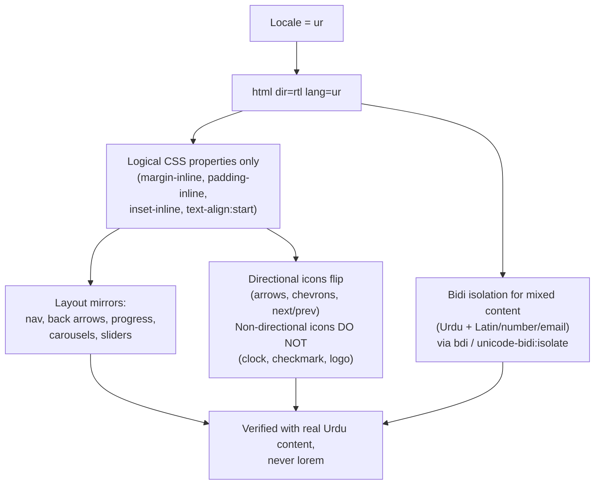

# 16 · Accessibility Standards

| | |
|---|---|
| **Document ID** | 16 |
| **Owner** | Head of Design + Accessibility Specialist |
| **Status** | Draft |
| **Last updated** | 2026-07-19 |
| **Related** | [01 Vision](../00-overview/01-vision.md) · [17 UI Design System](17-ui-design-system.md) · [18 Design Tokens](18-design-tokens.md) · [19 Component Library](19-component-library.md) · [20 Navigation](20-navigation-structure.md) · [15 Child Safety](../03-security-privacy/15-child-safety-framework.md) · [50 Definition of Done](../07-engineering/50-definition-of-done.md) |

## Purpose

This document defines the accessibility floor and the *concrete, testable* requirements every Taleem
surface must meet. It translates the Vision's principle "accessible to every child" into engineering
acceptance criteria: WCAG 2.2 AA is the minimum, extended for our real users — low-literacy,
Urdu-first/RTL, children on low-end Android phones. It exists so that "accessible" is never a matter
of opinion at review time.

## Scope

In scope: the normative accessibility requirements (WCAG 2.2 AA + Taleem extensions), the checklists,
the assistive-technology support matrix, the testing approach, and the Definition-of-Done acceptance
checklist. Out of scope: the visual token values (owned by [18](18-design-tokens.md)), per-component
implementation detail (owned by [19](19-component-library.md)), and safeguarding policy (owned by
[15](../03-security-privacy/15-child-safety-framework.md)).

---

## 1. Accessibility principles (the Taleem floor)

WCAG 2.2 Level AA is our **floor, not our target**. We formally exceed it in five areas because our
users demand it:

| # | Taleem extension beyond AA | Why |
|---|---|---|
| E1 | **Low-literacy support is mandatory**, not optional. Every actionable control pairs an icon **and** text, and every instructional text has an audio "read-aloud" affordance. | A guardian or young child may not read fluently. WCAG assumes literacy; our users may not have it. |
| E2 | **Touch targets ≥ 44×44 px** everywhere (WCAG 2.2 AA minimum is 24×24). | Shared low-end phones, small cracked screens, one-handed use, young motor skills. |
| E3 | **RTL and bidirectional correctness is a release blocker**, treated as a first-class functional requirement, not a "localization nicety". | Urdu is the primary language. A mirrored-but-broken layout fails the primary user. |
| E4 | **Reduced-motion and lite-mode are honoured by default** on slow links / low-end devices, not only when the OS flag is set. | Motion costs battery, CPU, and comprehension; many devices never expose the OS reduce-motion toggle. |
| E5 | **Cognitive load budget per screen** — a screen has one primary action, plain-Urdu language, and no time pressure unless pedagogically required (and then extendable). | Children, and first-time-internet users, are the design centre. |

**Non-negotiable:** these extensions are acceptance criteria. A surface that meets AA but fails E1–E5
is **not** done. See §12.

---

## 2. POUR conformance requirements

Structured against the four WCAG principles. Each row is a checkable requirement with its success
criterion (SC) reference where it maps to WCAG 2.2 AA.

### 2.1 Perceivable

| Req | Requirement | Maps to | How we verify |
|---|---|---|---|
| P1 | All non-text content (images, icons, illustrations) has a text alternative; decorative images use empty `alt=""` / `aria-hidden`. | 1.1.1 | axe + manual |
| P2 | Video lessons have synchronized **captions** in Urdu; audio-only content has a **transcript**. | 1.2.2, 1.2.3 | manual review |
| P3 | Information is not conveyed by **color alone** — always pair with icon, text, or pattern (e.g. correct/incorrect answer shows ✓/✗ + label, not just green/red). | 1.4.1 | manual |
| P4 | **Contrast:** normal text ≥ 4.5:1; large text (≥ 24 px, or ≥ 18.66 px bold) ≥ 3:1; UI components & graphical objects ≥ 3:1. See §3. | 1.4.3, 1.4.11 | automated (token pairings) + axe |
| P5 | Text reflows to a 320 px CSS width with **no horizontal scroll** and no loss of content. Content usable at **200% zoom**. | 1.4.4, 1.4.10 | manual @ 360px, 320px |
| P6 | Content and functionality do not depend on **device orientation** (portrait-first, landscape allowed). | 1.3.4 | manual |
| P7 | Text spacing overrides (line-height 1.5, paragraph 2×, letter 0.12em, word 0.16em) cause no clipping or overlap. | 1.4.12 | manual injection test |
| P8 | Content that appears on hover/focus is dismissible, hoverable, and persistent. | 1.4.13 | manual |

### 2.2 Operable

| Req | Requirement | Maps to | How we verify |
|---|---|---|---|
| O1 | **All functionality operable via keyboard**, no keyboard traps; logical tab order that follows reading order (RTL-aware). | 2.1.1, 2.1.2 | manual keyboard pass |
| O2 | **Touch targets ≥ 44×44 px** with ≥ 8 px spacing between adjacent targets. (Exceeds SC 2.5.8.) | 2.5.8 (extended) | automated measurement + manual |
| O3 | **Visible focus indicator** on every focusable element: ≥ 2 px, ≥ 3:1 contrast against adjacent colors, never removed. | 2.4.7, 2.4.11 | manual |
| O4 | No content **flashes** more than 3× per second. | 2.3.1 | manual |
| O5 | **Skip-to-content** link; descriptive page titles; headings and labels describe purpose; focus order preserves meaning. | 2.4.1–2.4.6 | manual |
| O6 | Any time limit is **adjustable, extendable, or removable** (min 10×). Assessments with timers show remaining time and warn before expiry; guardians/mentors can grant extended time. | 2.2.1 | manual |
| O7 | **Dragging alternatives**: any drag interaction (e.g. matching questions) has a single-tap alternative. | 2.5.7 | manual |
| O8 | Multi-step / pointer gestures have single-pointer alternatives; actions trigger on **up-event** (cancellable). | 2.5.1, 2.5.2 | manual |
| O9 | **Focus not obscured** by sticky headers, toasts, or keyboards when it moves. | 2.4.11, 2.4.12 | manual |
| O10 | **Consistent help** location and **no redundant re-entry** across multi-step flows (enrolment, assessment). | 3.2.6, 3.3.7 | manual |

### 2.3 Understandable

| Req | Requirement | Maps to | How we verify |
|---|---|---|---|
| U1 | Page language declared (`lang="ur"` / `lang="en"`) and `dir="rtl"`/`dir="ltr"`; inline language changes marked (`lang` on spans). | 3.1.1, 3.1.2 | axe + manual |
| U2 | Navigation and component identity are **consistent** across the app (same icon = same meaning everywhere). | 3.2.3, 3.2.4 | manual |
| U3 | No **unexpected context change** on focus or input; changes require an explicit activation. | 3.2.1, 3.2.2 | manual |
| U4 | **Plain-Urdu content**: short sentences, concrete words, one idea per line; reading level appropriate to the target grade. | 3.1.5 (aim) | content review |
| U5 | Instructions never rely solely on sensory characteristics ("tap the round button" not "tap the button on the left"). | 1.3.3 | manual |

### 2.4 Robust

| Req | Requirement | Maps to | How we verify |
|---|---|---|---|
| R1 | Valid, well-formed markup; no duplicate IDs; correct nesting. | 4.1.1 (parsing) | linter + axe |
| R2 | All custom components expose correct **name, role, value** via ARIA and fire state-change notifications. | 4.1.2 | manual + AT |
| R3 | **Status messages** (save success, sync complete, "answer correct") announced via `role="status"`/`aria-live` without moving focus. | 4.1.3 | AT (screen reader) |
| R4 | Progressive enhancement: **core content and navigation work without client JS** (Server Components default). | Robustness principle | manual (JS off) |

---

## 3. Color & contrast rules

Contrast is enforced at the **token layer** ([18 Design Tokens](18-design-tokens.md)) so it cannot be
violated per-screen. Every semantic foreground/background pairing ships with a verified ratio.

| Content type | Minimum ratio | Rule |
|---|---|---|
| Body text, labels | **4.5:1** | Non-negotiable. Ink `#111827` on Paper `#FAFAF7` ≈ 16.9:1. |
| Large text (≥24px / ≥18.66px bold) | **3:1** | Headlines, display. |
| UI component boundaries, icons, focus rings, states | **3:1** | Against adjacent colors, not just page background. |
| Disabled elements | exempt | But must still be perceivable + explained (no color-only). |
| Reward/celebration accents (Sun `#F59E0B`) | never sole carrier | Decorative; text on it must independently pass. |

**Rules of use:**

1. **Color is never the only signal** (P3). Correct/incorrect, online/offline, selected/unselected all
   carry an icon + text label in addition to color.
2. **High-contrast mode** (§ theming in [17](17-ui-design-system.md)) raises all pairings toward ≥ 7:1
   (WCAG AAA-level) for low-vision students; it is one tap from the settings and remembered per device.
3. Brand green `#0E7C5A` is **not** used for small body text on paper without verification — it passes
   at ~4.8:1 on Paper, so it is allowed for ≥ normal text, but the token file is the authority.
4. Do not place text over photographic imagery without a scrim that restores ≥ 4.5:1.

> **Enforcement:** the token contrast table in [18](18-design-tokens.md) is validated in CI. A new
> color pairing that fails its target ratio fails the build.

---

## 4. Touch targets & pointer

| Rule | Value |
|---|---|
| Minimum interactive target | **44 × 44 px** (CSS px) |
| Spacing between adjacent targets | ≥ 8 px |
| Primary action target (child-facing) | ≥ 48 × 48 px, aim 56 px height for the main CTA |
| Hit-slop | Visual control may be smaller if the *tappable* area (padding/pseudo-element) meets 44 px |
| Thumb-reach | Primary actions in the **bottom two-thirds** of the viewport for one-handed 360px use |

Rationale: shared, cracked, low-DPI screens and young or unsteady fingers. This exceeds WCAG 2.2 SC
2.5.8 (24 px) deliberately (extension E2).

---

## 5. Keyboard & screen-reader support

Although the primary device is touch, keyboard operability is required for external keyboards,
switch-access users, and as the substrate that makes screen readers work.

**Keyboard requirements:** every interactive element focusable and operable (Enter/Space activate,
Esc closes overlays, arrow keys move within composite widgets — RTL-aware so `←`/`→` map to visual
direction), a visible focus ring (O3), a skip link, and **no traps**. Focus is *managed* on route
change, modal open/close (focus trapped inside modal, returned to trigger on close), and toast
appearance (announced, not focused).

**Screen-reader requirements** (primary AT: **TalkBack** on Android):

| Requirement | Implementation |
|---|---|
| Correct semantics | Native HTML first (`<button>`, `<a>`, `<input>`, headings). ARIA only to fill gaps. |
| Names & roles | Every control has an accessible name (visible label, `aria-label`, or `aria-labelledby`) in the active language. |
| Live regions | `role="status"` for polite updates (saved, synced), `role="alert"` for errors. |
| Reading order | DOM order = visual reading order; verified in RTL. |
| Language switches | `lang` attribute so TalkBack loads the correct TTS voice (Urdu vs English). |
| Grouping | Related controls grouped (`fieldset`/`legend`, `role="group"`) so a child isn't lost. |

---

## 6. RTL & bidirectional text correctness

RTL is a **functional requirement**, not styling. See [17 §RTL](17-ui-design-system.md) for the
implementation system; the *acceptance* rules live here.

| Rule | Requirement |
|---|---|
| B1 | Use **logical CSS properties** (`margin-inline-start`, `inset-inline-end`, `text-align: start`) — never hardcoded `left`/`right`. |
| B2 | Layout, navigation, back/forward, progress bars, and carousels **mirror** in RTL. |
| B3 | **Directional icons flip** (arrows, chevrons, next/prev, send). **Non-directional icons do not** (checkmark, logo, clock, media play — play stays pointing to timeline start per platform convention; documented per-icon in [19](19-component-library.md)). |
| B4 | **Bidi isolation** for mixed-direction runs: Urdu text containing Latin words, phone numbers, emails, URLs, or Western/Eastern-Arabic numerals uses `<bdi>` / `unicode-bidi: isolate` so ordering never scrambles. |
| B5 | **Numerals**: choose Eastern-Arabic vs Western-Arabic numerals per locale policy (planning assumption: Western digits for marks/IDs for board-recognition compatibility, configurable). Consistent within a view. |
| B6 | Nastaʿlīq line-height and letter-spacing are **not** compressed; text truncation respects grapheme clusters (never mid-ligature). |
| B7 | Every RTL screen is verified with **real Urdu strings**, never Latin placeholder — a Taleem release-blocker rule. |

---

## 7. Low-literacy support

The defining Taleem extension (E1). Many students are early readers and many guardians read little.

| Mechanism | Requirement |
|---|---|
| **Icon + text pairing** | Every actionable control shows a recognizable icon **and** a short text label. Icons never stand alone for actions. |
| **Audio-first / read-aloud** | Every instruction, question, and key screen has a "🔊 read aloud" control. Pre-recorded audio where available; TTS fallback. Audio is cached for offline. |
| **Picture-password / PIN option** | Young students authenticate with a **picture password** or numeric PIN, not typed credentials (see [19](19-component-library.md) PIN/PicturePassword). |
| **Progressive disclosure** | One idea per screen; long text chunked; "show more" rather than walls of text. |
| **Consistent visual vocabulary** | Same concept always uses the same icon + color + word (U2). A mini "how to read this screen" is available. |
| **Plain Urdu** | Short sentences, concrete nouns, active voice; avoid idiom and rare vocabulary; reading level matched to grade. |
| **No literacy gate on core actions** | A child can start a lesson, answer, and progress driven by audio + icons even if they cannot yet read fluently. |

---

## 8. Motion, media & forms

### 8.1 Reduced motion (E4)

- Honour `prefers-reduced-motion: reduce`. **Additionally**, lite-mode / detected low-end device /
  slow link disables non-essential motion by default (see [17](17-ui-design-system.md) lite mode).
- Motion is decorative-only for meaning: no information is conveyed solely by animation.
- Provide instant, non-animated equivalents; celebrations (StreakBadge) degrade to a static state.
- Parallax, auto-playing carousels, and looping background animation are prohibited.

### 8.2 Captions & transcripts

- Video lessons: **synchronized Urdu captions** (SC 1.2.2). Caption styling respects contrast and can
  be enlarged. Captions are packaged for **offline** with the lesson.
- Audio-only content: full **transcript** (SC 1.2.3), also offline-available.
- Auto-generated captions must be human-reviewed before publish for instructional content.

### 8.3 Form accessibility

| Rule | Requirement |
|---|---|
| F1 | Every input has a **persistent visible label** (not placeholder-as-label). |
| F2 | Labels programmatically associated (`<label for>` / `aria-labelledby`). |
| F3 | Required fields marked in text ("ضروری" / "required"), not color/asterisk alone. |
| F4 | Input purpose declared (`autocomplete`, `inputmode`, `type`) so numeric fields raise numeric keypads and the browser can assist (SC 1.3.5). |
| F5 | Grouped inputs use `fieldset`/`legend`. |
| F6 | No redundant re-entry of data already provided in a flow (SC 3.3.7). |
| F7 | **Accessible authentication** (SC 3.3.8): no cognitive-function test (no puzzle, no transcription) required to log in — PIN/picture-password + device trust satisfy this. |

### 8.4 Error handling

| Rule | Requirement |
|---|---|
| EH1 | Errors are **identified in text**, adjacent to the field, and announced (`aria-describedby` + `role="alert"`). |
| EH2 | Error messages are **plain, kind, and instructive** ("Enter your 4-digit PIN" not "Invalid input"). Never blame a child. |
| EH3 | **Suggestions** provided when a fix is known (SC 3.3.3). |
| EH4 | Destructive / high-stakes actions (submit exam, leave lesson) are **reversible or confirmed** (SC 3.3.4/3.3.6). |
| EH5 | Errors carry an audio read-aloud (E1). Offline/sync errors explain state calmly ("saved on your phone, will send when online"). |

---

## 9. Cognitive accessibility for children (E5)

| Principle | Requirement |
|---|---|
| One primary action per screen | The main CTA is the largest, warmest, most obvious element. Secondary actions are visually subordinate. |
| No time pressure by default | Timers only where pedagogically required; always extendable (O6); no dark-pattern countdowns. |
| Predictability | Consistent layout, navigation, and vocabulary (U2); the child is never surprised. |
| Forgiveness | Mistakes are low-stakes and recoverable; encouraging, non-punitive feedback; a wrong answer never shames. |
| Memory support | Progress is saved and resumable; the app remembers where the child was; no requirement to hold state in their head. |
| Attention & calm | Warm, uncluttered visuals; minimal simultaneous stimuli; no flashing, no aggressive notification storms. |
| Safety-aligned | Cognitive-accessibility choices must also satisfy [15 Child Safety](../03-security-privacy/15-child-safety-framework.md) (age-appropriate, no manipulative patterns). |

---

## 10. Assistive-technology support matrix

Primary environment is **low-end Android + Chrome + TalkBack**; we support the realistic set.

| AT / setting | Platform | Support level | Notes |
|---|---|---|---|
| **TalkBack** | Android (Chrome) | **Full — primary** | Reference screen reader for all manual audits. |
| **Chrome/Android font scaling** & pinch-zoom | Android | **Full** | Reflow to 200%, 320px (P5). |
| **High-contrast / color-inversion** (OS) | Android | **Full** | Plus our in-app high-contrast theme. |
| **Switch Access** | Android | **Supported** | Keyboard-operability substrate (O1) makes this work. |
| **External keyboard** | Android/desktop | **Supported** | Full keyboard pass (§5). |
| **VoiceOver** | iOS/Safari | **Supported** | PWA on iOS; validated but secondary. |
| **NVDA / VoiceOver desktop** | Desktop browsers | **Best-effort** | Mentor/Admin portals; not the child device. |
| **Voice control / dictation** | Android | **Best-effort** | Accessible names make targets addressable. |

---

## 11. Testing approach

Three layers; **all three are required** for a surface to pass.

```mermaid
flowchart LR
    subgraph Automated["1 · Automated (every PR, CI)"]
        A1["axe-core / jest-axe<br/>on components + pages"]
        A2["ESLint jsx-a11y"]
        A3["Token contrast validator"]
        A4["Lighthouse a11y budget"]
    end
    subgraph Manual["2 · Manual (per feature)"]
        M1["Keyboard-only pass"]
        M2["RTL pass w/ real Urdu"]
        M3["200% zoom / 320px reflow"]
        M4["Color-only & contrast spot"]
        M5["Cognitive-load review"]
    end
    subgraph AT["3 · Assistive-tech (per feature)"]
        T1["TalkBack on low-end Android"]
        T2["Switch Access spot-check"]
        T3["Low-literacy walkthrough<br/>(icons+audio only)"]
    end
    Automated --> Manual --> AT --> Gate["DoD gate (§12)"]
```

**Layer 1 — Automated (blocks merge):** `jest-axe` on every component, `eslint-plugin-jsx-a11y` in
lint, the [18](18-design-tokens.md) contrast validator, and a Lighthouse accessibility score budget in
CI. Automated tooling catches ~30–40% of issues (planning assumption) — necessary, never sufficient.

**Layer 2 — Manual (per feature):** the checklist in §12, run by the implementer and verified in
review. Includes the keyboard pass, the **RTL-with-real-Urdu** pass, 200%/320px reflow, and a
color-only check.

**Layer 3 — Assistive-tech (per feature):** a **TalkBack pass on an actual low-end Android device**,
Switch Access spot-check, and a **low-literacy walkthrough** where the tester completes the flow using
only icons + audio (no reading). Regressions on the core learning path (login → lesson → submit) are
release blockers.

**Device lab (planning assumption):** a small fleet of representative low-end Androids (≤ 2 GB RAM,
Android Go, 360 px) throttled to 3G is the reference for perf-adjacent accessibility (reflow, tap
accuracy, motion).

---

## 12. Acceptance checklist (Definition of Done)

Copy this into the PR/feature DoD. A surface is **not done** until every box that applies is checked.
This checklist is referenced by [50 Definition of Done](../07-engineering/50-definition-of-done.md).

**Perceivable**
- [ ] All images/icons have correct text alternatives; decorative ones are hidden.
- [ ] No information conveyed by color alone (icon + text accompany every state).
- [ ] All text/UI meets contrast (§3) via approved tokens; no ad-hoc colors.
- [ ] Reflows at 320px and usable at 200% zoom with no horizontal scroll.
- [ ] Video has Urdu captions; audio-only has a transcript; both offline-available.

**Operable**
- [ ] Fully keyboard-operable; logical, RTL-aware tab order; no traps; skip link present.
- [ ] All touch targets ≥ 44×44 px with ≥ 8 px spacing; primary CTA reachable one-handed at 360px.
- [ ] Visible ≥ 2 px focus indicator (≥ 3:1) on every focusable element.
- [ ] Any time limit is adjustable/extendable/removable; drag/gesture has a tap alternative.
- [ ] Focus is managed on route/modal/toast; never obscured.

**Understandable**
- [ ] `lang` + `dir` correct; inline language changes marked.
- [ ] RTL verified with **real Urdu** content; bidi isolation on mixed runs; icons flip/preserve correctly.
- [ ] Consistent icon = meaning across app; no unexpected context change on focus/input.
- [ ] Plain-Urdu content at the right reading level; instructions not sensory-only.
- [ ] One primary action per screen; no dark patterns; errors are kind and instructive.

**Robust**
- [ ] Valid markup, no duplicate IDs; custom widgets expose name/role/value/state.
- [ ] Status messages announced via live regions without stealing focus.
- [ ] Core content + navigation work with client JS disabled.

**Taleem extensions (E1–E5)**
- [ ] Every action has icon **and** text; every instruction has read-aloud audio.
- [ ] Low-literacy walkthrough passed (completed using icons + audio only).
- [ ] Reduced-motion honoured; degrades gracefully in lite-mode / low-end / slow link.
- [ ] Accessible authentication (PIN/picture-password) — no cognitive test to log in.

**Verification evidence attached**
- [ ] `jest-axe` passing; Lighthouse a11y budget met; token contrast validator green.
- [ ] TalkBack pass on a low-end Android recorded/noted.

---

## Open questions

- **Numeral policy** (B5): Eastern-Arabic vs Western digits for marks and IDs — pending board-recognition
  guidance from the business/Curriculum track.
- **Urdu TTS quality/licensing** for read-aloud fallback where no recorded audio exists — evaluation of
  on-device vs server TTS and its data-cost impact (coordinate with [Media] context).
- **Lighthouse a11y numeric budget** — set the exact CI threshold after baselining representative pages.
- **Sindhi/Pashto/Punjabi/Balochi** accessibility specifics (script shaping, TTS) — deferred with the
  language rollout ([01 Vision](../00-overview/01-vision.md) open questions).
- **Formal audit / user testing with disabled children and low-literacy guardians** — cadence and
  partner TBD; strongly recommended before GA.

## Change log

| Date | Change | Author |
|---|---|---|
| 2026-07-19 | Initial draft: WCAG 2.2 AA floor + Taleem extensions E1–E5, POUR requirements, contrast/touch/keyboard/SR/RTL/low-literacy rules, AT matrix, 3-layer testing, DoD checklist. | Head of Design + Accessibility Specialist |
