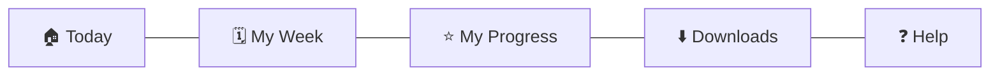

# 20 · Navigation Structure

| | |
|---|---|
| **Document ID** | 20 |
| **Owner** | Head of Product Design |
| **Status** | Draft (Phase 1) |
| **Last updated** | 2026-07-19 |
| **Related** | [07 Information Architecture](../01-product/07-information-architecture.md) · [17 UI Design System](./17-ui-design-system.md) · [19 Component Library](./19-component-library.md) · [16 Accessibility](./16-accessibility-standards.md) · [12 Authorization](../03-security-privacy/12-authorization-model.md) · [26 Student Portal](../06-portals/26-student-portal.md) |

## Purpose

This document defines the **navigation structure** for each Taleem surface — the concrete menus, tab
bars, routes, and wayfinding that implement the information architecture ([07 IA](../01-product/07-information-architecture.md))
using the component library ([19](./19-component-library.md)). It fixes navigation patterns, labelling,
authorization-aware navigation, and offline wayfinding.

## Scope

In scope: per-surface navigation models, route structure, labelling/glossary, and navigation rules
(authorization, accessibility, offline). Out of scope: IA rationale ([07](../01-product/07-information-architecture.md)),
component internals ([19](./19-component-library.md)), and portal screen detail ([06-portals/*](../06-portals/26-student-portal.md)).

---

## 1. Navigation principles

1. **Shallow and obvious** — the "next right thing" is always visible; child surfaces are ≤ 5
   top-level destinations ([07 §4](../01-product/07-information-architecture.md)).
2. **Authorization-aware** — navigation never shows a link a role cannot use ([12](../03-security-privacy/12-authorization-model.md)).
3. **Not JS-locked** — navigation works without heavy client JS and within the payload budget
   ([04 NFR DATA-01](../01-product/04-non-functional-requirements.md)).
4. **Offline-aware** — availability is a navigational signal ([33](../02-architecture/33-offline-architecture.md)).
5. **Urdu-first, icon+text** — labels are plain, localised, RTL-correct ([16](./16-accessibility-standards.md)).
6. **Safety always reachable** — safety help is one tap from every child/guardian screen
   ([15](../03-security-privacy/15-child-safety-framework.md)).

## 2. Student App navigation

**Pattern:** bottom navigation (thumb-reachable), ≤ 5 destinations, plus a persistent Help affordance.

| Destination | Route | Offline |
|---|---|---|
| Today | `/` | ✅ (day-pack) |
| My Week | `/week` | ✅ |
| My Progress | `/progress` | Partial (last-synced) |
| Downloads | `/downloads` | ✅ |
| Help | `/help` | Safety help always cached |

- **Lesson runtime** is a full-screen route reached from Today/My Week; the **AI Teacher** is entered
  *within* a lesson, not a top-level tab ([07 §4](../01-product/07-information-architecture.md), [FR-AIT-001](../01-product/03-functional-requirements.md)).
- **Profile picker** ("Who's learning?") precedes the app on shared devices ([11 §6](../03-security-privacy/11-authentication-strategy.md)).

## 3. Guardian Portal navigation

| Destination | Route |
|---|---|
| My Children | `/children` (child switcher at top) |
| Report Cards | `/report-cards` |
| Messages | `/messages` |
| Consent & Privacy | `/privacy` |
| Help | `/help` |

Read-and-acknowledge first; heavy writes are consent management and raising a concern ([07 §5](../01-product/07-information-architecture.md)).

## 4. Mentor Portal navigation

| Destination | Route |
|---|---|
| My Cohorts | `/cohorts` |
| Needs Attention | `/attention` (AI escalations, at-risk) |
| Grading | `/grading` |
| Students | `/students` |
| Messages | `/messages` |
| Safety | `/safety` |

"Needs Attention" is foregrounded — the Mentor's core value ([07 §6](../01-product/07-information-architecture.md), [28 Mentor](../06-portals/28-mentor-portal.md)).

## 5. Admin / Platform / Safety / Authoring (desktop) navigation

Desktop sidebar navigation with breadcrumbs ([07 §7/§9](../01-product/07-information-architecture.md)):

| Surface | Sidebar sections |
|---|---|
| School Admin | Enrolment · Cohorts · Timetables · Mentors · Reports |
| Platform Admin | Curriculum Publishing · Flags/Config · Users & Roles · Audit · Operations |
| Trust & Safety | Triage · Cases · Escalations · Audit · Policy |
| Curriculum Authoring | Subjects · Units/Lessons · Objectives · Standards · Versions |

## 6. Labelling & glossary

Canonical, Urdu-first labels (owned here + localisation):

| Concept | Label (English) | Notes |
|---|---|---|
| Home/today | "Today" | Warm, present-tense |
| Timetable | "My Week" | Not "Schedule" |
| AI tutor | "Ask the AI Teacher" | Always AI-labelled |
| Progress | "My Progress" | |
| Report card | "Report Card" | Verifiable proof |
| Triage queue | "Needs Attention" (Mentor) / "Triage" (Safety) | Role-appropriate |

Urdu equivalents are finalised with educators so they read naturally, not as translated jargon
([07 open Qs](../01-product/07-information-architecture.md)).

## 7. Navigation rules

| Rule | Authority |
|---|---|
| No link to a resource the role cannot access; menus render per authorization. | [12](../03-security-privacy/12-authorization-model.md) |
| Keyboard-navigable, visible focus, screen-reader landmarks. | [16](./16-accessibility-standards.md) |
| Navigation shell within the JS budget; not JS-dependent to render. | [04 NFR DATA-01](../01-product/04-non-functional-requirements.md) |
| Current location + back are always obvious (one-handed). | [07 §9](../01-product/07-information-architecture.md) |
| Availability (offline/online) shown on nav items. | [33](../02-architecture/33-offline-architecture.md) |
| Safety help reachable from every child/guardian screen. | [15](../03-security-privacy/15-child-safety-framework.md) |

## Open questions

- **4 vs. 5 Student destinations** — fold Downloads into Today? (Usability test with children,
  [07 open Qs](../01-product/07-information-architecture.md).)
- **Child-switcher pattern** for multi-child guardians on a shared device.
- **Search entry point** placement per surface ([32 Search](../02-architecture/32-search-architecture.md)).

## Change log

| Date | Change | Author |
|---|---|---|
| 2026-07-19 | Initial navigation structure: per-surface nav models, routes, labelling/glossary, and authorization/accessibility/offline navigation rules. | Head of Product Design |
