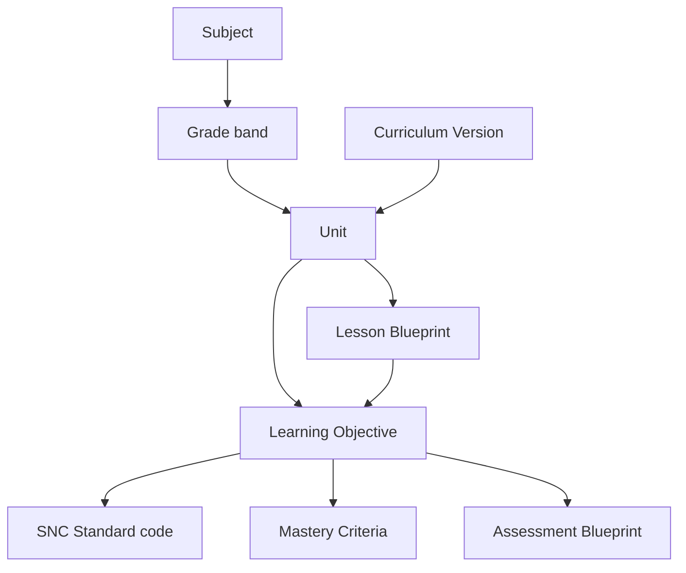
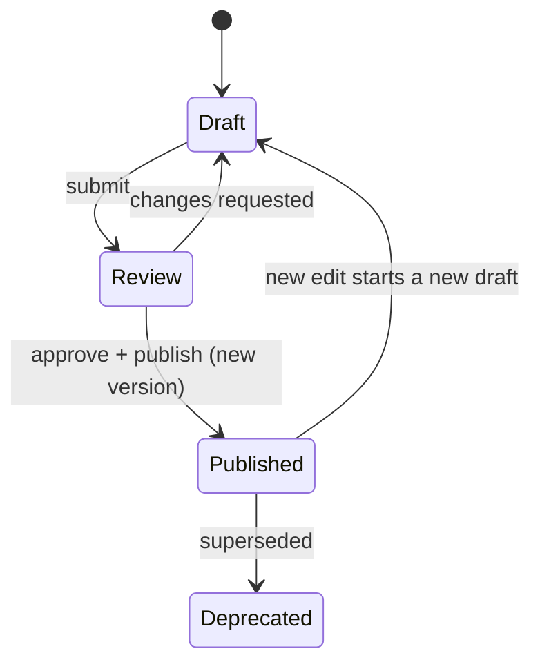

# 21 · Curriculum Engine Specification

| | |
|---|---|
| **Document ID** | 21 |
| **Owner** | Chief Learning Officer / Curriculum Architect Lead |
| **Status** | Draft (Phase 1) |
| **Last updated** | 2026-07-19 |
| **Related** | [02 PRD](../01-product/02-prd.md) · [22 Lesson Engine](./22-lesson-engine.md) · [23 Assessment Engine](./23-assessment-engine.md) · [24 AI Teacher](./24-ai-teacher-specification.md) · [09 Database](../02-architecture/09-database-design.md) · [08 Architecture](../02-architecture/08-system-architecture.md) · [Authoring Brief §3](../_meta/authoring-brief.md) |

## Purpose

This document specifies the **Curriculum context** — the spine of the school. It defines how the
Single National Curriculum (SNC) is modelled **as data** (subjects → grades → units → learning
objectives), how objectives map to standards and carry **mastery criteria**, how curriculum is
**versioned**, and how it feeds the Lesson, Assessment, and AI Teacher engines. Curriculum-as-data is
what lets Taleem add subjects, grades, and boards without a schema change ([FR-CUR-001](../01-product/03-functional-requirements.md)).

## Scope

In scope: the curriculum data model, standards mapping, mastery criteria, versioning, authoring, and
the contracts to downstream engines. Out of scope: lesson runtime ([22](./22-lesson-engine.md)),
assessment mechanics ([23](./23-assessment-engine.md)), AI grounding internals ([24](./24-ai-teacher-specification.md)),
and physical schema ([09](../02-architecture/09-database-design.md)).

---

## 1. Principles

1. **Curriculum is data, never code** — Curriculum Architects add/modify curriculum with no deploy
   ([FR-CUR-001](../01-product/03-functional-requirements.md)).
2. **Standards-mapped and traceable** — every objective maps to an SNC standard; a child's learning
   traces to a curriculum version ([FR-CUR-002/003](../01-product/03-functional-requirements.md)).
3. **Mastery-based** — objectives carry machine-readable mastery criteria the other engines consume
   ([Authoring Brief §3](../_meta/authoring-brief.md)).
4. **Extensible without schema change** — new subjects, grades, boards, and languages are data overlays
   ([FR-CUR-004/005](../01-product/03-functional-requirements.md)).
5. **Culturally grounded & neutral** — age-appropriate, respectful on religion and gender
   ([Authoring Brief §3](../_meta/authoring-brief.md), [15 §8](../03-security-privacy/15-child-safety-framework.md)).

## 2. The curriculum model

| Entity | Meaning |
|---|---|
| **Subject** | Urdu, English, Maths, Science, **Religious Education (Islamiat ↔ Ethics/Akhlaqiat, student-attribute-driven track — audit AR-C-20)**, Social/Pakistan Studies ([Authoring Brief §3](../_meta/authoring-brief.md)) |
| **Grade band** | KG–Grade 10 |
| **Unit** | A themed group of lessons within subject+grade |
| **Learning Objective** | The atomic "thing to master"; the north-star unit of value |
| **SNC Standard** | The national standard code an objective satisfies |
| **Mastery Criteria** | Machine-readable rule defining "mastered" |
| **Lesson Blueprint** | What a lesson teaching this unit/objective looks like (consumed by [22](./22-lesson-engine.md)) |
| **Assessment Blueprint** | How an objective is assessed (consumed by [23](./23-assessment-engine.md)) |
| **Curriculum Version** | Immutable published snapshot |

## 3. Learning objectives & mastery criteria

- An **objective** is the smallest gradable, teachable unit and the currency of the **north-star**
  ("objectives mastered", [01 Vision §6](../00-overview/01-vision.md)).
- Each objective carries **mastery criteria** — a machine-readable rule (e.g. "≥ N of M items correct
  across ≥ K attempts on distinct items, without hints on the final attempt") — consumed by
  [23 Assessment](./23-assessment-engine.md) and [22 Lesson](./22-lesson-engine.md) ([FR-CUR-006](../01-product/03-functional-requirements.md)).
- The **exact mastery threshold is an open question** shared with Assessment (§Open questions) — the
  model supports it; the value is being calibrated.

## 4. Standards mapping

- Every objective maps to ≥ 1 **SNC standard code** ([FR-CUR-002](../01-product/03-functional-requirements.md));
  a coverage report flags **unmapped objectives and uncovered standards** as errors.
- Mapping is **many-to-many** (one standard may need several objectives; one objective may satisfy
  several standards).
- **Board/provincial variance** is modelled as a **standards overlay** on the SNC spine, lit up in v2
  without touching the base ([FR-CUR-005](../01-product/03-functional-requirements.md)).

## 5. Versioning (immutability)

- Editing a **published** unit creates a **new `curriculum_version`**; published versions are
  **immutable** ([FR-CUR-003](../01-product/03-functional-requirements.md), [09 §5](../02-architecture/09-database-design.md)).
- Every learner record, report card, and mastery event **cites the exact version learned against** —
  so a child's history is reproducible even as curriculum evolves.
- `CurriculumVersionPublished` fans out to Lesson, Assessment, Search, and Media ([08 §5](../02-architecture/08-system-architecture.md)).

## 6. Authoring workflow

- **Curriculum Architects** author subjects/units/objectives/blueprints and map standards in the
  authoring surface ([07 §7](../01-product/07-information-architecture.md)), no deploy required.
- Content passes **age-appropriateness + accuracy review** before publish ([15 §4](../03-security-privacy/15-child-safety-framework.md),
  [FR-ADM-002](../01-product/03-functional-requirements.md)); publishing is gated, audited, reversible.
- Draft → review → publish is the version state machine (§5).

## 7. Contracts to downstream engines

| Consumer | Consumes | Contract |
|---|---|---|
| **Lesson Engine** ([22](./22-lesson-engine.md)) | Published units, lesson blueprints, objectives | Conformist/published-language ([08 §5.1](../02-architecture/08-system-architecture.md)) |
| **Assessment Engine** ([23](./23-assessment-engine.md)) | Objectives + mastery criteria + assessment blueprints | Read via API/events |
| **AI Teacher** ([24](./24-ai-teacher-specification.md)) | Published curriculum content for **RAG grounding** | Indexed, version-pinned |
| **Search** ([32](../02-architecture/32-search-architecture.md)) | Curriculum content | Projection |

Curriculum is **read-only to consumers**; it is the sole writer of curriculum data ([ADR-0002](../02-architecture/adr/ADR-0002-database-per-context.md)).

## 8. Scope v1

- **KG–Grade 5** at MVP, **KG–Grade 10** at v1; v1 core subjects ([02 PRD §4](../01-product/02-prd.md)).
- **Urdu primary, English secondary** medium; additional languages as first-class overlays later
  ([Authoring Brief §3](../_meta/authoring-brief.md)).
- Provincial/board variance modelled now, lit up in v2.

## 9. Risks

| # | Risk | Impact | Mitigation |
|---|---|---|---|
| R-1 | Hardcoded curriculum creeps into code | Loses extensibility | Curriculum-as-data + CI check; no curriculum literals in product code. |
| R-2 | Unmapped objectives / standard gaps | Untraceable learning | Coverage report gates publish. |
| R-3 | Mutating published curriculum breaks history | Non-reproducible records | Immutable versions; edits create new versions. |
| R-4 | Mastery criteria ambiguous | North-star ungameable-ness at risk | Machine-readable criteria; locked with [23](./23-assessment-engine.md). |
| R-5 | Culturally insensitive content | Child harm / distrust | Age-appropriate + accuracy review before publish ([15](../03-security-privacy/15-child-safety-framework.md)). |

---

## Open questions

- **Mastery threshold** — the precise rule for "objective mastered" (shared with [23](./23-assessment-engine.md)
  and [02 PRD](../01-product/02-prd.md)).
- **SNC mapping source** — canonical machine-readable standard codes and provincial variance data.
- **Objective granularity** — how fine to slice objectives so the north-star is meaningful but not
  gameable.
- **Prerequisite graph** — **resolved** (audit AR-C-15): promoted from a future open question to a **v1
  core entity** (objective DAG with `prerequisite_of` edges); the model, gating, and remediation routing
  are specified in [58 Mastery & Assessment Validity](./58-mastery-and-assessment-validity.md). Without it,
  "mastery-based progression" degrades to linear seat-order.
- **Religious-education track** — Islamiat ↔ Ethics/Akhlaqiat is captured at enrolment and reflected on
  the report card; content-review adds a minority-representation check (audit AR-C-20).

## Change log

| Date | Change | Author |
|---|---|---|
| 2026-07-19 | Initial curriculum engine: curriculum-as-data model, objectives + mastery criteria, standards mapping, immutable versioning, authoring workflow, downstream contracts. | Chief Learning Officer |
