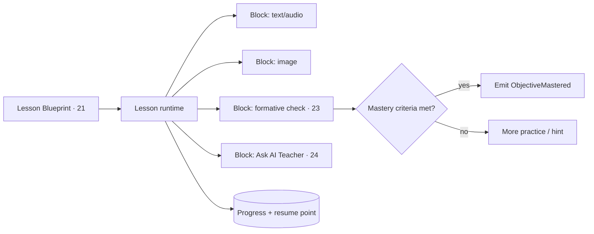

# 22 · Lesson Engine

| | |
|---|---|
| **Document ID** | 22 |
| **Owner** | Chief Learning Officer / Lesson Delivery Lead |
| **Status** | Draft (Phase 1) |
| **Last updated** | 2026-07-19 |
| **Related** | [21 Curriculum Engine](./21-curriculum-engine.md) · [23 Assessment Engine](./23-assessment-engine.md) · [24 AI Teacher](./24-ai-teacher-specification.md) · [33 Offline](../02-architecture/33-offline-architecture.md) · [34 Media](../02-architecture/34-media-architecture.md) · [19 Components](../04-design/19-component-library.md) · [04 NFR](../01-product/04-non-functional-requirements.md) |

## Purpose

This document specifies the **Lesson Delivery context** — the runtime a child actually experiences: how
a lesson blueprint from [21 Curriculum](./21-curriculum-engine.md) becomes an ordered, resumable,
offline-capable sequence of content blocks; how progress and mastery are tracked; how the AI Teacher is
invoked in-lesson; and how the whole thing stays inside the data and performance budgets for a low-end
device.

## Scope

In scope: lesson runtime, content-block model, progress/resume, mastery signalling, in-lesson AI
invocation, offline behaviour, and pedagogy (mastery-based, spaced retrieval). Out of scope: curriculum
authoring ([21](./21-curriculum-engine.md)), assessment scoring ([23](./23-assessment-engine.md)), AI
internals ([24](./24-ai-teacher-specification.md)), and the sync protocol ([33](../02-architecture/33-offline-architecture.md)).

---

## 1. Principles

1. **A structured day, not a content shelf** — lessons follow the timetable and curriculum spine
   ([01 Vision §3](../00-overview/01-vision.md)).
2. **Mastery-based progression** — a child advances by demonstrating mastery, not by time spent
   ([Authoring Brief §3](../_meta/authoring-brief.md)).
3. **Resumable and offline-first** — a child resumes exactly where they stopped, online or off
   ([FR-LSN-002/003](../01-product/03-functional-requirements.md)).
4. **Budget-bound** — every lesson loads within the payload budget in lite mode ([04 NFR DATA-02](../01-product/04-non-functional-requirements.md)).
5. **Formative-first, low-stakes** — frequent low-stakes practice with immediate feedback
   ([Authoring Brief §3](../_meta/authoring-brief.md)).

## 2. The lesson runtime

- A **lesson** is an ordered set of **content blocks** rendered by the runtime ([FR-LSN-001](../01-product/03-functional-requirements.md),
  [19 LessonBlock](../04-design/19-component-library.md)).
- Block types (v1): **text**, **image**, **audio**, **formative check**, **AI Teacher prompt**. Audio is
  the primary rich medium for low bandwidth ([34 §4](../02-architecture/34-media-architecture.md)).
- The runtime emits `LessonStarted`, `LessonCompleted`, and `ObjectiveMastered` ([08 §5](../02-architecture/08-system-architecture.md)).

## 3. Progress, resume & mastery

- **Progress** is tracked per block; the **resume point** restores the exact position after close,
  restart, or offline ([FR-LSN-002](../01-product/03-functional-requirements.md)).
- Progress is a **local-first write** queued for sync; last-writer-wins, never regressing a completed
  block ([33 §6](../02-architecture/33-offline-architecture.md)).
- **Mastery** is evaluated against the objective's criteria from [21](./21-curriculum-engine.md) using
  results from [23 Assessment](./23-assessment-engine.md); meeting them emits the **north-star**
  `ObjectiveMastered` event exactly once (deduped across offline replay) ([FR-ASM-007](../01-product/03-functional-requirements.md)).

## 4. Pedagogy

| Pattern | Implementation |
|---|---|
| **Mastery-based progression** | Advance on demonstrated mastery, not seat time. |
| **Formative-first** | Frequent low-stakes checks with immediate, kind feedback. |
| **Spaced retrieval** | Objectives resurface over time to consolidate ([Authoring Brief §3](../_meta/authoring-brief.md)); scheduling refined in v2 adaptive pacing ([FR-LSN-007](../01-product/03-functional-requirements.md)). |
| **Scaffolding** | Hints and the AI Teacher provide graduated support before revealing answers. |
| **Encouragement** | Warm, non-exploitative celebration of progress ([15 §8](../03-security-privacy/15-child-safety-framework.md)). |

## 5. In-lesson AI Teacher

- The **AI Teacher is invoked from within a lesson block**, grounded in the lesson's curriculum context,
  never as a free-roaming chat ([FR-AIT-001](../01-product/03-functional-requirements.md), [24](./24-ai-teacher-specification.md)).
- Every AI interaction passes safety guardrails and is transcript-logged ([15 §3](../03-security-privacy/15-child-safety-framework.md)).
- Offline, the AI Teacher is limited to **cached, pre-moderated** hints/FAQ; full tutoring needs
  connectivity ([33 §8](../02-architecture/33-offline-architecture.md)).

## 6. Offline behaviour

- Lessons are packaged into **offline day/week packs** ([34 §6](../02-architecture/34-media-architecture.md),
  [FR-LSN-003](../01-product/03-functional-requirements.md)); the runtime works fully offline with local
  progress and queued formative submissions.
- **Lite mode default** on slow links (reduced media, deferred assets) within budget ([FR-LSN-005](../01-product/03-functional-requirements.md)).

## 7. Accessibility & language

- Urdu-first, RTL-complete, WCAG 2.2 AA lesson UI ([FR-LSN-006](../01-product/03-functional-requirements.md), [16](../04-design/16-accessibility-standards.md)).
- Audio + transcript support for low literacy; icon+text; large targets ([17](../04-design/17-ui-design-system.md)).

## 8. Risks

| # | Risk | Impact | Mitigation |
|---|---|---|---|
| R-1 | Progress/resume lost offline | Frustration, re-work | Local-first writes, durable queue, deterministic sync ([33](../02-architecture/33-offline-architecture.md)). |
| R-2 | Lesson exceeds data budget | Cost, abandonment | Lite mode default, budget checks, audio-over-video. |
| R-3 | Mastery mis-signalled | Wrong progression / north-star noise | Criteria from [21](./21-curriculum-engine.md) + dedupe; locked with [23](./23-assessment-engine.md). |
| R-4 | AI used as open chat in-lesson | Safety / scope creep | Grounded, contextual invocation only ([24](./24-ai-teacher-specification.md)). |
| R-5 | Time-based progression sneaks in | Undermines mastery model | Advancement gated on mastery criteria, not time. |

---

## Open questions

- **Interactive block types** beyond v1 (drag/match) within the data/perf budget.
- **Spaced-retrieval scheduling** algorithm and its offline behaviour ([FR-LSN-007](../01-product/03-functional-requirements.md)).
- **Adaptive pacing** signals and guardrails (v2) — reorder/repeat without breaking resume.
- **Attendance semantics** — what counts as "attending" a lesson (shared with [02 PRD](../01-product/02-prd.md)).

## Change log

| Date | Change | Author |
|---|---|---|
| 2026-07-19 | Initial lesson engine: content-block runtime, progress/resume/mastery, mastery-based pedagogy, in-lesson AI invocation, offline behaviour, accessibility. | Chief Learning Officer |
