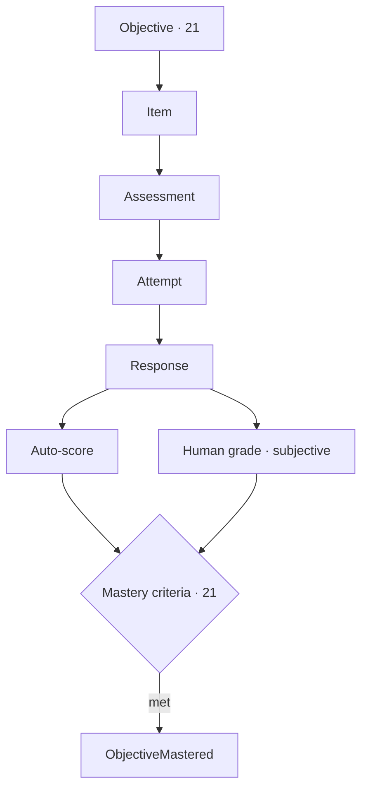
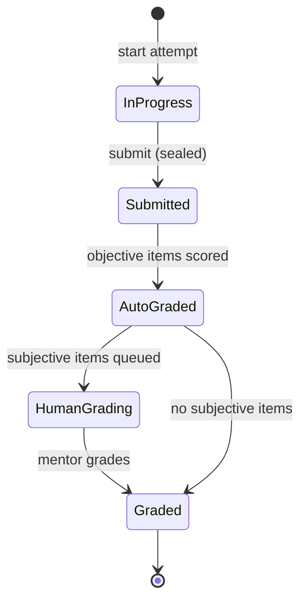

# 23 · Assessment Engine

| | |
|---|---|
| **Document ID** | 23 |
| **Owner** | Chief Learning Officer / Assessment Lead |
| **Status** | Draft (Phase 1) |
| **Last updated** | 2026-07-19 |
| **Related** | [21 Curriculum Engine](./21-curriculum-engine.md) · [22 Lesson Engine](./22-lesson-engine.md) · [24 AI Teacher](./24-ai-teacher-specification.md) · [29 Reporting System](../06-portals/29-reporting-system.md) · [28 Mentor Portal](../06-portals/28-mentor-portal.md) · [13 Security](../03-security-privacy/13-security-model.md) · [33 Offline](../02-architecture/33-offline-architecture.md) |

## Purpose

This document specifies the **Assessment context** — how Taleem measures learning fairly and honestly:
the item bank, assessment types, the immutable attempt lifecycle, auto- and human-grading, the
computation of **mastery** (the north-star signal), offline attempt integrity, and proctoring-lite. Fair
assessment and an honest report card are core to the product's trust ([01 Vision §7](../00-overview/01-vision.md)).

## Scope

In scope: item bank, assessment/attempt model, grading (auto + human), mastery computation,
integrity/anti-tamper, offline attempts, and proctoring-lite. Out of scope: mastery-criteria authoring
([21](./21-curriculum-engine.md)), lesson runtime ([22](./22-lesson-engine.md)), report cards/promotion
([29 Reporting](../06-portals/29-reporting-system.md)), and AI internals ([24](./24-ai-teacher-specification.md)).

---

## 1. Principles

1. **Honesty is non-negotiable** — never inflate or fabricate; every figure derives from immutable
   attempts ([FR-GRD-003](../01-product/03-functional-requirements.md), [01 Vision §7](../00-overview/01-vision.md)).
2. **Formative-first, low-stakes** — most assessment is practice with immediate feedback
   ([Authoring Brief §3](../_meta/authoring-brief.md)).
3. **Mastery is the currency** — assessment produces the north-star "objective mastered" signal
   ([FR-ASM-007](../01-product/03-functional-requirements.md)).
4. **Integrity by construction** — attempts are append-only and sealed at submission ([13 §5](../03-security-privacy/13-security-model.md)).
5. **Fair under real conditions** — works offline; integrity signals never hostilely surveil children
   ([FR-ASM-005/006](../01-product/03-functional-requirements.md)).
6. **Human-in-the-loop for the subjective and the high-stakes** ([FR-ASM-004](../01-product/03-functional-requirements.md), [12 §7](../03-security-privacy/12-authorization-model.md)).

## 2. Item bank & assessment model

| Entity | Meaning |
|---|---|
| **Item** | A question/task mapped to ≥1 objective ([FR-ASM-001](../01-product/03-functional-requirements.md)) |
| **Assessment** | A formative check or exam assembled from items (per the objective's assessment blueprint) |
| **Attempt** | A Student's immutable try at an assessment ([FR-ASM-002](../01-product/03-functional-requirements.md)) |
| **Response** | An answer to an item within an attempt |
| **Auto-score / Human grade** | Machine or Mentor grading of a response |

Item types (v1): multiple-choice, true/false, numeric, short-answer (auto where deterministic), and
**subjective/constructed** (human-graded). Every item links to an objective; orphans are flagged.

## 3. Attempt lifecycle (immutable)

- An attempt is **sealed at submission** (including offline) and is **append-only** — never edited in
  place ([13 §5](../03-security-privacy/13-security-model.md), [FR-ASM-002](../01-product/03-functional-requirements.md)).
- `AttemptSubmitted` → grading pipeline; `AttemptAutoGraded` / `HumanGradingRequested` route work
  ([08 §5](../02-architecture/08-system-architecture.md)).

## 4. Grading

| Mode | Rule |
|---|---|
| **Auto-grading** | Deterministic scoring of objective items; matches a gold set ([FR-ASM-003](../01-product/03-functional-requirements.md)). |
| **Human grading** | Mentor grades subjective work; combined with auto scores in one gradebook, with grader attribution ([FR-ASM-004](../01-product/03-functional-requirements.md), [28 Mentor](../06-portals/28-mentor-portal.md)). |
| **AI-assisted (advisory only)** | The AI Teacher may suggest formative feedback, but **never** issues a high-stakes grade unsupervised ([24](./24-ai-teacher-specification.md), [12 §7](../03-security-privacy/12-authorization-model.md)). |

Overrides require step-up auth and leave an immutable trail ([FR-GRD-003](../01-product/03-functional-requirements.md)).

## 5. Mastery computation (the north-star)

- Mastery is evaluated against the objective's **machine-readable criteria** from [21](./21-curriculum-engine.md)
  ([FR-CUR-006](../01-product/03-functional-requirements.md)).
- Meeting criteria emits **exactly one** `ObjectiveMastered` event per objective per student,
  **deduplicated across offline replay** ([FR-ASM-007](../01-product/03-functional-requirements.md)).
- The **precise mastery threshold** is the key open question (below); the engine consumes it as data so
  the value can be calibrated without code change.

## 6. Offline attempts & integrity

- Attempts can be taken offline and **sealed at submission time**; the sealed attempt is immutable and
  syncs idempotently ([04 NFR OFFL-05](../01-product/04-non-functional-requirements.md), [33 §6](../02-architecture/33-offline-architecture.md)).
- Answers cannot be tampered with after submission (cryptographic seal, [13 §5](../03-security-privacy/13-security-model.md)).

## 7. Proctoring-lite (v1, ethical)

- **Advisory integrity signals** (focus loss, timing anomalies) that are privacy-reviewed and **never
  the sole basis of a high-stakes decision** ([FR-ASM-006](../01-product/03-functional-requirements.md)).
- No hostile surveillance of children ([14](../03-security-privacy/14-privacy-model.md), [15](../03-security-privacy/15-child-safety-framework.md));
  signals inform a human, who decides.

## 8. Contracts

- Consumes objectives + mastery criteria + assessment blueprints from [21](./21-curriculum-engine.md).
- Emits attempt/grade events to **Grading & Reporting** ([29](../06-portals/29-reporting-system.md)) and
  mastery events to Lesson/Analytics ([08 §5](../02-architecture/08-system-architecture.md)).

## 9. Risks

| # | Risk | Impact | Mitigation |
|---|---|---|---|
| R-1 | Grade fabrication/inflation | Destroys trust | Immutable attempts; figures derive from source; audited overrides. |
| R-2 | Post-submission tampering | Integrity loss | Sealed attempts + crypto ([13 §5](../03-security-privacy/13-security-model.md)). |
| R-3 | Duplicate mastery events (offline replay) | North-star noise | Dedupe on event/attempt IDs. |
| R-4 | Unfair auto-grading of short-answer | Wrong results | Auto only where deterministic; else human. |
| R-5 | Proctoring harms children | Ethics/safety | Advisory-only, privacy-reviewed, human decides. |
| R-6 | AI grades high-stakes unsupervised | Vision violation | AI advisory only; human accountable. |

---

## Open questions

- **Mastery threshold** — the exact rule for "objective mastered" (shared with [21](./21-curriculum-engine.md),
  [02 PRD](../01-product/02-prd.md)); locks the north-star KPI.
- **Short-answer auto-grading** — how far AI-assisted scoring can go while staying honest and fair.
- **Proctoring-lite signal set** — which signals are ethically acceptable for children ([15](../03-security-privacy/15-child-safety-framework.md)).
- **Exam types** beyond MVP and their offline integrity.

## Change log

| Date | Change | Author |
|---|---|---|
| 2026-07-19 | Initial assessment engine: item bank, immutable attempt lifecycle, auto + human grading, mastery computation (north-star), offline integrity, ethical proctoring-lite. | Chief Learning Officer |
