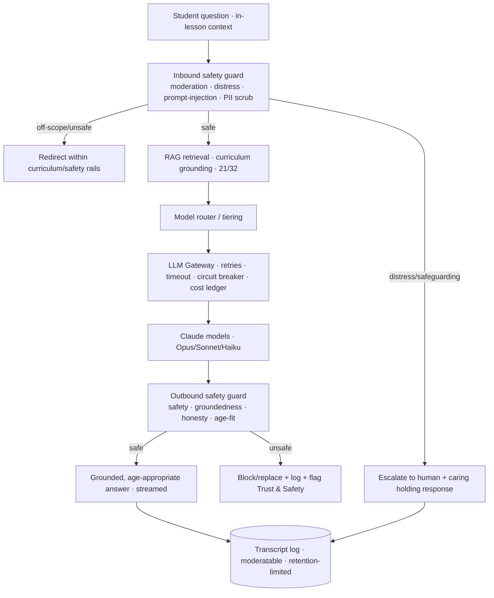

# 24 · AI Teacher Specification

| | |
|---|---|
| **Document ID** | 24 |
| **Owner** | Head of AI / Chief Learning Officer |
| **Status** | Draft (Phase 1) |
| **Last updated** | 2026-07-19 |
| **Related** | [01 Vision](../00-overview/01-vision.md) · [15 Child Safety](../03-security-privacy/15-child-safety-framework.md) · [14 Privacy](../03-security-privacy/14-privacy-model.md) · [08 System Architecture §10](../02-architecture/08-system-architecture.md) · [21 Curriculum](./21-curriculum-engine.md) · [22 Lesson Engine](./22-lesson-engine.md) · [23 Assessment](./23-assessment-engine.md) · [32 Search](../02-architecture/32-search-architecture.md) · [Authoring Brief §4](../_meta/authoring-brief.md) |

## Purpose

This document specifies the **AI Teacher** — Taleem's core pedagogy and its highest-novelty risk. It
defines what the AI Teacher is and is not, the safety-governed orchestration pipeline, curriculum
grounding (RAG), the provider-abstracted tiered-model gateway, the honesty and escalation behaviours,
transcript logging, privacy controls, cost management, and the evaluation regime. The AI Teacher gives
every child a patient 1:1 tutor at national scale ([01 Vision §4](../00-overview/01-vision.md)) — safely.

## Scope

In scope: AI Teacher behaviour contract, orchestration pipeline, RAG grounding, model gateway/tiering,
safety integration, honesty/escalation, transcripts, privacy, cost, and evaluation. Out of scope:
safeguarding *policy* ([15](../03-security-privacy/15-child-safety-framework.md)), privacy lawful basis
([14](../03-security-privacy/14-privacy-model.md)), and macro-architecture ([08 §10](../02-architecture/08-system-architecture.md))
— this doc specifies the service that plugs into them.

---

## 1. What the AI Teacher is — and is not

**Is:** a **bounded, safety-governed, curriculum-grounded educator** ([01 Vision §3](../00-overview/01-vision.md))
that delivers explanations, answers a child's question, gives formative feedback, and scaffolds toward
mastery — patient, encouraging, and honest.

**Is not:**

- ❌ an open-ended chatbot — it stays within curriculum and safety rails ([02 PRD NG1](../01-product/02-prd.md));
- ❌ a human — always labelled "AI Teacher"; never implies personhood ([FR-AIT-006](../01-product/03-functional-requirements.md));
- ❌ an unsupervised decision-maker — it never makes a high-stakes decision about a child alone
  ([12 §7](../03-security-privacy/12-authorization-model.md)).

## 2. Behaviour contract (binding)

| # | Behaviour | Authority |
|---|---|---|
| B1 | **Grounded in curriculum (RAG)**; redirect off-syllabus prompts, don't free-answer. | [FR-AIT-001](../01-product/03-functional-requirements.md) |
| B2 | **Every input and output passes safety guardrails** before reaching a child. | [15 §3](../03-security-privacy/15-child-safety-framework.md), [FR-AIT-002](../01-product/03-functional-requirements.md) |
| B3 | **Honesty over hallucination** — "I don't know / let's ask your Mentor" beats a made-up answer. | [FR-AIT-004](../01-product/03-functional-requirements.md) |
| B4 | **Never claims to be human**; always AI-labelled. | [FR-AIT-006](../01-product/03-functional-requirements.md) |
| B5 | **Escalates distress/safeguarding to a human** within SLA, with a caring holding response. | [15 §5](../03-security-privacy/15-child-safety-framework.md), [FR-AIT-007](../01-product/03-functional-requirements.md) |
| B6 | **Age-appropriate** tone/content for the child's band. | [15 §8](../03-security-privacy/15-child-safety-framework.md) |
| B7 | **Logs a moderatable transcript** of every turn. | [FR-AIT-003](../01-product/03-functional-requirements.md) |
| B8 | **Only via the gateway** — no product code calls a provider SDK. | [FR-AIT-005](../01-product/03-functional-requirements.md), [Authoring Brief §4](../_meta/authoring-brief.md) |

## 3. Orchestration pipeline

Realises [08 §10](../02-architecture/08-system-architecture.md); the safety contract is [15 §3](../03-security-privacy/15-child-safety-framework.md).

## 4. Curriculum grounding (RAG)

- The AI Teacher retrieves from **published, version-pinned curriculum content** ([21 §7](./21-curriculum-engine.md))
  and grounds its answer in it — it does not free-associate ([B1](#2-behaviour-contract-binding)).
- Retrieval respects **authorization** — only content the child may access ([12 §8](../03-security-privacy/12-authorization-model.md)).
- **Groundedness is checked on output** (B3): unsupported claims are suppressed or the AI declines.
- The **vector/retrieval store** (Meilisearch hybrid vs. dedicated vector DB) is an open decision shared
  with [08](../02-architecture/08-system-architecture.md)/[09](../02-architecture/09-database-design.md).

## 5. Model gateway & tiering

- **Provider abstraction (SOLID DIP):** a stable `LLMPort`; providers/models are swappable adapters
  ([08 §10](../02-architecture/08-system-architecture.md)). **Default to the latest, most capable Claude
  models** ([Authoring Brief §4](../_meta/authoring-brief.md)).
- **Tiered routing** by task difficulty and cost:

| Tier | Task | Model class (default) |
|---|---|---|
| Light | Routine formative feedback, simple hints | Claude Haiku 4.5 |
| Standard | Normal tutoring, explanations | Claude Sonnet 5 |
| Deep | Hard explanations, complex reasoning | Claude Opus 4.8 |

- Tiering is a **routing policy**, not scattered call sites; it is the primary AI cost lever
  ([04 NFR COST-02](../01-product/04-non-functional-requirements.md), [55 Cost Model](../08-delivery/55-cost-model.md)).
- **Safety never yields to cost** (audit AR-H-16): **every serving tier must pass the identical safety-eval
  bar**, and any **distress-adjacent or safety-relevant turn routes to the strongest tier regardless of
  cost.** Cost-tiering may not degrade safety.
- **Resilience:** retries, timeouts, circuit breaker; an LLM outage degrades AI to **static pre-moderated**
  cached hints (never generative) and **never takes down the learning path** ([08 §9.4](../02-architecture/08-system-architecture.md), [35 §6](../02-architecture/35-deployment-architecture.md)).

## 6. Safety integration

- **Two-sided, inline, non-bypassable** input and output guardrails ([15 §3](../03-security-privacy/15-child-safety-framework.md));
  a verdict can **block, rewrite, or escalate** ([FR-AIT-002](../01-product/03-functional-requirements.md)).
- **Prompt-injection defence** on input, with a concrete mechanism (audit AR-H-15): **structural
  separation** of system instructions from retrieved/user content, **signed + reviewed RAG corpus**, and
  an **output guard independent of the (potentially poisoned) generation prompt**.
- Unsafe outputs are blocked/replaced and raise `AISafetyFlagRaised` to Trust & Safety ([08 §5](../02-architecture/08-system-architecture.md)).
- **Red-team gates every release AND runs continuously (canary) against live provider endpoints** (audit
  AR-H-17) — a provider-side silent model change fails the canary and the system fails safe to cached
  content; model versions are pinned where the provider allows.
- **Explicit Urdu / Roman-Urdu / code-switch safety-eval** with measured recall on distress/grooming/
  self-harm classes gates launch (audit AR-H-18) — classifiers are weaker in low-resource/transliterated
  text, so the majority written language cannot be an untested blind spot.
- **No generative AI offline** (audit AR-C-06) — offline serves only static, pre-moderated content.

## 7. Honesty & escalation

- The system prompt enforces **honest uncertainty** — decline or defer to a Mentor rather than fabricate
  (B3).
- **Distress / safeguarding signals** trigger a **live human escalation within a tiered numeric SLA
  (T0 ≤ 5 min, 24/7)** and a **deterministic, clinician-reviewed holding response served OUTSIDE the LLM
  path** — never model-generated (audit AR-C-04), so a degraded/jailbroken model cannot alter the crisis
  message. Escalation is **MVP, not v1** ([52 Crisis Protocol](../03-security-privacy/52-safeguarding-crisis-protocol.md), [15 §3](../03-security-privacy/15-child-safety-framework.md), [FR-AIT-007](../01-product/03-functional-requirements.md)).
- **In-region classification for potentially-C4 utterances** (audit AR-C-07) — distress/safeguarding
  classification and the holding response run in-region; text pre-classified as potentially C4 is **never
  forwarded to an out-of-region model** (DECISION REQUIRED: residency, [14 O-3](../03-security-privacy/14-privacy-model.md)).
- **Repeated failure** on an objective can escalate to a Mentor for human help ([28 Mentor](../06-portals/28-mentor-portal.md)).

## 8. Transcripts & privacy

- **Every turn** logs prompt, retrieved context, response, model tier, tokens/cost, and safety verdicts
  as a **moderatable, retention-limited** transcript ([FR-AIT-003](../01-product/03-functional-requirements.md), [14 §9](../03-security-privacy/14-privacy-model.md)).
- **Minimal, pseudonymised context** to the provider under **no-training** contracts; no cross-child
  data ([14 §9](../03-security-privacy/14-privacy-model.md)).
- Transcripts **auto-expire** per retention ([04 NFR PRIV-07](../01-product/04-non-functional-requirements.md));
  access is governed ([12 §8](../03-security-privacy/12-authorization-model.md)).

## 9. Cost management

- **Tiered routing + caching** (RAG-chunk cache, identical-prompt formative-feedback cache) keep AI
  cost within the per-student envelope ([08 §9.3](../02-architecture/08-system-architecture.md), [04 NFR COST-02](../01-product/04-non-functional-requirements.md)).
- A **token/cost ledger** per turn feeds FinOps ([04 NFR COST-01](../01-product/04-non-functional-requirements.md));
  the exact per-student budget is an open question shared with PRD/NFR.

## 10. Evaluation

| Eval | Purpose |
|---|---|
| **Safety red-team set** | Adversarial prompts (harmful, grooming-adjacent, injection, distress) — release-gating ([15](../03-security-privacy/15-child-safety-framework.md)). |
| **Groundedness/honesty set** | Measures curriculum-grounded, non-hallucinated answers ([B1/B3](#2-behaviour-contract-binding)). |
| **Pedagogical quality** | Human review of explanation quality and age-appropriateness. |
| **Regression** | Behaviour contract (§2) covered by tests before any model/prompt change ([40 Testing](../07-engineering/40-testing-strategy.md)). |

## 11. Risks

| # | Risk | Impact | Mitigation |
|---|---|---|---|
| R-1 | Harmful/unsafe generation | Direct child harm | Two-sided guardrails, block-and-log, red-team gate ([15](../03-security-privacy/15-child-safety-framework.md)). |
| R-2 | Hallucination/false authority | Child mislearns | RAG grounding + output groundedness check + honesty prompt. |
| R-3 | Prompt injection via content | Bypassed safety/scope | Input injection defence; gateway isolation ([13 §4](../03-security-privacy/13-security-model.md)). |
| R-4 | Provider trains on child data | Privacy harm | No-training contracts, minimal/pseudonymised context ([14 §7/§9](../03-security-privacy/14-privacy-model.md)). |
| R-5 | Cost blowout at scale | Sustainability | Tiered routing, caching, cost ledger, budget envelope. |
| R-6 | LLM outage degrades learning | Availability | Circuit breaker + cached-hint degrade; core path independent ([35 §6](../02-architecture/35-deployment-architecture.md)). |
| R-7 | AI implies it is human | Trust/safety | Mandatory AI labelling; copy review (B4). |

---

## Open questions

- **Vector/RAG store** — Meilisearch hybrid vs. dedicated vector DB (shared with [08](../02-architecture/08-system-architecture.md)/[09](../02-architecture/09-database-design.md)).
- **Per-student AI cost envelope** — the monthly budget that keeps marginal cost viable (shared with
  [04 NFR](../01-product/04-non-functional-requirements.md)/[02 PRD](../01-product/02-prd.md)).
- **Distress-detection efficacy** — false-pos/neg tolerances and human-review staffing ([15](../03-security-privacy/15-child-safety-framework.md)).
- **Voice/audio tutoring** (v2) and its cost/safety profile.
- **Urdu pedagogical quality** — model performance on Urdu-medium instruction and eval coverage.

## Change log

| Date | Change | Author |
|---|---|---|
| 2026-07-19 | Initial AI Teacher spec: behaviour contract, safety-governed orchestration, RAG grounding, provider-abstracted tiered gateway, honesty/escalation, transcripts/privacy, cost, evaluation regime. | Head of AI / CLO |
