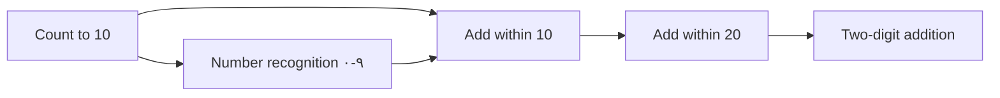

# 58 · Mastery Definition, Prerequisite Graph & Assessment Validity

| | |
|---|---|
| **Document ID** | 58 (Phase 1.5 remediation) |
| **Owner** | Chief Learning Officer / Head of Assessment (psychometrician) |
| **Status** | Draft — needs psychometric review + pilot calibration |
| **Last updated** | 2026-07-19 |
| **Closes** | AR-C-14, AR-C-15, AR-C-16, AR-C-17, AR-H-02 |
| **Related** | [21 Curriculum](./21-curriculum-engine.md) · [22 Lesson](./22-lesson-engine.md) · [23 Assessment](./23-assessment-engine.md) · [29 Reporting](../06-portals/29-reporting-system.md) |

## Purpose

This document closes the pedagogical core the blueprint left as open questions: it defines **what
"mastered" means**, introduces the **prerequisite knowledge graph** that makes mastery-based progression
implementable, and adds the **assessment validity/reliability** framework and **item-bank/authoring**
model without which a report card is unvalidated scores. It supersedes the "Open Questions" in
[21 §3](./21-curriculum-engine.md) and [23 §5](./23-assessment-engine.md).

## Scope

In scope: mastery rule, prerequisite DAG, validity/reliability, item-bank sizing + authoring/QA,
anti-gaming, and shared-device summative integrity. Out of scope: runtime mechanics ([22](./22-lesson-engine.md)),
report-card rendering ([29](../06-portals/29-reporting-system.md)). Threshold values are **planning
assumptions** to be calibrated on pilot data.

---

## 1. Mastery definition (v1)

An objective is **mastered** when a student meets **all** of:

| Criterion | v1 rule (planning assumption) |
|---|---|
| **Accuracy** | ≥ 80% correct across the last N attempted items for the objective |
| **Distinct items** | Items drawn from a pool ≥ 5× the attempt count (no item repeats within a mastery window) |
| **No-hint final** | The final qualifying attempt used no hints/AI scaffolding |
| **Spaced retention** | The objective survives a **spaced re-check** ≥ 1 interval later (Leitner-style: +1 day, +3 days, +7 days) before mastery is *confirmed* |
| **Guessing correction** | Recognition-only item types (MCQ/true-false) are down-weighted; guessing-adjusted scoring applied |

Mastery has two states: **provisional** (accuracy met) and **confirmed** (survived spaced retention).
**Only confirmed mastery** emits the north-star `ObjectiveMastered` event and counts toward promotion.
This directly de-gameables the north-star (AR-H-02): retry-to-pass and small-bank memorization fail the
distinct-item + retention gates.

## 2. Prerequisite knowledge graph (v1 core entity)

Objectives form a **directed acyclic graph** (`prerequisite_of` edges), not a tree. This is what makes
"mastery-based" real: the Lesson Engine can diagnose *why* a child is stuck and route remediation.

| Rule | Requirement |
|---|---|
| Model | Each objective has 0+ prerequisite edges; the coverage report **fails on cycles** and on orphaned high-grade objectives |
| Gating | An objective is not offered until its prerequisites are confirmed-mastered (or a placement test grants credit) |
| Remediation | On repeated failure, the engine routes *down* the graph to the unmastered prerequisite, not linearly forward |
| Authoring | Prerequisite edges are authored alongside objectives ([21 §6](./21-curriculum-engine.md)) and version-pinned |

## 3. Assessment validity & reliability

Immutable storage of a score is not valid *measurement*. v1 requires:

| Concern | Requirement |
|---|---|
| **Item quality** | Every item reviewed for difficulty and discrimination; items with poor discrimination are retired |
| **Construct coverage** | Each objective's assessment blueprint maps items to the SNC standard it measures; coverage gaps are errors |
| **Reliability** | Target internal-consistency/reliability estimate per summative assessment (calibrated on pilot data) |
| **Standard-setting** | Any promotion/pass cut score is set by a documented standard-setting method, not an arbitrary number |
| **Bias review** | Items pass the content-QA bias/gender/minority rubric ([21 §6](./21-curriculum-engine.md)) |
| **Fairness (low-literacy)** | Items classify whether *reading* is the construct under test; audio delivery is permitted only where reading is not the target skill (else it invalidates the measure) |

## 4. Item-bank sizing & authoring pipeline

Mastery-on-distinct-items requires a real content supply.

| Element | Decision |
|---|---|
| **Min items/objective** | ≥ 5× the mastery attempt count (from §1), per objective, per language |
| **Authoring** | Human-authored + optionally AI-generated *drafts*, but **every item passes human psychometric + safety review** before going live |
| **Throughput model** | Author throughput is modeled against KG–10 × 6 subjects × objectives × languages; content supply gates grade-band launch (a band does not open until its item bank is sufficient) |
| **Calibration** | Items accumulate response statistics; poorly-performing items are retired; the bank is continuously refreshed |

## 5. Shared-device summative integrity

Formative practice is identity-relaxed (fine). **Promotion-bearing summative** assessment requires:

- **Server-side scoring** — answer keys never ship in the offline day-pack ([23](./23-assessment-engine.md) updated);
- **Identity assurance** — Mentor-supervised or synchronous check-in, occasional human-verified oral/interview
  items via the Mentor, and per-child response fingerprints;
- **Explicit limit** — offline summative **cannot** be identity-assured and is not credential-bearing;
- Sealed, append-only attempts ([13 §5](../03-security-privacy/13-security-model.md)).

## Open questions

- Final threshold values (accuracy %, N, retention intervals) — calibrate on pilot data.
- Reliability target per assessment type.
- Extent of ethical AI-assisted scoring for Urdu constructed-response ([23 OQ](./23-assessment-engine.md)).
- Human-grading throughput vs. subjective-item volume at 1M ([28 Mentor](../06-portals/28-mentor-portal.md)).

## Change log

| Date | Change | Author |
|---|---|---|
| 2026-07-19 | Initial mastery/validity spec (Phase 1.5): confirmed-mastery rule with spaced retention, prerequisite DAG as core entity, validity/reliability framework, item-bank sizing + authoring QA, shared-device summative integrity. | Chief Learning Officer / Psychometrician |
