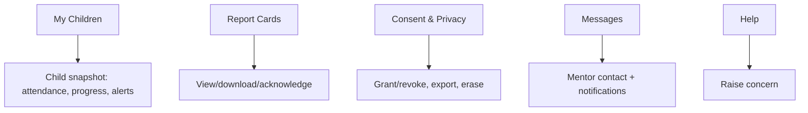

# 25 · Parent (Guardian) Portal Specification

| | |
|---|---|
| **Document ID** | 25 |
| **Owner** | Product Manager — Guardian Experience |
| **Status** | Draft (Phase 1) |
| **Last updated** | 2026-07-19 |
| **Related** | [05 Personas](../01-product/05-user-personas.md) · [07 IA](../01-product/07-information-architecture.md) · [20 Navigation](../04-design/20-navigation-structure.md) · [14 Privacy](../03-security-privacy/14-privacy-model.md) · [29 Reporting](./29-reporting-system.md) · [30 Notifications](./30-notification-system.md) · [11 Authentication](../03-security-privacy/11-authentication-strategy.md) |

## Purpose

This document specifies the **Guardian Portal** — the surface where a parent/guardian consents, monitors
progress, receives report cards, manages privacy, and raises concerns. It is designed for a busy,
possibly low-literacy Guardian on a shared low-end phone, reachable in-language ([07 §5](../01-product/07-information-architecture.md)).

## Scope

In scope: Guardian portal capabilities, screens, consent/privacy self-service, and cross-references to
the services it surfaces. Out of scope: IA rationale ([07](../01-product/07-information-architecture.md)),
consent lawful basis ([14](../03-security-privacy/14-privacy-model.md)), and report-card generation
([29](./29-reporting-system.md)).

---

## 1. Who it serves

The **Guardian** ([05 Personas](../01-product/05-user-personas.md)) — the legal consent-holder, often
with limited literacy/time, reachable via SMS/WhatsApp, frequently sharing the device with the child.
Primary need: **proof my child is learning + low-effort involvement + trust** ([02 PRD §3](../01-product/02-prd.md)).

## 2. Capabilities

| Capability | FR | Notes |
|---|---|---|
| Enrol a child + grant/revoke **consent** | [FR-IDN-001/005](../01-product/03-functional-requirements.md) | Consent gates activation ([11 §4](../03-security-privacy/11-authentication-strategy.md)) |
| View each child's **progress & attendance** | — | Read-first snapshots per child |
| View/download **report cards**; acknowledge | [FR-GRD-002](../01-product/03-functional-requirements.md) | From [29 Reporting](./29-reporting-system.md) |
| Manage **privacy**: access, export, erasure | [FR-IDN-005](../01-product/03-functional-requirements.md) | Self-service ([14 §6](../03-security-privacy/14-privacy-model.md)) |
| Receive **notifications** & set preferences | [FR-ENG-001/002](../01-product/03-functional-requirements.md) | Quiet hours, opt-out ([30](./30-notification-system.md)) |
| **Raise a safety concern** | [FR-TNS-002](../01-product/03-functional-requirements.md) | One tap, in-language ([15](../03-security-privacy/15-child-safety-framework.md)) |
| Contact the child's **Mentor** | — | Bounded, monitored messaging ([15 §7](../03-security-privacy/15-child-safety-framework.md)) |

## 3. Structure (top-level)

Per [07 §5](../01-product/07-information-architecture.md) / [20 §3](../04-design/20-navigation-structure.md):
**My Children · Report Cards · Messages · Consent & Privacy · Help.** Multi-child households switch child
context at the top level.

## 4. Key design rules

- **Read-and-acknowledge first**; the only heavy writes are consent and raising a concern ([07 §5](../01-product/07-information-architecture.md)).
- **Low-literacy friendly** — icon+text, plain Urdu, audio where useful ([16](../04-design/16-accessibility-standards.md)).
- **Authenticated as a distinct Guardian session** (T1), never sharing the child's session, even on the
  same phone ([11 §6](../03-security-privacy/11-authentication-strategy.md)).
- **No child PII exposure beyond the guardian's own children** ([12 §4](../03-security-privacy/12-authorization-model.md)).
- **Low-bandwidth** — snapshots within data budget; report-card PDF download is explicit ([04 NFR DATA](../01-product/04-non-functional-requirements.md)).

## 5. Privacy self-service

The portal is the primary place Guardians exercise **data-subject rights** ([14 §6](../03-security-privacy/14-privacy-model.md)):
view held data, export a machine-readable record, and revoke consent / request erasure — with clear,
in-language explanations and audit ([FR-IDN-005](../01-product/03-functional-requirements.md)).

## 6. Risks

| # | Risk | Impact | Mitigation |
|---|---|---|---|
| R-1 | Guardian confusion on shared device | Wrong child context | Distinct guardian session + clear child switcher. |
| R-2 | Low literacy blocks use | Exclusion | Icon+text, audio, plain language, minimal steps. |
| R-3 | Over-exposure of child data | Privacy | Scope to own children only; dignity-aware ([14](../03-security-privacy/14-privacy-model.md)). |
| R-4 | Consent dark patterns | Invalid consent | No pre-tick/bundling ([14 §3](../03-security-privacy/14-privacy-model.md)). |

## Open questions

- **Multi-child switching** pattern on shared devices ([07 open Qs](../01-product/07-information-architecture.md)).
- **Guardian↔Mentor messaging** scope and monitoring depth ([15](../03-security-privacy/15-child-safety-framework.md)).
- **Transcript visibility** to guardians vs. child dignity ([12 §8](../03-security-privacy/12-authorization-model.md)).

## Change log

| Date | Change | Author |
|---|---|---|
| 2026-07-19 | Initial Guardian Portal spec: capabilities, structure, privacy self-service, low-literacy/low-bandwidth design rules. | PM — Guardian Experience |
