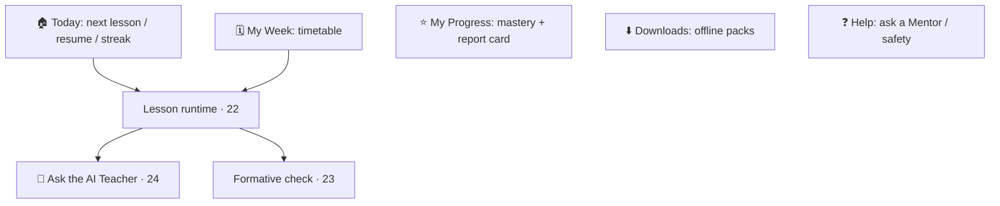

# 26 · Student Portal Specification

| | |
|---|---|
| **Document ID** | 26 |
| **Owner** | Product Manager — Student Experience |
| **Status** | Draft (Phase 1) |
| **Last updated** | 2026-07-19 |
| **Related** | [05 Personas](../01-product/05-user-personas.md) · [06 Journeys](../01-product/06-user-journeys.md) · [07 IA](../01-product/07-information-architecture.md) · [20 Navigation](../04-design/20-navigation-structure.md) · [22 Lesson Engine](../05-education/22-lesson-engine.md) · [24 AI Teacher](../05-education/24-ai-teacher-specification.md) · [33 Offline](../02-architecture/33-offline-architecture.md) · [16 Accessibility](../04-design/16-accessibility-standards.md) |

## Purpose

This document specifies the **Student App** — the single most important surface in Taleem, the one a
child actually attends school through. It is designed for a possibly pre-/low-literate child, one-handed,
on a shared 360px low-end Android phone on metered 3G with intermittent power. It answers one question:
*what do I do now?*

## Scope

In scope: Student App capabilities, structure, the learning loop, offline/low-bandwidth behaviour, and
child-safety/accessibility rules. Out of scope: lesson runtime internals ([22](../05-education/22-lesson-engine.md)),
AI internals ([24](../05-education/24-ai-teacher-specification.md)), and IA rationale ([07](../01-product/07-information-architecture.md)).

---

## 1. Who it serves

The **Student** ([05 Personas](../01-product/05-user-personas.md)) — a child aged ~5–16, grades KG–10,
often behind, often sharing a device, learning primarily in Urdu. **The primary user at the bottom of
the curve; when trade-offs arise, Student reach wins** ([02 PRD §3](../01-product/02-prd.md)).

## 2. Structure (bottom nav ≤ 5)

Per [07 §4](../01-product/07-information-architecture.md) / [20 §2](../04-design/20-navigation-structure.md):
**Today · My Week · My Progress · Downloads · Help.**

## 3. The learning loop

The core loop the app exists to make effortless ([06 Journeys](../01-product/06-user-journeys.md)):

1. Open **Today** → resume or start the next lesson.
2. Learn through content blocks ([22](../05-education/22-lesson-engine.md)); **Ask the AI Teacher**
   in-lesson when stuck ([24](../05-education/24-ai-teacher-specification.md)).
3. Complete **formative checks** ([23](../05-education/23-assessment-engine.md)); mastery is celebrated.
4. Progress and mastery update; the north-star `ObjectiveMastered` may fire.

## 4. Capabilities

| Capability | FR |
|---|---|
| Sign in on a shared device (picture-PIN/PIN), profile picker | [FR-IDN-002/003](../01-product/03-functional-requirements.md), [11 §5/§6](../03-security-privacy/11-authentication-strategy.md) |
| Attend timetabled lessons; resume exactly | [FR-LSN-001/002](../01-product/03-functional-requirements.md) |
| Ask the AI Teacher (grounded, safe) | [FR-AIT-001](../01-product/03-functional-requirements.md) |
| Formative checks + exams | [FR-ASM-002](../01-product/03-functional-requirements.md) |
| Download offline day/week packs | [FR-LSN-003](../01-product/03-functional-requirements.md) |
| See progress, mastery, report card | [FR-GRD-002](../01-product/03-functional-requirements.md) |
| Reach safety help / a Mentor | [FR-TNS-002](../01-product/03-functional-requirements.md) |

## 5. Offline & low-bandwidth

- **Offline-first** — downloaded lessons work with no network; progress/attempts queue and sync
  ([33](../02-architecture/33-offline-architecture.md), [FR-LSN-003/004](../01-product/03-functional-requirements.md)).
- **Lite mode default** on slow links; every screen within data budget ([04 NFR DATA](../01-product/04-non-functional-requirements.md)).
- **No dead ends** — offline/queued states are explicit and honest ([04 NFR OFFL-04](../01-product/04-non-functional-requirements.md)).

## 6. Safety & accessibility (acceptance criteria)

- **AI Teacher always labelled**, contextual to a lesson, never a free chat home ([FR-AIT-006](../01-product/03-functional-requirements.md)).
- **Safety help one tap from every screen** ([15](../03-security-privacy/15-child-safety-framework.md)).
- **Age-appropriate** tone/content by band ([15 §8](../03-security-privacy/15-child-safety-framework.md)).
- **WCAG 2.2 AA, RTL-complete, Urdu-first, ≥44px, one-handed** ([16](../04-design/16-accessibility-standards.md), [04 NFR A11Y](../01-product/04-non-functional-requirements.md)).
- **No dark patterns** — motivation, not exploitation ([15 §8](../03-security-privacy/15-child-safety-framework.md)).

## 7. Risks

| # | Risk | Impact | Mitigation |
|---|---|---|---|
| R-1 | Too complex for a young/low-literacy child | Abandonment | ≤5 shallow destinations, icon+text, audio, obvious next action. |
| R-2 | Wrong-child on shared device | Wrong records/privacy | Profile picker + per-profile isolation ([11 §6](../03-security-privacy/11-authentication-strategy.md)). |
| R-3 | Data cost deters use | Exclusion | Lite mode, sized downloads, offline-first. |
| R-4 | AI misused as open chat | Safety/scope | In-lesson grounded invocation only ([24](../05-education/24-ai-teacher-specification.md)). |

## Open questions

- **4 vs. 5 destinations** for the youngest learners ([07 open Qs](../01-product/07-information-architecture.md)).
- **Search for children** — needed for young grades or Mentors/older only? ([32 Search](../02-architecture/32-search-architecture.md)).
- **Onboarding a non-reader** to the picture-PIN + first lesson with guardian help.

## Change log

| Date | Change | Author |
|---|---|---|
| 2026-07-19 | Initial Student App spec: structure, learning loop, capabilities, offline/low-bandwidth, safety & accessibility acceptance criteria. | PM — Student Experience |
