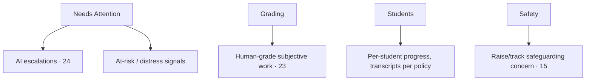
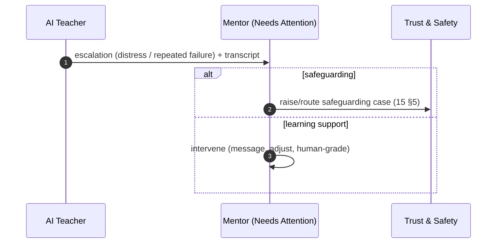

# 28 · Mentor Portal Specification

| | |
|---|---|
| **Document ID** | 28 |
| **Owner** | Product Manager — Mentor Experience |
| **Status** | Draft (Phase 1) |
| **Last updated** | 2026-07-19 |
| **Related** | [05 Personas](../01-product/05-user-personas.md) · [07 IA](../01-product/07-information-architecture.md) · [20 Navigation](../04-design/20-navigation-structure.md) · [23 Assessment](../05-education/23-assessment-engine.md) · [24 AI Teacher](../05-education/24-ai-teacher-specification.md) · [15 Child Safety](../03-security-privacy/15-child-safety-framework.md) · [12 Authorization](../03-security-privacy/12-authorization-model.md) |

## Purpose

This document specifies the **Mentor Portal** — where a human educator scales their care across a cohort:
handling AI escalations, watching over at-risk and distressed learners, human-grading subjective work,
and being the first human contact for a child. The Mentor is what a machine cannot be
([01 Vision §3](../00-overview/01-vision.md)); their portal is built around **triage**.

## Scope

In scope: Mentor capabilities, structure, the escalation/grading workflows, and safeguarding
responsibilities on this surface. Out of scope: grading mechanics ([23](../05-education/23-assessment-engine.md)),
AI internals ([24](../05-education/24-ai-teacher-specification.md)), and safeguarding policy ([15](../03-security-privacy/15-child-safety-framework.md)).

---

## 1. Who it serves

The **Mentor** ([05 Personas](../01-product/05-user-personas.md)) — an identity-verified,
safeguarding-vetted, MFA-authenticated (T2) human educator on a tablet/low-end laptop with more reliable
connectivity ([11 §11](../03-security-privacy/11-authentication-strategy.md)). **Access is relationship-scoped
to assigned cohorts** ([12 §4](../03-security-privacy/12-authorization-model.md)).

## 2. Structure (triage-first)

Per [07 §6](../01-product/07-information-architecture.md) / [20 §4](../04-design/20-navigation-structure.md):
**My Cohorts · Needs Attention · Grading · Students · Messages · Safety.**

## 3. Capabilities

| Capability | FR |
|---|---|
| See assigned cohorts + at-a-glance health | [FR-ENR-004](../01-product/03-functional-requirements.md) |
| **Needs Attention** queue: AI escalations, at-risk, distress | [FR-AIT-007](../01-product/03-functional-requirements.md), [15 §5](../03-security-privacy/15-child-safety-framework.md) |
| **Human-grade** subjective work (combined gradebook) | [FR-ASM-004](../01-product/03-functional-requirements.md) |
| View per-student progress + transcripts (per policy) | [12 §8](../03-security-privacy/12-authorization-model.md) |
| Bounded, monitored **messaging** with Student/Guardian | [15 §7](../03-security-privacy/15-child-safety-framework.md) |
| **Raise/track safeguarding** concerns | [FR-TNS-002/006](../01-product/03-functional-requirements.md) |

## 4. Escalation workflow

The Mentor's core value is handling what AI escalates:

## 5. Safeguarding responsibilities

- Mentors are a **human line of safeguarding** — trained, vetted, and the first human a distressed child
  reaches ([15 §6](../03-security-privacy/15-child-safety-framework.md)).
- Access is **scoped and time-bound**; an ex-Mentor loses access immediately ([12 §4](../03-security-privacy/12-authorization-model.md)).
- All Mentor↔child contact is **bounded and monitored** (grooming prevention, [15 §7](../03-security-privacy/15-child-safety-framework.md)).
- Sensitive actions require **AAL2 step-up** ([11 §11](../03-security-privacy/11-authentication-strategy.md)).

## 6. Risks

| # | Risk | Impact | Mitigation |
|---|---|---|---|
| R-1 | Overwhelmed by queue at scale | Missed at-risk child | Prioritised triage, workload limits, staffing model ([15](../03-security-privacy/15-child-safety-framework.md)). |
| R-2 | Unvetted/compromised Mentor | Predatory access | Vetting, MFA, scoped/time-bound access, monitoring. |
| R-3 | Over-broad transcript access | Child dignity | Policy-scoped transcript visibility ([12 §8](../03-security-privacy/12-authorization-model.md)). |
| R-4 | Human grade errors/bias | Unfair results | Attribution, review, immutable trail ([23 §4](../05-education/23-assessment-engine.md)). |

## Open questions

- **Mentor:cohort ratio** and workload caps that keep safeguarding effective at scale ([15](../03-security-privacy/15-child-safety-framework.md)).
- **Transcript visibility policy** — how much a Mentor sees vs. child dignity ([12 §8](../03-security-privacy/12-authorization-model.md)).
- **Vetting pipeline** capacity ([02 PRD D8](../01-product/02-prd.md)).

## Change log

| Date | Change | Author |
|---|---|---|
| 2026-07-19 | Initial Mentor Portal spec: triage-first structure, escalation & human-grading workflows, safeguarding responsibilities, scoped/vetted access. | PM — Mentor Experience |
