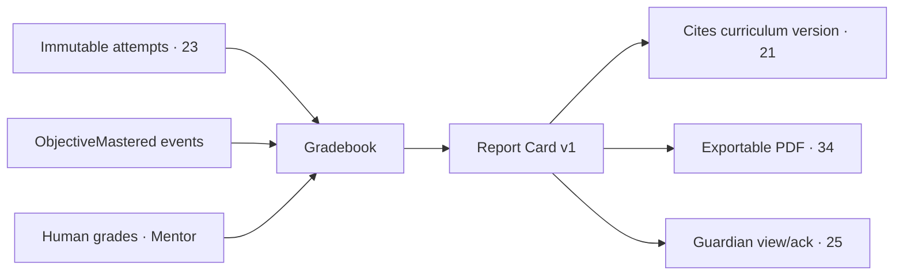

# 29 · Reporting System

| | |
|---|---|
| **Document ID** | 29 |
| **Owner** | Product Manager — Grading & Reporting |
| **Status** | Draft (Phase 1) |
| **Last updated** | 2026-07-19 |
| **Related** | [23 Assessment](../05-education/23-assessment-engine.md) · [21 Curriculum](../05-education/21-curriculum-engine.md) · [25 Parent Portal](./25-parent-portal.md) · [28 Mentor Portal](./28-mentor-portal.md) · [12 Authorization](../03-security-privacy/12-authorization-model.md) · [13 Security](../03-security-privacy/13-security-model.md) · [34 Media](../02-architecture/34-media-architecture.md) |

## Purpose

This document specifies the **Grading & Reporting context** — the gradebook, the **report card** a
Guardian can trust, transcripts, and human-accountable **promotion decisions**. The report card is the
verifiable proof of learning that makes Taleem a *school*, not a content app ([01 Vision §3](../00-overview/01-vision.md));
its integrity is sacrosanct.

## Scope

In scope: gradebook, report card generation, transcripts, promotion decisions, and their integrity and
delivery. Out of scope: assessment/grading mechanics ([23](../05-education/23-assessment-engine.md)),
curriculum versioning ([21](../05-education/21-curriculum-engine.md)), and delivery channels ([30](./30-notification-system.md)).

---

## 1. Principles

1. **Honest and derivable** — every report-card figure traces to **immutable attempts**; nothing is
   inflated or fabricated ([FR-GRD-003](../01-product/03-functional-requirements.md), [01 Vision §7](../00-overview/01-vision.md)).
2. **Human-accountable high-stakes** — promotion has a human in the loop; AI may recommend, never decide
   alone ([FR-GRD-004](../01-product/03-functional-requirements.md), [12 §7](../03-security-privacy/12-authorization-model.md)).
3. **Verifiable & version-pinned** — report cards cite the exact curriculum version ([21 §5](../05-education/21-curriculum-engine.md)).
4. **Guardian-trustworthy** — clear, in-language, exportable ([25](./25-parent-portal.md)).

## 2. Gradebook

- Aggregates **auto-scores + human grades + mastery** per Student per objective/subject ([23](../05-education/23-assessment-engine.md), [FR-GRD-001](../01-product/03-functional-requirements.md)).
- **Append-only** entries; corrections are new attributed entries, never mutations ([13 §5](../03-security-privacy/13-security-model.md)).
- Totals **reconcile** with underlying attempts for any sampled Student.

## 3. Report card

- **Report card v1** renders and exports (PDF-able), lists **objective-level results**, and names the
  curriculum version ([FR-GRD-002](../01-product/03-functional-requirements.md)).
- Generation is a **queued** job producing a stored artifact ([34 Media](../02-architecture/34-media-architecture.md), [08 §9.4](../02-architecture/08-system-architecture.md));
  `ReportCardIssued` notifies the Guardian ([30](./30-notification-system.md)).
- **No manual override** of figures without a logged, authorized reason ([FR-GRD-003](../01-product/03-functional-requirements.md)).

## 4. Transcripts & promotion (v1)

- **Transcript** aggregates report cards across cycles with consistent identity + curriculum versions
  ([FR-GRD-005](../01-product/03-functional-requirements.md)).
- **Promotion decision** records the deciding human + evidence; AI recommendation is advisory only
  ([FR-GRD-004](../01-product/03-functional-requirements.md)); `PromotionDecided` flows to Enrolment/Guardian
  ([08 §5](../02-architecture/08-system-architecture.md)).

## 5. Access & privacy

- Report cards/transcripts are **relationship-scoped**: a Guardian sees their children; a Mentor their
  cohort ([12 §3/§4](../03-security-privacy/12-authorization-model.md)).
- Contains child learning data (C2); handled per privacy classification ([14 §4](../03-security-privacy/14-privacy-model.md));
  exports honour data-subject rights ([14 §6](../03-security-privacy/14-privacy-model.md)).

## 6. Risks

| # | Risk | Impact | Mitigation |
|---|---|---|---|
| R-1 | Fabricated/inflated report card | Destroys trust | Figures derive from immutable attempts; audited overrides. |
| R-2 | Unversioned card | Non-reproducible | Cite curriculum version ([21 §5](../05-education/21-curriculum-engine.md)). |
| R-3 | AI decides promotion | Vision violation | Human-in-loop mandatory ([12 §7](../03-security-privacy/12-authorization-model.md)). |
| R-4 | Report card leaks to wrong guardian | Privacy | Relationship-scoped access + authorization. |

## Open questions

- **Report-card portability** — board/government recognition ([01 Vision open Qs](../00-overview/01-vision.md); business track).
- **Promotion rule** — how mastery/attendance combine into a promotion recommendation.
- **Report-card format** for low-literacy guardians (visual/audio summary).

## Change log

| Date | Change | Author |
|---|---|---|
| 2026-07-19 | Initial reporting system: gradebook, verifiable version-pinned report card, transcripts, human-accountable promotion, integrity & access. | PM — Grading & Reporting |
