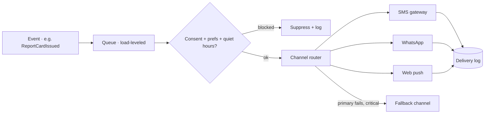

# 30 · Notification System

| | |
|---|---|
| **Document ID** | 30 |
| **Owner** | Product Manager — Engagement & Notifications |
| **Status** | Draft (Phase 1) |
| **Last updated** | 2026-07-19 |
| **Related** | [08 System Architecture](../02-architecture/08-system-architecture.md) · [14 Privacy](../03-security-privacy/14-privacy-model.md) · [15 Child Safety](../03-security-privacy/15-child-safety-framework.md) · [25 Parent Portal](./25-parent-portal.md) · [11 Authentication](../03-security-privacy/11-authentication-strategy.md) · [04 NFR](../01-product/04-non-functional-requirements.md) |

## Purpose

This document specifies the **Engagement & Notifications context** — how Taleem reaches Guardians and
Students across **SMS, WhatsApp, and web push**, for consent, report cards, safety, and (later)
motivational nudges. It must reach a low-literacy Guardian in-language, respect consent and quiet hours,
and never become an engagement dark pattern.

## Scope

In scope: channels, message types, delivery pipeline, preferences/consent, fallback, and abuse/cost
controls. Out of scope: message *content* owned by producing contexts, and safeguarding policy
([15](../03-security-privacy/15-child-safety-framework.md)).

---

## 1. Principles

1. **Consent- and preference-respecting** — non-safety messages honour consent, channel preference,
   quiet hours, and opt-out ([FR-ENG-002](../01-product/03-functional-requirements.md)).
2. **Safety messages are privileged** but still humane ([15](../03-security-privacy/15-child-safety-framework.md)).
3. **In-language, low-literacy friendly** — plain Urdu; SMS/WhatsApp reach guardians without literacy
   barriers ([02 PRD A2](../01-product/02-prd.md)).
4. **No dark patterns** — nudges motivate learning, never exploit ([15 §8](../03-security-privacy/15-child-safety-framework.md), [FR-ENG-003](../01-product/03-functional-requirements.md)).
5. **Reliable with fallback** — critical messages fall back across channels ([FR-ENG-005](../01-product/03-functional-requirements.md)).

## 2. Channels & message types

| Channel | Use |
|---|---|
| **SMS** | Consent, OTP, report-card-ready, safety — broad reach ([11 §5](../03-security-privacy/11-authentication-strategy.md)) |
| **WhatsApp** | Rich transactional + nudges where the Guardian prefers it |
| **Web Push** | In-app/PWA nudges, streaks, lesson reminders |

| Type | Consent | Example |
|---|---|---|
| **Transactional (essential)** | Core | Consent confirmation, report card ready ([FR-ENG-001](../01-product/03-functional-requirements.md)) |
| **Safety** | Non-optional | Safeguarding notice to guardian ([15](../03-security-privacy/15-child-safety-framework.md)) |
| **Engagement (nudges)** | Opt-in | Streak reminder, lesson nudge ([FR-ENG-003](../01-product/03-functional-requirements.md)) |

## 3. Delivery pipeline

- **Queue-based** delivery absorbs spikes ([08 §9.4](../02-architecture/08-system-architecture.md)); `NotificationDelivered`
  feeds analytics ([31](./31-analytics-platform.md)).
- **Fallback:** a failed critical push → SMS, logged end-to-end ([FR-ENG-005](../01-product/03-functional-requirements.md)).

## 4. Preferences, consent & quiet hours

- Guardians set channel preference, quiet hours, and opt-out for non-safety messages in the Guardian
  Portal ([25](./25-parent-portal.md), [FR-ENG-002](../01-product/03-functional-requirements.md)).
- **Opted-out guardians receive no non-safety messages**; quiet hours honoured; frequency caps on
  nudges ([FR-ENG-003](../01-product/03-functional-requirements.md)).

## 5. Privacy, abuse & cost

- Providers (SMS/WhatsApp) receive **only what a message requires** (guardian phone + message), never
  learning data, under DPAs ([14 §8](../03-security-privacy/14-privacy-model.md)).
- **OTP hardening** — rate limits, single-use, per-number/IP caps to prevent SMS-pumping/toll fraud
  ([11 §10](../03-security-privacy/11-authentication-strategy.md)).
- **Cost control** — batching, dedupe, channel-cost-aware routing.

## 6. Risks

| # | Risk | Impact | Mitigation |
|---|---|---|---|
| R-1 | Nudge spam / dark patterns | Child/guardian harm, distrust | Opt-in nudges, frequency caps, anti-dark-pattern review ([15 §8](../03-security-privacy/15-child-safety-framework.md)). |
| R-2 | Critical message not delivered | Missed safety/report | Cross-channel fallback + delivery logging. |
| R-3 | SMS-pumping/toll fraud | Cost/DoS | OTP hardening, per-number/IP caps, fraud monitoring. |
| R-4 | Provider over-shared data | Privacy | Minimal payloads under DPAs ([14](../03-security-privacy/14-privacy-model.md)). |

## Open questions

- **WhatsApp vs. SMS** deliverability/fraud posture in target regions ([11 O-4](../03-security-privacy/11-authentication-strategy.md)).
- **Provider selection** with Pakistan coverage ([02 PRD D5](../01-product/02-prd.md)).
- **Nudge policy** balancing motivation and non-exploitation.

## Change log

| Date | Change | Author |
|---|---|---|
| 2026-07-19 | Initial notification system: channels/message types, consent-respecting delivery pipeline with fallback, preferences/quiet hours, privacy/abuse/cost controls. | PM — Engagement & Notifications |
