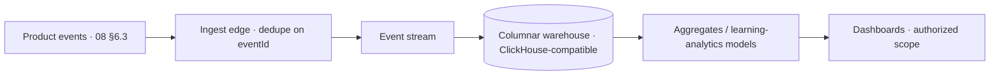

# 31 · Analytics Platform

| | |
|---|---|
| **Document ID** | 31 |
| **Owner** | Head of Data / Product Analytics Lead |
| **Status** | Draft (Phase 1) |
| **Last updated** | 2026-07-19 |
| **Related** | [08 System Architecture](../02-architecture/08-system-architecture.md) · [09 Database](../02-architecture/09-database-design.md) · [14 Privacy](../03-security-privacy/14-privacy-model.md) · [02 PRD §6](../01-product/02-prd.md) · [23 Assessment](../05-education/23-assessment-engine.md) · [27 Admin Portal](./27-admin-portal.md) |

## Purpose

This document specifies the **Analytics & Insights context** — event ingestion, learning analytics, the
**north-star instrumentation**, and dashboards for Mentors/Admins. It makes success *measurable from
MVP* ([02 PRD §6](../01-product/02-prd.md)) while never exposing raw child PII ([14](../03-security-privacy/14-privacy-model.md)).

## Scope

In scope: event pipeline, north-star + KPI instrumentation, learning analytics, dashboards, and privacy.
Out of scope: warehouse provisioning ([36 Infrastructure](../02-architecture/36-infrastructure-architecture.md))
and business KPIs themselves (owned by [02 PRD](../01-product/02-prd.md)).

---

## 1. Principles

1. **Measurable north-star from day one** — "objectives mastered by out-of-school learners" is
   instrumented at MVP ([FR-ANL-001](../01-product/03-functional-requirements.md), [01 Vision §6](../00-overview/01-vision.md)).
2. **Privacy-preserving** — pseudonymous IDs; **no raw child PII in analytics** ([FR-ANL-002](../01-product/03-functional-requirements.md), [14 §5](../03-security-privacy/14-privacy-model.md)).
3. **Offline-tolerant ingestion** — events queued offline arrive without loss or double-count
   ([FR-ANL-001](../01-product/03-functional-requirements.md)).
4. **Authorized, scoped dashboards** — viewers see only their authorized scope ([FR-ANL-003](../01-product/03-functional-requirements.md)).
5. **Aggregate over identify** — insights are aggregate; no re-identification of children.

## 2. Event pipeline

- Consumes the **domain event stream** ([08 §6.3](../02-architecture/08-system-architecture.md)); the north-star
  `ObjectiveMastered` is a first-class event.
- **Idempotent ingest** (dedupe on `eventId`) tolerates offline-queued and at-least-once delivery
  ([08 §6.2](../02-architecture/08-system-architecture.md), [23 §5](../05-education/23-assessment-engine.md)).
- Lands in a **columnar warehouse** for analytics ([09 §11](../02-architecture/09-database-design.md)).

## 3. North-star & KPI instrumentation

- **North-star:** distinct objectives mastered by learners flagged out-of-school at enrolment —
  ungameable by logins/content ([02 PRD §6](../01-product/02-prd.md)).
- **KPI layers** (learning, reach, engagement, trust/safety, performance, cost) ladder to the north-star
  ([02 PRD §6](../01-product/02-prd.md)); **guardrail metrics** (data cost, safety rate, a11y, marginal
  cost) are tracked so they don't regress.

## 4. Learning analytics & dashboards

- **Mentor/Admin dashboards**: progress, attendance, mastery, at-risk signals — within the viewer's
  **authorized scope only** ([FR-ANL-003](../01-product/03-functional-requirements.md), [27](./27-admin-portal.md)).
- **At-risk detection** surfaces learners needing human help (feeds Mentor "Needs Attention", [28](./28-mentor-portal.md)).
- No dashboard exposes raw child PII ([FR-ANL-002](../01-product/03-functional-requirements.md)).

## 5. Privacy

- Analytics use **pseudonymous identifiers** (`student_ref`), not names ([14 §5](../03-security-privacy/14-privacy-model.md));
  datasets are PII-scanned ([04 NFR PRIV-05](../01-product/04-non-functional-requirements.md)).
- **Cross-tenant aggregate** insight for Platform Admin without cross-tenant PII access (open question).
- Retention + minimisation per privacy policy ([14 §6](../03-security-privacy/14-privacy-model.md)).

## 6. Risks

| # | Risk | Impact | Mitigation |
|---|---|---|---|
| R-1 | Child PII leaks into analytics | Privacy breach | Pseudonymous IDs, PII scan, no-PII dashboards. |
| R-2 | North-star gamed by logins/content | False success | Objective-mastery definition; dedup; OOS segmentation. |
| R-3 | Offline events lost/double-counted | Wrong metrics | Idempotent ingest, dedupe on eventId. |
| R-4 | Cross-tenant leakage in dashboards | Privacy | Authorized scope enforcement ([12](../03-security-privacy/12-authorization-model.md)). |

## Open questions

- **"Out-of-school at enrolment" flag** — lawful, non-stigmatising capture ([14 O-4](../03-security-privacy/14-privacy-model.md), [02 PRD](../01-product/02-prd.md)).
- **Warehouse choice** confirmation (ClickHouse-compatible) ([09 open Qs](../02-architecture/09-database-design.md)).
- **Cross-tenant aggregate** analytics without PII ([27](./27-admin-portal.md)).
- **At-risk model** definition and false-positive tolerance.

## Change log

| Date | Change | Author |
|---|---|---|
| 2026-07-19 | Initial analytics platform: idempotent event pipeline, north-star + KPI instrumentation, privacy-preserving learning analytics & scoped dashboards. | Head of Data / Analytics |
