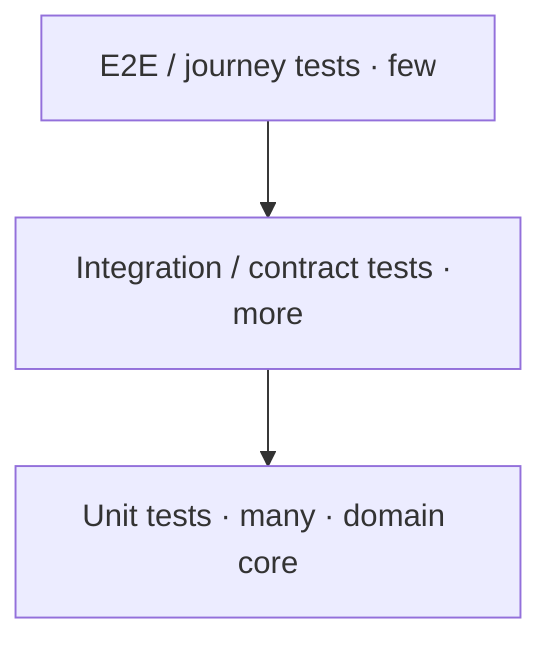

# 40 · Testing Strategy

| | |
|---|---|
| **Document ID** | 40 |
| **Owner** | Head of Quality / Principal Engineer |
| **Status** | Draft (Phase 1) |
| **Last updated** | 2026-07-19 |
| **Related** | [03 Functional Requirements](../01-product/03-functional-requirements.md) · [04 NFR](../01-product/04-non-functional-requirements.md) · [37 CI/CD](./37-cicd-pipeline.md) · [50 Definition of Done](./50-definition-of-done.md) · [15 Child Safety](../03-security-privacy/15-child-safety-framework.md) · [24 AI Teacher](../05-education/24-ai-teacher-specification.md) · [33 Offline](../02-architecture/33-offline-architecture.md) |

## Purpose

This document defines **how Taleem is tested** so that every functional requirement ([03 FR](../01-product/03-functional-requirements.md))
and quality target ([04 NFR](../01-product/04-non-functional-requirements.md)) is verified before it
reaches a child. It covers the test pyramid, the special testing that child safety, accessibility,
offline, and AI demand, and the CI gates that make "tested" a release condition.

## Scope

In scope: test levels, safety/a11y/offline/AI/performance/security testing, test data, and coverage
gates. Out of scope: pipeline mechanics ([37 CI/CD](./37-cicd-pipeline.md)) and the DoD checklist
([50](./50-definition-of-done.md)).

---

## 1. Principles

1. **Every requirement is testable and tested** — FRs have acceptance criteria; NFRs have measurement
   methods; both map to tests ([03](../01-product/03-functional-requirements.md), [04](../01-product/04-non-functional-requirements.md)).
2. **Safety and accessibility are pass/fail gates**, not aspirations ([15](../03-security-privacy/15-child-safety-framework.md), [16](../04-design/16-accessibility-standards.md)).
3. **Test the reference baseline** — low-end device + 3G, offline included ([04 NFR COMPAT-01](../01-product/04-non-functional-requirements.md)).
4. **Fast feedback** — the pyramid favours many fast unit tests over few slow E2E.
5. **Shift left** — tests run in CI on every change ([37](./37-cicd-pipeline.md)).

## 2. Test pyramid

| Level | Scope |
|---|---|
| **Unit** | Domain core (pure, no I/O) — the bulk; ≥ 85% branch on domain ([04 NFR MNT-02](../01-product/04-non-functional-requirements.md)). |
| **Integration** | Adapters, DB, events, outbox idempotency ([08 §6.2](../02-architecture/08-system-architecture.md)). |
| **Contract** | OpenAPI + event schema provider/consumer conformance ([10 §12](../02-architecture/10-api-design.md)). |
| **E2E / journey** | Core journeys ([06 Journeys](../01-product/06-user-journeys.md)) on the reference baseline. |

## 3. Specialised testing (the ones that matter most here)

| Kind | What | Authority |
|---|---|---|
| **Child-safety / AI red-team** | Adversarial prompts (harmful, grooming-adjacent, injection, distress); output moderation; "never human". **Release-gating.** | [15 §3/§11](../03-security-privacy/15-child-safety-framework.md), [24 §10](../05-education/24-ai-teacher-specification.md) |
| **AI groundedness/honesty** | RAG-grounded, non-hallucinated answers; "I don't know" behaviour. | [24 §10](../05-education/24-ai-teacher-specification.md) |
| **Accessibility** | Automated axe + manual audit; RTL visual regression; screen-reader matrix. | [16](../04-design/16-accessibility-standards.md), [04 NFR A11Y](../01-product/04-non-functional-requirements.md) |
| **Offline/sync** | Network-disabled E2E; idempotent replay (flush twice → identical state); conflict scenarios. | [33](../02-architecture/33-offline-architecture.md), [04 NFR OFFL](../01-product/04-non-functional-requirements.md) |
| **Performance** | Lighthouse CI on 3G profile; bundle-size budget; load tests toward 1M. | [04 NFR PERF/DATA/SCAL](../01-product/04-non-functional-requirements.md) |
| **Security** | SAST/DAST/SCA/secret-scan; authz fitness (every route has a policy); ASVS regression. | [13](../03-security-privacy/13-security-model.md), [12 §9](../03-security-privacy/12-authorization-model.md) |
| **Integrity** | Sealed-attempt tamper tests; grade-derivability. | [23](../05-education/23-assessment-engine.md), [13 §5](../03-security-privacy/13-security-model.md) |

## 4. Test data & environments

- **Synthetic, never real child data** in tests/CI/staging ([14](../03-security-privacy/14-privacy-model.md)).
- Ephemeral CI environments; prod-like staging for DAST/load ([35 §2](../02-architecture/35-deployment-architecture.md)).
- Deterministic fixtures for curriculum/assessment gold sets.

## 5. CI gates (release conditions)

Enforced in [37 CI/CD](./37-cicd-pipeline.md) and the DoD ([50](./50-definition-of-done.md)):

- Unit/integration/contract green; domain coverage ≥ target.
- **AI safety red-team green** (release-blocking).
- Accessibility (axe + RTL) green.
- Offline replay/idempotency green.
- Performance/bundle budgets met; security scans clean of criticals.

## 6. Risks

| # | Risk | Impact | Mitigation |
|---|---|---|---|
| R-1 | Unsafe AI ships | Child harm | Release-gating red-team eval set. |
| R-2 | A11y/RTL regressions | Exclusion | Automated + manual a11y + RTL visual regression gates. |
| R-3 | Offline data-loss undetected | Lost learning | Offline replay/idempotency/conflict tests. |
| R-4 | Real child data in tests | Privacy breach | Synthetic-only policy + scanning. |
| R-5 | Perf regressions on 3G | Unreachable | Lighthouse-CI + bundle budgets. |

## Open questions

- **Coverage target** shape (flat 85% vs. per-layer) ([04 NFR MNT-02](../01-product/04-non-functional-requirements.md)).
- **AI eval maintenance** — who curates the red-team/groundedness sets and how often.
- **Load-test scale** milestones toward 1M ([04 NFR SCAL](../01-product/04-non-functional-requirements.md)).

## Change log

| Date | Change | Author |
|---|---|---|
| 2026-07-19 | Initial testing strategy: pyramid, specialised safety/a11y/offline/AI/perf/security testing, synthetic test data, CI release gates. | Head of Quality |
