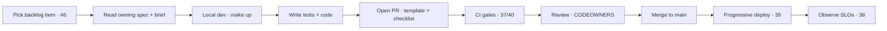

# 49 · Development Workflow

| | |
|---|---|
| **Document ID** | 49 |
| **Owner** | Principal Engineer / Engineering Manager |
| **Status** | Draft (Phase 1) |
| **Last updated** | 2026-07-19 |
| **Related** | [48 Repository Standards](./48-repository-standards.md) · [50 Definition of Done](./50-definition-of-done.md) · [37 CI/CD](./37-cicd-pipeline.md) · [40 Testing](./40-testing-strategy.md) · [46 Backlog](../08-delivery/46-project-backlog.md) · [45 Milestone Plan](../08-delivery/45-milestone-plan.md) |

## Purpose

This document describes the **day-to-day development workflow** — from a backlog item to a shipped,
Definition-of-Done-satisfying change — so the team moves fast without compromising the safety and quality
the mission demands.

## Scope

In scope: the dev loop, local environment, branch→PR→merge→deploy flow, and how work is planned/tracked.
Out of scope: repo governance ([48](./48-repository-standards.md)), pipeline internals ([37](./37-cicd-pipeline.md)),
and the DoD checklist ([50](./50-definition-of-done.md)).

---

## 1. Principles

1. **Small, safe increments** — trunk-based, short-lived branches, frequent integration ([48 §2](./48-repository-standards.md)).
2. **Spec before code** — read the owning spec + [Authoring Brief](../_meta/authoring-brief.md); contract-first ([10](../02-architecture/10-api-design.md)).
3. **Test-first where it pays** — safety/domain logic especially ([40](./40-testing-strategy.md)).
4. **DoD is the finish line**, including safety/privacy/a11y ([50](./50-definition-of-done.md)).

## 2. The loop

## 3. Local environment

- **One-command bring-up** (`make up`) from a clean clone ([04 NFR MNT-03](../01-product/04-non-functional-requirements.md)).
- Synthetic data only ([40 §4](./40-testing-strategy.md), [14](../03-security-privacy/14-privacy-model.md)).
- Reference-baseline emulation (low-end device + 3G) available locally for reach checks ([04 NFR COMPAT-01](../01-product/04-non-functional-requirements.md)).

## 4. Planning & tracking

- Work comes from the **backlog** ([46](../08-delivery/46-project-backlog.md)) aligned to the
  **milestone plan** ([45](../08-delivery/45-milestone-plan.md)) and **roadmap** ([44](../08-delivery/44-roadmap.md)).
- Each item traces FR/NFR → tests → code ([03](../01-product/03-functional-requirements.md), [04](../01-product/04-non-functional-requirements.md), [40](./40-testing-strategy.md)).

## 5. Deploy & observe

- Merge triggers CI/CD; **progressive delivery** (flag → canary → ramp) with SLO auto-halt ([35 §4](../02-architecture/35-deployment-architecture.md)).
- Post-deploy, watch SLO dashboards; error-budget burn halts the ramp ([38 §4](./38-monitoring.md)).

## 6. Phase discipline (current)

We are in **Phase 1 — Foundation**: the deliverable is the blueprint; **production code does not begin
until the blueprint is approved** ([CONTRIBUTING](../../CONTRIBUTING.md), [02 PRD phase gate](../01-product/02-prd.md)).
This workflow governs both doc contributions now and code contributions when Phase 1 completes.

## Risks

| # | Risk | Impact | Mitigation |
|---|---|---|---|
| R-1 | Big-bang PRs | Risky, hard to review | Small increments, trunk-based. |
| R-2 | Code before spec | Rework, drift | Spec-before-code + contract-first. |
| R-3 | Skipping DoD | Unsafe/low-quality ship | DoD gate + PR checklist. |

## Open questions

- **Issue tracker** and its link to backlog IDs ([46](../08-delivery/46-project-backlog.md)).
- **Local reference-device emulation** tooling fidelity.

## Change log

| Date | Change | Author |
|---|---|---|
| 2026-07-19 | Initial development workflow: backlog→spec→local→test→PR→CI→review→merge→progressive deploy→observe loop; phase discipline. | Engineering Manager |
