# 53 · Incident Response Plan

| | |
|---|---|
| **Document ID** | 53 (Phase 1.5 remediation) |
| **Owner** | SRE Lead / Head of Trust & Safety |
| **Status** | Draft — on-call staffing is DECISION REQUIRED |
| **Last updated** | 2026-07-19 |
| **Closes** | AR-C-22, AR-H (ops), AR-L (assurance) |
| **Related** | [52 Crisis Protocol](../03-security-privacy/52-safeguarding-crisis-protocol.md) · [38 Monitoring](./38-monitoring.md) · [13 Security §10](../03-security-privacy/13-security-model.md) · [14 Privacy](../03-security-privacy/14-privacy-model.md) |

## Purpose

The blueprint referenced "top-severity incidents" and "playbooks" but contained no incident-response
plan. This provides the severity taxonomy, roles, communications, and the safeguarding-specific and
data-breach runbooks for a child-safety platform.

## Scope

In scope: severity taxonomy, IC/roles, comms, safeguarding IR, breach notification, post-incident review,
on-call. Out of scope: the crisis-response *clinical* protocol ([52](../03-security-privacy/52-safeguarding-crisis-protocol.md)).

---

## 1. Severity taxonomy

| Sev | Definition | Examples | Response |
|---|---|---|---|
| **SEV1** | A child is in danger, or child data is exposed | Missed T0 safeguarding escalation; safeguarding-data breach; grooming via a platform flaw | Page safeguarding + security on-call immediately; IC declared; 24/7 |
| **SEV2** | Core learning path down or degraded at scale | Login/lesson/submit outage; sync data loss; auth outage | Page eng on-call; IC declared |
| **SEV3** | Partial degradation, workaround exists | AI Teacher down (degraded help); notification backlog | On-call handles |
| **SEV4** | Minor/no user impact | Single-service blip | Ticket |

**Any incident with potential child-safety impact is at minimum SEV1** and is jointly owned by Security
and Trust & Safety ([13 §10](../03-security-privacy/13-security-model.md), [15 §9](../03-security-privacy/15-child-safety-framework.md)).

## 2. Roles

- **Incident Commander (IC)** — owns the response, not the fix.
- **Safeguarding Lead** — owns child-protection actions on any SEV1 with child impact.
- **Comms Lead** — guardian/regulator/internal comms.
- **Scribe** — timeline for the post-incident review.
- **Subject-matter responders** — service owners.

## 3. On-call (DECISION REQUIRED — staffing)

Two **separate 24/7 rotations**: **Engineering** (availability/data) and **Trust & Safety/Safeguarding**
(child protection). Each with primary/secondary, ack timeout, and an escalation ladder. Follow-the-sun or
Pakistan-night coverage for T0/T1 safeguarding ([52](../03-security-privacy/52-safeguarding-crisis-protocol.md)).
Paging tool, roster, and headcount are a staffing decision, gated in [RISK_REMEDIATION_PLAN.md](../../RISK_REMEDIATION_PLAN.md).

## 4. Safeguarding incident runbook (SEV1)

```mermaid
graph LR
    D[Detect / missed-SLA alert] --> P[Page safeguarding on-call]
    P --> Protect[Protect the child first]
    Protect --> Assess[Assess: guardian implicated?]
    Assess --> Act[Holding response · human contact · referral per 52]
    Act --> Notify[Notify guardian/regulator per policy]
    Notify --> Preserve[Preserve evidence · immutable audit]
    Preserve --> PIR[Blameless post-incident review]
```

## 5. Data-breach notification

If child data is exposed: contain, assess scope, notify DPO, and follow the breach-notification
thresholds and timelines ([14](../03-security-privacy/14-privacy-model.md)) — regulator + affected
guardians. Thresholds under Pakistan PDPB are DECISION REQUIRED (legal).

## 6. Post-incident review

Blameless, within a fixed window, produces tracked actions. SEV1/SEV2 require a written review; child-
safety SEV1 reviews go to leadership + safeguarding governance.

## 7. Assurance program

Pre-launch external pentest + independent safeguarding/privacy audit; recurring cadence; a published
vulnerability-disclosure policy with a security contact (closes AR-L security-assurance).

## Open questions

- On-call staffing/tooling and headcount (DECISION REQUIRED).
- PDPB breach thresholds/timelines (legal).
- Whether a child-safety incident warrants proactive external transparency reporting.

## Change log

| Date | Change | Author |
|---|---|---|
| 2026-07-19 | Initial incident-response plan (Phase 1.5): severity taxonomy (SEV1 = child in danger), roles, dual 24/7 on-call, safeguarding + breach runbooks, PIR, assurance program. | SRE Lead / Head of T&S |
