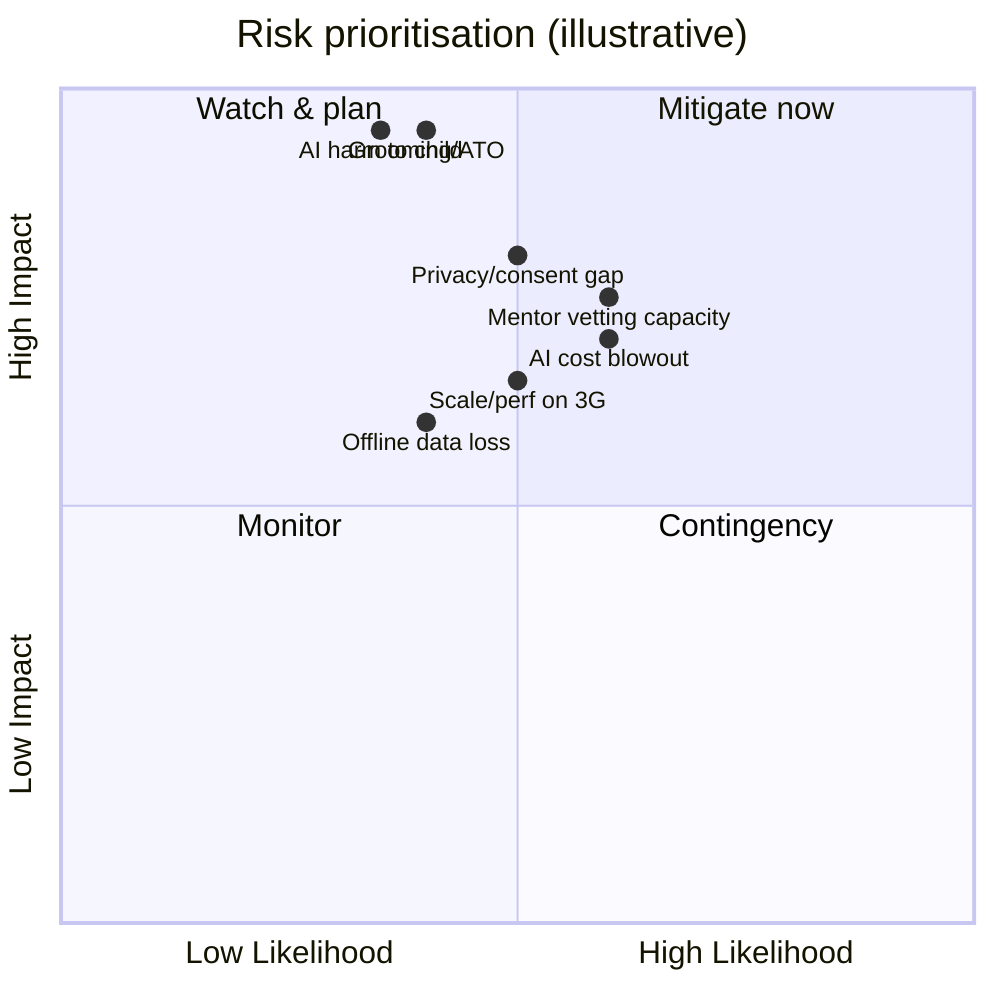

# 43 · Risk Register

| | |
|---|---|
| **Document ID** | 43 |
| **Owner** | Program Director / CTO |
| **Status** | Draft (Phase 1) |
| **Last updated** | 2026-07-19 |
| **Related** | [01 Vision](../00-overview/01-vision.md) · [15 Child Safety](../03-security-privacy/15-child-safety-framework.md) · [14 Privacy](../03-security-privacy/14-privacy-model.md) · [24 AI Teacher](../05-education/24-ai-teacher-specification.md) · [44 Roadmap](./44-roadmap.md) · [02 PRD](../01-product/02-prd.md) |

## Purpose

This document is the **program-level risk register** — the consolidated, prioritised view of the
significant risks to Project Taleem's mission, with owners and mitigations. It aggregates the per-doc
risk sections into a single governance artifact reviewed on a cadence.

## Scope

In scope: strategic, safety, privacy/security, technical, delivery, and sustainability risks at program
level. Out of scope: exhaustive per-feature risks (owned by each spec's Risks section, referenced here).

---

## 1. Method

Each risk is scored **Likelihood × Impact** (Low/Med/High) with **child-impact weighted highest** —
any child-safety risk is elevated regardless of likelihood ([15 §1](../03-security-privacy/15-child-safety-framework.md)).
Risks are reviewed on a regular cadence; mitigations and residual risk are tracked.

## 2. Top program risks

| # | Risk | L×I | Owner | Mitigation | Refs |
|---|---|---|---|---|---|
| PR-1 | **AI Teacher harms a child** (unsafe/hallucinated/manipulative output) | Med×High | Head of AI / T&S | Two-sided guardrails, red-team release gate, honesty prompt, block-and-log | [24](../05-education/24-ai-teacher-specification.md), [15 §3](../03-security-privacy/15-child-safety-framework.md) |
| PR-2 | **Grooming / account takeover** (predatory contact) | Med×High | CISO / T&S | Guardian-anchored ID, audited number-change, bounded/monitored contact, vetting | [11 §9](../03-security-privacy/11-authentication-strategy.md), [15 §7](../03-security-privacy/15-child-safety-framework.md) |
| PR-3 | **Privacy/consent legal gap** (esp. institutional consent) | Med×High | DPO / Counsel | Conservative strictest-of baseline, attested consent, DPIA | [14 §2/§3](../03-security-privacy/14-privacy-model.md) |
| PR-4 | **AI cost blowout at scale** undermines sustainability | Med×High | Head of AI / Finance | Tiered routing, caching, cost ledger, per-student envelope | [24 §9](../05-education/24-ai-teacher-specification.md), [04 NFR COST](../01-product/04-non-functional-requirements.md) |
| PR-5 | **Mentor vetting/supply cannot scale** | Med×High | Ops / People | Vetting pipeline investment, ratio caps, phased cohort growth | [15 §6](../03-security-privacy/15-child-safety-framework.md), [02 PRD D8](../01-product/02-prd.md) |
| PR-6 | **Unreachable at the bottom of the curve** (data/perf/offline) | Med×High | Principal Eng | Reference-baseline gates, offline-first, data budgets | [04 NFR](../01-product/04-non-functional-requirements.md), [33](../02-architecture/33-offline-architecture.md) |
| PR-7 | **Offline sync data loss / grade integrity** | Med×High | Principal Eng | Idempotent append-only, deterministic conflict policy, sealed attempts | [33 §6](../02-architecture/33-offline-architecture.md), [23](../05-education/23-assessment-engine.md) |
| PR-8 | **Security breach of child data** | Low×High | CISO | Defence-in-depth, ASVS L2, safeguarding zone, least privilege | [13](../03-security-privacy/13-security-model.md) |
| PR-9 | **Scale ceiling** hit before 1M | Low×High | Principal Eng | Stateless/horizontal, partitioning plans, load tests | [04 NFR SCAL](../01-product/04-non-functional-requirements.md), [35](../02-architecture/35-deployment-architecture.md) |
| PR-10 | **Credential/report-card not recognised** (business) | Med×Med | Business | Board/government partnership track | [01 Vision open Qs](../00-overview/01-vision.md) |
| PR-11 | **Funding/sponsorship insufficient** | Med×High | Business | Diversified sponsorship, low marginal cost | [01 Vision §9](../00-overview/01-vision.md) |
| PR-12 | **Urdu/RTL/AI-in-Urdu quality shortfall** | Med×Med | Design / AI | Urdu-first testing, Urdu eval coverage | [16](../04-design/16-accessibility-standards.md), [24 open Qs](../05-education/24-ai-teacher-specification.md) |

## 3. Governance

- The register is reviewed on a regular cadence; new risks from specs' Risks sections are promoted here
  when they reach program significance.
- **Child-safety risks are standing agenda item #1**; a materialised safety risk is a top-severity
  incident ([15 §9](../03-security-privacy/15-child-safety-framework.md), [13 §10](../03-security-privacy/13-security-model.md)).
- Mitigations map to backlog items ([46](./46-project-backlog.md)) and milestones ([45](./45-milestone-plan.md)).

## Open questions

- **Risk appetite** thresholds (what residual risk is acceptable to launch a pilot).
- **External audit** cadence for safety/security/privacy.
- **Regulatory changes** tracking (PDPB finalisation).

## Change log

| Date | Change | Author |
|---|---|---|
| 2026-07-19 | Initial risk register: prioritised program risks with owners/mitigations, child-impact-weighted method, governance cadence. | Program Director |
