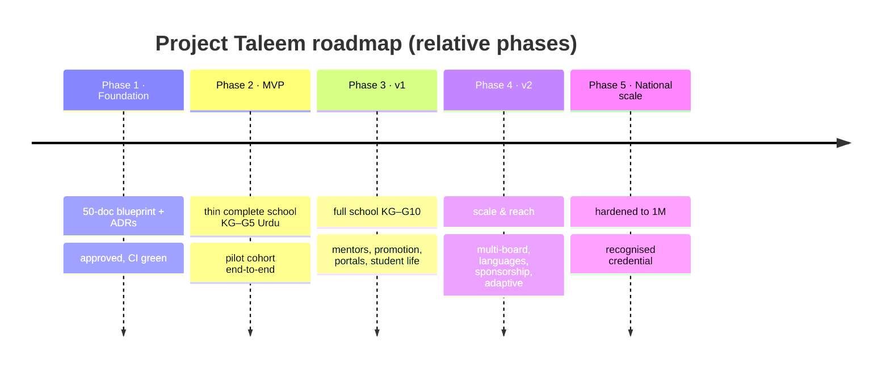

# 44 · Roadmap

| | |
|---|---|
| **Document ID** | 44 |
| **Owner** | Chief Product Officer / Program Director |
| **Status** | Draft (Phase 1) |
| **Last updated** | 2026-07-19 |
| **Related** | [01 Vision](../00-overview/01-vision.md) · [02 PRD](../01-product/02-prd.md) · [43 Risk Register](./43-risk-register.md) · [45 Milestone Plan](./45-milestone-plan.md) · [46 Backlog](./46-project-backlog.md) |

## Purpose

This document is the **path from blueprint to a school that serves a nation** — the phased roadmap that
sequences the vision ([01](../00-overview/01-vision.md)) and PRD releases ([02 §4](../01-product/02-prd.md))
into deliverable stages, gated by the mission's non-negotiables.

## Scope

In scope: the phase sequence (Foundation → MVP → v1 → v2 → scale), the goal and exit gate of each phase,
and the dependencies between them. Out of scope: dated milestones ([45](./45-milestone-plan.md)) and
individual backlog items ([46](./46-project-backlog.md)). Dates are deliberately **relative** — this is a
planning roadmap, not a commitment schedule.

---

## 1. Roadmap principles

1. **Blueprint before build** — no production code until Phase 1 is approved ([02 PRD phase gate](../01-product/02-prd.md)).
2. **Thin complete school first** — MVP is a *complete* vertical school for one grade band, not a demo
   ([02 §4.1](../01-product/02-prd.md)).
3. **Reach and safety gate every phase** — a phase exits only when its bottom-of-curve and child-safety
   gates are green ([02 §10](../01-product/02-prd.md)).
4. **Measure the north-star from MVP** ([31 Analytics](../06-portals/31-analytics-platform.md)).

## 2. Phases

| Phase | Goal | Exit gate |
|---|---|---|
| **1 · Foundation** (current) | Enterprise-grade blueprint: 50 docs + ADRs | All docs Approved; **CI green** (lint/link/mermaid); non-negotiables specified. |
| **2 · MVP** | A thin **complete** school: enrol→timetabled KG–G5 lessons→AI Teacher→assess→report card, offline on 3G, Urdu, safety spine | MVP release gates green ([02 §10](../01-product/02-prd.md)); pilot cohort learns end-to-end; north-star instrumented. |
| **3 · v1** | The **full school**: KG–G10, human grading + promotion, Mentor/Guardian portals, student life, multi-channel engagement, dashboards | v1 release gates green; full loop incl. human grading + promotion; AA across portals. |
| **4 · v2** | **Scale & reach**: multi-board/provincial variance, additional languages, sponsorship at scale, adaptive mastery, credential portability | Variance/languages live without schema change; sponsorship operational. |
| **5 · National scale** | Hardened to **1,000,000** students; recognised credential | Load-validated toward 1M; core-path SLOs held; credential recognition (business). |

## 3. Cross-phase dependencies

| Dependency | Gates | Ref |
|---|---|---|
| Curriculum authored KG–G5 (MVP) → KG–G10 (v1) | Lessons/assessment/RAG | [21](../05-education/21-curriculum-engine.md) |
| Child Safety Framework operational | Everything AI/media/contact | [15](../03-security-privacy/15-child-safety-framework.md) |
| Privacy/consent + legal posture | Identity/enrolment | [14](../03-security-privacy/14-privacy-model.md) |
| LLM gateway + cost envelope | AI Teacher | [24](../05-education/24-ai-teacher-specification.md) |
| SMS/WhatsApp provider (Pakistan) | Notifications | [30](../06-portals/30-notification-system.md) |
| Mentor vetting pipeline | Human grading, safeguarding (v1) | [15 §6](../03-security-privacy/15-child-safety-framework.md), [43 PR-5](./43-risk-register.md) |
| Credential recognition (business) | Portability (v2/5) | [01 open Qs](../00-overview/01-vision.md) |

## 4. Guiding constraints

- Every phase honours the vision's non-negotiables ([01 §7](../00-overview/01-vision.md)); a phase that
  cannot meet child-safety/reach gates does not ship.
- Risks in [43](./43-risk-register.md) are actively burned down phase over phase.

## Open questions

- **Pilot cohort** grade band and size ([02 PRD open Qs](../01-product/02-prd.md)).
- **Phase durations** — dated in [45 Milestone Plan](./45-milestone-plan.md) once resourcing is set.
- **Language rollout order** beyond Urdu/English ([01 open Qs](../00-overview/01-vision.md)).

## Change log

| Date | Change | Author |
|---|---|---|
| 2026-07-19 | Initial roadmap: five phases (Foundation → National scale) with goals and exit gates, cross-phase dependencies, guiding constraints. | CPO / Program Director |
