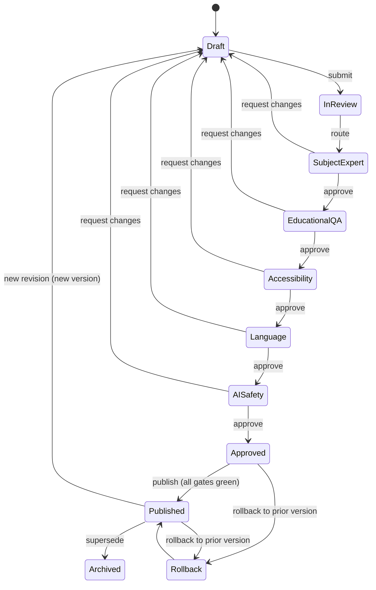

# Authoring Workflow

| | |
|---|---|
| **Status** | Phase 3 · The review workflow every lesson passes · Related: [CURRICULUM_AUTHORING_GUIDE](./CURRICULUM_AUTHORING_GUIDE.md) · [QUALITY_ASSURANCE_STANDARD](./QUALITY_ASSURANCE_STANDARD.md) |
| **Date** | 2026-07-20 |

## 1. States & transitions

## 2. Review chain (roles → gate)

Each transition is a **review decision** by the responsible role; approval advances, "request changes"
returns to Draft with recorded notes.

| Stage | Role | Gate ([QA](./QUALITY_ASSURANCE_STANDARD.md)) |
|---|---|---|
| Subject-Expert Approval | Subject Expert | Technical accuracy + curriculum alignment |
| Educational QA | Instructional Designer | Educational review + age-appropriateness + readability |
| Accessibility Review | A11y Specialist | Accessibility (WCAG 2.2 AA) |
| Language Review | Language Editor (Urdu + English) | Language + translation quality |
| AI Safety Review | Safety Officer | AI safety (AI teaching object + content) |

**Curriculum Architect** owns Draft and Publish. **No self-approval** — the author cannot approve their
own gate.

## 3. Publish preconditions (all must hold)

1. All required fields valid ([LESSON_STANDARD §2](./LESSON_STANDARD.md)).
2. Provenance clean (original / permitted).
3. **All 9 quality gates green.**
4. Full review chain approved (5 role sign-offs).
5. State == `Approved`.

Publishing creates a **new immutable version** and emits a publish event to the Curriculum Engine + AI
Knowledge Base ([CURRICULUM_ARCHITECTURE §5](./CURRICULUM_ARCHITECTURE.md)).

## 4. Versioning, rollback, audit

- **Version control:** every publish snapshots the full lesson (content hash, gate results, change
  summary). Editing a published lesson starts a **new revision → new version**; published versions are
  immutable ([21 §5](../05-education/21-curriculum-engine.md)).
- **Rollback:** re-activate a prior published version (audited, reversible). Learner records cite the
  exact version learned against.
- **Audit trail:** every state transition, review decision, publish, and rollback is append-only with
  actor role + timestamp + note ([13 §9](../03-security-privacy/13-security-model.md)).

## 5. Concurrency & locking

- A lesson in review is read-only to authors; a "request changes" unlocks it back to Draft.
- Optimistic concurrency on edits (version check) prevents lost updates.

## 6. Enforcement

The workflow is a **domain state machine** — illegal transitions are rejected by the domain, not just the
UI. The publish gate is enforced server-side; the authoring UI reflects state but cannot bypass it.

## Change log

| Date | Change | Author |
|---|---|---|
| 2026-07-20 | Authoring workflow: state machine, 5-role review chain → 9 gates, publish preconditions, versioning/rollback/audit, concurrency, server-side enforcement. | Curriculum Studio |
