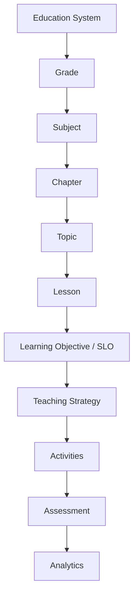
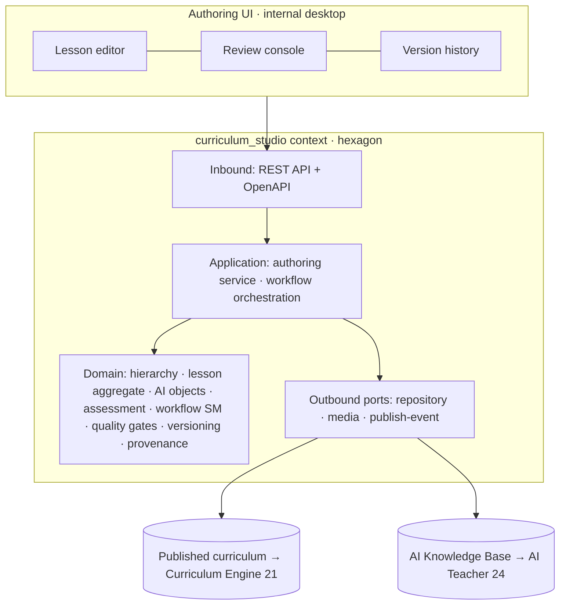
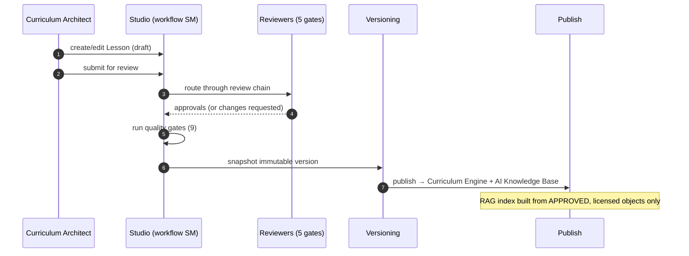

# Curriculum Studio — Architecture

| | |
|---|---|
| **Program** | Curriculum Studio — the AI-native curriculum knowledge system that powers the Taleem AI school |
| **Status** | Phase 3 — platform & tooling (NO production curriculum content yet) |
| **Date** | 2026-07-20 |
| **Related** | [21 Curriculum Engine](../05-education/21-curriculum-engine.md) · [58 Mastery & Validity](../05-education/58-mastery-and-assessment-validity.md) · [23 Assessment](../05-education/23-assessment-engine.md) · [24 AI Teacher](../05-education/24-ai-teacher-specification.md) · [curriculum-research pipeline](../../curriculum-research/04_CURRICULUM_INGESTION_PIPELINE.md) |

## 1. What Curriculum Studio is

Curriculum Studio is the **internal authoring, review, versioning, and publishing platform** for
Taleem's original, AI-native curriculum. It is the source of truth for every learning object that the
Student App, AI Teacher, and Assessment engine consume. **We are not writing books — we are building the
educational knowledge system.**

**Governance-safe by construction:** Studio is an internal tool for Curriculum Architects, subject
experts, and reviewers. It handles **no child data, no live students, and produces no production content
in Phase 3** — only the platform. It sits behind the same governance gate as the M1 skeleton.

## 2. Non-negotiable principles

1. **Original content only.** Never copy copyrighted textbooks. Author original content aligned to the
   *public* National Curriculum of Pakistan (NCP) Student Learning Outcomes. Enforced by the
   **provenance gate** (§6).
2. **AI-native.** Every lesson ships structured **AI teaching objects** ([AI_TEACHING_STANDARD](./AI_TEACHING_STANDARD.md))
   so the AI Teacher is driven by authored pedagogy, not improvisation.
3. **Human-reviewed, quality-gated.** Nothing publishes without passing all quality gates
   ([QUALITY_ASSURANCE_STANDARD](./QUALITY_ASSURANCE_STANDARD.md)) and the review workflow
   ([AUTHORING_WORKFLOW](./AUTHORING_WORKFLOW.md)).
4. **Version-controlled + auditable.** Immutable versions, full history, rollback, audit trail.
5. **Mobile-first, offline-capable, Urdu+English, WCAG 2.2 AA** — the same reach bar as the platform.

## 3. The knowledge hierarchy

Each level maps to the curriculum-engine entities ([21](../05-education/21-curriculum-engine.md)); the
**Lesson** is the atomic authored unit ([LESSON_STANDARD](./LESSON_STANDARD.md)), and the **Learning
Objective (SLO)** is the atomic gradable unit and north-star currency.

## 4. System architecture (hexagonal, in the modulith)

Curriculum Studio is a **bounded-context module** (`curriculum_studio`) inside the core-API modulith
([08 §2](../02-architecture/08-system-architecture.md), [47 Folder Structure](../07-engineering/47-folder-structure.md)),
plus a dedicated **authoring UI** (internal desktop web app).

- **Domain is pure** (framework-free, fully unit-tested): the lesson aggregate, workflow state machine,
  quality gates, versioning, and provenance logic have no I/O.
- **Application** orchestrates create → edit → submit → review-chain → publish → rollback.
- **Adapters**: FastAPI REST + OpenAPI ([CURRICULUM_DATA_MODEL](./CURRICULUM_DATA_MODEL.md)); repository
  (in-memory in Phase 3; sharded Postgres later — [09](../02-architecture/09-database-design.md)); media
  ([MEDIA references](./CONTENT_STYLE_GUIDE.md)); a publish event to the Curriculum Engine + RAG.

## 5. Data flow: authoring → published knowledge

## 6. The provenance gate (never copy textbooks)

Every content object carries a **provenance record** (`source`, `license`, `derivation`, `permission_ref`)
enforced at authoring and at publish ([curriculum-research §4](../../curriculum-research/04_CURRICULUM_INGESTION_PIPELINE.md)):

- `derivation = authored-original` (default) — our own content aligned to public SLOs.
- `derivation = ingested` — only permitted sources (open-licensed or under NCC/MoFEPT MoU).
- **Rejected:** any object derived from copyrighted textbooks or third-party scans. A validation gate
  fails publish if provenance is missing or references a prohibited source.

## 7. Technology

Backend: Python **FastAPI**, hexagonal, pure-stdlib domain (per repo standards). Authoring UI: **Next.js**
(internal desktop). Contract-first **OpenAPI**. Versioning immutable. All per the fixed stack
([Authoring Brief §4](../_meta/authoring-brief.md)).

## 8. Phase 3 scope (this build)

Platform + tooling only: **data models, APIs, authoring interface, workflow, versioning, publishing,
review system, validation, documentation, tests.** No production curriculum content. The result is a
production-grade platform capable of supporting every subject KG–10.

## Change log

| Date | Change | Author |
|---|---|---|
| 2026-07-20 | Initial Curriculum Studio architecture: knowledge hierarchy, hexagonal module + authoring UI, authoring→publish data flow, provenance gate, Phase-3 scope. | Curriculum Studio |
