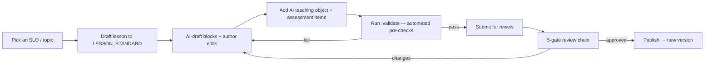

# Curriculum Authoring Guide

| | |
|---|---|
| **Status** | Phase 3 · How to author a lesson in Curriculum Studio · Related: [LESSON_STANDARD](./LESSON_STANDARD.md) · [AUTHORING_WORKFLOW](./AUTHORING_WORKFLOW.md) |
| **Date** | 2026-07-20 |

## 1. Who authors

| Role | Does |
|---|---|
| **Curriculum Architect** | Owns the SLO taxonomy, chapter/topic structure, and publish decision |
| **Subject Author** | Writes lessons (AI-drafted + human-authored) aligned to SLOs |
| **Subject Expert** | Reviews technical accuracy + curriculum alignment |
| **Instructional Designer** | Educational QA, age-appropriateness, readability |
| **A11y Specialist / Language Editor / Safety Officer** | The remaining review gates |

## 2. The authoring loop

## 3. Step-by-step

1. **Start from a public SLO** (never from a textbook). Record the `standard_code` and provenance
   (`derivation = authored-original`).
2. **Write original content** to [LESSON_STANDARD](./LESSON_STANDARD.md) — Urdu-first, with the full field
   set. AI may **draft** blocks; the author owns and edits them.
3. **Author the AI Teaching Object** ([AI_TEACHING_STANDARD](./AI_TEACHING_STANDARD.md)) — teaching +
   questioning strategy, misconception detectors, hint policy, escalation + forbidden behaviours.
4. **Author assessment** — item bank (≥5×/SLO), rubrics, auto+mentor marking ([ASSESSMENT_STANDARD](./ASSESSMENT_STANDARD.md)).
5. **Add media** — original/CC0 SVG, audio (recorded Urdu), alt text.
6. **`:validate`** — fix every automated finding before submitting (don't waste reviewer time).
7. **Submit** — the workflow routes through the 5 gates; address "request changes" notes.
8. **Publish** — the Architect publishes when all gates green; a new immutable version is created.

## 4. Using AI responsibly in authoring

- AI **drafts**; humans **own, review, and sign off**. AI-generated content is **never auto-published**
  ([QA §4](./QUALITY_ASSURANCE_STANDARD.md)).
- Draft **to our SLO taxonomy**, not by copying textbooks (provenance enforced).
- Every AI-drafted item passes the same psychometric + safety + bias review.

## 5. Do / don't

| Do | Don't |
|---|---|
| Align to public NCP SLOs | Copy copyrighted textbook text/images |
| Author original, Urdu-first content | Skip a quality gate or self-approve |
| Name misconceptions + corrections | Ship without recorded Urdu audio |
| Keep lessons short + offline-friendly | Overload a lesson with many SLOs |
| Record provenance on everything | Ingest third-party scans |

## Change log

| Date | Change | Author |
|---|---|---|
| 2026-07-20 | Authoring guide: roles, authoring loop, step-by-step, responsible AI-assisted authoring, do/don't. | Curriculum Studio |
