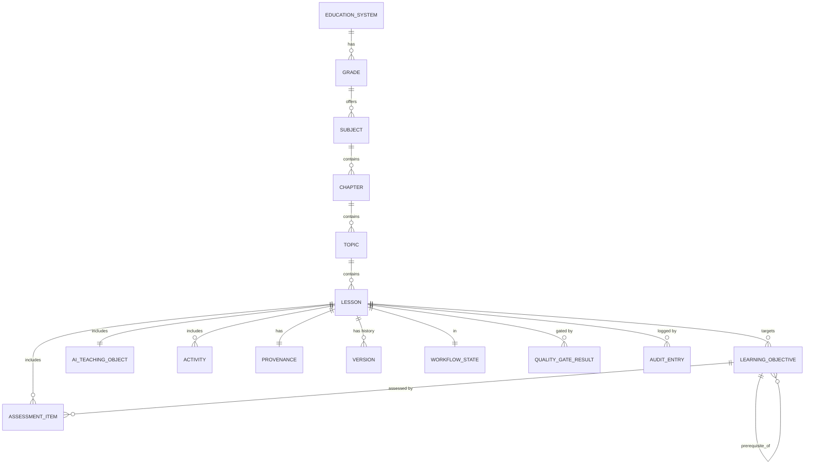

# Curriculum Studio — Data Model

| | |
|---|---|
| **Status** | Phase 3 · Related: [CURRICULUM_ARCHITECTURE](./CURRICULUM_ARCHITECTURE.md) · [LESSON_STANDARD](./LESSON_STANDARD.md) · [ASSESSMENT_STANDARD](./ASSESSMENT_STANDARD.md) · [AI_TEACHING_STANDARD](./AI_TEACHING_STANDARD.md) |
| **Date** | 2026-07-20 |

## 1. Entity model



## 2. Identifiers

All IDs are UUIDv7 (time-ordered, offline-safe — [09 §3](../02-architecture/09-database-design.md)) with
a human-readable slug key. `standard_code` maps each objective to the public NCP SLO it aligns to.

| Entity | ID | Business key |
|---|---|---|
| Education System | `system_id` | e.g. `PK-NCP` |
| Grade | `grade_id` | `KG`,`G1`..`G10` |
| Subject | `subject_id` | `math`,`urdu`,… |
| Chapter | `chapter_id` | subject+seq |
| Topic | `topic_id` | chapter+seq |
| Lesson | `lesson_id` | topic+seq |
| Learning Objective | `objective_id` | `standard_code` |

## 3. Lesson object (full field set)

The Lesson aggregate — see [LESSON_STANDARD](./LESSON_STANDARD.md) for authoring rules. Every field is
first-class and versioned.

| Field | Type | Notes |
|---|---|---|
| `lesson_id` | UUIDv7 | stable forever |
| `title` | localized{ur,en} | |
| `description` | localized | |
| `learning_outcomes` | [objective_ref] | SLOs targeted |
| `prerequisites` | [objective_ref] | prerequisite DAG ([58 §2](../05-education/58-mastery-and-assessment-validity.md)) |
| `estimated_duration_min` | int | |
| `difficulty` | enum{intro, developing, secure, challenge} | |
| `keywords` | [str] | search/index |
| `vocabulary` | [{term, definition, pronunciation_audio_ref}] | Urdu+English |
| `teacher_script` | rich | what the (AI/human) teacher says |
| `student_explanation` | rich | child-facing explanation |
| `worked_examples` | [example] | step-by-step |
| `visual_concepts` | [media_ref] | SVG/diagram/animation |
| `interactive_activities` | [activity] | see [ASSESSMENT_STANDARD](./ASSESSMENT_STANDARD.md) |
| `practice_questions` | [assessment_item] | |
| `hints` | [{trigger, hint}] | graduated |
| `common_misconceptions` | [{misconception, correction}] | |
| `adaptive_remediation` | [{signal, remediation_ref}] | routes down the DAG |
| `challenge_problems` | [assessment_item] | for `secure`+ |
| `homework` | [assessment_item] | |
| `assessment` | assessment_blueprint | formative + summative |
| `revision_notes` | rich | |
| `summary` | rich | |
| `parent_notes` | localized | guardian-facing |
| `mentor_notes` | rich | mentor-facing |
| `accessibility_notes` | rich | a11y guidance ([ACCESSIBILITY_STANDARD](./ACCESSIBILITY_STANDARD.md)) |
| `offline_package` | package_ref | day-pack bundling ([33](../02-architecture/33-offline-architecture.md)) |
| `ai_teaching_object` | AITeachingObject | see [AI_TEACHING_STANDARD](./AI_TEACHING_STANDARD.md) |
| `provenance` | Provenance | required; enforces original-content rule |
| `metadata` | Metadata | grade/subject/lang/authors/tags |
| `workflow_state` | WorkflowState | see [AUTHORING_WORKFLOW](./AUTHORING_WORKFLOW.md) |
| `quality_gate_results` | [QualityGateResult] | see [QUALITY_ASSURANCE_STANDARD](./QUALITY_ASSURANCE_STANDARD.md) |
| `version` | int | current version number |
| `version_history` | [Version] | immutable snapshots + audit |

`rich` = structured content blocks (text/image/audio/interactive), localized ur+en, each block
media-referenced and a11y-annotated.

## 4. Provenance (required on every lesson)

```json
{ "derivation": "authored-original | ingested",
  "source": "authored | ncc.gov.pk/... (aligned-to) | open-license-uri",
  "license": "authored-original | MoU-2026-NCC | CC-BY-4.0",
  "aligned_slo_codes": ["MATH-G1-N-01", "..."],
  "permission_ref": "MoU-... | null",
  "prohibited_source": false }
```

Validation **rejects** a lesson whose provenance is missing, whose `derivation` claims `ingested` without
a `permission_ref`/open license, or whose `prohibited_source` is true.

## 5. AI Teaching Object

See [AI_TEACHING_STANDARD](./AI_TEACHING_STANDARD.md). Fields: `learning_goals`, `teaching_strategy`,
`questioning_strategy`, `slow_down_signals`, `hint_policy`, `example_policy`, `misconception_detectors`,
`critical_thinking_prompts`, `personalization_rules`, `escalation_rules`, `forbidden_behaviours`,
`confidence_thresholds`.

## 6. Workflow state & audit

```json
{ "state": "draft|in_review|subject_expert|educational_qa|accessibility|language|ai_safety|approved|published|archived",
  "assignee_role": "curriculum_architect|subject_expert|...",
  "history": [{ "from": "...", "to": "...", "actor_role": "...", "at": "...", "note": "..." }] }
```

Audit entries are append-only ([13 §9](../03-security-privacy/13-security-model.md)).

## 7. Version (immutable snapshot)

```json
{ "version": 3, "created_at": "...", "author_role": "...",
  "content_hash": "sha256:...", "change_summary": "...",
  "quality_gate_results": [...], "workflow_state_at_publish": "published",
  "snapshot": { /* full lesson at this version */ } }
```

Published versions are immutable; a correction creates a new version. Rollback re-activates a prior
version ([21 §5](../05-education/21-curriculum-engine.md)).

## 8. API resource surface (contract-first)

| Method | Path | Purpose |
|---|---|---|
| POST | `/v1/studio/lessons` | create draft |
| GET | `/v1/studio/lessons/{id}` | read (current version) |
| PATCH | `/v1/studio/lessons/{id}` | edit draft |
| POST | `/v1/studio/lessons/{id}:validate` | run structural + quality validation |
| POST | `/v1/studio/lessons/{id}:submit` | submit for review |
| POST | `/v1/studio/lessons/{id}:review` | record a gate decision (approve/request-changes) |
| POST | `/v1/studio/lessons/{id}:publish` | publish (all gates green) → new version |
| POST | `/v1/studio/lessons/{id}:rollback` | roll back to a prior version |
| GET | `/v1/studio/lessons/{id}/versions` | version history + audit |
| GET | `/v1/studio/hierarchy` | education-system→…→topic tree |

Full schema in the OpenAPI contract (`packages/contracts/curriculum-studio.openapi.yaml`).

## Change log

| Date | Change | Author |
|---|---|---|
| 2026-07-20 | Data model: entity graph, IDs, full lesson field set, provenance, AI teaching object, workflow/audit, immutable versions, API surface. | Curriculum Studio |
