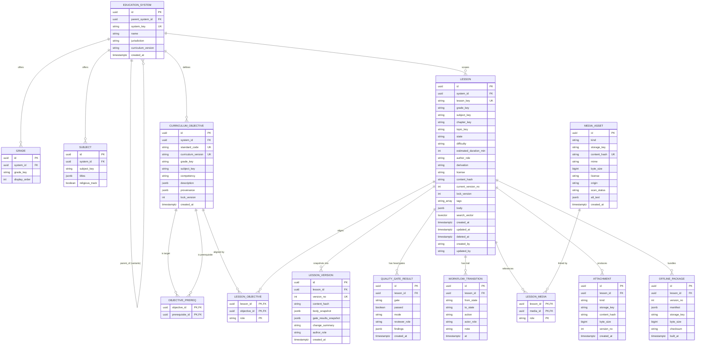
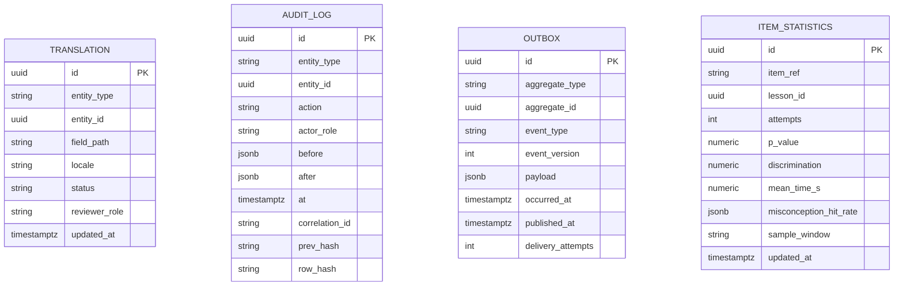
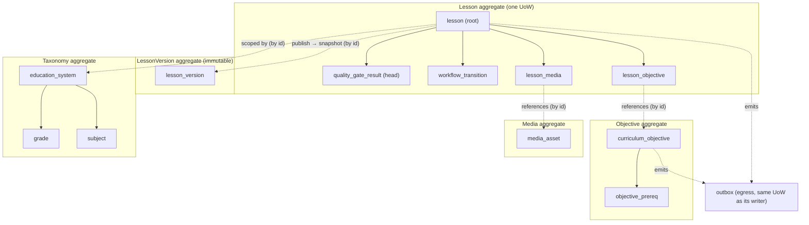

# Curriculum Studio — Entity-Relationship Diagram

Companion to [DATABASE_ARCHITECTURE.md](DATABASE_ARCHITECTURE.md) and
[POSTGRES_SCHEMA.md](POSTGRES_SCHEMA.md). All entities live in the single PostgreSQL schema
`curriculum_studio`. There are **no cross-context foreign keys** (doc 09); references to other
bounded contexts are by opaque id only and are not drawn here.

Notation: crow's-foot cardinality. `PK` primary key, `FK` foreign key, `UK` unique key.
`JSONB` columns holding the authored document body are shown as single attributes (their internal
shape is the domain aggregate, not a relational structure — see architecture §2).

---

## 1. Full schema ERD

---

## 2. Cross-cutting tables (not FK-linked into the aggregate graph)

`translation`, `audit_log`, `outbox`, and `item_statistics` reference domain rows **by
`(entity_type, entity_id)` / natural id, not by foreign key**, because they span entity types and
(for audit/outbox) must survive the deletion or archival of what they describe. Drawing FK edges
would wrongly couple their lifecycle to the referent.

`entity_type` / `aggregate_type` are logical discriminators (`lesson`, `curriculum_objective`,
`media_asset`, …). Referential integrity for these is enforced in the application/Unit of Work,
not by the database, and this is intentional: it is the standard trade-off for polymorphic audit
and outbox tables (documented in POSTGRES_SCHEMA.md §Foreign keys).

---

## 3. Aggregate boundaries overlaid

The transactional boundaries from architecture §3. A dashed grouping = one aggregate; one Unit of
Work commits within one grouping.

Solid arrows are intra-aggregate ownership (cascade within the boundary). Dashed arrows are
by-id references across aggregate boundaries (no cascade; eventual consistency via §17 events).
