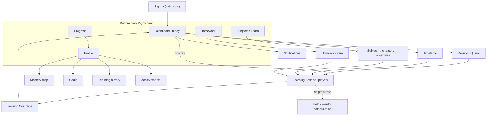
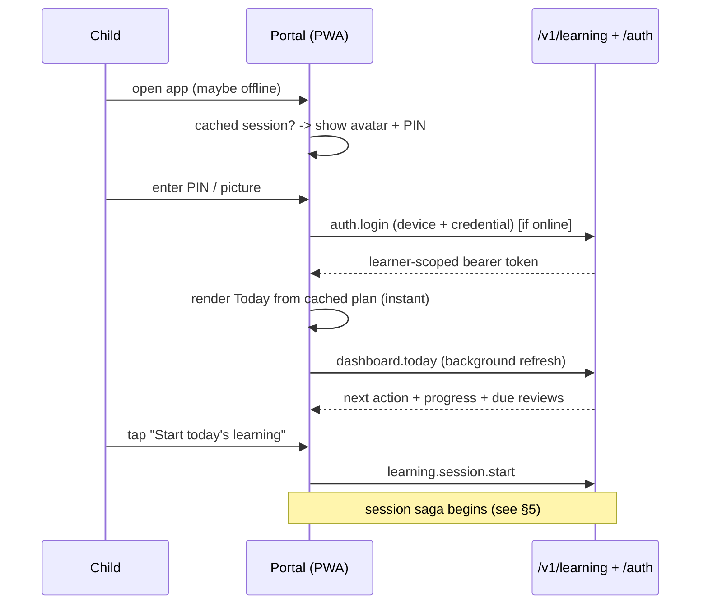
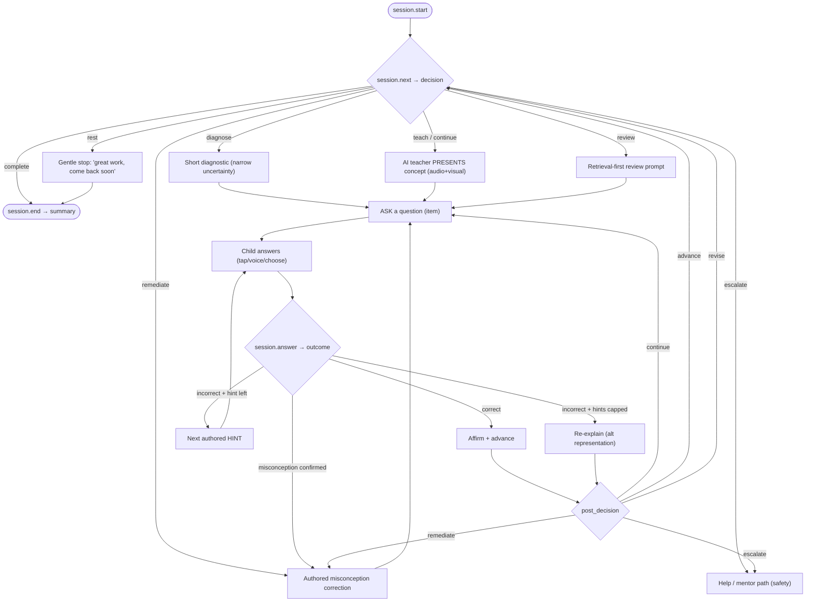
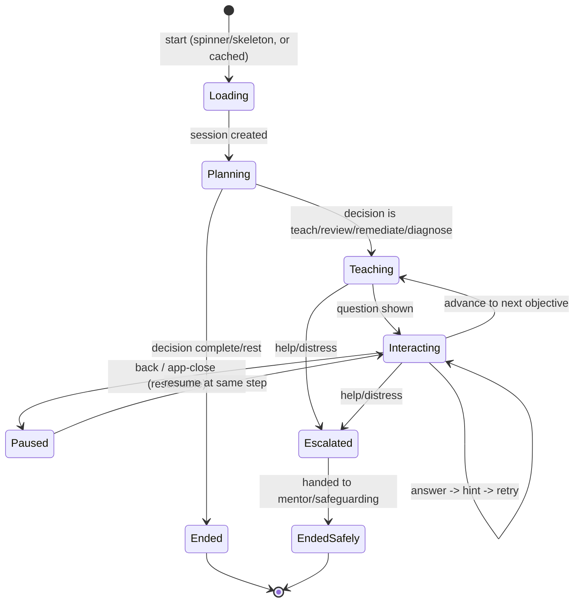
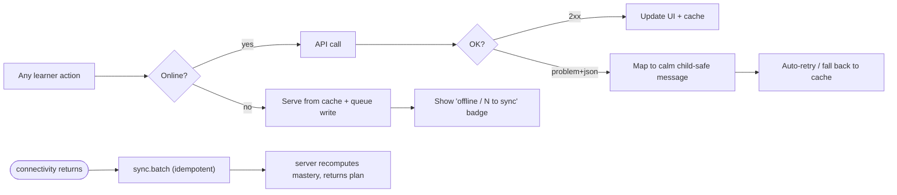
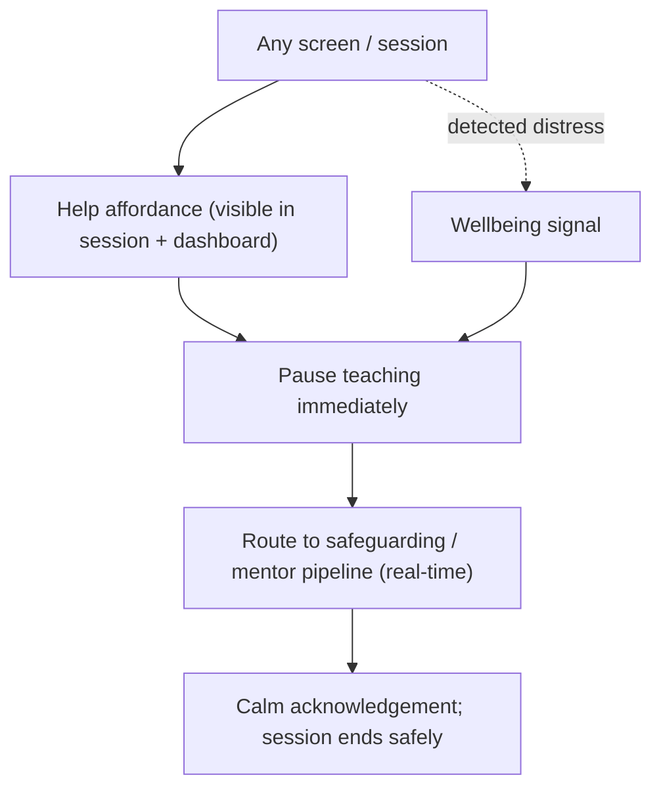

# Student UI Flow (Phase 5 Design)

Status: **Design only.** Companion to [STUDENT_EXPERIENCE.md](STUDENT_EXPERIENCE.md) and
[STUDENT_PORTAL_ARCHITECTURE.md](STUDENT_PORTAL_ARCHITECTURE.md). Defines the screen map, navigation
graph, the core user journeys, and — critically — how the **Learning Session UI maps to the built
`/v1/learning` session state machine and decision engine**. No implementation code.

Diagrams are mermaid. Every flow is designed **RTL-first** (mirror the left/right sense for Urdu) and
**offline-tolerant** (each has an offline/error branch).

---

## 1. Screen map

## 2. Navigation rules

- **Bottom nav** holds at most 5 destinations (Early band: 3). `Today` is home and default.
- The **primary action** ("Start today's learning") on Today is the single largest, first-focus
  element and launches the engine-chosen session.
- Secondary destinations (Revision, Timetable, Assessments, Achievements, Notifications) are reachable
  from Today cards and Profile — not the bottom bar.
- **Back always pauses, never loses** — leaving a session resumes at the same step.
- Navigation is keyboard/switch operable; the active destination sets `aria-current`.

## 3. Journey: sign-in → first session (happy path)

Offline variant: `auth.login` is skipped if a valid cached session exists; Today renders from the
last-synced plan; the session runs from a cached lesson package; interactions queue for later sync.

## 4. Journey: a complete learning session (mapped to the engine)

Mapping to the built API/engine (no new engine behavior — the UI renders what the engine already
decides):

| Engine output | UI surface |
| --- | --- |
| `session.next` decision `teach/continue` | `TeacherTurn` (present) → `QuestionCard` |
| decision `diagnose` | short diagnostic framed as "let's see what you know" |
| decision `review` | retrieval-first `QuestionCard` before any re-teach |
| decision `remediate` + misconception ref | `MisconceptionCorrectionCard` (authored correction) |
| decision `rest` | calm stop screen (wellbeing/attention budget) |
| decision `escalate` | Help/mentor route (never overridden) |
| decision `complete` | Session Complete |
| `answer` outcome + `feedback` | `FeedbackToast` (affirm/correct, encouraging) |
| `answer` `post_decision` | drives the next loop iteration |

## 5. Session state → UI state

The client session saga mirrors the server `SessionState` machine so the two never diverge:

- **Paused** is durable (persisted to IndexedDB) → the child can close the app and resume exactly
  where they were.
- **Escalated/EndedSafely** are reachable from any active state and take priority over learning flow.

## 6. Offline & error branches (every flow has one)

Guarantees: no learner action is ever lost (written locally first); offline is a labelled, calm mode;
sync is idempotent (no double-counting); errors always offer a way forward and never show
status/stack to the child.

## 7. Safety flow (always available)

Safety is not an error path and is never overridden by "finish the lesson." It maps to the platform's
real-time safeguarding pipeline and the session `Escalated → EndedSafely` states.

## 8. Empty / first-run / edge states (per screen)

- **First run:** guardian/mentor-assisted setup (outside the child flow) leaves the child with a
  ready Today; the child's first experience is a warm greeting + one clear action.
- **No plan / all done for today:** Today shows a positive "you've finished today's learning — want to
  revise or explore?" (never a blank screen).
- **No lessons cached & offline:** offer what *is* cached + "download more on Wi-Fi."
- **New learner, no mastery yet:** Profile/mastery map shows an encouraging "your map will fill as you
  learn," not an empty grid of failure.

Every screen spec in [STUDENT_EXPERIENCE.md](STUDENT_EXPERIENCE.md) §6 lists its acceptance criteria;
this document is the connective flow between them.
